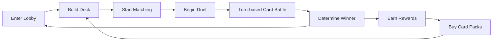

# Maple Duel Game Overview

## 📋 Project Introduction

**Maple Duel** is a 1vs1 turn-based card duel game based on the MapleStory Worlds platform. It reconstructs MapleStory characters and skills into cards, allowing players to enjoy strategic card battles.

### 🎮 Core Gameplay Loop



1. **Enter Lobby**: Players meet and interact with other players in the lobby
2. **Build Deck**: Edit and manage decks composed of 20 cards
3. **Matching**: Match opponents through ranked matches or friendly duels
4. **Duel Progress**: Battle opponents using cards in turn-based fashion
5. **Reward System**: Earn meso and experience upon victory, expand collection by purchasing card packs

## 🏗️ Major Game Systems

### Card System
- **Card Types**: Two main types - Minion and Skill
- **Class System**: 6 classes - Warrior, Magician, Bowman, Thief, Pirate, Common
- **Rarity**: 5 tiers - Normal → Rare → Epic → Unique → Legendary
- **Variant System**: Various appearance versions of the same card

### Deck System  
- **Deck Size**: Composed of exactly 20 cards
- **Class Restriction**: Only Common + selected 1 class cards can be used
- **Card Limitation**: Maximum 2 copies of same card allowed
- **Multiple Decks**: Up to 10 decks per player

### Duel System
- **Turn-based Progress**: Players take turns alternately
- **MP System**: MP increases each turn enabling use of powerful cards
- **Field Limitation**: Maximum 6 minions deployable per player
- **Hand Limitation**: Maximum 8 cards per player

### Matching System
- **Ranked Match**: Competitive system based on ELO rating
- **Friendly Match**: Casual matches with friends
- **Practice Mode**: Practice games with AI bots
- **Tutorial**: Guide for new players

## 📁 Project Folder Structure

### Core Development Folders
```
RootDesk/MyDesk/
├── Components/          # Main game components
│   ├── Objects/         # Game objects (Card, Deck, Player, etc.)
│   ├── Managers/        # System managers
│   ├── UIs/            # User interface modules
│   └── Helpers/        # Helper components
├── DataSets/           # CSV-based game data
├── Events/             # Game event definitions
├── Logics/             # Game logic and utilities
├── Images/             # Sprite resources
├── Models/             # 3D models and prefabs
├── Materials/          # Material resources
└── Sounds/             # Sound resources
```

### Main Component Overview

#### Objects (Objects/)
- `Duel.mlua`: Overall duel control and management
- `Player.mlua`: Player units and game resources
- `Card.mlua`: Individual card logic and visualization
- `Deck.mlua`: Deck management and shuffling
- `Field.mlua`, `Hand.mlua`: Game area management

#### Managers (Managers/)  
- `CardManager.mlua`: Card data provision and management
- `DeckManager.mlua`: Deck composition rules and validation
- `TaskManager.mlua`: Game flow control
- `CommandManager.mlua`: Client-server synchronization

#### UI Modules (UIs/)
- `LobbyModule.mlua`: Lobby screen
- `DuelModule.mlua`: Duel progress UI
- `CardModule.mlua`: Card collection management
- `ShopModule.mlua`: Shop and card pack purchase

### Data Structure (DataSets/)
- `Card.csv`: All card attribute information (266 cards)
- `Deck.csv`: Default deck composition data
- `CardPack.csv`: Card pack probabilities and composition
- `AvatarItem.csv`: Avatar item information

## 🎯 Game Features

### MapleStory Worlds Platform Utilization
- **Multiplayer**: Real-time online matching and interaction
- **Data Synchronization**: Secure game state management between client and server
- **Social Features**: Friend system, chat, emotion expression

### Strategic Depth
- **Class Synergies**: Specialized card combinations for each class
- **Resource Management**: Strategic resource allocation through MP system  
- **Timing**: Importance of turn order and card play timing

### Collection Elements
- **Card Collection**: Collect 266 diverse cards
- **Rarity System**: Higher rarity cards have more powerful effects
- **Card Packs**: Probability-based card acquisition system

## 🛠️ Developer Getting Started Guide

### Essential Files to Understand
1. **`Character.mlua`**: Player basic system and data management
2. **`Duel.mlua`**: Core battle logic of the game  
3. **`Card.csv`**: Central repository of all card data
4. **Managers**: Business logic for each system

### Code Structure Features
- **Component-based**: Utilizes MSW's Entity-Component system
- **Server-Client Separation**: Execution environment distinguished by `@ExecSpace` annotation
- **Event-driven**: All in-game interactions handled through event system

### Main Code References
- Character basic system: `RootDesk/MyDesk/Components/Character.mlua`
- Duel progress logic: `RootDesk/MyDesk/Components/Objects/Duel.mlua`  
- Card data definition: `RootDesk/MyDesk/DataSets/Card.csv`
- UI system structure: `RootDesk/MyDesk/Components/UIs/`

This overview provides understanding of Maple Duel's overall structure and gameplay, with detailed information about each subsystem covered in subsequent documents.
