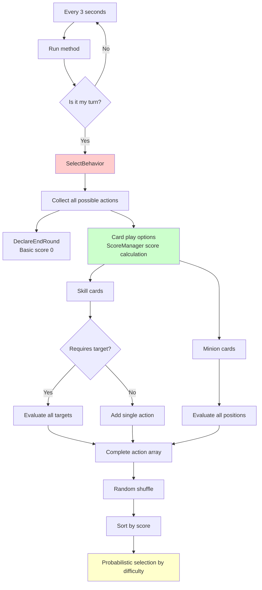
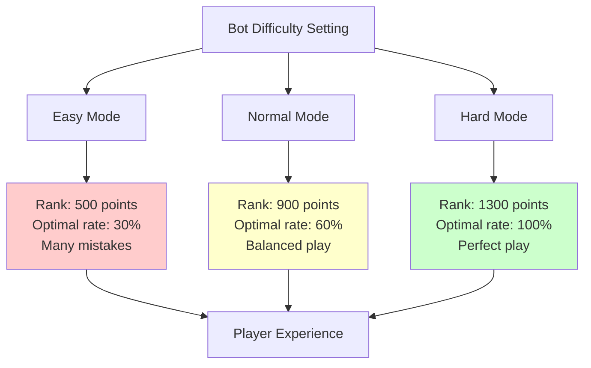
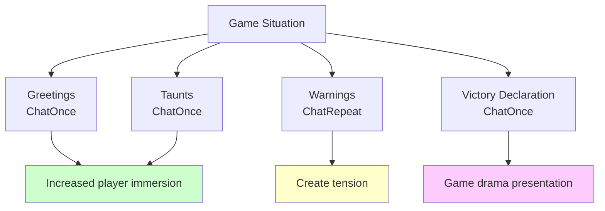
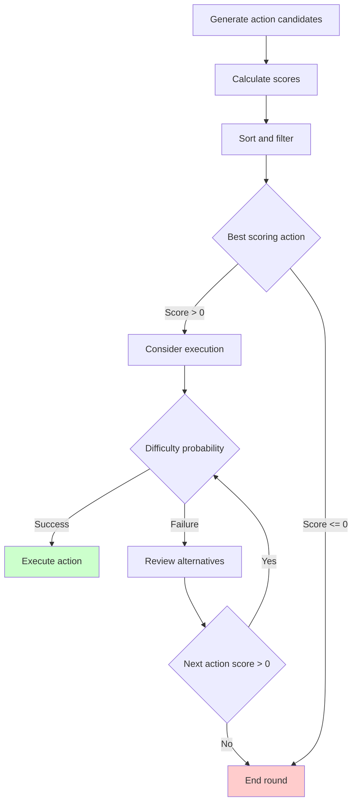

# Bot Component

## 📋 Overview

The Bot Component is the core system that implements AI opponents for Maple Duel battles. This component integrates with ScoreManager to perform complex score calculations for over 200 card combinations and provides appropriate challenges for player skill levels through a 3-tier difficulty system. The bot evaluates all possible actions every 3 seconds to make optimal choices, implementing unpredictable yet rational play through probabilistic decision-making. It also provides a more vibrant gaming experience through chat functionality that interacts with players.

**Related Files**:
- `RootDesk/MyDesk/Components/Bot.mlua` - AI bot main component
- `RootDesk/MyDesk/Components/Managers/ScoreManager.mlua` - Score calculation system
- `RootDesk/MyDesk/Components/Managers/BotManager.mlua` - Bot data management

## 🏗️ Bot AI Architecture

### Decision-making Process



## 🎯 1. Action Selection System

### Comprehensive Action Evaluation

#### Collecting All Possible Actions
```lua
@ExecSpace("ServerOnly")
method table SelectBehavior()
    local player = self.Entity.Character.player
    local behaviorArray = {}
    
    -- 1. Basic action: End round
    table.insert(behaviorArray, {name = "DeclareEndRound", score = 0})
    
    -- 2. Evaluate play options for hand cards
    for _, card in ipairs(player.hand.cardArray) do
        local inputState = card:GetInputState(player.character)
        if not inputState.isPlayable then
            continue  -- Skip unplayable cards
        end
        
        if card.category == "Skill" then
            if card.requiresTarget then
                -- Target-required skill: Evaluate all valid targets
                for _, target in ipairs(card.targetableArray) do
                    local behavior = {
                        name = "Play", 
                        card = card, 
                        target = target, 
                        score = self.scoreManager:GetScore(card, target, nil)
                    }
                    table.insert(behaviorArray, behavior)
                end
            else
                -- Instant skill: Single evaluation
                local behavior = {
                    name = "Play", 
                    card = card, 
                    score = self.scoreManager:GetScore(card, nil, nil)
                }
                table.insert(behaviorArray, behavior)
            end
        elseif card.category == "Minion" then
            -- Minion: Evaluate all possible placement positions
            for i = 0, #player.field.minionArray do
                local pivot = player.field.minionArray[i]
                local behavior = {
                    name = "Play", 
                    card = card, 
                    pivot = pivot, 
                    score = self.scoreManager:GetScore(card, nil, pivot)
                }
                table.insert(behaviorArray, behavior)
            end
        end
    end
    
    return self:ApplyDifficultyFilter(behaviorArray)
end
```

### Score-based Decision Making

#### Smart Action Selection Logic
```lua
-- Sort action candidates by score
_Table:Shuffle(behaviorArray)  -- Ensure randomness in tie situations
table.sort(behaviorArray, self.behaviorComparer)  -- Descending by score

-- Probabilistic selection by difficulty
local rate = 0.3
if self.difficulty == "Easy" then
    rate = 0.3    -- 30% chance to select optimal
elseif self.difficulty == "Normal" then
    rate = 0.6    -- 60% chance to select optimal  
elseif self.difficulty == "Hard" then
    rate = 1      -- Always select optimal
end

local behavior
for _, item in ipairs(behaviorArray) do
    if item.score < 0 then
        break  -- Never select negative score actions
    end
    
    behavior = item
    
    if _UtilLogic:RandomDouble() < rate then
        break  -- Confirm selection based on probability
    end
end

return behavior
```

**Decision-making Characteristics**:
- **Strategic Depth**: Evaluate all possible actions by score
- **Probabilistic Selection**: Natural gameplay with imperfect play
- **Difficulty Control**: Provide appropriate challenge for player level
- **Safety Net**: Never select negative score actions

## 🎲 2. Difficulty System

### 3-Tier Difficulty Structure

#### Difficulty Characterization


#### Difficulty Setting and Rank Integration
```lua
@ExecSpace("ServerOnly")
method void SetDifficulty(string difficulty)
    self.difficulty = difficulty
    
    local character = self.Entity.Character
    if difficulty == "Easy" then
        character:SetRank(500, 0)    -- Bronze level
    elseif difficulty == "Normal" then
        character:SetRank(900, 0)    -- Silver level
    elseif difficulty == "Hard" then
        character:SetRank(1300, 0)   -- Gold level
    end
end
```

**Educational Value of Difficulty System**:
- **Learning Curve**: Step-by-step challenge from beginner to expert
- **Rank Simulation**: Mimicking actual competitive environment
- **Strategy Learning**: Learn strategies by observing bot play

### Probabilistic Decision Model

#### Human-like Play Patterns
```lua
-- Natural AI that doesn't always choose optimal solution
local behavior
for _, item in ipairs(behaviorArray) do
    if item.score < 0 then
        break
    end
    
    behavior = item  -- Store current best action
    
    -- Decide whether to stop here based on probability
    if _UtilLogic:RandomDouble() < rate then
        break  -- Select this action
    end
    -- Otherwise consider next action (might be worse choice)
end
```

**Advantages of Probability Model**:
- **Unpredictability**: Different choices possible in same situation
- **Human-like Mistakes**: Enhanced fun with imperfect play
- **Learning Opportunities**: Players can exploit bot mistakes

## 🎮 3. Real-time Game Execution

### Automatic Play Loop

#### Continuous Decision Cycle
```lua
@ExecSpace("ServerOnly")
method void Run()
    self.behaviorComparer = function(left, right) 
        return left.score > right.score 
    end
    
    local behave = function()
        local player = self.Entity.Character.player
        
        -- Check action conditions
        if not isvalid(player) or not player:IsOurTurn() or self.taskManager.delay > 0 then
            return
        end
        
        -- Select and execute action
        local behavior = self:SelectBehavior()
        local name = behavior.name
        
        if name == "DeclareEndRound" then
            self:DeclareEndRound()
        elseif name == "Play" then
            -- Revalidate card state
            local inputState = behavior.card:GetInputState(player.character)
            if not inputState.isPlayable then
                return
            end
            
            self:Play(behavior.card, behavior.target, behavior.pivot)
        end
    end
    
    -- Evaluate and execute actions every 3 seconds
    _TimerService:SetTimerRepeat(behave, 3)
end
```

#### Safe Command Execution
```lua
@ExecSpace("ServerOnly")
method void Play(Card card, Unit target, Minion pivot)
    -- Visual feedback: Card selection animation
    card:BeginPlaying()
    wait(1)
    card:EndPlaying()
    
    -- Execute actual game command
    self.commandManager:RunCommand("Play", {card, target, pivot}, {})
end

@ExecSpace("ServerOnly")
method void DeclareEndRound()
    local player = self.Entity.Character.player
    self.commandManager:RunCommand("DeclareEndRound", {player, false}, {})
end
```

**Execution System Characteristics**:
- **Asynchronous Execution**: Independent execution without blocking game flow
- **State Verification**: Reconfirm card state just before execution
- **Visual Presentation**: Clear recognition of bot actions by players
- **Command System**: Safe game state changes through CommandManager

## 💬 4. Bot Chat System

### Emotional Expression and Interaction

#### Various Chat Modes
```lua
@ExecSpace("ClientOnly")
method void ChatOnce(string message, number duration)
    _TimerService:ClearTimer(self.chatTimer)
    
    local chatBalloon = self.Entity.Character.player.chatBalloon
    
    -- Regular chat style
    chatBalloon.AutoShowEnabled = true
    chatBalloon.BalloonScale = 2
    chatBalloon.FontSize = 1
    chatBalloon.FontColor = Color.black
    chatBalloon.Message = message
    
    -- Hide chat after specified time
    self.chatTimer = _TimerService:SetTimerOnce(function()
        chatBalloon.AutoShowEnabled = false
    end, duration)
end

@ExecSpace("ClientOnly")
method void ChatRepeat(string message, number showDuration, number hideDuration)
    local chatBalloon = self.Entity.Character.player.chatBalloon
    
    -- Repeating chat style (for warnings)
    chatBalloon.AutoShowEnabled = true
    chatBalloon.BalloonScale = 2
    chatBalloon.FontSize = 1
    chatBalloon.FontColor = Color.FromHexCode("#AD1E00")  -- Red
    chatBalloon.Message = message
    chatBalloon.ShowDuration = showDuration
    chatBalloon.HideDuration = hideDuration
end
```

#### Chat Usage Scenarios


**Chat System Value**:
- **Personality Assignment**: Unique dialogue patterns for each bot
- **Situation Awareness**: Appropriate reactions to game situations
- **Immersion**: Feeling like playing against real players
- **Educational Effect**: Provide game situation explanations or hints

## 🧠 5. AI Intelligence System

### ScoreManager Integration

#### Sophisticated Score Calculation Utilization
```lua
-- Score calculation for each action
local behavior = {
    name = "Play", 
    card = card, 
    target = target, 
    score = self.scoreManager:GetScore(card, target, pivot)
}
```

**Score Calculation Elements**:
- **Immediate Effects**: Direct value of damage, healing, removal, etc.
- **Long-term Value**: Board situation, hand advantage, tempo, etc.
- **Risk Assessment**: Opponent counterattack possibility, risk management
- **Synergy Effects**: Combination possibilities with other cards

### Strategic Thinking Patterns

#### Action Priority Determination


**Strategic Characteristics**:
- **Conservative Approach**: Absolutely prohibit negative outcome actions
- **Opportunistic**: Actively utilize good opportunities
- **Adaptability**: Flexible strategy changes based on game situations
- **Learnable**: Performance improvement through ScoreManager score adjustments

## ⚡ 6. Performance Optimization

### Efficient Action Evaluation

#### Computational Complexity Management
```lua
-- Filter unplayable cards early
local inputState = card:GetInputState(player.character)
if not inputState.isPlayable then
    continue  -- Skip complex score calculations
end

-- Action revalidation only just before execution
if name == "Play" then
    local inputState = behavior.card:GetInputState(player.character)
    if not inputState.isPlayable then
        return  -- Cancel action on situation change
    end
end
```

### Memory Efficiency

#### Temporary Data Management
```lua
-- Create new behaviorArray each time to prevent memory leaks
method table SelectBehavior()
    local behaviorArray = {}  -- Create as local variable
    -- ... Collect actions ...
    return behavior  -- Return only selected action
end

-- Automatic cleanup through timers
_TimerService:ClearTimer(self.chatTimer)  -- Clean previous timer before setting new timer
```

## 💡 Code References

Bot Component core logic:
- `Bot.mlua :: SelectBehavior()` — AI decision-making main logic
- `Bot.mlua :: Run()` — Automatic play execution system
- `Bot.mlua :: SetDifficulty()` — Difficulty-based rank setting
- `Bot.mlua :: Play()` — Safe card play execution
- `Bot.mlua :: ChatOnce()` — Bot chat interaction

The Bot Component is the core system that enriches Maple Duel's single-player experience, providing experiences similar to battling real players through sophisticated AI logic and human-like interactions, offering appropriate challenges and learning opportunities for all skill levels through various difficulties.
