# Bot Data Management

## 📋 Overview

The Bot Data Management System is a centralized system that defines and manages the configuration and characteristics of various AI bots in Maple Duel. BotManager provides data for 5 job-specific practice bots and special purpose bots, managing unique deck compositions, card backs, and difficulty settings for each bot. This system integrates with DeckManager to automatically configure job-specific starter decks and provides expandability to easily add new bot types through dynamic bot data access.

**Related Files**:
- `RootDesk/MyDesk/Components/Managers/BotManager.mlua` - Bot data definition and management
- `RootDesk/MyDesk/Components/Managers/DeckManager.mlua` - Starter deck provision
- `RootDesk/MyDesk/Components/Character.mlua` - Bot data loading and application

## 🏗️ Bot Data Architecture

### Bot Data Structure


## 🎮 1. Job-specific Practice Bot System

### 5 Job Bot Configuration

#### Warrior Practice Bot
```lua
method table PracticeWarriorBot()
    return {
        cardBack = "OrangeMushroom",  -- Orange Mushroom card back
        deckArray = {self.deckManager:GetWarriorStarterDeck(nil)},
        deckIndex = 1,
    }
end
```

#### Magician Practice Bot
```lua
method table PracticeMagicianBot()
    return {
        cardBack = "Yeti",  -- Yeti card back
        deckArray = {self.deckManager:GetMagicianStarterDeck(nil)},
        deckIndex = 1,
    }
end
```

#### Bowman Practice Bot
```lua
method table PracticeBowmanBot()
    return {
        cardBack = "StoneSpirit",  -- Stone Spirit card back
        deckArray = {self.deckManager:GetBowmanStarterDeck(nil)},
        deckIndex = 1,
    }
end
```

#### Thief Practice Bot
```lua
method table PracticeThiefBot()
    return {
        cardBack = "PinkBean",  -- Pink Bean card back
        deckArray = {self.deckManager:GetThiefStarterDeck(nil)},
        deckIndex = 1,
    }
end
```

#### Pirate Practice Bot
```lua
method table PracticePirateBot()
    return {
        cardBack = "PinkBean",  -- Pink Bean card back
        deckArray = {self.deckManager:GetPirateStarterDeck(nil)},
        deckIndex = 1,
    }
end
```

**Job-specific Bot Features**:
- **Job Representation**: Composed of core strategies and cards of each job
- **Visual Distinction**: Bot identification possible through unique card backs
- **Educational Purpose**: Players learn characteristics of each job
- **Balanced Difficulty**: All job bots provide similar level of challenge

### Bot-specific Card Back System

#### Visual Identity Assignment


## 🎯 2. Special Purpose Bots

### Tutorial Bot

#### Education-dedicated Design
```lua
method table TutorialBot()
    return {
        cardBack = "Yeti",
        deckArray = {},  -- Empty deck array
        deckIndex = 1,
    }
end
```

**Tutorial Bot Features**:
- **Flexible Deck Configuration**: Dynamically change deck according to tutorial stages
- **Limited Actions**: Play specific cards only in specific situations
- **Educational Interaction**: Intentional play for player learning
- **Stage Adaptation**: Progressive complexity according to tutorial progress

### Expandable Bot System

#### New Bot Addition Pattern
```lua
// New bot addition example (not implemented)
method table ChallengeBoss()
    return {
        cardBack = "DarkLord",
        deckArray = {
            self.deckManager:GetBossDeck("DarkLord"),
            self.deckManager:GetBossDeck("CrimsonBalrog"),
        },
        deckIndex = 1,
        difficulty = "Nightmare",  -- Extension property
        specialAbilities = {"ExtraMP", "DoubleDraw"}  -- Special abilities
    }
end
```

## 🔄 3. Dynamic Bot Data System

### Runtime Data Access

#### String-based Bot Lookup
```lua
method table GetData(string botName)
    return _Util:Call(self, botName, {})
end
```

**Dynamic Access Advantages**:
- **Expandability**: Add new bots without code changes
- **Flexibility**: Runtime selection through bot names
- **Modularity**: Each bot's settings managed independently
- **Debugging**: Easy testing of specific bots only

### Integration with Character Component

#### Bot Data Loading Process


#### Bot Data Application in Character
```lua
@ExecSpace("ServerOnly")
method void Load(string localeId)
    if not self:IsUser() then
        self.isLoaded = true
        
        -- Bot data loading
        local data = self.botManager:GetData(self.Entity.Bot.name)
        self.cardBack = data.cardBack
        self.deckArray = data.deckArray
        self.deckIndex = data.deckIndex
        
        return
    end
    // ... User data loading logic
end
```

## 📊 4. Starter Deck System

### Integration with DeckManager

#### Job-specific Starter Deck Configuration
```lua
-- Starter decks provided by DeckManager
self.deckManager:GetWarriorStarterDeck(nil)     -- Warrior basic deck
self.deckManager:GetMagicianStarterDeck(nil)    -- Magician basic deck
self.deckManager:GetBowmanStarterDeck(nil)      -- Bowman basic deck
self.deckManager:GetThiefStarterDeck(nil)       -- Thief basic deck
self.deckManager:GetPirateStarterDeck(nil)      -- Pirate basic deck
```

#### Starter Deck Design Principles

```mermaid
graph TB
    A[Starter Deck Design] --> B[Job Identity]
    A --> C[Learning Curve]
    A --> D[Balance]
    
    B --> B1[Include core cards<br/>Job-specific characteristics<br/>Synergy combinations]
    C --> C1[Learn basic strategy<br/>Simple → Complex<br/>Allow mistakes]
    D --> D1[Mutual counters<br/>Similar power level<br/>Various strategies]
    
    B1 --> E[Educational Value]
    C1 --> E
    D1 --> E
    
    style E fill:#ccffcc
```


### Deck Configuration Features

#### Job-specific Strategy Reflection
- **Warrior**: Strong minions and direct attack focused
- **Magician**: Various skills and magic effect focused  
- **Bowman**: Ranged attacks and precise targeting
- **Thief**: Fast attacks and special effects
- **Pirate**: Balanced composition and various options

## 🎭 5. Bot Personality System

### Characterization through Card Backs

#### Bot Personality Assignment


### Expandable Personality System

#### Future Expandability Consideration
```lua
// Expansion example (not implemented)
method table AdvancedWarriorBot()
    return {
        cardBack = "DarkKnight",
        deckArray = {self.deckManager:GetAdvancedWarriorDeck()},
        deckIndex = 1,
        personality = {
            aggression = 0.8,    -- Aggression index
            patience = 0.3,      -- Patience index  
            riskTaking = 0.7     -- Risk-taking tendency
        },
        chatPatterns = {
            "Let's fight like a true warrior!",
            "My sword will decide the battle!",
            "Defense is the best offense!"
        }
    }
end
```

## 🛡️ 6. Bot Management Security and Integrity

### Data Validation

#### Bot Settings Validity Check
```lua
method boolean ValidateBotData(table botData)
    -- Check required field existence
    if not botData.cardBack or not botData.deckArray or not botData.deckIndex then
        return false
    end
    
    -- Deck index validity check
    if botData.deckIndex < 1 or botData.deckIndex > #botData.deckArray then
        return false
    end
    
    -- Card back validity check
    if not self.cardBackManager:IsValidCardBack(botData.cardBack) then
        return false
    end
    
    return true
end
```

### Bot Performance Monitoring

#### Bot Performance Tracking
```lua
method void TrackBotPerformance(string botName, table gameResult)
    local stats = self.botStats[botName] or {
        games = 0,
        wins = 0,
        avgGameTime = 0,
        commonMistakes = {}
    }
    
    stats.games += 1
    if gameResult.winner == botName then
        stats.wins += 1
    end
    
    -- Data collection for win rate balancing
    self.botStats[botName] = stats
end
```

## 🔧 7. Development Tools and Debugging

### Bot Testing Utilities

#### Development Bot Creation
```lua
method table DebugBot(table customConfig)
    local defaultConfig = {
        cardBack = "TestCardBack",
        deckArray = {self.deckManager:GetTestDeck()},
        deckIndex = 1
    }
    
    return _Table:Merge(defaultConfig, customConfig)
end

method table CreateCustomBot(string deck, string cardBack, string difficulty)
    return {
        cardBack = cardBack,
        deckArray = {deck},
        deckIndex = 1,
        difficulty = difficulty
    }
end
```

### Bot Configuration Editor

#### Runtime Bot Modification
```lua
method void ModifyBotData(string botName, table modifications)
    if _Debug.AllowBotModification then
        local currentData = self:GetData(botName)
        local newData = _Table:Merge(currentData, modifications)
        
        -- Dynamic bot data replacement
        self[botName] = function() return newData end
    end
end
```

## 💡 Code References

Bot Data Management core logic:
- `BotManager.mlua :: GetData()` — Dynamic bot data access system
- `BotManager.mlua :: PracticeWarriorBot()` — Warrior bot configuration example
- `BotManager.mlua :: TutorialBot()` — Educational special bot design
- `Character.mlua :: Load()` — Bot data loading and application
- `DeckManager.mlua :: GetWarriorStarterDeck()` — Job-specific starter deck integration

The Bot Data Management System is the core infrastructure that allows AI bots in Maple Duel to have unique personalities and educational value while providing consistent quality gaming experiences, offering flexibility to easily add new bot types and characteristics through expandable design.
