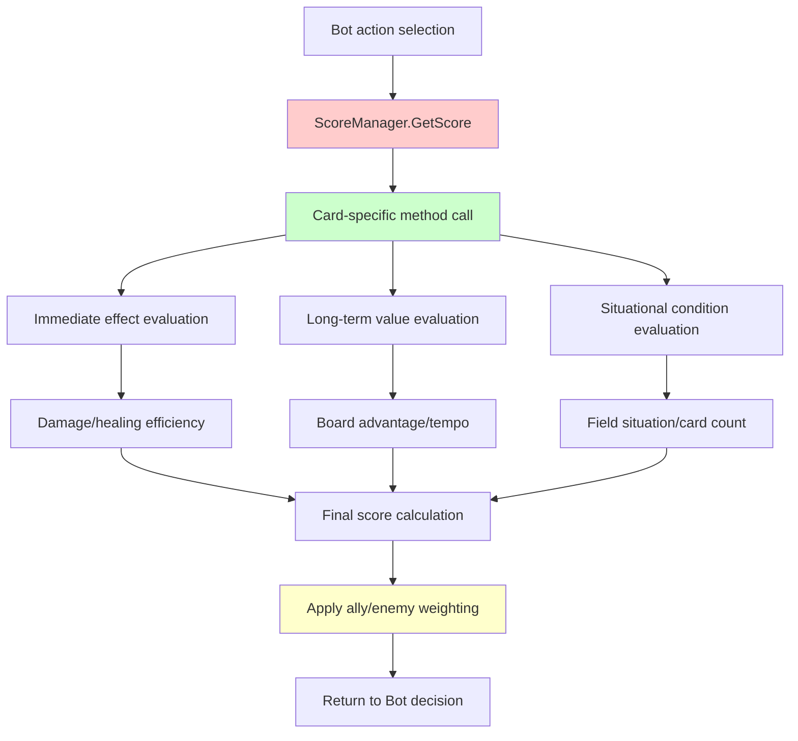
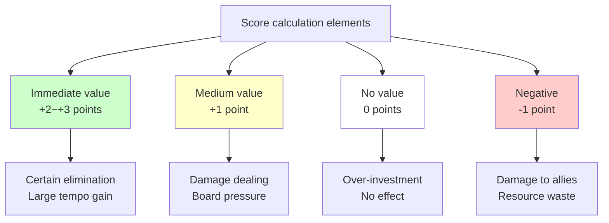
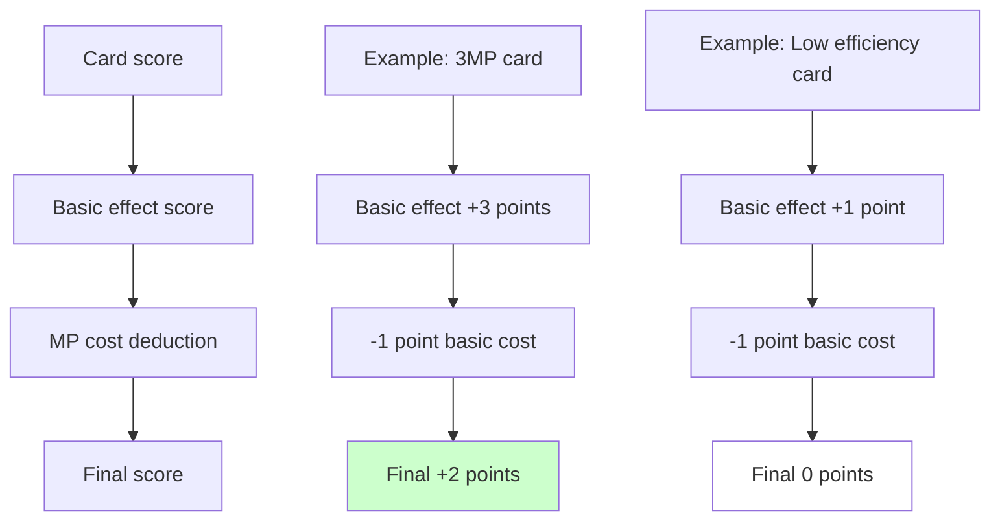
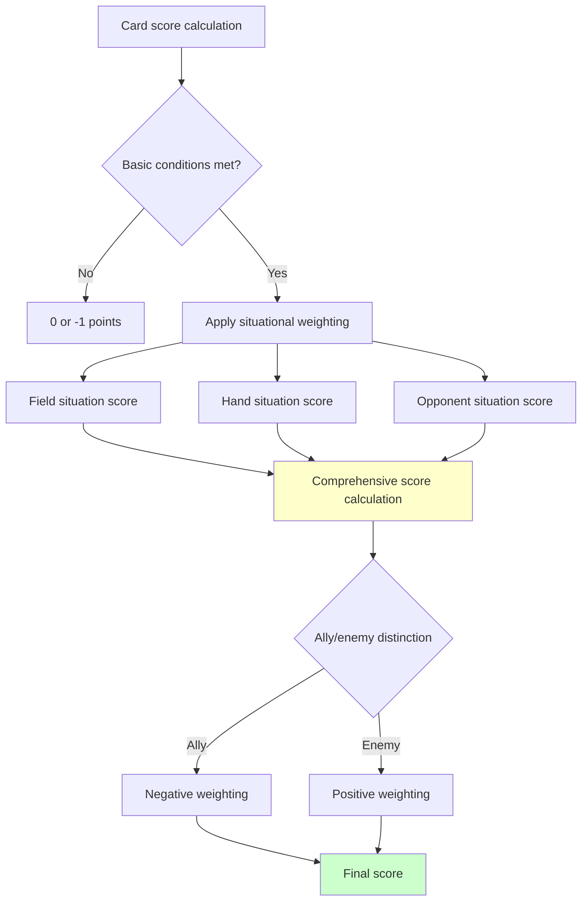

# Scoring System

## 📋 Overview

The Scoring System serves as the core decision-making engine that acts as the brain of Maple Duel AI. ScoreManager provides specialized scoring algorithms for each of over 200 cards, enabling bots to make optimal strategic choices in complex game situations. This system comprehensively evaluates from immediate effects to long-term strategic value, implementing strategic thinking comparable to human players through ally/enemy distinction, efficiency calculations, risk management, and field situation analysis.

**Related Files**:
- `RootDesk/MyDesk/Components/Managers/ScoreManager.mlua` - AI score calculation logic
- `RootDesk/MyDesk/Components/Bot.mlua` - Score-based decision execution
- `RootDesk/MyDesk/Components/Objects/History.mlua` - Game record-based evaluation

## 🏗️ Scoring Architecture

### AI Decision Flow



## 🎯 1. Basic Score Calculation Framework

### Score Calculation Interface

#### Standard Score Calculation Signature
```lua
method number GetScore(Card card, Unit target, Minion pivot)
    return _Util:Call(self, card.name, {card, target, pivot}) or 1
end

-- Card-specific score calculation method
method number PowerStrike(Card card, Minion target, Minion pivot)
    local sign = target.player == card.player and -1 or 1  -- Ally/enemy distinction
    local damage = 5 + card.player.skillDamage
    local value
    
    if 3 <= target.hp and target.hp <= damage then
        value = 2  -- Certain elimination possible
    elseif target.hp > damage then
        value = 1  -- Damage only possible
    else
        value = 0  -- Excessive damage (inefficient)
    end
    
    return sign * value - 1  -- Deduct basic cost
end
```

### Score System Design Principles

#### Weighting System


## 💥 2. Damage-based Score Calculation

### Efficiency-centered Evaluation

#### Score Calculation Based on Target Health
```lua
-- FireArrow - Adaptive damage evaluation
method number FireArrow(Card card, any target, Minion pivot)
    local sign
    if target == card.player or target.player == card.player then
        sign = -1  -- Negative if used on ally
    else
        sign = 1   -- Positive if used on enemy
    end
    
    local damage = 3 + card.player.skillDamage
    local value
    
    if target:IsPlayer() then
        -- Player target: High value when health below half
        if target.hp <= target.maxHp * 0.5 then
            value = 2
        else
            value = 0
        end
    else
        -- Minion target: Different value based on elimination possibility
        if 2 <= target.hp and target.hp <= damage then
            value = 2  -- Certain elimination
        elseif target.hp > damage then
            value = 1  -- Damage only
        else
            value = 0  -- Excessive damage
        end
    end
    
    return sign * value - 1
end
```

#### Proportional Damage System
```lua
-- FinalAttack - Score proportional to opponent health
method number FinalAttack(Card card, Minion target, Minion pivot)
    local sign = target.player == card.player and -1 or 1
    local value = target.hp * 0.5  -- Value proportional to health
    return sign * value
end

-- CorkscrewBlow - Current health-based evaluation
method number CorkscrewBlow(Card card, Minion target, Minion pivot)
    local sign = target.player == card.player and -1 or 1
    local value = target.hp * 0.5
    return sign * value - 1
end
```

**Sophistication of Damage Evaluation**:
- **Elimination Priority**: Highest score when certain elimination is possible
- **Excessive Prevention**: Lower scores for more damage than needed
- **Player vs Minion**: Different evaluation criteria for each
- **Skill Damage Correction**: Reflect player skill damage stats

## 🏟️ 3. Field Situation-based Evaluation

### Board Advantage Calculation

#### Strategy Scores Based on Minion Count
```lua
-- Griffey - Evaluation based on minion count difference
method number Griffey(Card card, Unit target, Minion pivot)
    return #card.player.opponent.field:GetMinions(nil) - #card.player.field:GetMinions(nil)
end

-- Mano - Field advantage evaluation
method number Mano(Card card, Unit target, Minion pivot)
    return #card.player.opponent.field:GetMinions(nil) - #card.player.field:GetMinions(nil)
end

-- DragonRoar - Area attack value
method number DragonRoar(Card card, Unit target, Minion pivot)
    return #card.player.opponent.field:GetMinions(nil) - #card.player.field:GetMinions(nil) - 1
end
```

#### Field Space Management
```lua
-- ThreeSnails - Need for summoning space
method number ThreeSnails(Card card, Unit target, Minion pivot)
    return card.player.field.capacity - #card.player.field:GetMinions(nil) >= 2 and 1 or 0
end

-- Puppet - Minion summoning value
method number Puppet(Card card, Unit target, Minion pivot)
    return card.player.field.capacity - #card.player.field:GetMinions(nil) >= 1 and 1 or 0
end
```

### Position-based Strategy

#### Importance of Placement Position
```lua
-- DancesWithBalrog - Rightmost placement synergy
method number DancesWithBalrog(Card card, Unit target, Minion pivot)
    return card.player.field:GetRightmostMinion() == pivot and 1 or 0
end

-- RedKentaurus - Rightmost special effect
method number RedKentaurus(Card card, Unit target, Minion pivot)
    return card.player.field:GetRightmostMinion() == pivot and 1 or 0
end

-- DrummingBunny - Position-based buff value
method number DrummingBunny(Card card, Unit target, Minion pivot)
    return card.player.field:GetRightmostMinion() == pivot and 1 or 0
end
```

**Field Management Strategy**:
- **Numerical Advantage**: More minions than opponent is beneficial
- **Space Efficiency**: Optimal use of limited field space
- **Position Synergy**: Special effects that trigger at specific positions
- **Tempo Management**: Board control and pressure creation

## 🎴 4. Card Advantage Evaluation

### Hand-based Score Calculation

#### Card Count Advantage System
```lua
-- Shumi - Value based on hand minion count
method number Shumi(Card card, Unit target, Minion pivot)
    return #card.player.hand:GetCards(self.taskManager.minionSelector) - 1
end

-- Focus - Hand skill utilization conditions
method number Focus(Card card, Unit target, Minion pivot)
    if card.player.mp >= 7 and #card.player.hand:GetCards(self.taskManager.skillSelector) >= 2 then
        return 2
    else
        return -1
    end
end
```

#### Opponent Hand Pressure
```lua
-- BandOfThieves - Opponent field cleanup
method number BandOfThieves(Card card, Unit target, Minion pivot)
    return #card.player.opponent.field:GetMinions(nil) - 1
end

-- Explosion - Area cleanup value
method number Explosion(Card card, Unit target, Minion pivot)
    return #card.player.opponent.field:GetMinions(nil) - 2
end
```

### Resource Management Evaluation

#### MP Efficiency Calculation


## 📊 5. Situational Score Adjustment

### Conditional Value Evaluation

#### Game State-dependent Scores
```lua
-- Mai - Whether ally minions exist
method number Mai(Card card, Unit target, Minion pivot)
    return #card.player.field:GetMinions(nil) >= 1 and 1 or -1
end

-- Nependeath - Total minion count condition
method number Nependeath(Card card, Unit target, Minion pivot)
    return #self.duel:GetMinions(nil) >= 3 and 1 or 0
end

-- FireBoar - Overall field situation
method number FireBoar(Card card, Unit target, Minion pivot)
    return #self.duel:GetMinions(nil) >= 1 and 1 or 0
end
```

#### History-based Evaluation
```lua
-- MasterSergeantFox - Skill usage count within round
method number MasterSergeantFox(Card card, Unit target, Minion pivot)
    return self.history:GetThisRoundSkillCount(card.player) - 1
end

-- Utah - Skill usage frequency-based value
method number Utah(Card card, Unit target, Minion pivot)
    return self.history:GetThisRoundSkillCount(card.player) - 1
end
```

### State-based Score Modification

#### Value by Minion State
```lua
-- Fairy - Target ally minions without barrier
method number Fairy(Card card, Unit target, Minion pivot)
    return #card.player.field:GetMinions(self.taskManager.nonBarrierSelector) >= 1 and 1 or 0
end

-- Bless - Barrier granting value
method number Bless(Card card, Unit target, Minion pivot)
    return #card.player.field:GetMinions(self.taskManager.nonBarrierSelector)
end
```

## 🧠 6. AI Strategic Thinking Patterns

### Complex Situation Analysis

#### Multi-condition Evaluation Algorithm


### Risk Management System

#### Safety Net Implementation
```lua
-- Ally damage is always negative in all score calculations
local sign = target.player == card.player and -1 or 1

-- Basic cost always deducted (reflect resource consumption)
return sign * value - 1

-- Clear negative score when conditions not met
return condition and positive_value or -1
```

**Risk Management Principles**:
- **Self-harm Prevention**: Never select actions that harm allies
- **Opportunity Cost**: All actions have basic cost
- **Conditional Execution**: Clear negative signal when conditions not met
- **Conservative Approach**: Passive choices in uncertain situations

## 🎯 7. Advanced AI Strategy Implementation

### Dynamic Score Adjustment

#### Game Phase-based Weighting
```lua
-- Early game: Emphasize board control
-- Mid game: Emphasize card advantage  
-- Late game: Emphasize direct damage

method number ContextualScore(Card card, Unit target, Minion pivot)
    local baseScore = self:GetBaseScore(card, target, pivot)
    local gamePhase = self:GetGamePhase()
    
    if gamePhase == "Early" then
        return baseScore * self:GetBoardControlWeight()
    elseif gamePhase == "Mid" then
        return baseScore * self:GetCardAdvantageWeight()  
    else
        return baseScore * self:GetDamageWeight()
    end
end
```

### Adaptive AI

#### Opponent Strategy Response
```lua
-- Analyze opponent play patterns
method number AdaptiveScore(Card card)
    local opponentStrategy = self.history:GetOpponentStrategy()
    
    if opponentStrategy == "Aggressive" then
        return self:GetDefensiveScore(card)
    elseif opponentStrategy == "Control" then
        return self:GetAggressiveScore(card) 
    else
        return self:GetBalancedScore(card)
    end
end
```

## 💡 Code References

Scoring System core logic:
- `ScoreManager.mlua :: GetScore()` — Basic score calculation interface
- `ScoreManager.mlua :: PowerStrike()` — Sophisticated damage efficiency calculation
- `ScoreManager.mlua :: Griffey()` — Field situation-based strategy evaluation
- `ScoreManager.mlua :: Focus()` — Conditional card advantage evaluation
- `ScoreManager.mlua :: MasterSergeantFox()` — History-based score calculation

The Scoring System is the core intelligence of Maple Duel AI, a sophisticated algorithmic collection that goes beyond simple numerical calculations to comprehensively analyze and evaluate complex strategic situations, enabling decision-making at human player level.
