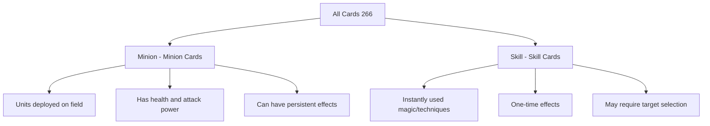
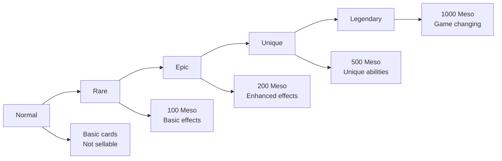
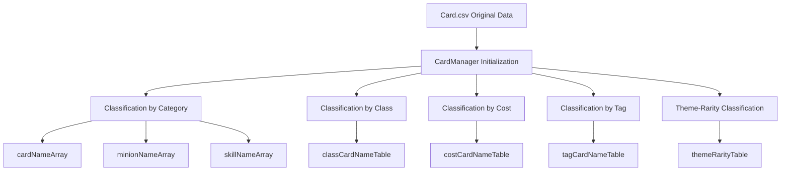

# Card Classification System

## 📋 Overview

Maple Duel's cards are systematically managed through a multi-dimensional classification system. All 266 cards are classified through category, class, rarity, theme, and tag systems, which form the basis for deck composition rules, card pack probabilities, and game balance.

**Related Files**: 
- `RootDesk/MyDesk/DataSets/Card.csv`
- `RootDesk/MyDesk/Components/Managers/CardManager.mlua`

## 🎯 Basic Category Classification

### 1. Card Type (Category)



**Minion**:
- Units that are deployed on the field and persist continuously
- Has `maxHp` and `atk` stats
- Performs attacking or defensive roles against opponents
- Examples: "Adobis", "AthenaPierce", "Zakum"

**Skill**:  
- Magic or techniques that are used instantly and disappear
- Various effects: damage, healing, buffs, debuffs, summoning, etc.
- Often requires targets
- Examples: "AirStrike", "ArmorCrash", "Heal"

### 2. Token System

**Token Cards** (`isToken = TRUE`):
- Special cards that cannot be collected
- Generated by other cards or effects
- Cannot be directly included in deck composition
- Examples: "BlueSnail", "Goblin", "IceElemental"

## 🏆 Class Classification System

### Class-specific Characteristics

| Class | English | Characteristics | Main Card Examples |
|-------|---------|-----------------|-------------------|
| **Warrior** | Warrior | High health, melee combat | "Brandish", "PowerStrike", "Blackbull" |
| **Magician** | Magician | Magic attacks, various effects | "Genesis", "ThunderBolt", "Adobis" |
| **Bowman** | Bowman | Ranged attacks, precision | "DoubleShot", "IceShot", "AthenaPierce" |
| **Thief** | Thief | Fast attacks, stealth techniques | "LuckySeven", "ShadowPartner", "DarkLord" |
| **Pirate** | Pirate | Balanced abilities, special techniques | "AirStrike", "Flamethrower", "Kyrin" |
| **Common** | Common | Usable by all classes | "OrangeMushroom", "Slime", "Stump" |

### Relationship with Deck Composition Rules
- Each deck can only use **Common + one class**
- Provides strategic depth through class-specific synergy effects
- Powerful cards are restricted to specific classes for balance

## 💎 Rarity System

### Rarity Grades and Characteristics



### Detailed Analysis by Rarity

| Rarity | Sell Price | Characteristics | Representative Cards |
|---------|------------|-----------------|---------------------|
| **Normal** | Not sellable | Basic abilities, entry-level | "ArrowRain", "Chakra", "Threaten" |
| **Rare** | 100 Meso | Moderate effects, stable | "DoubleShot", "Heal", "ArrowBlow" |  
| **Epic** | 200 Meso | Enhanced abilities, special effects | "ThunderBolt", "Focus", "Rage" |
| **Unique** | 500 Meso | Unique mechanisms | "LuckySeven", "IceShot", "Elquines" |
| **Legendary** | 1000 Meso | Game-deciding power | "Genesis", "AirStrike", "Zakum" |

### Relationship with Card Packs
Rarity determines the probability of drawing from card packs:
- **Theme-specific Rarity Distribution**: Managed via `themeRarityTable[theme][rarity]`
- **Probability-based System**: Higher rarity = lower probability
- **Economic System**: Card value determined by sell price

## 🌍 Theme Classification

### Major Themes

**Classic Theme**:
- Based on original MapleStory content
- Traditional monsters and NPCs
- Examples: "Zakum", "Mushmom", "AthenaPierce"

**Nautilus Theme**:
- Based on expansion content
- New regions and characters  
- Examples: "AirStrike", "Kyrin", "Timer"

### Theme-specific Characteristics
- Each theme has unique art style and worldview
- Can be separated or mixed when composing card packs
- Provides collection goals for players

## 🏷️ Tag System

### Monster Type Tags

| Tag | Description | Representative Cards |
|-----|-------------|---------------------|
| **Dragon** | Dragon-type monsters | "Horntail", "RedDrake", "Manon" |
| **Devil** | Demon-type | "CrimsonBalrog", "JrBalrog" |
| **Beast** | Beast-type | "Werewolf", "WildKargo" |
| **Undead** | Undead | "ZombieLupin", "GhostStump" |
| **Plant** | Plant-type | "Deo", "AxeStump" |
| **Mushroom** | Mushroom-type | "OrangeMushroom", "Mushmom" |

### Special Tags

| Tag | Description | Usage |
|-----|-------------|-------|
| **Npc** | NPC characters | Story connection, special dialogue |
| **Boss** | Boss monsters | High stats, powerful effects |
| **Pet** | Pets | Cute appearance, support effects |
| **Toy** | Toys/Dolls | Special mechanisms |
| **Alien** | Aliens | Unique abilities |

### Tag System Utilization

**Card Search and Filtering**:
```lua
-- Tag-based search in CardManager
GetCardNamesByTag(string tag)
GetMinionNamesByTag(string tag)  
GetSkillNamesByTag(string tag)
```

**Synergy Effects**:
- Interactions between cards with same tags
- Effects targeting specific tags
- Provides thematic unity in deck composition

## 📊 Classification System Utilization

### Classification Management in CardManager



### Integration with Game Systems

**Deck Composition Validation**:
- Check class restrictions
- Exclude token cards
- Apply card quantity limits

**Card Pack System**:
- Compose card packs by theme
- Apply rarity probabilities
- Implement guarantee system

**UI Filtering**:
- User-friendly card search
- Multi-condition filtering
- Sorting and grouping functions

## 💡 Code References

Core classification management logic:
- `CardManager.mlua :: OnBeginPlay()` — Build initial classification data
- `CardManager.mlua :: GetCardNamesByClass()` — Query cards by class
- `CardManager.mlua :: GetCardNamesByThemeAndRarity()` — Query by theme-rarity
- `CardManager.mlua :: GetSellPrice()` — Calculate sell price by rarity
- `CardManager.mlua :: GetTags()` — Tag system utilization

This classification system serves as the foundation for all card-related functions in the game, providing a consistent structure for adding new cards or expanding the system.
