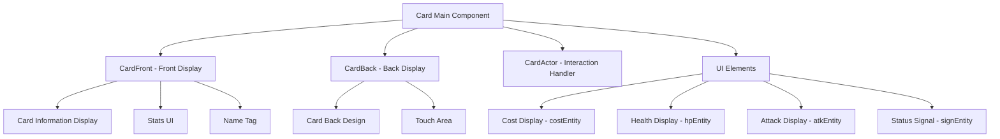
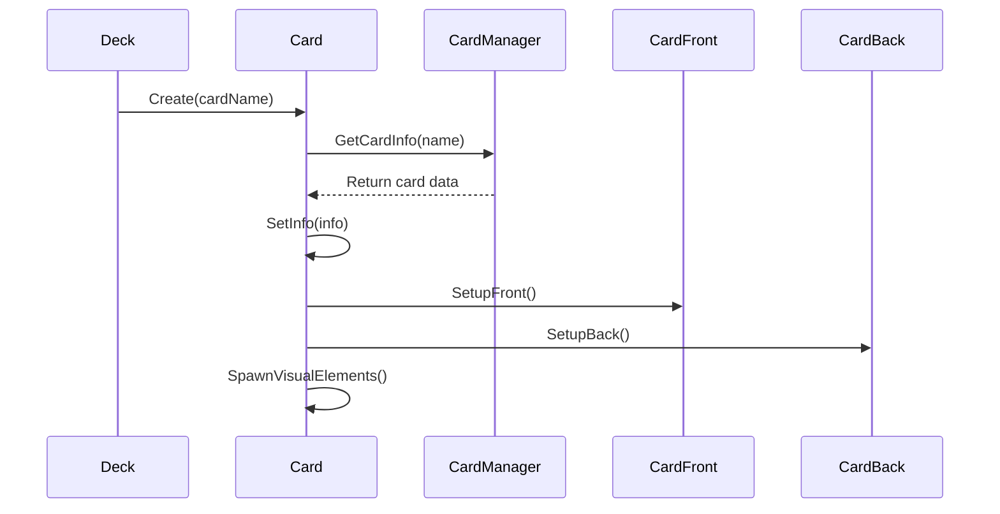

# Card Component (Card.mlua)

## 📋 Overview

`Card.mlua` is the core component responsible for all functions and states of individual cards in Maple Duel. It comprehensively manages card visual representation, game logic, user interaction, and animations, working closely with the Deck and Hand systems.

**Related Files**: 
- `RootDesk/MyDesk/Components/Objects/Card.mlua`
- `RootDesk/MyDesk/Components/Helpers/CardFront.mlua`  
- `RootDesk/MyDesk/Components/Helpers/CardBack.mlua`

## 🏗️ Card Component Architecture

### Component Structure

### Core Properties

#### Component References
- `cardManager`: Card data manager reference
- `actor`: Card behavior processing component
- `front`: Card front display component  
- `back`: Card back display component

#### Game State
- `player`: Player who owns the card
- `deck`: Deck the card belongs to
- `hand`: Hand the card belongs to
- `isPlayable`: Whether currently playable
- `requiresTarget`: Whether target selection is required

#### Card Information
- `info`: Card's basic information table
- `variant`, `quality`: Card variant and quality
- `category`, `cost`, `maxHp`, `atk`: Game stats
- `rarity`, `tagArray`: Rarity and tag information

## 🎮 Main Function Systems

### 1. Card Initialization and Setup

#### Card Creation Process

**Key Methods**:
- `Create(table info, string variant, string quality)` — Create and initialize card
- `SetInfo(table info)` — Set card basic information
- `SetVariant(string variant)` — Set card variant
- `SetQuality(string quality)` — Set card quality

### 2. Visual Representation System

#### Front/Back Toggle
Cards switch between front and back display depending on the situation:

- **Front Display** (`isFront = true`):
  - When in hand
  - When deployed on field  
  - When viewing card details

- **Back Display** (`isFront = false`):
  - When in deck
  - When in opponent's hand

**Related Methods**:
- `SetFront(boolean isFront)` — Set front/back
- `UpdateDisplay()` — Update display state

#### UI Element Management
Each card dynamically manages the following UI elements:

- **costEntity + costInteger**: MP cost display
- **hpEntity + hpInteger**: Health display (minions only)
- **atkEntity + atkInteger**: Attack power display (minions only)  
- **signEntity**: Special status signals (playable, targeting, etc.)
- **nametag**: Card name display

### 3. Gameplay Interaction

#### Card Playability Check
Checks multiple conditions to determine if card can be played:

**Key Methods**:
- `IsPlayable()` — Check overall playability
- `CanPlay()` — Check specific conditions like cost, targets
- `GetTargetableArray()` — Return possible targets

#### Targeting System
Skill cards may require target selection:

- `requiresTarget`: Whether target selection is required
- `targetableArray`: List of selectable targets
- `SetTargetableArray(table array)` — Set target list

### 4. Animation and Effects

#### Movement Animation
Provides smooth animations when cards move from deck → hand → field:

- `tweener`: Main tweening object
- `anchorTweener`: Anchor point animation
- `costTweener`, `hpTweener`, `atkTweener`: Per-UI element animations

#### State Visualization
Visually represents the card's current state:

- `signState`: Current signal state ("playable", "targetable", etc.)
- `SetSignState(string state)` — Change status signal
- `UpdateSign()` — Update signal display

### 5. Object Pooling System

#### Performance Optimization
Cards use a reusable object pool pattern:

**Lifecycle Methods**:
- `Create()` — Retrieve from pool and initialize
- `Clear()` — Clean up after use
- `Destroy()` — Return to pool

**Initialization/Cleanup**:
- `ClearInfo()` — Initialize card information
- `ClearEnchantments()` — Remove applied effects  
- `ClearVariables()` — Reset state variables

## 🔄 State Management System

### Input State Management
Synchronizes card state between client and server:

**Server Side**:
- `GetInputState(Character character)` — Calculate input state per player

**Client Side**:  
- `SetInputState(table inputState)` — Apply state received from server

### Card Movement State
Tracks which area the card is in:

- `deck != nil`: In deck
- `hand != nil`: In hand
- `deck == nil && hand == nil`: On field or in other areas

## 📱 User Interface

### Touch Interaction
Cards handle various touch events:

- **touchAreaEntity**: Define touch area
- Handle actions like card selection, drag, and play on touch
- Card zoom view and detailed information display

### Display Control
Dynamically controls card visibility:

- `isDisplayable`: Whether displayable
- `displayTimer`: Display delay timer
- Automatic hide/show handling based on situation

## 🎨 Visual Customization

### Card Back System
Applies player-selected card back designs:

- `backName`: Selected card back name
- `SetBackName(string backName)` — Change card back
- Display personalized card backs per character

### Quality System
Manages card visual quality:

- `quality`: Quality grade like "Silver", "Gold"
- Visual effects and border changes based on quality

## 💡 Code References

Core card management logic:
- `Card.mlua :: Create()` — Card creation and initialization
- `Card.mlua :: SetInfo()` — Card data setup  
- `Card.mlua :: IsPlayable()` — Playability determination
- `Card.mlua :: GetInputState()` — Server-side state calculation
- `CardFront.mlua` — Card front UI management
- `CardBack.mlua` — Card back UI management

The Card component is a core component that comprehensively manages all card-related functions in the game, handling the entire lifecycle of cards from visual representation to game logic.
