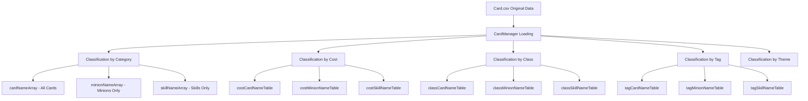

# Card Data Structure

## 📋 Overview

All card information in Maple Duel is defined in the `Card.csv` file, and this data is loaded and managed by `CardManager.mlua`. Currently, **266 cards** are defined in total, with each card having over 40 attributes.

**Related Files**: 
- `RootDesk/MyDesk/DataSets/Card.csv`
- `RootDesk/MyDesk/Components/Managers/CardManager.mlua`

## 🗃️ Card Data Structure

### Core Identification Attributes

| Attribute | Type | Description | Example |
|-----------|------|-------------|---------|
| `name` | String | Card's unique name | "Adobis", "AirStrike" |
| `category` | String | Card type | "Minion", "Skill" |
| `class` | String | Class classification | "Warrior", "Magician", "Common" |
| `theme` | String | Theme/Expansion | "Classic", "Nautilus" |
| `rarity` | String | Rarity | "Normal", "Rare", "Epic", "Unique", "Legendary" |

### Card Variant System

| Attribute | Type | Description |
|-----------|------|-------------|
| `isToken` | Boolean | Whether token card (non-collectible) |
| `variantArray` | Array | Card appearance variant array |
| `linkArray` | Array | Connected cards (summon relationships, etc.) |

### Gameplay Attributes

#### Basic Stats
| Attribute | Type | Description | Range |
|-----------|------|-------------|-------|
| `cost` | Integer | Usage cost (MP) | 0-14 |
| `maxHp` | Integer | Maximum health (Minions only) | 1-8 |
| `atk` | Integer | Attack power (Minions only) | 1-8 |

#### Special States
| Attribute | Type | Description |
|-----------|------|-------------|
| `hasBarrier` | Boolean | Whether has barrier |
| `hasVenom` | Boolean | Whether has venom effect |
| `hasChill` | Boolean | Whether has chill effect |
| `isDirectAttackable` | Boolean | Whether can be directly attacked |
| `isImmuneToStrong` | Boolean | Whether immune to strong |

### Effect System

#### Trigger System
| Attribute | Type | Description |
|-----------|------|-------------|
| `cardTriggerNameArray` | Array | Triggers activated when card is played |
| `minionTriggerNameArray` | Array | Triggers activated while in minion state |

#### Aura System  
| Attribute | Type | Description |
|-----------|------|-------------|
| `cardAuraNameArray` | Array | Auras applied when card is played |
| `minionAuraNameArray` | Array | Auras applied when deployed as minion |

### Tag System

| Attribute | Type | Description | Major Tag Examples |
|-----------|------|-------------|-------------------|
| `tagArray` | Array | Card classification tags | "Npc", "Boss", "Dragon", "Mushroom" |

**Major Tag Categories**:
- **Monster Types**: "Dragon", "Devil", "Beast", "Undead", "Plant" 
- **NPCs**: "Npc", "Boss"
- **Items**: "Toy", "Pet", "Alien"
- **Nature**: "Mushroom", "Plant"

## 🎨 Visual/Audio Resources

### Sound Attributes
| Attribute | Description |
|-----------|-------------|
| `damageSound` | Sound when taking damage |
| `dieSound` | Sound when destroyed |
| `skillSound_1~3` | Skill usage sounds (up to 3) |
| `hitSound_1~3` | Attack hit sounds (up to 3) |
| `extraSound_1~3` | Additional effect sounds (up to 3) |

### Animation Attributes
| Attribute | Description |
|-----------|-------------|
| `skillAnimation_1~3` | Skill usage animations |
| `ballAnimation_1~3` | Projectile animations |
| `hitAnimation_1~3` | Hit effect animations |
| `extraAnimation_1~3` | Additional effect animations |

## 📊 Data Management Structure

### CardManager Data Classification



### Main Access Methods

Access methods provided by **CardManager.mlua**:

- `GetCategory(name)` — Returns card type
- `GetClass(name)` — Returns class  
- `GetRarity(name)` — Returns rarity
- `GetCost(name)` — Returns usage cost
- `GetMaxHp(name)`, `GetAtk(name)` — Returns minion stats
- `GetTags(name)` — Returns tag array
- `IsToken(name)` — Checks if token card

## 💡 Actual Card Data Examples

### Minion Card - Adobis
```csv
name: Adobis
category: Minion
class: Magician  
theme: Classic
rarity: Unique
cost: 1
maxHp: 2
atk: 1
tagArray: ["Npc"]
minionAuraNameArray: ["Adobis"]
```

### Skill Card - AirStrike  
```csv
name: AirStrike
category: Skill
class: Pirate
theme: Nautilus  
rarity: Legendary
cost: 8
variantArray: ["Hanbok"]
cardTriggerNameArray: ["AirStrike"]
```

### Token Card - BlueSnail
```csv
name: BlueSnail
isToken: TRUE
cost: 1
maxHp: 2
atk: 2
```

## 🔧 Data Structure Utilization

### Deck Composition Validation
CardManager validates the following when composing decks:
- Class restrictions (Common + selected class)
- Card quantity limits (maximum 2 of same card)
- Token card exclusion

### Probability System
When drawing cards from card packs, probabilities are determined by `theme` and `rarity` combinations.

### Search and Filtering
When finding cards in UI, filtering is done based on `tagArray`, `class`, `cost`, etc.

## 📝 Code References

Main data processing logic:
- `CardManager.mlua :: OnBeginPlay()` — Initial data loading and classification
- `CardManager.mlua :: GetStarterCollection()` — Provide basic cards for new players
- `CardManager.mlua :: GetCardsByClass()` — Filter cards by class

This data structure serves as the foundation for all card-related functions in the game, and when adding new cards, they will automatically be reflected in the game by adding data to the CSV following this structure.
