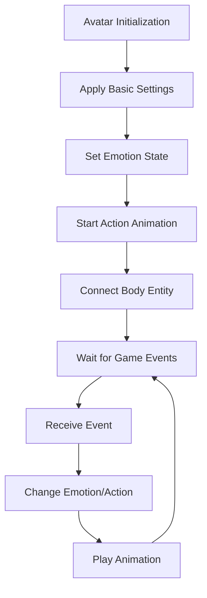

# Avatar Rendering System

## Overview

Maple Duel's avatar rendering system is centered around `AvatarRenderer.mlua` and is responsible for the visual representation of player characters. It extends MapleStory Worlds platform's native `AvatarRendererComponent` to comprehensively manage emotion expression, action animations, and body rendering.

## Core Components

### AvatarRenderer.mlua
A custom renderer that extends the native avatar rendering component.

**Main Roles:**
- Visual representation of avatar emotional states
- Control of action animation playback
- Management of body entity states
- Real-time preview in editor mode

```lua
@Component
script AvatarRenderer extends AvatarRendererComponent

property string emotionalType = ""    -- Emotion type (default: Default)
property string actionName = ""       -- Action animation name
property integer frameIndex = 0       -- Animation frame index
```

## Emotion Expression System

### Emotion Type Management

```lua
@ExecSpace("ClientOnly")
method void OnBeginPlay()
    -- Disable default weapon effects (unnecessary for card game)
    self.ShowDefaultWeaponEffects = false
    
    -- Initialize emotion state
    local emotion = _UtilLogic:IsNilorEmptyString(self.emotionalType) and 
                   EmotionalType.Default or 
                   EmotionalType.CastFrom(self.emotionalType)
    
    self:PlayEmotion(emotion, 3.402823466e+38)  -- Infinite duration
    
    -- Set body action animation
    local bodyEntity = self:GetBodyEntity()
    bodyEntity:SendEvent(ActionStateChangedEvent(
        self.actionName,                    -- Current action
        self.actionName,                    -- Next action  
        1,                                  -- Playback speed
        SpriteAnimClipPlayType.Loop,        -- Loop playback
        self.frameIndex,                    -- Start frame
        self.frameIndex                     -- End frame
    ))
end
```

### Supported Emotion Types

```lua
-- EmotionalType enumeration (MapleStory Worlds native)
EmotionalType = {
    Default = "default",      -- Default expression
    Happy = "happy",          -- Joy
    Sad = "sad",             -- Sadness
    Angry = "angry",          -- Anger
    Surprised = "surprised",  -- Surprise
    Confused = "confused",    -- Confusion
    Excited = "excited",      -- Excitement
    Tired = "tired",         -- Fatigue
    Cool = "cool",           -- Coolness
    Love = "love"            -- Love
}
```

### Dynamic Emotion Changes

```lua
method void SetEmotion(string emotionType, number duration)
    duration = duration or 3.0  -- Default 3 seconds
    
    if not EmotionalType[emotionType] then
        emotionType = "Default"
    end
    
    self.emotionalType = emotionType
    self:PlayEmotion(EmotionalType.CastFrom(emotionType), duration)
end

method void SetEmotionByGameEvent(string eventType)
    local emotionMap = {
        CardPlayed = "Cool",
        Victory = "Happy", 
        Defeat = "Sad",
        Critical = "Excited",
        Damaged = "Surprised",
        Thinking = "Confused"
    }
    
    local emotion = emotionMap[eventType] or "Default"
    self:SetEmotion(emotion, 2.0)
end
```

## Action Animation System

### Action Animation Types

```lua
-- Supported action animations
ActionAnimations = {
    Idle = "stand",           -- Default standing
    Walk = "walk",            -- Walking
    Attack = "attack",        -- Attacking
    Skill = "skill",         -- Skill usage
    Victory = "victory",      -- Victory
    Defeat = "defeat",        -- Defeat
    Celebrate = "celebrate",  -- Celebration
    Think = "think",          -- Thinking
    Point = "point",          -- Pointing
    Wave = "wave"            -- Waving
}
```

### Action Playback System

```lua
method void PlayAction(string actionName, boolean loop, integer startFrame, integer endFrame)
    startFrame = startFrame or 0
    endFrame = endFrame or startFrame
    
    self.actionName = actionName
    self.frameIndex = startFrame
    
    local bodyEntity = self:GetBodyEntity()
    if not isvalid(bodyEntity) then return end
    
    local playType = loop and SpriteAnimClipPlayType.Loop or SpriteAnimClipPlayType.Once
    
    bodyEntity:SendEvent(ActionStateChangedEvent(
        actionName,      -- Current action
        actionName,      -- Next action
        1,              -- Playback speed
        playType,       -- Playback type
        startFrame,     -- Start frame
        endFrame        -- End frame
    ))
end

method void PlayActionSequence(table actionSequence, number intervalSeconds)
    intervalSeconds = intervalSeconds or 1.0
    
    for i, action in ipairs(actionSequence) do
        _TimerService:SetTimer(function()
            self:PlayAction(action.name, action.loop, action.startFrame, action.endFrame)
        end, (i - 1) * intervalSeconds)
    end
end
```

### Action Mapping by Game Events

```lua
method void HandleGameEvent(string eventType, table eventData)
    if eventType == "CardPlayed" then
        self:PlayCardPlayAnimation(eventData.cardType)
    elseif eventType == "TurnStart" then
        self:PlayAction("Think", true)
        self:SetEmotion("Confused", 1.0)
    elseif eventType == "TurnEnd" then
        self:PlayAction("Idle", true)
        self:SetEmotion("Default")
    elseif eventType == "GameWin" then
        self:PlayVictorySequence()
    elseif eventType == "GameLose" then
        self:PlayDefeatSequence()
    end
end

method void PlayCardPlayAnimation(string cardType)
    local cardAnimations = {
        Minion = {
            {name = "Point", loop = false, startFrame = 0, endFrame = -1},
            {name = "Skill", loop = false, startFrame = 0, endFrame = -1},
            {name = "Idle", loop = true, startFrame = 0, endFrame = 0}
        },
        Skill = {
            {name = "Skill", loop = false, startFrame = 0, endFrame = -1},
            {name = "Cool", loop = false, startFrame = 0, endFrame = -1},
            {name = "Idle", loop = true, startFrame = 0, endFrame = 0}
        }
    }
    
    local sequence = cardAnimations[cardType] or cardAnimations.Minion
    self:PlayActionSequence(sequence, 0.8)
end
```

## Body Entity Management

### Body Entity Access

```lua
method Entity GetBodyEntity()
    -- Return body entity from native AvatarRendererComponent
    return self:GetBodyEntity()  -- Call native method
end

method boolean IsBodyEntityValid()
    local bodyEntity = self:GetBodyEntity()
    return isvalid(bodyEntity)
end
```

### Body State Management

```lua
method void SetBodyVisibility(boolean visible)
    local bodyEntity = self:GetBodyEntity()
    if isvalid(bodyEntity) then
        bodyEntity.Enable = visible
    end
end

method void SetBodyScale(number scaleX, number scaleY)
    local bodyEntity = self:GetBodyEntity()
    if isvalid(bodyEntity) then
        local transform = bodyEntity.TransformComponent
        transform.Scale.x = scaleX
        transform.Scale.y = scaleY
    end
end

method void SetBodyPosition(Vector3 position)
    local bodyEntity = self:GetBodyEntity()
    if isvalid(bodyEntity) then
        bodyEntity.TransformComponent.Position = position
    end
end
```

## Editor Integration

### Real-time Preview

```lua
@ExecSpace("ClientOnly")
@EventSender("Service", "EditorService")
handler HandleScreenTouchEditorEvent(ScreenTouchEditorEvent event)
    -- Update avatar state on screen touch in editor mode
    local TouchPoint = event.TouchPoint
    
    -- Refresh emotion state
    local emotion = _UtilLogic:IsNilorEmptyString(self.emotionalType) and 
                   EmotionalType.Default or 
                   EmotionalType.CastFrom(self.emotionalType)
    
    self:PlayEmotion(emotion, 3.402823466e+38)
    
    -- Refresh body animation
    local bodyEntity = self:GetBodyEntity()
    if isvalid(bodyEntity) then
        bodyEntity:SendEvent(ActionStateChangedEvent(
            self.actionName, self.actionName, 1, 
            SpriteAnimClipPlayType.Loop, 
            self.frameIndex, self.frameIndex
        ))
    end
end
```

### Editor Settings Synchronization

```lua
method void SyncWithEditor()
    -- Apply values set in editor to runtime
    if not self:IsEditor() then return end
    
    -- Validate properties and set defaults
    if _UtilLogic:IsNilorEmptyString(self.emotionalType) then
        self.emotionalType = "Default"
    end
    
    if _UtilLogic:IsNilorEmptyString(self.actionName) then
        self.actionName = "Idle"
    end
    
    if self.frameIndex < 0 then
        self.frameIndex = 0
    end
    
    -- Apply settings
    self:RefreshAvatar()
end
```

## Avatar Customization

### Appearance Settings

```lua
method void SetAvatarAppearance(table appearanceData)
    -- Appearance setting via native avatar component
    if appearanceData.hair then
        self:SetHair(appearanceData.hair.id, appearanceData.hair.color)
    end
    
    if appearanceData.face then
        self:SetFace(appearanceData.face.id)
    end
    
    if appearanceData.outfit then
        self:SetOutfit(appearanceData.outfit)
    end
    
    -- Refresh state after customization
    self:RefreshAvatar()
end

method void RefreshAvatar()
    -- Refresh entire avatar based on current settings
    local emotion = EmotionalType.CastFrom(self.emotionalType)
    self:PlayEmotion(emotion, 3.402823466e+38)
    
    local bodyEntity = self:GetBodyEntity()
    if isvalid(bodyEntity) then
        bodyEntity:SendEvent(ActionStateChangedEvent(
            self.actionName, self.actionName, 1,
            SpriteAnimClipPlayType.Loop,
            self.frameIndex, self.frameIndex
        ))
    end
end
```

## Special Effects System

### Particle Effects

```lua
method void PlayParticleEffect(string effectName, Vector3 position, number duration)
    duration = duration or 2.0
    
    local effectEntity = _SpawnService:SpawnByModelId(
        _ResourceManager:GetEffectModelId(effectName), 
        effectName, position, self.Entity
    )
    
    if isvalid(effectEntity) then
        -- Remove effect after certain time
        _TimerService:SetTimer(function()
            if isvalid(effectEntity) then
                effectEntity:Destroy()
            end
        end, duration)
    end
end

method void PlaySkillEffect(string skillName)
    local effectMap = {
        PowerStrike = "sword_slash",
        MagicMissile = "magic_spark", 
        HealPotion = "heal_glow",
        ShieldWall = "shield_shine"
    }
    
    local effectName = effectMap[skillName] or "default_effect"
    local bodyEntity = self:GetBodyEntity()
    
    if isvalid(bodyEntity) then
        local effectPosition = bodyEntity.TransformComponent.WorldPosition
        effectPosition.y += 0.5  -- Effect above character
        self:PlayParticleEffect(effectName, effectPosition, 1.5)
    end
end
```

## Performance Optimization

### Animation Caching

```lua
property table animationCache = {}

method void CacheAnimation(string actionName)
    if not self.animationCache[actionName] then
        -- Preload animation data
        self.animationCache[actionName] = {
            loaded = true,
            frameCount = self:GetAnimationFrameCount(actionName),
            duration = self:GetAnimationDuration(actionName)
        }
    end
end

method void PreloadCommonAnimations()
    local commonAnimations = {"Idle", "Attack", "Skill", "Victory", "Defeat"}
    for _, actionName in ipairs(commonAnimations) do
        self:CacheAnimation(actionName)
    end
end
```

### Rendering Optimization

```lua
method void SetRenderingQuality(string quality)
    local qualitySettings = {
        Low = {
            particleEffects = false,
            detailedAnimations = false,
            emotionUpdates = false
        },
        Medium = {
            particleEffects = true,
            detailedAnimations = false, 
            emotionUpdates = true
        },
        High = {
            particleEffects = true,
            detailedAnimations = true,
            emotionUpdates = true
        }
    }
    
    local settings = qualitySettings[quality] or qualitySettings.Medium
    self:ApplyQualitySettings(settings)
end
```

## Avatar Rendering System Flow



## Integration with Other Systems

### Gameplay Integration

```lua
-- Example of avatar control from Player.mlua
method void OnCardPlayed(Card card)
    if isvalid(self.avatarRenderer) then
        self.avatarRenderer:HandleGameEvent("CardPlayed", {
            cardType = card:GetType(),
            cardName = card.name
        })
    end
end

method void OnTurnStart()
    if isvalid(self.avatarRenderer) then
        self.avatarRenderer:SetEmotion("Confused", 30.0)  -- Turn duration
        self.avatarRenderer:PlayAction("Think", true)
    end
end
```

### UI System Integration

```lua
-- Handle emotion button clicks from UI
method void OnEmotionButtonClicked(string emotionType)
    local character = _UserService.LocalPlayer.Character
    if isvalid(character) and isvalid(character.avatarRenderer) then
        character.avatarRenderer:SetEmotion(emotionType, 5.0)
    end
end
```

This avatar rendering system is a core element that enhances the visual appeal of Maple Duel and increases players' emotional immersion, improving the overall user experience of the game.
