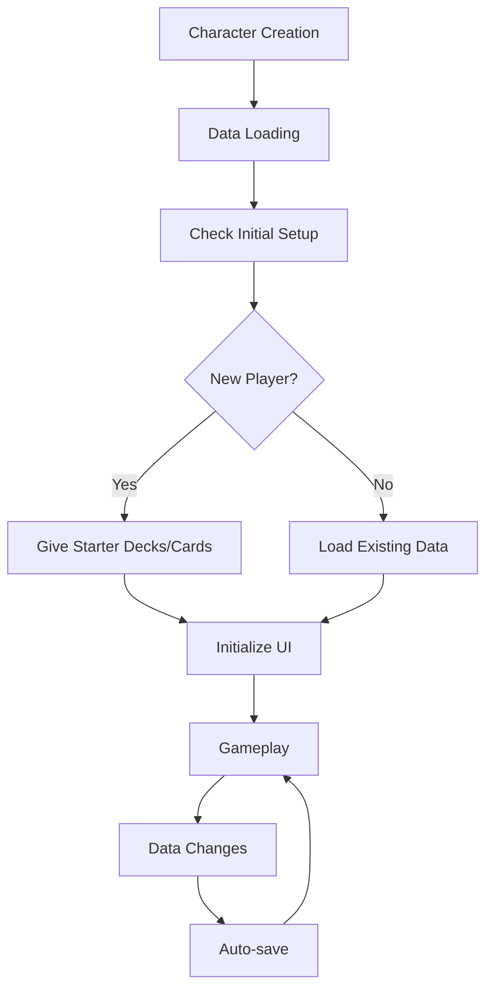

# Character Management System

## Overview

Maple Duel's character management system is a core system centered around `Character.mlua` that manages all game-related data and states of players. It integrates with all major game features including player basic attributes, deck management, card collection, friend system, matching system, and economy system.

## Core Components

### Character.mlua
The master component that centrally manages all player data and game states.

**Main Roles:**
- Player profile and progress management
- Deck collection and card ownership management
- Economy system (meso, rewards) integration
- Social features (friends, chat) support
- Matching system and ranking integration

```lua
@Component
script Character extends Component

-- Basic attributes
property string nickname = ""
property integer profileCode = 0
property boolean isLoaded = false
property any player = nil           -- Player reference when dueling

-- Economy system
property integer meso = 0                        -- Game currency
property integer dailyRankedWinMeso = 0          -- Daily ranked match win meso
property integer dailyPlayMeso = 0               -- Daily play meso
property integer dailyRankedPlayCount = 0        -- Daily ranked match play count

-- Collection system
property table cardArray = {}                    -- Owned cards list
property table deckArray = {}                    -- Deck list
property integer deckIndex = 1                   -- Currently selected deck

-- Social system
property table friendTable = {}                  -- Friends list
property table friendRequestArray = {}           -- Friend request list

-- Matching system
property boolean isMatching = false              -- Matching state
property integer rankPoint = 500                 -- Rank points

-- Temporary data
property table temp = {}                         -- Session temporary data
```

## Player Initialization System

### Character Loading

```lua
method void OnBeginPlay()
    -- Connect UI manager
    self.uiManager = _UserService.LocalPlayer.Entity.UIManagerComponent.UIManager
    
    -- Set manager component references
    self.cardManager = self.Entity.CardManager
    self.deckManager = self.Entity.DeckManager
    self.cardPackManager = self.Entity.CardPackManager
    
    -- Ranking system integration
    self.rankManager = self.Entity.RankManager
    self.matching = self.Entity.Matching
    
    -- Data loading
    if self:IsUser() then
        self:Load()
    end
end
```

### User Data Loading

```lua
@ExecSpace("ServerOnly")
method void Load()
    local userDataStorage = _DataStorageService:GetUserDataStorage(self.Entity.Name)
    
    -- Load basic profile
    self.nickname = userDataStorage:GetData("nickname", "Player")
    self.profileCode = userDataStorage:GetData("profileCode", _UserService:GetRandom(1000, 9999))
    self.meso = userDataStorage:GetData("meso", 10000)  -- Initial meso
    
    -- Load collection data
    self.cardArray = userDataStorage:GetData("cardArray", {})
    self.deckArray = userDataStorage:GetData("deckArray", {})
    self.deckIndex = userDataStorage:GetData("deckIndex", 1)
    
    -- Load social data
    self.friendTable = userDataStorage:GetData("friendTable", {})
    
    -- Load ranking data
    self.rankPoint = userDataStorage:GetData("rankPoint", 500)
    
    -- Initial deck setup (new players)
    if _Table:IsEmpty(self.deckArray) then
        self:SetupStarterDecks()
    end
    
    self.isLoaded = true
    
    -- Notify client of loading completion
    if self:IsUser() then
        self:LoadInOwner(self.Entity.Name)
    end
end
```

### New Player Initial Setup

```lua
method void SetupStarterDecks()
    -- Create starter decks for each class
    local classes = {"Warrior", "Magician", "Bowman", "Thief", "Pirate"}
    
    for _, className in ipairs(classes) do
        local starterDeck = self.deckManager:GetStarterDeck(className)
        table.insert(self.deckArray, starterDeck)
    end
    
    -- Add starter card collection
    local starterCards = self:GetStarterCards()
    for _, cardInfo in ipairs(starterCards) do
        table.insert(self.cardArray, cardInfo)
    end
end

method table GetStarterCards()
    local starterCards = {}
    local baseCards = {
        "PowerStrike", "GuardStance", "HealPotion", "MagicMissile", 
        "ArrowShot", "SteelSkin", "QuickStep", "EnergyBolt"
    }
    
    for _, cardName in ipairs(baseCards) do
        table.insert(starterCards, {
            name = cardName,
            skinIndex = 1  -- Default skin
        })
    end
    
    return starterCards
end
```

## Deck Management System

### Deck Creation and Editing

```lua
method table CreateDeck(string className)
    local newDeck = {
        name = className .. " Deck",
        class = className,
        cardTable = {},  -- {[cardName] = count}
        index = #self.deckArray + 1
    }
    
    return newDeck
end

method boolean AddCardToDeck(integer deckIndex, string cardName)
    if deckIndex < 1 or deckIndex > #self.deckArray then return false end
    
    local deck = self.deckArray[deckIndex]
    if not self.deckManager:CanAddCardToDeck(deck, cardName) then return false end
    
    -- Add card
    deck.cardTable[cardName] = (deck.cardTable[cardName] or 0) + 1
    
    -- Save data
    self:SaveDeckArray()
    
    return true
end

method boolean RemoveCardFromDeck(integer deckIndex, string cardName)
    if deckIndex < 1 or deckIndex > #self.deckArray then return false end
    
    local deck = self.deckArray[deckIndex]
    if not deck.cardTable[cardName] or deck.cardTable[cardName] <= 0 then return false end
    
    -- Remove card
    deck.cardTable[cardName] -= 1
    if deck.cardTable[cardName] == 0 then
        deck.cardTable[cardName] = nil
    end
    
    -- Save data
    self:SaveDeckArray()
    
    return true
end
```

### Deck Selection and Validation

```lua
method void SetCurrentDeck(integer deckIndex)
    if deckIndex >= 1 and deckIndex <= #self.deckArray then
        self.deckIndex = deckIndex
        self:SaveDeckIndex()
    end
end

method table GetCurrentDeck()
    if self.deckIndex >= 1 and self.deckIndex <= #self.deckArray then
        return self.deckArray[self.deckIndex]
    else
        return self.deckArray[1]  -- Fallback: first deck
    end
end

method boolean IsCurrentDeckValid()
    local currentDeck = self:GetCurrentDeck()
    return self.deckManager:IsDeckValid(currentDeck)
end
```

## Card Collection System

### Card Acquisition

```lua
method void GainCard(string cardName, integer skinIndex, boolean showAnimation)
    skinIndex = skinIndex or 1
    showAnimation = showAnimation ~= false
    
    -- Add to collection
    table.insert(self.cardArray, {
        name = cardName,
        skinIndex = skinIndex
    })
    
    -- Update UI
    if showAnimation and self:IsUser() then
        self.uiManager.CardModule:ShowNewCardAnimation(cardName, skinIndex)
    end
    
    -- Save data
    self:SaveCardArray()
end

method void GainCards(table cardInfoArray, boolean showAnimation)
    for _, cardInfo in ipairs(cardInfoArray) do
        self:GainCard(cardInfo.cardName or cardInfo.name, cardInfo.skinIndex, false)
    end
    
    -- Batch animation
    if showAnimation and self:IsUser() then
        self.uiManager.CardModule:ShowNewCardsAnimation(cardInfoArray)
    end
end
```

### Card Ownership Verification

```lua
method integer GetCardCount(string cardName)
    local count = 0
    for _, cardInfo in ipairs(self.cardArray) do
        if cardInfo.name == cardName then
            count += 1
        end
    end
    return count
end

method boolean HasCard(string cardName)
    return self:GetCardCount(cardName) > 0
end

method table GetOwnedCardsByClass(string className)
    local ownedCards = {}
    for _, cardInfo in ipairs(self.cardArray) do
        local cardClass = self.cardManager:GetClass(cardInfo.name)
        if cardClass == className or cardClass == "Common" then
            table.insert(ownedCards, cardInfo)
        end
    end
    return ownedCards
end
```

## Economy System Integration

### Meso Management

```lua
method void AddMeso(integer amount, string reason)
    if amount <= 0 then return end
    
    self.meso += amount
    
    -- UI feedback
    if self:IsUser() then
        self.uiManager:ShowMesoGain(amount, reason)
    end
    
    -- Save data
    self:SaveMeso()
end

method boolean SpendMeso(integer amount, string reason)
    if amount <= 0 or self.meso < amount then return false end
    
    self.meso -= amount
    
    -- UI feedback
    if self:IsUser() then
        self.uiManager:ShowMesoSpent(amount, reason)
    end
    
    -- Save data
    self:SaveMeso()
    
    return true
end
```

### Daily Reward System

```lua
method void ProcessDailyReward()
    local today = _DateTime:KtcNow():ToString("yyyy-MM-dd")
    local lastRewardDate = self.temp.lastDailyReward or ""
    
    if lastRewardDate ~= today then
        -- Give daily reward
        self:AddMeso(1000, "Daily Login Reward")
        
        -- Calculate consecutive login bonus
        local consecutiveDays = self:GetConsecutiveLoginDays()
        if consecutiveDays >= 7 then
            self:GainCard("ClassicGoldRare", 1, true)
        end
        
        self.temp.lastDailyReward = today
        self:SaveTemp()
    end
end

method integer GetConsecutiveLoginDays()
    local lastLogin = self.temp.lastLoginDate
    local today = _DateTime:KtcNow()
    
    if not lastLogin then return 1 end
    
    local lastLoginDate = DateTime(lastLogin)
    local daysDiff = (today - lastLoginDate).Days
    
    if daysDiff == 1 then
        return (self.temp.consecutiveLoginDays or 0) + 1
    elseif daysDiff == 0 then
        return self.temp.consecutiveLoginDays or 1
    else
        return 1  -- Consecutive login broken
    end
end
```

## Matching System Integration

### Matching State Management

```lua
method void StartMatching(string matchType)
    if self.isMatching or isvalid(self.player) then return end
    
    self.isMatching = true
    self.temp.matchType = matchType
    self.temp.matchStartTime = _TimerService:GetCurrentTime()
    
    -- Update UI
    if self:IsUser() then
        self.uiManager:ShowMatchingUI(true)
    end
end

method void StopMatching()
    self.isMatching = false
    self.temp.matchType = nil
    self.temp.matchStartTime = nil
    
    -- Update UI
    if self:IsUser() then
        self.uiManager:ShowMatchingUI(false)
    end
end
```

### Rank System

```lua
method string GetMajorRank()
    return self.rankManager:GetMajorRank(self.rankPoint, self:GetRanking())
end

method string GetMinorRank()
    return self.rankManager:GetMinorRank(self.rankPoint)
end

method integer GetRanking()
    return self.rankManager:GetRanking(self.Entity.Name)
end

method void UpdateRankPoint(integer change, string reason)
    local oldRankPoint = self.rankPoint
    self.rankPoint = math.max(0, self.rankPoint + change)
    
    -- Check rank change
    local oldRank = self.rankManager:GetMajorRank(oldRankPoint, self:GetRanking())
    local newRank = self:GetMajorRank()
    
    if oldRank ~= newRank then
        -- Rank up/down event
        self:OnRankChanged(oldRank, newRank)
    end
    
    -- Save data
    self:SaveRankPoint()
end
```

## Social System Integration

### Friend Management

The functions detailed in the previous Social System document are implemented in Character.mlua.

```lua
method boolean IsFriendWith(Character character)
    return self:IsUser() and self.friendTable[character.Entity.Name] ~= nil
end

method integer GetFriendCount()
    return _Table:GetSize(self.friendTable)
end

method table GetOnlineFriends()
    local onlineFriends = {}
    for userId, friendInfo in pairs(self.friendTable) do
        local userEntity = _UserService:GetUserEntityByUserId(userId)
        if isvalid(userEntity) and isvalid(userEntity.Character) then
            table.insert(onlineFriends, {
                userId = userId,
                character = userEntity.Character,
                friendInfo = friendInfo
            })
        end
    end
    return onlineFriends
end
```

## Data Persistence

### Auto-save System

```lua
method void SaveAll()
    if not self:IsUser() then return end
    
    self:SaveNickname()
    self:SaveProfileCode()
    self:SaveMeso()
    self:SaveCardArray()
    self:SaveDeckArray()
    self:SaveDeckIndex()
    self:SaveFriendTable()
    self:SaveRankPoint()
    self:SaveTemp()
end

method void SaveNickname()
    local userDataStorage = _DataStorageService:GetUserDataStorage(self.Entity.Name)
    userDataStorage:SetData("nickname", self.nickname)
end

method void SaveMeso()
    local userDataStorage = _DataStorageService:GetUserDataStorage(self.Entity.Name)
    userDataStorage:SetData("meso", self.meso)
end

-- Other save methods...
```

### Backup and Recovery

```lua
method table CreateBackup()
    return {
        nickname = self.nickname,
        profileCode = self.profileCode,
        meso = self.meso,
        cardArray = _Table:Clone(self.cardArray),
        deckArray = _Table:Clone(self.deckArray),
        deckIndex = self.deckIndex,
        friendTable = _Table:Clone(self.friendTable),
        rankPoint = self.rankPoint,
        timestamp = _DateTime:KtcNow():ToString()
    }
end

method boolean RestoreFromBackup(table backup)
    if not backup or not backup.timestamp then return false end
    
    -- Validate backup
    if not self:ValidateBackup(backup) then return false end
    
    -- Restore data
    self.nickname = backup.nickname
    self.profileCode = backup.profileCode
    self.meso = backup.meso
    self.cardArray = _Table:Clone(backup.cardArray)
    self.deckArray = _Table:Clone(backup.deckArray)
    self.deckIndex = backup.deckIndex
    self.friendTable = _Table:Clone(backup.friendTable)
    self.rankPoint = backup.rankPoint
    
    -- Save all data
    self:SaveAll()
    
    return true
end
```

## Character System Flow



## Performance Optimization

### Lazy Loading

```lua
property table lazyLoadedData = {}

method table GetExpensiveData(string key)
    if not self.lazyLoadedData[key] then
        self.lazyLoadedData[key] = self:LoadExpensiveData(key)
    end
    return self.lazyLoadedData[key]
end
```

### Caching System

```lua
property table cachedCalculations = {}

method integer GetTotalCardValue()
    local cacheKey = "totalCardValue_" .. #self.cardArray
    if not self.cachedCalculations[cacheKey] then
        local totalValue = 0
        for _, cardInfo in ipairs(self.cardArray) do
            local rarity = self.cardManager:GetRarity(cardInfo.name)
            totalValue += self:GetCardValue(rarity)
        end
        self.cachedCalculations[cacheKey] = totalValue
    end
    return self.cachedCalculations[cacheKey]
end
```

This character management system is a core system that comprehensively manages all player-related data and functions in Maple Duel, providing a consistent game experience and stable data persistence.
