# Dataset Structure

## 📋 Overview

Maple Duel efficiently manages complex game data such as cards, decks, and card packs through a powerful CSV-based data management system. _DataService is a built-in service of the MapleStory Worlds platform that loads CSV files into UserDataSet objects, providing structured data access. Through this system, 266 cards and over 50 attributes, various card packs, and deck configuration data are systematically managed, enabling fast data queries and filtering at runtime.

**Related Files**:
- `Environment/NativeScripts/Service/DataService.d.mlua` - _DataService API definition
- `RootDesk/MyDesk/DataSets/Card.csv` - Card master data
- `RootDesk/MyDesk/DataSets/Deck.csv` - Deck-related data
- `RootDesk/MyDesk/DataSets/CardPack.csv` - Card pack system data

## 🏗️ Data Service Architecture

### _DataService Basic Structure


## 🔌 1. _DataService API Utilization

### Core Method Structure

#### Basic Data Access
```lua
-- DataService API Definition (Environment/NativeScripts/Service/DataService.d.mlua)
@Service
script DataService extends Service
    -- Load CSV file as UserDataSet
    method UserDataSet GetTable(string name) end
    
    -- Query specific cell data (row/column index)
    method string GetCell(string name, int32 row, int32 col) end
    
    -- Query specific cell data (row index/column name)
    method string GetCell(string name, int32 row, string columnName) end
    
    -- Total row count of dataset
    method int32 GetRowCount(string name) end
end
```

#### Actual Usage Example
```lua
-- Loading Card.csv in CardManager
method void OnBeginPlay()
    self.dataSet = _DataService:GetTable("Card")  -- Load Card.csv
    self.allCardNameArray = self.dataSet:GetColumn("name")  -- Query entire name column
    
    -- Create classification table by card
    for _, name in ipairs(self.allCardNameArray) do
        local class = self.dataSet:GetRow(name).class
        local category = self.dataSet:GetRow(name).category
        
        -- Classification by class
        self.classCardNameTable[class] = self.classCardNameTable[class] or {}
        table.insert(self.classCardNameTable[class], name)
    end
end
```

### UserDataSet Object Utilization

#### Dataset Navigation Methods
```lua
-- Query entire column data
local allCardNames = dataSet:GetColumn("name")
local allClasses = dataSet:GetColumn("class")
local allRarities = dataSet:GetColumn("rarity")

-- Query specific row data
local cardRow = dataSet:GetRow("AirStrike")
local cost = cardRow.cost
local category = cardRow.category

-- Conditional row search
local foundRow = dataSet:FindRow("name", "AirStrike")
local theme = foundRow:GetItem("theme")
```

## 🎴 2. Card.csv Data Structure

### Card Master Data Schema

#### Basic Identification Information


#### Card Data Access Patterns
```lua
-- Card information accessors in CardManager
method string GetClass(string name)
    return self.dataSet:GetRow(name).class
end

method integer GetCost(string name)  
    return tonumber(self.dataSet:GetRow(name).cost)
end

method boolean IsToken(string name)
    return self.dataSet:GetRow(name).isToken == "TRUE"
end

method table GetTags(string name)
    local tagString = self.dataSet:GetRow(name).tagArray
    return tagString and _String:Split(tagString, ",") or {}
end

-- Resource path queries
method string GetSkillAnimation_1(string name)
    return self.dataSet:GetRow(name).skillAnimation_1
end

method string GetSkillSound_1(string name)
    return self.dataSet:GetRow(name).skillSound_1  
end
```

### Card Classification System

#### Multi-dimensional Indexing
```lua
-- Creating classification index tables in CardManager
method void OnBeginPlay()
    -- Classification by class
    self.classCardNameTable = {}
    self.classMinionNameTable = {}
    self.classSkillNameTable = {}
    
    -- Classification by cost
    self.costCardNameTable = {}
    self.costMinionNameTable = {}
    self.costSkillNameTable = {}
    
    -- Classification by tag
    self.tagCardNameTable = {}
    self.tagMinionNameTable = {}
    self.tagSkillNameTable = {}
    
    -- Iterate through all cards for classification
    for _, name in ipairs(self.allCardNameArray) do
        local class = self:GetClass(name)
        local category = self:GetCategory(name) 
        local cost = self:GetCost(name)
        local tags = self:GetTags(name)
        
        -- Add card to each classification
        self:InsertToClassification(name, class, category, cost, tags)
    end
end
```

## 📚 3. Deck.csv Data Structure

### Deck-related Metadata

#### Deck Configuration Support Data
```lua
-- Utilizing Deck.csv in DeckManager
method void OnBeginPlay()
    self.dataSet = _DataService:GetTable("Deck")
    
    -- Load adjective array for deck names
    self.adjectiveArray = self.dataSet:GetColumn("adjective")
end

-- Automatic deck name generation
method table GetNewDeck(string class, string localeId)
    local adjective = self.adjectiveArray[_UtilLogic:RandomIntegerRange(1, #self.adjectiveArray)]
    local name = _LocalizationService:GetText(adjective) .. " " .. _LocalizationService:GetText(class)
    
    return {
        class = class,
        name = name,
        cardTable = {}
    }
end
```

**Deck.csv Structure**:
- **adjective**: Adjectives for deck name generation ("Mighty", "Swift", "Wise", etc.)
- **Multi-language Support**: Localization keys provide translations for each language
- **Random Generation**: Automatically assigns interesting names when players create new decks

## 💰 4. CardPack.csv Data Structure

### Card Pack Economy System Data

#### Card Pack Master Data
```lua
-- Utilizing CardPack.csv in CardPackManager
method void OnBeginPlay()
    self.dataSet = _DataService:GetTable("CardPack")
    
    -- Classification by theme
    for _, name in ipairs(self.dataSet:GetColumn("name")) do
        local theme = self:GetTheme(name)
        self.cardPackNameTable[theme] = self.cardPackNameTable[theme] or {}
        table.insert(self.cardPackNameTable[theme], name)
    end
end

-- Card pack attribute accessors
method string GetTheme(string name)
    return self.dataSet:FindRow("name", name):GetItem("theme")
end

method string GetCurrency(string name)
    return self.dataSet:FindRow("name", name):GetItem("currency")  -- "Meso" or "WorldCoin"
end

method integer GetSingleMesoPrice(string name)
    return tonumber(self.dataSet:FindRow("name", name):GetItem("singleMesoPrice"))
end

method integer GetMultipleMesoPrice(string name)
    return tonumber(self.dataSet:FindRow("name", name):GetItem("multipleMesoPrice"))  
end
```

#### Card Pack Economy Model


### Card Pack Drop System

#### Probability-based Card Generation
```lua
@ExecSpace("ServerOnly")
method table GetInfos(string cardPackName)
    local cardPackTheme = self:GetTheme(cardPackName)
    local cardPackQuality = self:GetQuality(cardPackName)
    local cardPackRarity = self:GetRarity(cardPackName)
    
    local infoArray = {}
    for i = 1, 5 do  -- 5 cards per pack
        local name, variant, quality
        local value = _UtilLogic:RandomDouble()
        
        -- Probability calculation based on CSV data
        -- Drop rate adjustment using cardPackQuality and cardPackRarity
        -- Selection from card pool corresponding to cardPackTheme
        
        table.insert(infoArray, {
            name = name,
            variant = variant, 
            quality = quality
        })
    end
    
    return infoArray
end
```

## 🔍 5. Advanced Data Utilization Patterns

### Dynamic Query System

#### Complex Condition Search
```lua
-- Search for cards meeting specific conditions
method table FindCardsByCondition(function predicate)
    local results = {}
    
    for _, name in ipairs(self.allCardNameArray) do
        local cardRow = self.dataSet:GetRow(name)
        if predicate(cardRow) then
            table.insert(results, name)
        end
    end
    
    return results
end

-- Usage example: Search for warrior minions with cost 3 or less
local affordableWarriorMinions = cardManager:FindCardsByCondition(function(row)
    return row.class == "Warrior" 
       and row.category == "Minion" 
       and tonumber(row.cost) <= 3
end)
```

#### Aggregation and Statistics
```lua
-- Card statistics by class
method table GetClassStatistics()
    local stats = {}
    
    for _, name in ipairs(self.allCardNameArray) do
        local class = self:GetClass(name)
        local category = self:GetCategory(name)
        
        stats[class] = stats[class] or {minions = 0, skills = 0, total = 0}
        stats[class][category == "Minion" and "minions" or "skills"] += 1
        stats[class].total += 1
    end
    
    return stats
end
```

### Memory Efficiency Optimization

#### Lazy Loading Pattern
```lua
-- Query on-demand without pre-loading all card information into memory
method table GetCardInfo(string name)
    if not self.cardInfoCache[name] then
        local row = self.dataSet:GetRow(name)
        self.cardInfoCache[name] = {
            cost = tonumber(row.cost),
            maxHp = tonumber(row.maxHp),
            atk = tonumber(row.atk),
            -- Cache only frequently used attributes
        }
    end
    
    return self.cardInfoCache[name]
end
```

#### Fast Search Through Indexing
```lua
-- Pre-index frequently used search patterns at game start
method void BuildSearchIndices()
    -- Cost-based index
    for cost = 0, 14 do
        self.costIndex[cost] = self:FindCardsByCondition(function(row)
            return tonumber(row.cost) == cost
        end)
    end
    
    -- Rarity-based index
    for _, rarity in ipairs({"Normal", "Rare", "Epic", "Unique", "Legendary"}) do
        self.rarityIndex[rarity] = self:FindCardsByCondition(function(row)
            return row.rarity == rarity
        end)
    end
end
```

## 🚀 6. Performance Optimization Strategies

### Data Loading Optimization

#### Phased Initialization

```mermaid
sequenceDiagram
    participant GM as Game Start
    participant DS as _DataService
    participant CM as CardManager
    participant DM as DeckManager
    participant CPM as CardPackManager
    
    GM->>DS: Load all CSV files
    DS->>CM: Card.csv → UserDataSet
    DS->>DM: Deck.csv → UserDataSet
    DS->>CPM: CardPack.csv → UserDataSet
    
    CM->>CM: Create card classification indices
    DM->>DM: Prepare deck metadata
    CPM->>CPM: Classify card packs by theme
    
    Note over CM,CPM: All managers initialize in parallel
```


### Memory Usage Optimization

#### Selective Data Loading
```lua
-- Load only visual resources on client, only game logic data on server
method void OnBeginPlay()
    self.dataSet = _DataService:GetTable("Card")
    
    if self:IsServer() then
        -- Server loads only game logic data
        self:LoadGameplayData()
    else
        -- Client loads visual resources as well
        self:LoadGameplayData()
        self:LoadVisualResources()
    end
end
```

## 💡 Code References

Core dataset system logic:
- `CardManager.mlua :: OnBeginPlay()` — Card.csv loading and classification index creation
- `DeckManager.mlua :: OnBeginPlay()` — Deck.csv metadata loading
- `CardPackManager.mlua :: GetInfos()` — Server-side card pack drop logic
- `DataService.d.mlua :: GetTable()` — CSV file to UserDataSet conversion
- `EntryManager.mlua :: OnBeginPlay()` — Game object default value mapping

The dataset structure is a core system that efficiently manages Maple Duel's complex card game data, achieving both development productivity and runtime performance through CSV-based structured data and _DataService's powerful query capabilities.
