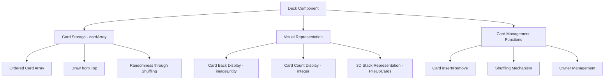
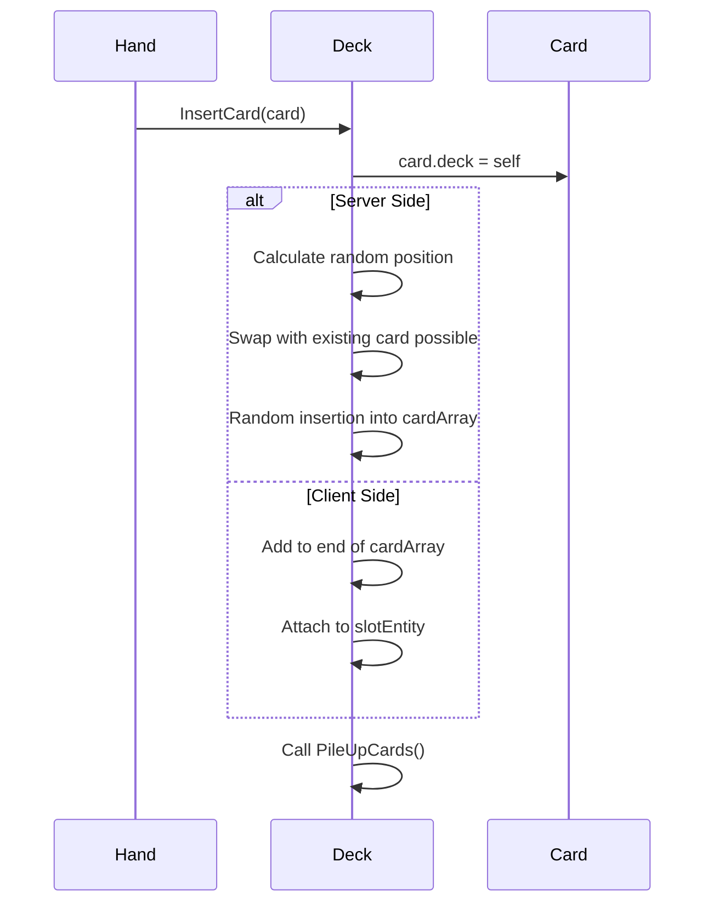
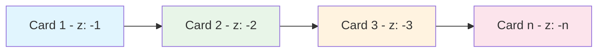
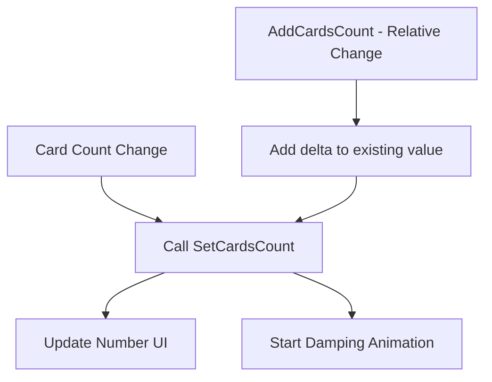
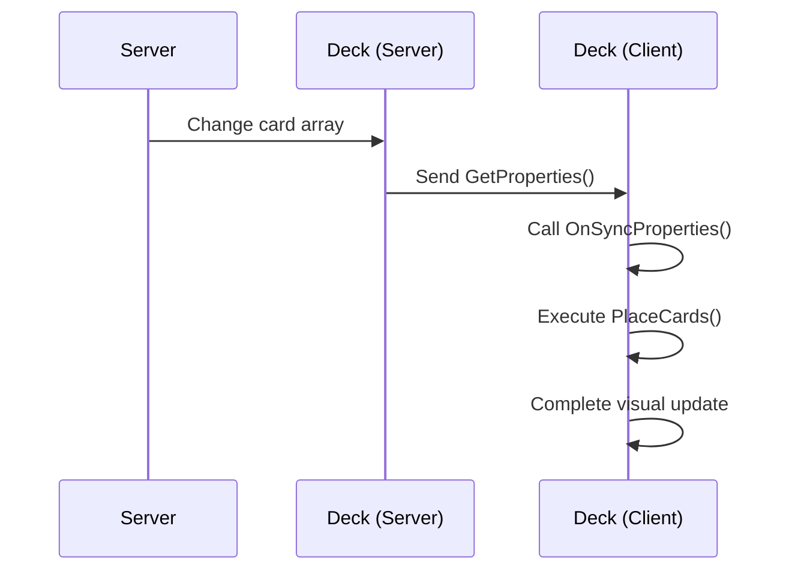

# Deck Component (Deck.mlua)

## 📋 Overview

`Deck.mlua` is the physical implementation of decks in Maple Duel, serving as a container that stores and manages cards. It handles all deck-related gameplay functions including card drawing from deck to hand, shuffling, visual representation, and more.

**Related Files**: 
- `RootDesk/MyDesk/Components/Objects/Deck.mlua`

## 🏗️ Deck Component Architecture

### Component Structure

### Core Properties

#### Card Management
- `cardArray`: Ordered array of cards in the deck
- `player`: Player who owns the deck
- `isOurs`: Distinction between our deck and opponent's deck

#### Visual Elements
- `propEntity`: Deck UI property entity
- `slotEntity`: Slot entity where cards are placed
- `imageEntity`: Image entity displaying card backs
- `integer`: Number UI displaying card count

#### Animation
- `imageTweener`: Image animation handler
- `integerTweener`: Number animation handler
- `integerTimer`: Number display delay timer

## 🎮 Main Function Systems

### 1. Card Storage and Management

#### Card Insertion System

**Main Methods**:
- `InsertCard(Card card)` — Single card insertion (with shuffling)
- `InsertCards(table cardArray)` — Multiple card insertion
- `InsertCardsWithoutShuffle(table cardArray)` — Insertion without shuffling

#### Card Removal System
- `RemoveCard(Card card)` — Remove specific card
- `RemoveCards(table cardArray)` — Remove multiple cards
- Remove card's `deck` reference and visual separation upon removal

### 2. Shuffling Mechanism

#### Dynamic Shuffling System
The deck automatically shuffles every time a card is added:

Shuffling logic is implemented through random index calculation and card ID exchange within `Deck.mlua :: InsertCard()`.

**Features**:
- **Continuous Shuffling**: Position randomization with each card insertion
- **Card ID Exchange**: Identifier exchange through `card:Swap(victim)`
- **Server Authority**: Shuffling executed only on server to ensure synchronization

### 3. Visual Representation System

#### 3D Stack Representation

**PileUpCards() Mechanism**:
- Set each card's Z position to -1, -2, -3... in sequence
- Visually implement stacked appearance of cards
- Top card displayed in front

#### Card Back System
- `imageEntity`: Display player-selected card back design
- `SpawnAndSetImageEntity()`: Dynamic generation of card back model
- Provide personalized visual representation

### 4. Card Count Display

#### Real-time Count Updates

**Methods**:
- `SetCardsCount(integer count)` — Set absolute count
- `AddCardsCount(integer delta)` — Relative count change
- Express changes with smooth damping animation

### 5. Detail Information Display

#### Deck Detail View
Shows detailed information when deck is clicked during game:

**ShowDetails() Features**:
- Card back image zoom animation
- Display card count (0.25 second delay)
- Smooth appearance with scale tweening

**HideDetails() Features**:
- Deactivate UI elements
- Resource cleanup and optimization

## 🔄 Client-Server Synchronization

### Property Synchronization

**Synchronized Data**:
- `cardArray`: Information of all cards currently in deck
- One-way synchronization from server to client

**OnSyncProperties() Processing**:
- Visual reconstruction with received card array information
- Update card placement through `PlaceCards()`

### Position Setting System

#### SetSide() Method
Position setting is handled in `Deck.mlua :: SetSide()` method through `layout:GetTransform()`.

- Automatic deck position setting according to game layout
- Distinguished placement of our deck and opponent's deck

## 🎯 Integration with Gameplay

### Card Draw at Turn Start
The deck integrates with other systems to support game progression:

- **TaskManager Integration**: Automatic draw at turn start
- **Hand System Integration**: Move drawn cards to hand
- **Player System Integration**: Ownership management

### Deck Depletion Handling
- Apply game rules when deck is empty
- Handle situations where no more draws are possible
- Connection with game end conditions

## 🎨 Optimization and Performance

### Memory Management
- **Card Reference Management**: Prevent `card.deck` circular references
- **Dynamic Creation/Removal**: Create UI elements as needed
- **Timer Cleanup**: Automatic release of unused timers

### Animation Optimization
- **Tweener Reuse**: Start new animation after stopping existing animation
- **Delayed Execution**: Proper timing control for UI updates
- **Visual Feedback**: Smooth transitions for user experience

## 💡 Code References

Core deck management logic:
- `Deck.mlua :: InsertCard()` — Card insertion and shuffling
- `Deck.mlua :: RemoveCard()` — Card removal
- `Deck.mlua :: PileUpCards()` — Visual stack composition
- `Deck.mlua :: SetCardsCount()` — Count display update
- `Deck.mlua :: OnSyncProperties()` — Client synchronization

The deck component handles the core mechanism of card games - deck management - and is an important component that provides the randomness and strategic elements of the game.
