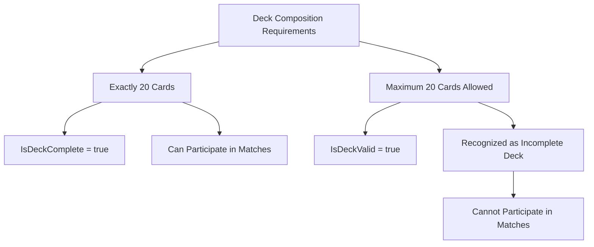
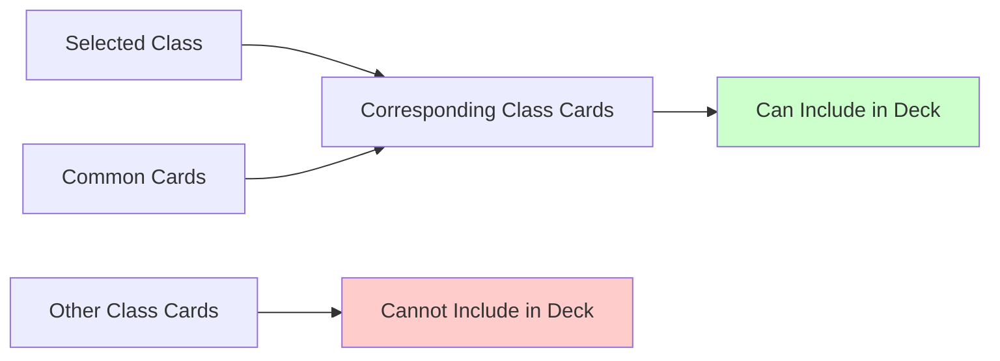
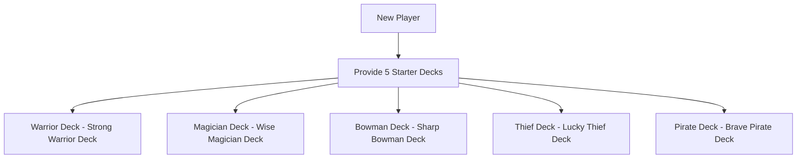
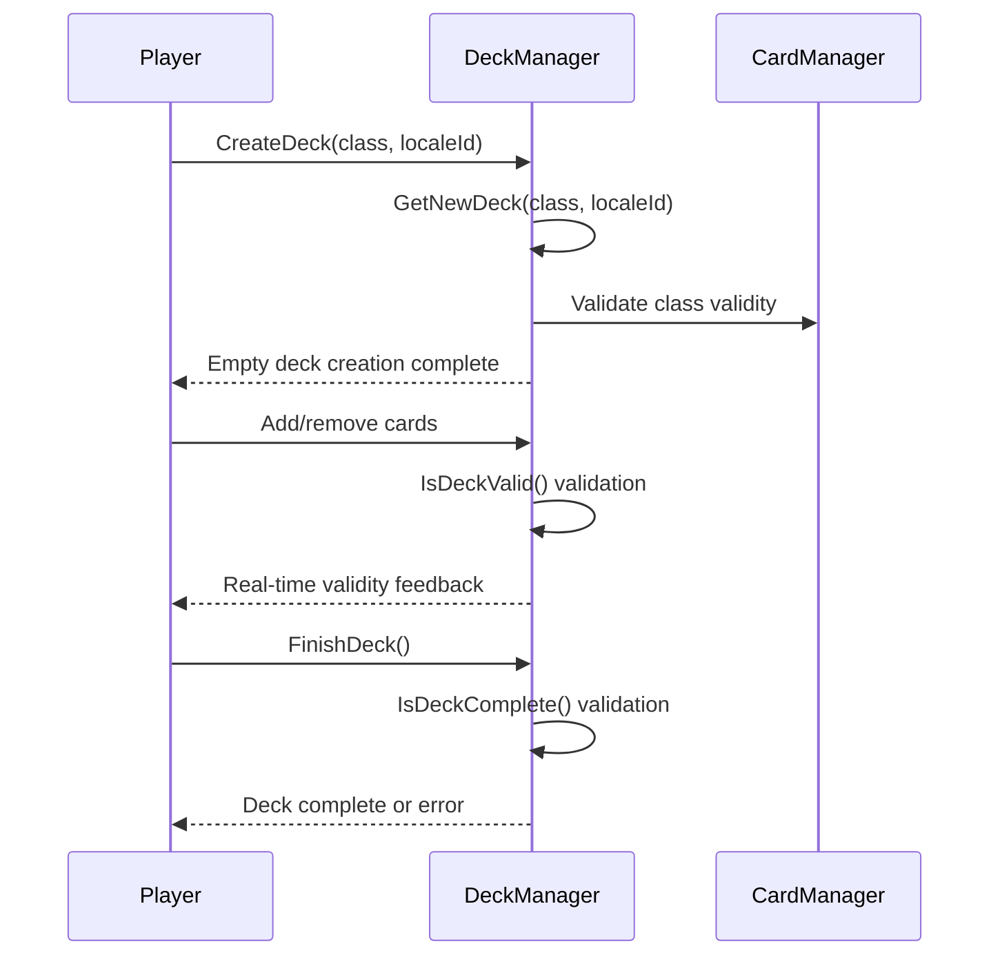

# Deck Composition Rules

## 📋 Overview

Maple Duel's deck system has strict composition rules for strategic depth and balance. All decks must consist of exactly 20 cards, with class restrictions and card quantity limits to maintain game balance.

**Related Files**: 
- `RootDesk/MyDesk/Components/Managers/DeckManager.mlua`
- `RootDesk/MyDesk/Components/Character.mlua`

## 🎯 Core Deck Composition Rules

### 1. Deck Size Limitations



**Rule Details**:
- **Required Size**: Exactly 20 cards (`IsDeckComplete()`)
- **Maximum Allowed**: 20 cards or less (`IsDeckValid()`)
- **Match Condition**: Only complete decks (20 cards) can participate in ranked matches

### 2. Class Restriction System



**Allowed Class Combinations**:
| Selected Class | Usable Cards |
|-----------|------------------|
| **Warrior** | Common + Warrior |
| **Magician** | Common + Magician |
| **Bowman** | Common + Bowman |
| **Thief** | Common + Thief |
| **Pirate** | Common + Pirate |

### 3. Card Quantity Limitations

**Same Card Limit**:
- Each card can include **maximum 2 copies** in a deck
- Same card regardless of different variant and quality
- Example: "OrangeMushroom" Default Silver 1 copy + "OrangeMushroom" Default Gold 1 copy = Total 2 copies

### 4. Token Card Exclusions

**Excluded Targets**:
- Cards with `isToken = TRUE`
- Uncollectable special cards
- Cards that can only be created through other effects

## 🔍 Deck Validation System

### DeckManager Validation Methods

#### `IsDeckValid(table deck)` - Basic Validity Check
```lua
-- Validation Conditions:
1. Deck exists and is not empty
2. Valid class selection (Warrior/Magician/Bowman/Thief/Pirate)
3. Deck name exists
4. Deck size is 20 cards or less
5. All cards are from allowed classes (Common + selected class)
6. Same card is 2 copies or less
```

#### `IsDeckComplete(table deck)` - Completeness Check
```lua
-- Completion Conditions:
1. IsDeckValid() == true
2. Deck size is exactly 20 cards
```

### Card Quantity Calculation Methods

#### `GetDeckSize(table deck)` - Total Card Count
Calculates total number of cards including all variants and qualities.

#### `GetCardCountByName(string name)` - Card Count by Name
Calculates total quantity including all variants/qualities of a specific card name.

#### `GetCardCountByInfo(table info)` - Exact Card Count
Calculates exact card quantity of specific variant and quality.

## 🎮 Starter Deck System

### Basic Decks by Class

Each player receives 5 starter decks when starting the game:



### Starter Deck Composition Examples

#### Warrior Starter Deck
- **Deck Name**: "Strong Warrior Deck" (Multi-language support)
- **Core Cards**:
  - PowerStrike x2 (Basic warrior attack skill)
  - Common minions (OrangeMushroom, Stump, etc.)
  - General utility cards

#### Magician Starter Deck  
- **Deck Name**: "Wise Magician Deck"
- **Core Cards**:
  - FireArrow x2 (Basic magician attack skill)
  - EvilEye x2 (Magician minion)
  - Explosion x2 (Powerful AOE skill)

### Starter Deck Features

**Balanced Composition**:
- Each deck showcases the characteristics of its respective class
- Simple cards that beginners can easily understand
- Appropriate ratio of minions and skills

**Unified Quality**:
- All starter deck cards are Silver quality
- Provides fair starting point with consistent performance

## 🛠️ Deck Editing System

### Deck Creation Process



### Real-time Validation

During deck editing, the following are validated in real-time:

**When Adding Cards**:
1. Check class restrictions
2. Check quantity limits (prevent exceeding 2 copies)
3. Check deck size limit (prevent exceeding 20 cards)

**When Removing Cards**:
1. Update deck size
2. Change completeness status

## 📊 Deck Management System

### Multiple Deck Support

**Per-Player Deck Management**:
- Maximum **10 decks** can be owned (`maxDeckCount = 10`)
- Each deck has independent class and composition
- Track currently selected deck index (`deckIndex`)

### Deck Save System

**Save Methods**:
- `SaveDeck()` - Temporary save (during editing)
- `FinishDeck()` - Final completion save
- `DeleteDeck()` - Deck deletion

**Data Structure**:
```lua
deck = {
    class = "Warrior",
    name = "My Custom Deck",
    cardTable = {
        CardName = {
            Variant = {
                Quality = count
            }
        }
    }
}
```

## 🎯 Strategic Considerations

### Metagame and Deck Composition

**Utilizing Class-specific Characteristics**:
- Combination of synergy cards for each class
- Counter picks considering opposing classes
- Card selection considering cost curve

**Resource Management**:
- Balance of MP cost distribution
- Balance of early/mid/late game
- Appropriate ratio of minions and skills

### Collection-based Constraints

**Card Ownership Limitations**:
- Can only include cards owned by player
- Limited quantities of rare cards
- Card sharing between decks (same card can be used in multiple decks)

## 💡 Code References

Core deck management logic:
- `DeckManager.mlua :: IsDeckValid()` — Deck validity validation
- `DeckManager.mlua :: IsDeckComplete()` — Deck completeness check
- `DeckManager.mlua :: GetDeckSize()` — Deck size calculation
- `DeckManager.mlua :: GetCardCountByName()` — Card quantity calculation by card
- `Character.mlua :: SetDecks()` — Set player deck list
- `Character.mlua :: CreateDeck()` — New deck creation

These deck composition rules provide strategic depth while ensuring a fair competitive environment, offering players the freedom to compose their own unique decks.
