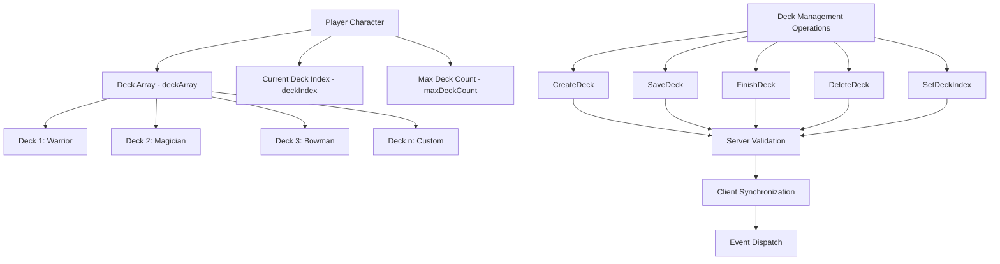
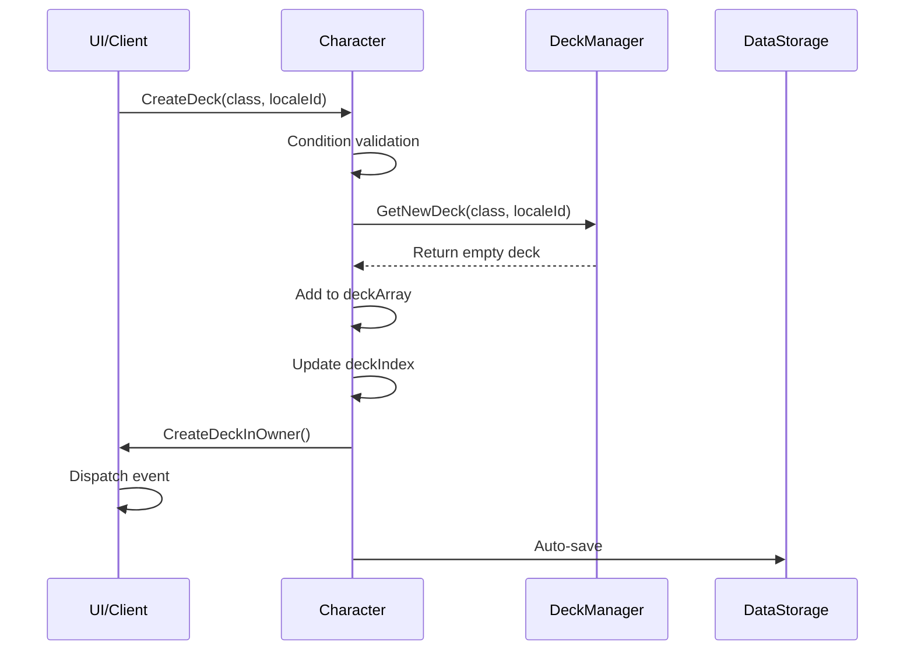
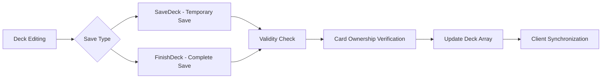
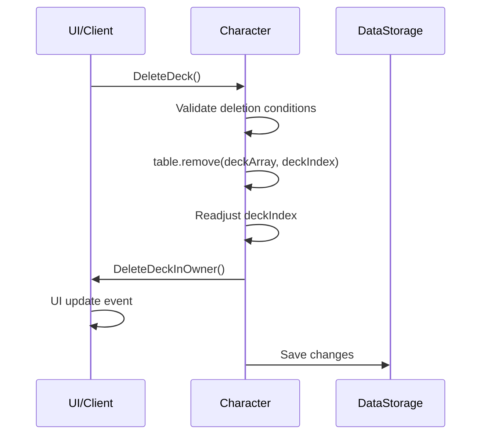
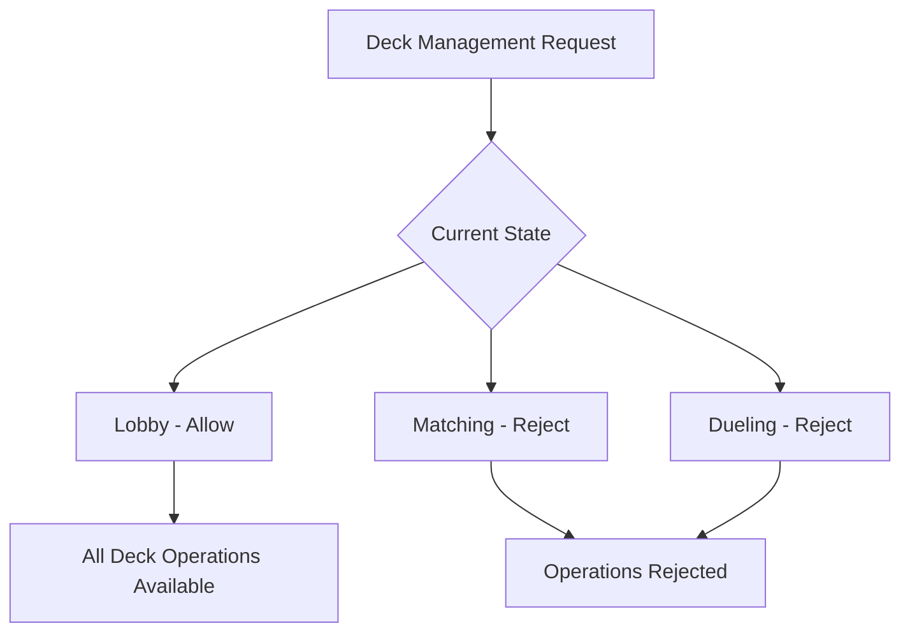
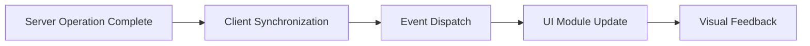

# Deck Management System

## 📋 Overview

The deck management system provides comprehensive functionality for players to create, edit, save, and delete their multiple decks. Each player can have up to 10 decks, and they participate in games using the currently selected deck.

**Related Files**: 
- `RootDesk/MyDesk/Components/Character.mlua`
- `RootDesk/MyDesk/Components/Managers/DeckManager.mlua`
- `RootDesk/MyDesk/Events/CreateDeck.mlua`, `SaveDeck.mlua`, `DeleteDeck.mlua`

## 🏗️ Deck Management Architecture

### System Structure



### Core Components

#### Per-Player Deck Storage
- `deckArray`: Array of all decks owned by the player
- `maxDeckCount = 10`: Maximum number of decks that can be owned
- `deckIndex`: Index of the currently selected and in-use deck

#### Deck Data Structure
```lua
deck = {
    class = "Warrior",           -- Deck's class
    name = "My Warrior Deck",    -- User-defined deck name
    cardTable = {                -- Card composition
        CardName = {
            Variant = {
                Quality = count
            }
        }
    }
}
```

## 🎮 Deck Management Operation System

### 1. Deck Creation (CreateDeck)

#### Creation Process


**Creation Condition Validation**:
1. `isLoaded == true` - Player data loading complete
2. Valid class selection (Warrior/Magician/Bowman/Thief/Pirate)
3. `#deckArray < maxDeckCount` - Below maximum deck count
4. `!isvalid(player) && !isMatching` - Not in game state
5. Server request validation passed

#### New Deck Generation
- Call `DeckManager:GetNewDeck(class, localeId)`
- Create empty deck template for selected class
- Set default deck name with multi-language support
- Automatically set `deckIndex` to newly created deck

### 2. Deck Saving (SaveDeck)

#### Temporary Save vs Complete Save


**SaveDeck() - Temporary Save**:
- Save intermediate state during deck editing
- Allow incomplete decks with less than 20 cards
- Reflect real-time editing content

**FinishDeck() - Complete Save**:
- Final save upon deck editing completion
- Require complete deck composition (20 cards)
- Set to state ready for game participation

#### Save Validation Process
1. **Basic Validity**: Pass `DeckManager:IsDeckValid()`
2. **Card Ownership Verification**:
   ```lua
   for name, variant, quality, count in deck.cardTable do
       if self:GetCardCount({name, variant, quality}) < count then
           return -- Fail if using unowned cards
       end
   end
   ```
3. **Game State Check**: Not in matching or dueling
4. **Server Authority Verification**: Confirm requester identity

### 3. Deck Deletion (DeleteDeck)

#### Deletion Process


**Deletion Conditions**:
- Current deck exists (`!_Table:IsEmpty(GetDeck())`)
- Not in game state
- Server authority verification passed

**Index Readjustment**:
```lua
self.deckIndex = math.min(self.deckIndex, #self.deckArray)
```
- Automatically adjust to valid index range after deletion
- Automatically move to previous deck when last deck is deleted

### 4. Deck Selection (SetDeckIndex)

#### Deck Switching System
Function to select which deck to use:

**Switch Condition Validation**:
1. Valid index range (`1 <= deckIndex <= #deckArray`)
2. For empty deck array, only index 1 allowed
3. Not in game state
4. Different from current index

**Switch Effects**:
- Update `deckIndex`
- Use new deck in matching system
- Highlight selected deck in UI

## 🔐 Security and Validation System

### Server Authority Management

#### Request Validation System
```lua
if _Server:IsRequesting() then
    if self ~= _Server.sender then
        return -- Reject if requester is not the owner
    end
end
_Server.sender = nil -- Reset after request processing
```

**Security Features**:
- **Requester Verification**: Can only manage own decks
- **Duplicate Request Prevention**: Prevent duplicate execution of pending requests
- **Session Invalidation**: Clean up session after processing completion

### Card Ownership Verification

#### Real-time Ownership Check
Verify that the player actually owns all cards included in the deck:

```lua
-- Detailed verification by card
if self:GetCardCount({
    name = name,
    variant = variant, 
    quality = quality
}) < count then
    return false -- Reject when trying to use more than owned quantity
end
```

**Verification Levels**:
- **By Name**: Check total ownership of same card name
- **By Variant**: Check ownership of specific variant
- **By Quality**: Check ownership of exact quality

### State-based Restrictions

#### Game State Constraints


**Restriction Conditions**:
- `isvalid(self.player)`: Participating in duel
- `self.isMatching`: Waiting for match
- Protection to not affect game progression

## 💾 Data Persistence

### Auto-Save System

#### Real-time Data Synchronization
All deck management operations are automatically saved to the database:

**Save Data**:
- `deckArray`: Complete deck array
- `deckIndex`: Currently selected deck index
- Stored as MSON format in user data storage

**Save Timing**:
- Immediately after deck creation/deletion
- Upon deck save/completion
- When deck index changes
- Upon player logout

### Loading and Initialization

#### New Player Handling
```lua
-- Provide basic starter decks
deckArray = {
    deckManager:GetWarriorStarterDeck(localeId),
    deckManager:GetMagicianStarterDeck(localeId),
    deckManager:GetBowmanStarterDeck(localeId),
    deckManager:GetThiefStarterDeck(localeId),
    deckManager:GetPirateStarterDeck(localeId)
}
deckIndex = 1 -- Select first deck
```

#### Existing Player Restoration
- Load saved deck array
- Restore last selected deck index
- Re-verify card ownership and modify decks

## 🎨 User Interface Integration

### Event System

#### Deck Management Events
Each deck management operation dispatches corresponding events:

- `CreateDeck()`: New deck creation complete
- `SaveDeck()`: Deck save complete
- `FinishDeck()`: Deck completion complete
- `DeleteDeck()`: Deck deletion complete
- `SetDeckIndex()`: Deck selection changed

#### UI Responsiveness


**UI Update Content**:
- Refresh deck list
- Highlight selected deck
- Switch deck editing mode
- Display status messages

## 💡 Code References

Core deck management logic:
- `Character.mlua :: CreateDeck()` — New deck creation
- `Character.mlua :: SaveDeck()` — Deck temporary save
- `Character.mlua :: FinishDeck()` — Deck completion save  
- `Character.mlua :: DeleteDeck()` — Deck deletion
- `Character.mlua :: SetDeckIndex()` — Deck selection change
- `Character.mlua :: GetDeck()` — Current deck query
- `DeckManager.mlua :: GetNewDeck()` — New deck template creation

The deck management system supports players' strategic choices and provides a core system that offers safe and intuitive deck management experience.
