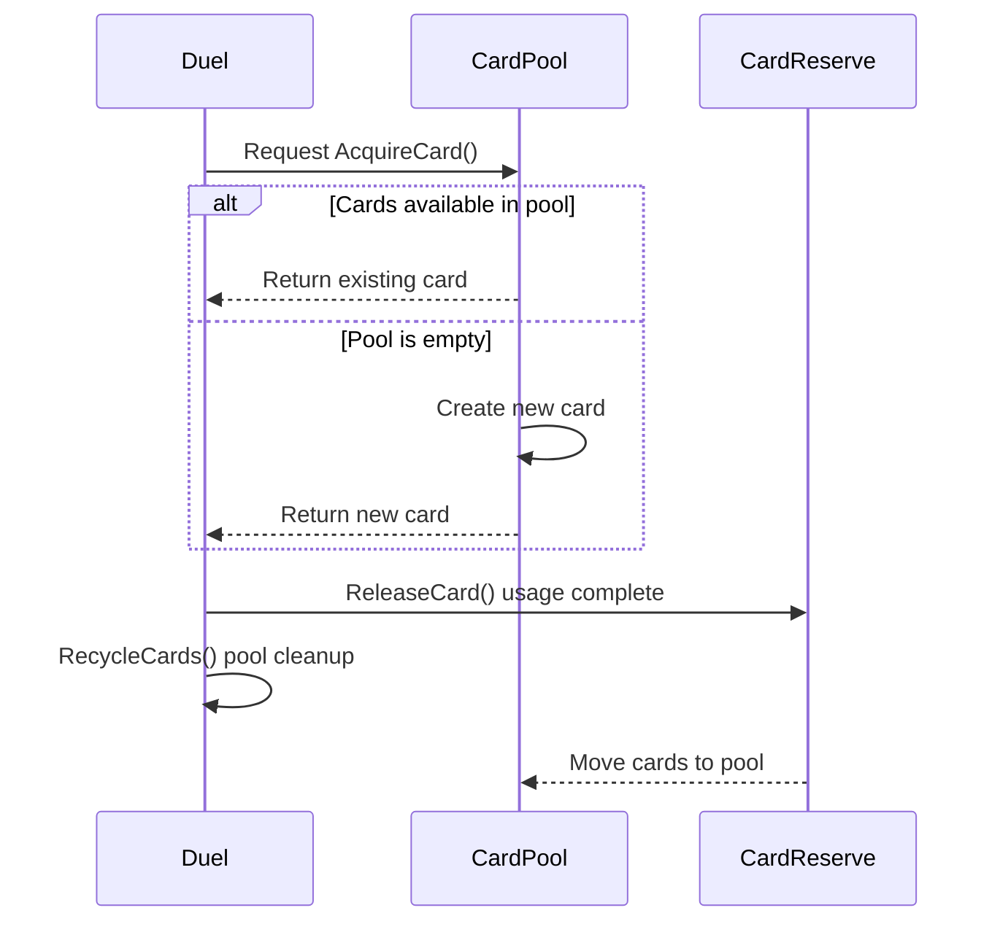
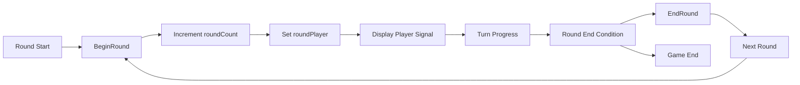
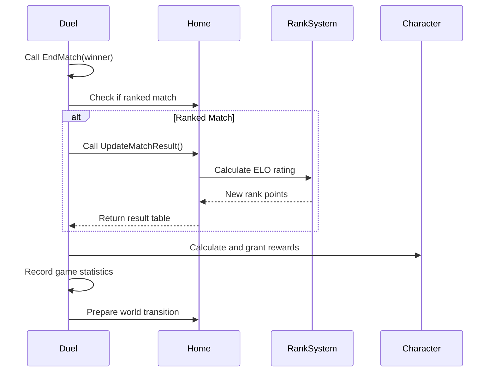
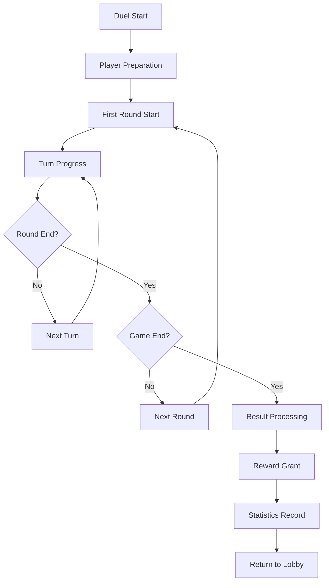

# Duel Component (Duel.mlua)

## 📋 Overview

`Duel.mlua` is the core component of Maple Duel that manages and controls the entire battle process between two players. It serves as the central controller handling all aspects from game start to end, including all progression, turn management, object pooling, and result processing.

**Related Files**: 
- `RootDesk/MyDesk/Components/Objects/Duel.mlua`

## 🏗️ Duel Component Architecture

### System Structure

```mermaid
graph TB
    A[Duel Component] --> B[Player Management]
    A --> C[Game Progress Control]
    A --> D[Object Pooling]
    A --> E[Result Processing]
    A --> F[Visual Effects]
    
    B --> B1[ourPlayer - Our Player]
    B --> B2[enemyPlayer - Enemy Player]
    B --> B3[playerArray - Player Array]
    
    C --> C1[Round Management - roundCount, roundPlayer]
    C --> C2[Turn Management - turnCount, turnPlayer]  
    C --> C3[Game State - isDueling]
    C --> C4[Timer System]
    
    D --> D1[Card Pool - cardPool, cardReserve]
    D --> D2[Minion Pool - minionPool, minionReserve]
    D --> D3[Object Recycling]
    
    E --> E1[Victory Determination]
    E --> E2[Reward Calculation]
    E --> E3[Ranking Update]
    
    F --> F1[Background Effects - DarkenBackground]
    F --> F2[Card Display - ShowCard]
    F --> F3[UI Feedback]
```



### Core Properties

#### Game State Management
- `isDueling`: Whether duel is currently in progress
- `roundCount`: Current round number
- `turnCount`: Current turn number
- `startDate`: Game start time

#### Player Management
- `playerArray`: Array of two players
- `ourPlayer`: Current client's player
- `enemyPlayer`: Opponent player
- `roundPlayer`: Current round's leader
- `turnPlayer`: Current turn's actor

#### Timer System
- `beginDuelTimer`: Duel start delay timer
- `turnTimer`: Turn time limit timer
- `countdownTimer`: Countdown timer
- `turnTime`: Remaining turn time
- `countdownTime`: Countdown time

## 🎮 Main Function Systems

### 1. Object Pooling System

#### Card Pooling


**Card Pooling Methods**:
- `ShareAcquiredCards(count)` — Acquire multiple cards simultaneously
- `ShareAcquiredCard()` — Single card acquisition (server-client sync)
- `AcquireCard()` — Server-only card acquisition
- `ReleaseCard(card)` — Return used card
- `RecycleCards()` — Pool cleanup and recycling

#### Minion Pooling
Manages minion objects with the same pattern:
- `minionPool`: Available minion pool
- `minionReserve`: Used minions awaiting cleanup
- Same lifecycle management as cards

**Optimization Benefits**:
- **Memory Efficiency**: Reduce GC pressure through object reuse
- **Performance Improvement**: Save frequent creation/deletion costs
- **Synchronization Guarantee**: Object ID consistency between server-client

### 2. Game Progress Control

#### Round System


**BeginRound(Player roundPlayer) Features**:
- Increment round number (`roundCount++`)
- Set round leader
- Visual round start signal
- Initialize each player's state

**EndRound(boolean isTimeout) Features**:
- Clear all players' round end declarations
- Hide round-related UI
- Move hand cards to rest position
- Prepare for next round

#### Turn Management System
Each round consists of multiple turns where players take actions alternately:

- `turnPlayer`: Player currently taking action
- `turnTime`: Turn time limit (in seconds)
- `turnTimer`: Timer tracking time elapsed
- `isWaitingExtraTime`: Extra time waiting state

### 3. Visual Feedback System

#### Background Effect Control
Immersive background effects according to game situations:

**DarkenBackground() Features**:
- Darken background at game start
- Smooth transition over 0.25 seconds
- Visual effect to improve focus

**LightenBackground() Features**:
- Restore background brightness at game end
- Natural recovery with same transition time

#### Card Highlight Display
**ShowCard System**:
- `showingCard`: Currently highlighted card
- `showCardTimer`: Card display duration
- `showCardTweener`: Card animation handler

**placingMinion System**:
- Visual preview during minion placement
- Highlight placement position
- Cancelable before placement confirmation

### 4. Game End and Result Processing

#### Victory Determination System


**EndMatch(Player winner) Processing**:
1. **Victory Determination**: Confirm match result with `winner` parameter
2. **Match Type Check**: Distinguish ranked match vs friendly match
3. **Ranking Update**: Rating change through ELO system
4. **Reward Grant**: Meso, experience, rank points, etc.
5. **Statistics Record**: Save game history
6. **World Transition**: Automatic return to lobby after 6 seconds

#### Reward System
Visually display various types of rewards:

**Reward Types**:
- **PlayMeso**: Basic reward for game participation
- **RankedWinMeso**: Additional reward for ranked victory  
- **RankedPlayMeso**: Daily reward for ranked participation
- **RankMeso**: Rank promotion bonus
- **RankPoint**: Rating point change

**Visual Representation**:
- Display each reward as separate UI sequentially
- Entrance/exit effects with scale animation
- Auto-disappear after 5 seconds
- Vertically arranged on left side of screen

### 5. Integrated Command System Integration

#### Collaboration with CommandManager
Duel closely integrates with `commandManager`:

**Synchronization Packages**:
- `commandManager:PushPackage(object)` — Send object from server
- `commandManager:PopPackage()` — Receive object on client
- Guarantee ID synchronization when creating cards/minions

**Command Execution Control**:
- All game actions processed through CommandManager
- Server authority verification and client synchronization
- Complex object transfer through package system

### 6. State Management and Synchronization

#### Property Synchronization
```lua
method table GetProperties()
    return {
        commandId = self.commandId,
        objectId = self.objectId,
        objectArray = self.objectArray,
        isDueling = self.isDueling,
        roundCount = self.roundCount,
        roundPlayer = self.roundPlayer,
        turnCount = self.turnCount,
        turnPlayer = self.turnPlayer,
        tutorial = self.tutorial,
    }
end
```

**Synchronized Data**:
- Game progress state (round, turn, duel status)
- Current active player information
- Object arrays and identifiers
- Tutorial state

## 🎯 Game Flow Integration

### Complete Duel Lifecycle


### Integration with Other Systems
- **TaskManager**: Control game logic execution order
- **Player**: Individual player state management
- **Field/Hand**: Card placement area management
- **TriggerManager**: Card effect activation processing
- **UI System**: Game state visualization

## ⚡ Performance Optimization

### Memory Management
- **Object Pooling**: Minimize GC pressure through card/minion reuse
- **Timer Management**: Automatic release of unused timers
- **Resource Cleanup**: Clean up all temporary objects at game end

### Network Optimization
- **Package System**: Efficient transmission of complex data
- **State Synchronization**: Selective sync of essential information only
- **Delay Processing**: Appropriate timing control for visual effects

## 💡 Code References

Core duel management logic:
- `Duel.mlua :: BeginRound()` — Round start processing
- `Duel.mlua :: EndRound()` — Round end processing  
- `Duel.mlua :: EndMatch()` — Game end and result processing
- `Duel.mlua :: ShareAcquiredCard()` — Card pooling management
- `Duel.mlua :: DarkenBackground()` — Visual effect control
- `Duel.mlua :: GetProperties()` — State synchronization

The Duel component serves as the central hub overseeing all game progression and is a core system that provides players with a high-quality battle experience.
