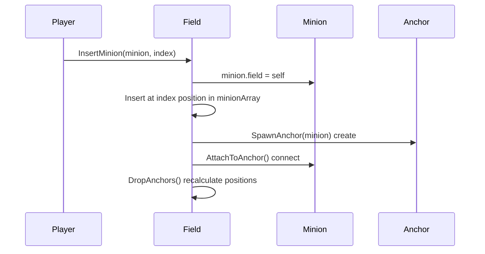
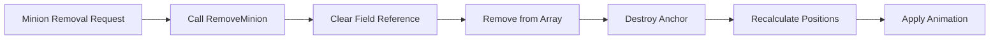
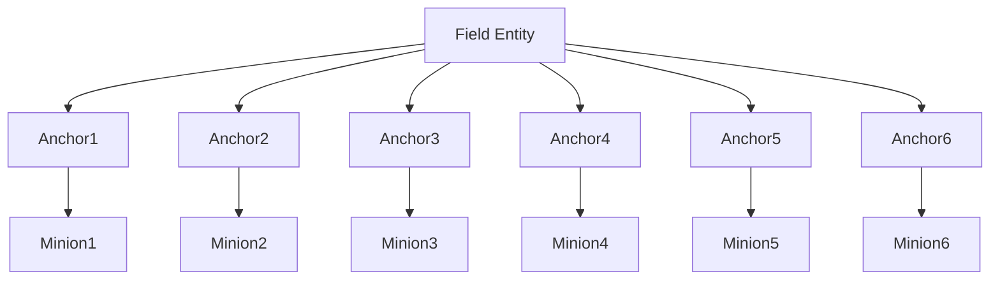
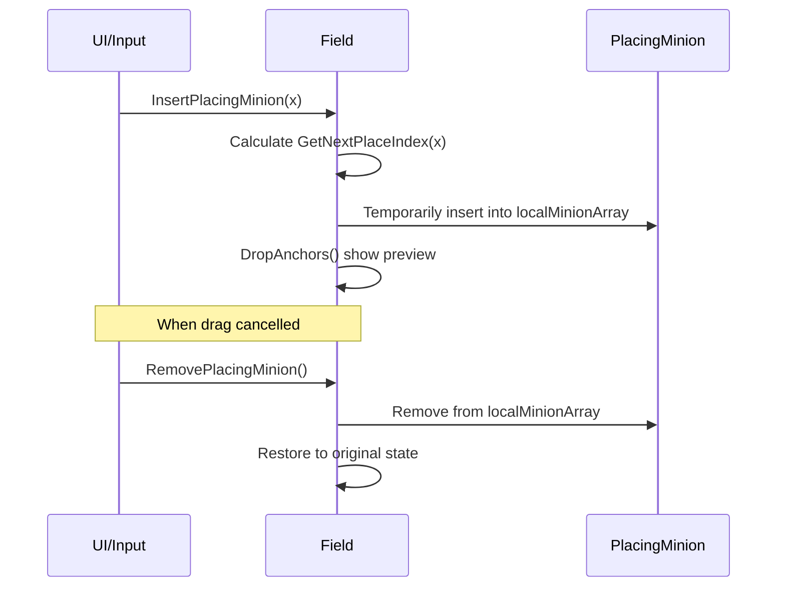
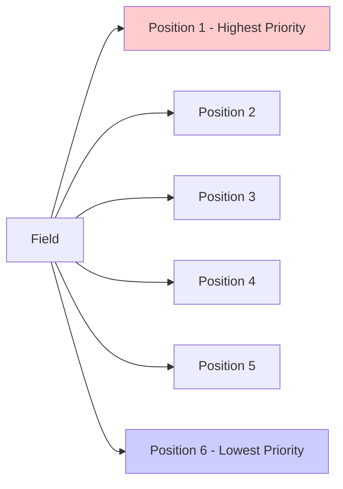
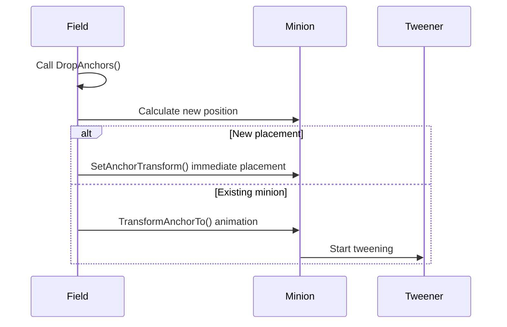
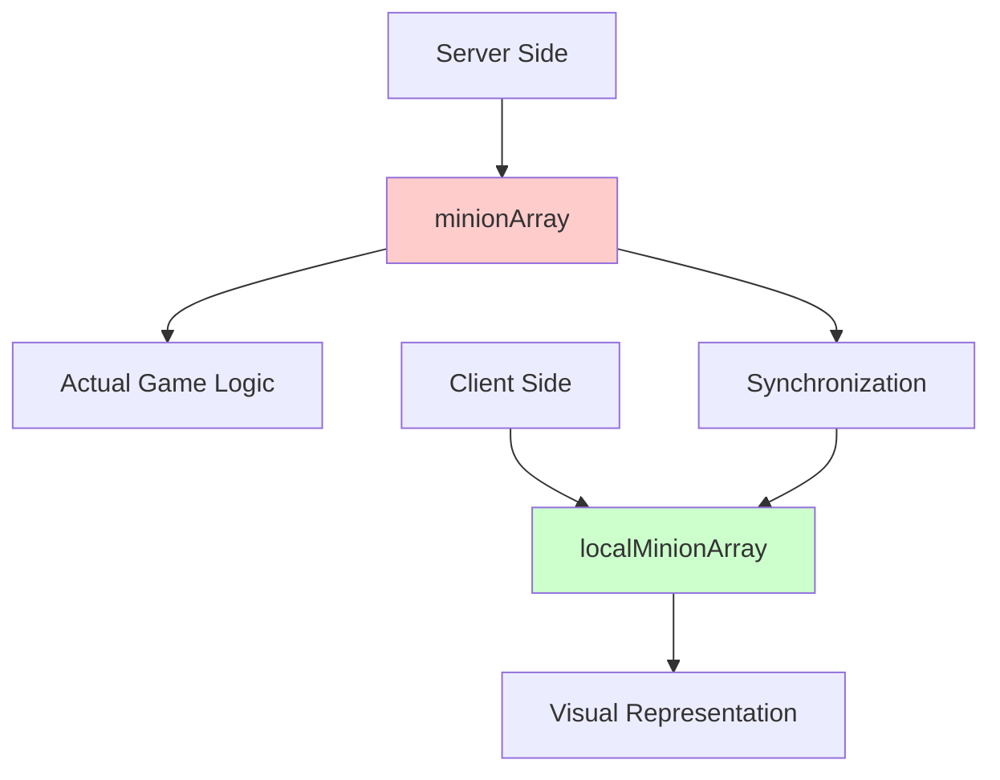

# Field System (Field.mlua)

## 📋 Overview

`Field.mlua` is a core component in Maple Duel that manages the battle field where minions are placed and combat occurs. Each player can place up to 6 minions on their field, and it handles their positioning, battle order, state management, and more. It provides comprehensive functionality including real-time minion placement, anchor-based position management, and combat logic integration.

**Related Files**: 
- `RootDesk/MyDesk/Components/Objects/Field.mlua`

## 🏗️ Field System Architecture

### System Structure

```mermaid
graph TB
    A[Field Component] --> B[Minion Placement Management]
    A --> C[Position Calculation System]
    A --> D[Combat Logic Integration]
    A --> E[Visual Representation]
    
    B --> B1[minionArray - Server Minion Array]
    B --> B2[localMinionArray - Client Minion Array]
    B --> B3[capacity = 6 - Max Placement Count]
    B --> B4[Placement Availability - isPlaceable]
    
    C --> C1[Anchor System - anchorEntity]
    C --> C2[Position Calculation - DropAnchors]
    C --> C3[Placement Preview - placingMinion]
    C --> C4[Dynamic Rearrangement]
    
    D --> D1[Battle Order - Left Priority]
    D --> D2[Battler Selection - GetFrontBattler]
    D --> D3[Direct Attackers - GetDirectAttackers]
    D --> D4[Dead Minion Processing - GetDeadMinions]
    
    E --> E1[Real-time Animation]
    E --> E2[Tweening System]
    E --> E3[UI Feedback]
```



### Core Properties

#### Minion Management
- `minionArray`: Actual minion array managed by server
- `localMinionArray`: Local array for client visual representation
- `capacity = 6`: Maximum number of minions that can be placed on field
- `player`: Player who owns the field

#### State Management
- `isOurs`: Our/opponent field distinction
- `isPlaceable`: Current minion placement availability

## 🎮 1. Minion Placement System

### Placement Condition System

#### GetInputState() Mechanism
```lua
method table GetInputState(Character character)
    local isPlaceable = character.player == self.player 
                       and self.player:IsOurTurn() 
                       and not self:IsFull()
    return {isPlaceable = isPlaceable}
end
```

**Placement Conditions**:
1. **Ownership Check**: Can only place on own field
2. **Turn Check**: Can only place during own turn  
3. **Capacity Check**: Can only place when under 6 minions

### Minion Insertion System

#### Single Minion Insertion


#### Multiple Minion Insertion  
```lua
method void InsertMinions(table minionArray, Minion pivot)
    -- Calculate insertion position based on pivot
    local index = (_Table:Find(self.minionArray, pivot) or 0) + 1
    
    -- Insert each minion sequentially
    for i = #minionArray, 1, -1 do
        local minion = minionArray[i]
        self:InsertMinion(minion, index)
        self:SpawnAndAttachToAnchor(minion)
    end
    
    -- Recalculate positions and animate
    self:DropAnchors(newMinionArray)
end
```

**Insertion Features**:
- **Pivot-based**: Determine relative position based on existing minion
- **Reverse Insertion**: Insert from end of array to maintain order
- **Immediate Reflection**: Update visual representation simultaneously with insertion

### Minion Removal System

#### Removal Process


**Post-removal Processing**:
- `minion.field = nil` — Clear field reference
- `DestroyAnchor(minion)` — Destroy anchor entity
- `DropAnchors({})` — Reposition remaining minions

## 🎯 2. Position Management System

### Anchor System 

#### Anchor-based Position Management
Each minion has an independent anchor entity for precise position control.



#### Position Calculation Formula
```lua
-- Core calculation in DropAnchors method
local size = #self.localMinionArray
for i, minion in ipairs(self.localMinionArray) do
    local position = Vector2((-0.5 * size + i - 0.5) * 1.2, 0)
    minion:SetAnchorTransform(position)
end
```

**Position Formula Features**:
- **Center Alignment**: Minions evenly distributed at field center
- **1.2 Spacing**: Maintain 1.2 unit distance between minions
- **Dynamic Adjustment**: Automatic spacing adjustment based on minion count

### Real-time Placement Preview

#### placingMinion System
Feature that shows placement position preview when dragging cards.



**Preview Features**:
- **Real-time Feedback**: Immediate reflection based on mouse position
- **Temporary Placement**: Only provide visual preview before actual placement
- **Cancellable**: Restore to original state when drag is cancelled

## ⚔️ 3. Combat System Integration

### Battle Order Determination

#### Position-based Battle Priority
Field minions have battle priority determined by placement order (left to right).



#### Combat-related Methods
```lua
-- First minion capable of battle 
method Minion GetFrontBattler()
    if self.duel.isRandomBattle then
        return self.commandManager:ShareRandomElementInArray(self:GetBattlers())
    end
    
    for _, minion in ipairs(self.minionArray) do
        if minion:IsBattler() then
            return minion
        end
    end
end

-- Minion access by position
method Minion GetLeftmostMinion()  -- Leftmost (first)
method Minion GetRightmostMinion() -- Rightmost (last)
method Minion GetFrontMinion()     -- Battle highest priority
```

### Minion Status Classification

#### Grouping by Battle Status
Field efficiently classifies minions according to their status.

**Combat-related Classification**:
- `GetBattlers()` — Minions capable of battle
- `GetDirectAttackers()` — Minions capable of direct attack  
- `HasBattler()` — Whether battle-capable minions exist

**Survival Status Classification**:
- `GetDeadMinions()` — Dead minions
- `HasDeadMinion()` — Whether dead minions exist

**Random Selection Support**:
```lua
method table ShareRandomMinions(integer count, any selector)
    return self.commandManager:ShareRandomPermutationInArray(
        _Table:Select(self:GetMinions(selector), self.taskManager.liveSelector), count)
end
```

## 🎨 4. Visual Representation System

### Animation System

#### Anchor Movement Animation
Provides smooth animation when minion placement changes.



#### Tweening Management
```lua
-- Minion anchor animation
method void TransformAnchorTo(Vector2 position)
    if isvalid(self.anchorTweener) then
        self.anchorTweener:Destroy()
    end
    
    self.anchorTweener = _Tween:MoveTo(
        self.anchorEntity, position, 0.3, EaseType.CubicEaseOut)
end
```

### Field Placement System

#### SetSide() Method
```lua
method void SetSide(boolean isOurs)
    self.isOurs = isOurs
    
    local transform = self.layout:GetTransform(
        isOurs and "OurField" or "EnemyField")
    self.Entity.TransformComponent.WorldPosition = transform.WorldPosition:Clone()
end
```

**Field Positions**:
- **Our Field**: Bottom of screen placement
- **Opponent Field**: Top of screen placement  
- **Layout Integration**: Use positions defined in Layout system

## 🔄 5. Synchronization System

### Server-Client Synchronization

#### Dual Array System


#### OnSyncProperties() Processing
```lua
method void OnSyncProperties()
    -- Copy server data to local array
    self.localMinionArray = _Table:ShallowCopy(self.minionArray)
    
    -- Update visual representation
    self:PlaceMinions()
end
```

**Synchronization Features**:
- **Server Authority**: `minionArray` modified only on server
- **Client Representation**: Visual representation with `localMinionArray`
- **Real-time Reflection**: Immediate client update when server changes

### Input State Management

#### Input Control by Client
```lua
method void SetInputState(table inputState)
    if _Table:IsEmpty(inputState) then
        self.isPlaceable = false
    else
        self.isPlaceable = inputState.isPlaceable
    end
end
```

Each client has different input permissions based on their turn and field state.

## 🎯 6. Optimization and Performance

### Memory Management

#### Anchor Lifecycle Management
```lua
-- Anchor creation
method void SpawnAnchor(Minion minion)
    if isvalid(minion.anchorEntity) then return end
    
    minion.anchorEntity = _SpawnService:SpawnByModelId(
        _EntryService:GetModelIdByName("Anchor"), "Anchor", 
        position, self.Entity)
end

-- Anchor cleanup
method void DestroyAnchor(Minion minion)
    minion:DestroyTweener()
    minion:DestroyAnchorTweener()
    minion.anchorEntity:Destroy()
    minion.anchorEntity = nil
end
```

**Optimization Points**:
- **Create as Needed**: Create anchors only when placing minions
- **Immediate Cleanup**: Complete resource release when removing minions
- **Tweener Management**: Clean up tweener objects after animation completion

## 💡 Code References

Core field management logic:
- `Field.mlua :: InsertMinion()` — Minion field placement
- `Field.mlua :: RemoveMinion()` — Minion field removal  
- `Field.mlua :: DropAnchors()` — Position calculation and animation
- `Field.mlua :: GetFrontBattler()` — Battle priority minion selection
- `Field.mlua :: PlaceMinions()` — Client visual placement
- `Field.mlua :: GetInputState()` — Placement availability determination

The field system provides the core battle stage of card games and is an important system that adds tactical depth to the game through intuitive minion placement and strategic position selection.
