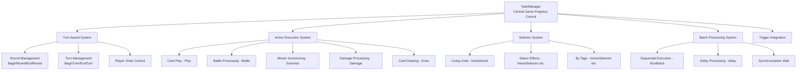
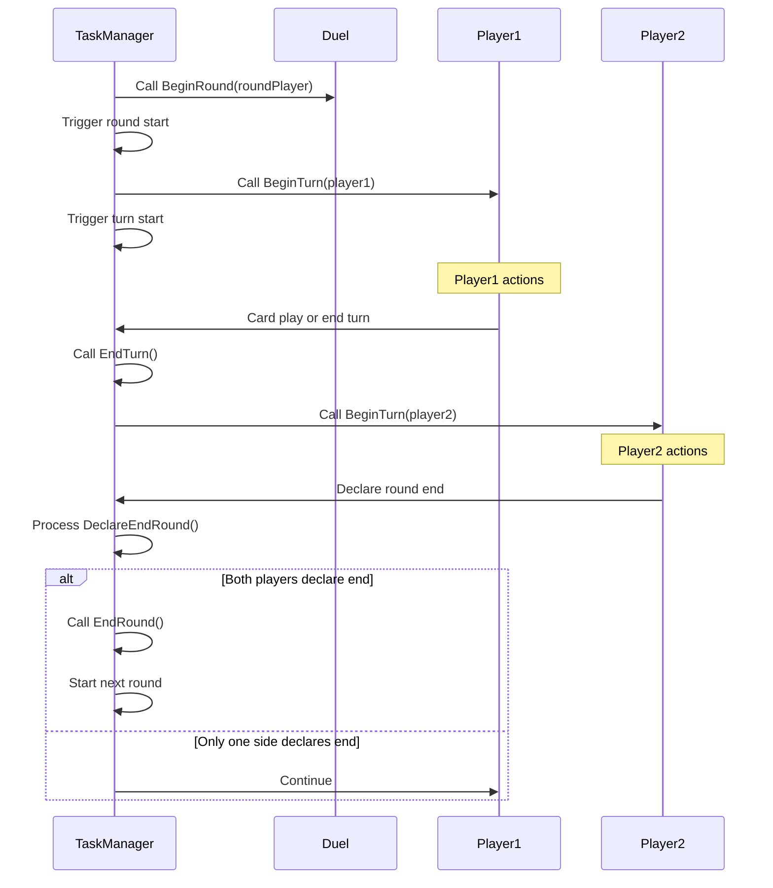
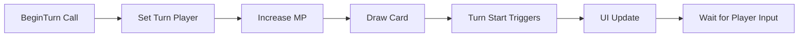
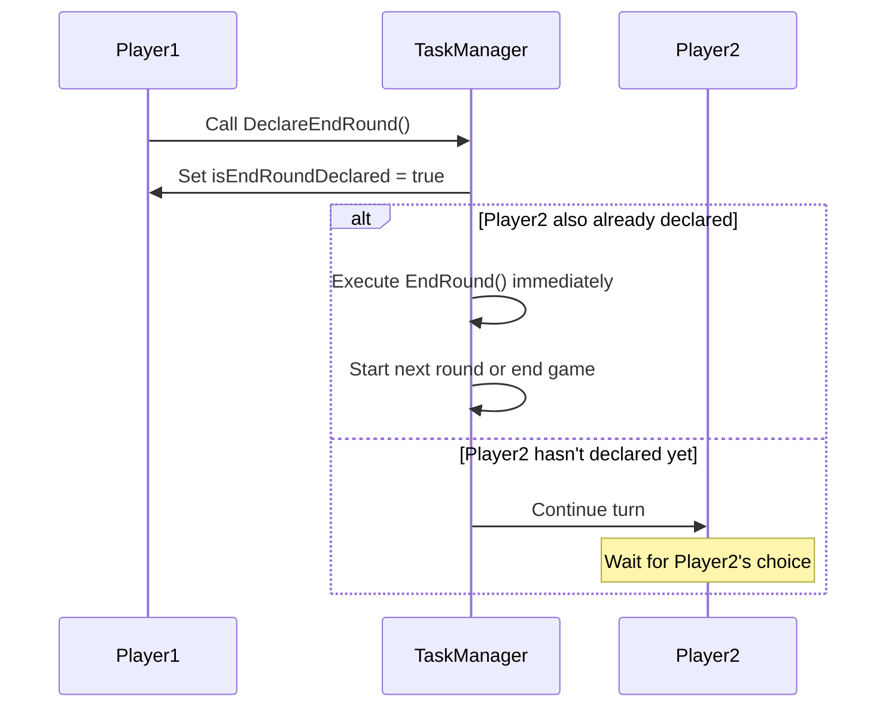
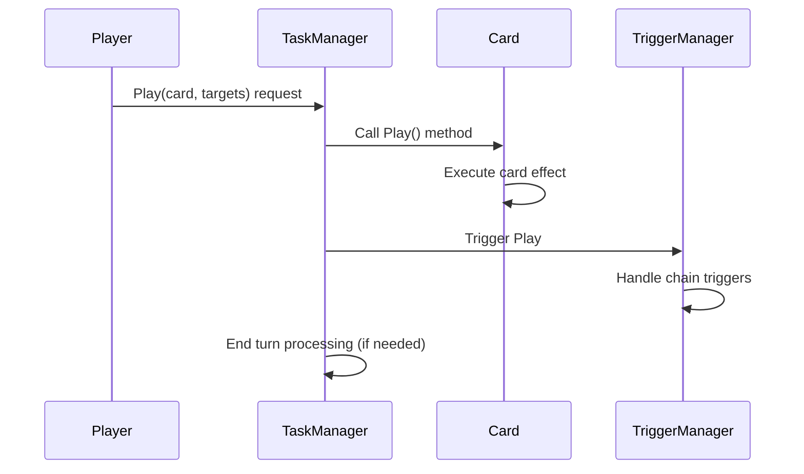
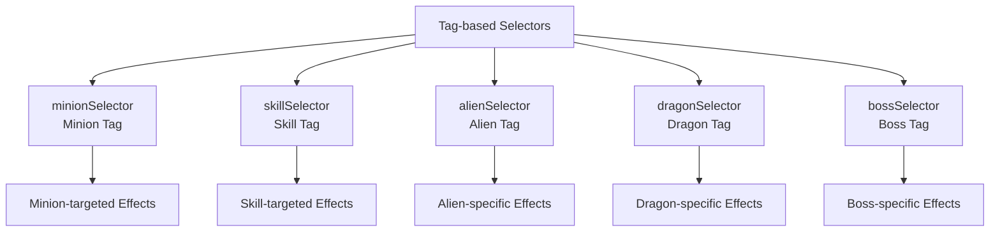
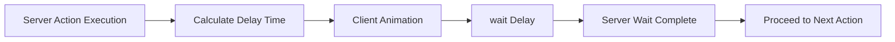
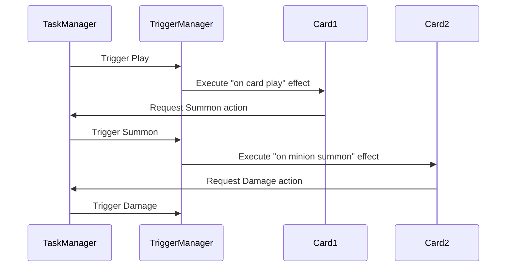

# Game Progress Control (TaskManager.mlua)

## 📋 Overview

`TaskManager.mlua` is the central controller that manages the overall game flow in Maple Duel. It handles round and turn management in the turn-based system, sequential execution of game actions, trigger system integration, and coordination of various gameplay tasks (card play, battle, summoning, etc.). All game progression is systematically managed through TaskManager, ensuring complex card effects and interactions execute in the correct order.

**Related Files**: 
- `RootDesk/MyDesk/Components/Managers/TaskManager.mlua`

## 🏗️ Game Progress Control Architecture

### System Structure



### Core Properties

#### Manager Integration
- `duel`: Duel component reference
- `actionManager`: Action execution manager
- `commandManager`: Command synchronization manager
- `triggerManager`: Trigger system manager
- `history`: Game history record

#### Execution Control
- `delay`: Currently accumulated delay time
- `coreDelayTable`: Core delay time table

#### Selector System
- `validSelector`: Valid object identification
- `liveSelector`: Living unit identification
- `openSelector`: Revealed card identification
- Various status/tag-based selectors

## 🎮 1. Turn-based System Control

### Game Progress Flow



### Round Management System

#### BeginRound() Mechanism
```lua
method void BeginRound(Player roundPlayer)
    local taskName = "BeginRound"
    local args = {}
    local objectArray = {roundPlayer}
    
    -- Notify duel component of round start
    self.duel:BeginRound(roundPlayer)
    
    -- Propagate round start event to trigger system
    self.triggerManager:InvokeTriggers(objectArray, receiverArray, "BeginRound", args, nil, nil)
    
    -- Start first turn
    self:BeginTurn(roundPlayer)
end
```

**Round Start Processing**:
- Set round player and update UI
- Trigger round-specific effects
- Automatically start first turn

#### EndRound() Mechanism
```lua
method void EndRound(boolean isTimeout)
    local taskName = "EndRound"
    local args = {isTimeout}
    
    -- Force end current turn
    self:EndTurn(isTimeout)
    
    -- Notify duel component of round end
    self.duel:EndRound(isTimeout)
    
    -- Trigger round end effects
    self.triggerManager:InvokeTriggers(objectArray, receiverArray, "EndRound", args, nil, nil)
end
```

### Turn Management System

#### BeginTurn() Detailed Processing


```lua
method void BeginTurn(Player turnPlayer)
    local taskName = "BeginTurn"
    local args = {}
    local objectArray = {turnPlayer}
    
    -- Set turn player in duel
    self.duel.turnPlayer = turnPlayer
    
    -- Notify trigger system of turn start
    self.triggerManager:InvokeTriggers(objectArray, receiverArray, "BeginTurn", args, nil, nil)
    
    -- Auto-processing (MP increase, card draw, etc.)
    -- This part is handled through triggers
end
```

#### Round End Declaration System


## ⚔️ 2. Game Action Execution System

### Batch Processing System (RunBatch)

#### Sequential Execution Mechanism
```lua
method void RunBatch(table objectArray, string taskName, table args, table eachArgs, string actionName, number interval)
    if _Table:IsEmpty(objectArray) then
        return
    end
    
    -- Execute task sequentially for each object
    for i, object in ipairs(objectArray) do
        -- Use individual arguments if available
        local currentArgs = eachArgs and eachArgs[i] or args
        
        -- Method call
        _Util:Call(object, taskName, currentArgs)
        
        -- Action animation (client side)
        if actionName and self:IsClient() then
            object:Animate(actionName)
        end
        
        -- Interval wait (except last object)
        if interval and i < #objectArray then
            if self:IsClient() then
                wait(interval)
            end
            self:AddDelay(interval)
        end
    end
end
```

**Batch Processing Advantages**:
- **Consistency**: Handle all game actions with same pattern
- **Synchronization**: Ensure precise timing between server-client
- **Visual Feedback**: Natural presentation through animation and delay

### Main Game Actions

#### Card Play (Play)


#### Battle Processing (Battle)
```lua
method void Battle(table attackerArray, table targetArray)
    local taskName = "Battle"
    local args = {}
    
    -- Match attackers and targets for battle processing
    for i, attacker in ipairs(attackerArray) do
        local target = targetArray[i] or targetArray[1]  -- Target matching
        
        if isvalid(target) and not target.isDead then
            -- Execute actual battle logic
            local battleResult = target:Damage(attacker, attacker:GetFinalAtk())
            
            -- Additional processing based on battle result
            if battleResult.damage > 0 then
                self.history:AddThisGameDamage(attacker.player, battleResult.damage)
            end
        end
    end
    
    -- Trigger battle effects
    self.triggerManager:InvokeTriggers(attackerArray, receiverArray, "Battle", args, nil, nil)
end
```

#### Minion Summoning (Summon)
```lua
method void Summon(table blueprintTable, Minion pivot, boolean isPlaying)
    local minionTable = {}
    
    -- Create minions for each player
    for player, blueprintArray in pairs(blueprintTable) do
        local availableSpace = player.field.capacity - #player.field.minionArray
        local minionArray = self.duel:ShareAcquiredMinions(
            math.min(#blueprintArray, availableSpace))
        
        -- Set minions based on blueprints
        for i, minion in ipairs(minionArray) do
            local blueprint = blueprintArray[i]
            minion:SetPlayer(player)
            minion:SetBlueprint(blueprint)
        end
        
        -- Place on field
        player.field:InsertMinions(minionArray, pivot)
    end
    
    -- Trigger summon effects
    self.triggerManager:InvokeTriggers(objectArray, receiverArray, "Summon", args, nil, nil)
end
```

## 🎯 3. Selector System

### Conditional Object Selection

TaskManager provides selector functions for selecting objects that meet specific conditions in various situations.

#### Basic Selectors
```lua
-- Living unit selection
self.liveSelector = function(unit)
    return not unit.isDead
end

-- Revealed card selection
self.openSelector = function(card)
    return not _Table:IsEmpty(card.info)
end

-- Damaged minion selection
self.damagedSelector = function(minion)
    return minion:IsDamaged()
end

-- Frozen minion selection
self.freezeSelector = function(minion)
    return minion.isFreeze
end
```

#### Tag-based Selectors


### Selector Usage Examples
```lua
-- Damage living minions in opponent's field
local targets = _Table:Select(
    player.opponent.field:GetMinions(), 
    self.liveSelector
)

-- Select minion cards from own hand
local minionCards = _Table:Select(
    player.hand:GetCards(), 
    function(card) 
        return self.minionSelector(card) and self.openSelector(card) 
    end
)
```

## ⏰ 4. Delay System and Synchronization

### Delay Time Management

#### AddDelay() Accumulation System
```lua
method void AddDelay(number delay)
    self.delay = self.delay + delay
    
    -- Record core delay time
    table.insert(self.coreDelayTable, delay)
end
```

All visual effects and animations in the game have appropriate delay times applied to ensure natural game progression.

#### Synchronization Wait System


**Server-Client Synchronization**:
- Server accumulates delay time with `AddDelay()`
- Client actually waits with `wait()`
- Ensure all actions complete at same timing

## 🔗 5. Trigger System Integration

### Event-based Game Progression

#### Trigger Invocation Pattern
```lua
-- Trigger invocation in all major actions
self.triggerManager:InvokeTriggers(
    objectArray,        -- Objects that generated the event
    receiverArray,      -- All objects that can receive the event
    "EventName",        -- Event name
    args,              -- Event arguments
    nil, nil           -- Additional parameters
)
```

#### Main Game Events
- **BeginRound** / **EndRound**: Round start/end
- **BeginTurn** / **EndTurn**: Turn start/end  
- **Play**: Card play
- **Battle**: Battle occurrence
- **Summon**: Minion summoning
- **Damage**: Taking damage
- **Death**: Unit death
- **Draw**: Card draw
- **Discard**: Card discard

### Trigger Chain Processing

#### Complex Interaction Resolution


TaskManager systematically manages the chain reactions of complex card effects.

## 🎮 6. Game State Check

### Game End Condition Check

#### Victory Determination Logic
TaskManager checks game end conditions after each action:
- Whether player health is 0 or below
- Whether deck is empty  
- Whether special victory conditions are achieved

```lua
-- Check game state after action completion
if self:ShouldEndGame() then
    local winner = self:DetermineWinner()
    self.duel:EndMatch(winner)
end
```

## 💡 Code References

Core game progress control logic:
- `TaskManager.mlua :: BeginRound()` — Round start control
- `TaskManager.mlua :: BeginTurn()` — Turn start control
- `TaskManager.mlua :: DeclareEndRound()` — Round end declaration processing
- `TaskManager.mlua :: RunBatch()` — Batch processing system
- `TaskManager.mlua :: Play()` — Card play processing
- `TaskManager.mlua :: Battle()` — Battle processing
- `TaskManager.mlua :: Summon()` — Minion summoning processing

TaskManager systematically manages Maple Duel's complex game progression, ensuring all game elements execute in the correct order and timing as a core system.
