# Hand System (Hand.mlua)

## 📋 Overview

`Hand.mlua` is a core component in Maple Duel that manages cards in players' hands. Each player can hold up to 8 cards in their hand, and it handles the visual arrangement, animation, and player interactions of these cards. It provides an intuitive card game experience through a unique circular arc layout and physical card manipulation feel.

**Related Files**: 
- `RootDesk/MyDesk/Components/Objects/Hand.mlua`

## 🏗️ Hand System Architecture

### System Structure


### Core Properties

#### Card Management
- `cardArray`: Actual card array managed by server
- `localCardArray`: Local array for client visual representation
- `capacity = 8`: Maximum number of cards that can be held in hand
- `player`: Player who owns the hand

#### Arrangement System  
- `radius = 10`: Radius of circular arrangement
- `centerEntity`: Hand center point entity
- `isOurs`: Distinction between our/opponent's hand

#### Animation
- `tweener`: Hand overall animation processor

## 🎮 1. Circular Arrangement System

### Mathematical Position Calculation

#### GetAnchorPosition() Mechanism
```lua
method Vector2 GetAnchorPosition(number radius, number zRotation)
    local angle = math.rad(zRotation + 90)
    return Vector2(radius * math.cos(angle), radius * math.sin(angle))
end
```

Cards in hand are arranged along a circular arc, with each card's position calculated precisely using trigonometric functions.

#### Dynamic Spacing System

```mermaid
graph TB
    A[Number of Cards] --> B[Calculate Spacing]
    B --> C["delta = 12.5 / √size"]
    C --> D[Total Angle Range]
    D --> E["total = delta * (size - 1)"]
    E --> F[Starting Angle]
    F --> G["zRotation = total * 0.5"]
    
    style C fill:#ffcccc
    style E fill:#ccffcc
    style G fill:#ffffcc
```


**Spacing Calculation Formula**:
- **Base Spacing**: `delta = 12.5 / √size` — Adjust spacing inversely proportional to card count
- **Total Range**: `total = delta * (size - 1)` — Total angle range of entire arc
- **Center Alignment**: Start from half of total range for center-symmetric arrangement

### DropAnchors() Arrangement System

#### Real-time Position Recalculation


**Arrangement Features**:
- **Real-time Calculation**: Immediate rearrangement when card count changes
- **Smooth Transition**: Existing cards move with animation
- **Depth Management**: Control card overlap order with Z position
- **Immediate Placement**: New cards placed immediately without animation

## 🎯 2. Card Management System

### Card Addition System

#### InsertCards() Mechanism
```lua
method void InsertCards(table cardArray)
    for _, card in ipairs(cardArray) do
        self:InsertCard(card)                -- Add to server array
        table.insert(self.localCardArray, card)  -- Add to local array  
        self:SpawnAndAttachToAnchor(card)    -- Create and connect anchor
    end
    
    self:DropAnchors(cardArray)              -- Recalculate positions
end
```

**Addition Process**:
1. **Server Registration**: Set `card.hand = self` reference
2. **Local Synchronization**: Add to client visual array
3. **Anchor Creation**: Create individual card position control point
4. **Position Recalculation**: Update entire hand layout

### Card Removal System

#### Regular Removal vs Play Removal


**RemoveCards() - Complete Removal**:
- Used for returning to deck, discarding, etc.
- Remove from both server and client

**RemovePlayingCard() - Play Removal**:
- Visual-only removal when playing cards
- Maintain server data (processed by other systems)

## 🎨 3. Visual Representation System

### Anchor-based Position Control

#### Individual Card Anchor System
Each card has an independent anchor entity, enabling precise position and rotation control.


#### Anchor Lifecycle Management
```lua
-- Anchor creation
method void SpawnAnchor(Card card)
    card.anchorEntity = _SpawnService:SpawnByModelId(
        _EntryService:GetModelIdByName("Anchor"), "Anchor", 
        card.actor.Entity.TransformComponent.WorldPosition, 
        self.centerEntity)  -- Attach to center entity
end

-- Anchor cleanup
method void DestroyAnchor(Card card)
    card:DestroyTweener()
    card:DestroyAnchorTweener()
    card.actor.Entity:Detach()
    card.anchorEntity:Destroy()
    card.anchorEntity = nil
end
```

### Turn-based Position Changes

#### OnSyncProperties() Turn Response
```lua
method void OnSyncProperties()
    local transform = self.centerEntity.TransformComponent
    if self.player.isEndRoundDeclared then
        transform.Position.y = -0.4      -- Move down when round end declared
    elseif self.player:IsOurTurn() then
        transform.Position.y = 0.6       -- Move up during our turn
    end
end
```

**Position Change Meaning**:
- **Turn Activation**: Hand moves up during our turn for improved accessibility
- **Round End**: Visually express no longer playing
- **Smooth Transition**: Natural position movement during turn changes

### Animation System

#### TransformToPlay() / TransformToRest() System
According to Plan.json, these methods exist and handle hand position transitions based on game situations.


## 🔄 4. Synchronization and State Management

### Dual Array System

#### Server-Client Separate Management


**Separate Management Advantages**:
- **Server Authority**: Server manages actual card ownership
- **Client Optimization**: Visual representation processed quickly locally
- **Synchronization Guarantee**: Client auto-updates when server changes

### SetSide() Position Setting

#### Hand Position by Player
```lua
method void SetSide(boolean isOurs)
    self.isOurs = isOurs
    
    local transform = self.layout:GetTransform(
        isOurs and "OurHand" or "EnemyHand")
    self.Entity.TransformComponent.WorldPosition = transform.WorldPosition:Clone()
    self.Entity.TransformComponent.WorldZRotation = transform.WorldZRotation
end
```

**Position Characteristics**:
- **Our Hand**: Bottom of screen, cards facing upward
- **Opponent Hand**: Top of screen, cards face down
- **Layout Integration**: Use positions defined in Layout system

## 🎯 5. Card Selection and Interaction

### Random Selection System

#### ShareRandomCards() Mechanism
```lua
method table ShareRandomCards(integer count, any selector)
    return self.commandManager:ShareRandomPermutationInArray(
        self:GetCards(selector), count)
end
```

**Random Selection Features**:
- **Server Synchronization**: Deterministic randomness through CommandManager
- **Selective Filter**: Can select only cards meeting specific conditions with selector
- **Card Effect Support**: Utilized in various card effects

#### ShareRandomBlueprints() Blueprint System
```lua
method table ShareRandomBlueprints(integer count, any selector)
    if self:IsServer() then
        blueprintArray = {}
        local cardArray = _Table:GetRandomPermutation(self:GetCards(selector), count)
        for i, card in ipairs(cardArray) do
            blueprintArray[i] = card:GetBlueprint()  -- Extract only card blueprint
        end
        self.commandManager:PushPackage(blueprintArray)
    else
        blueprintArray = self.commandManager:PopPackage()
    end
end
```

System used in effects that need to show card information to opponents.

## 🎮 6. Gameplay Integration

### Capacity Management

#### Hand Limit System
- `IsFull()` — Check if full with 8 cards
- `IsEmpty()` — Check if hand is empty
- Prevent capacity overflow during card draw

### Card Play Support

#### Playable Card Filtering
```lua
method table GetCards(any selector)
    local cardArray = _Table:ShallowCopy(self.cardArray)
    return selector and _Table:Select(cardArray, selector) or cardArray
end
```

Filter cards with various conditions to select only cards suitable for game situations.

## 💡 Code References

Core hand management logic:
- `Hand.mlua :: InsertCards()` — Add cards to hand
- `Hand.mlua :: RemoveCards()` — Remove cards from hand
- `Hand.mlua :: DropAnchors()` — Circular arrangement position calculation
- `Hand.mlua :: GetAnchorPosition()` — Mathematical position calculation
- `Hand.mlua :: ShareRandomCards()` — Random card selection
- `Hand.mlua :: OnSyncProperties()` — Turn-based position synchronization

The hand system provides an intuitive and beautiful card management interface and is a core system that allows players to naturally manipulate cards.
