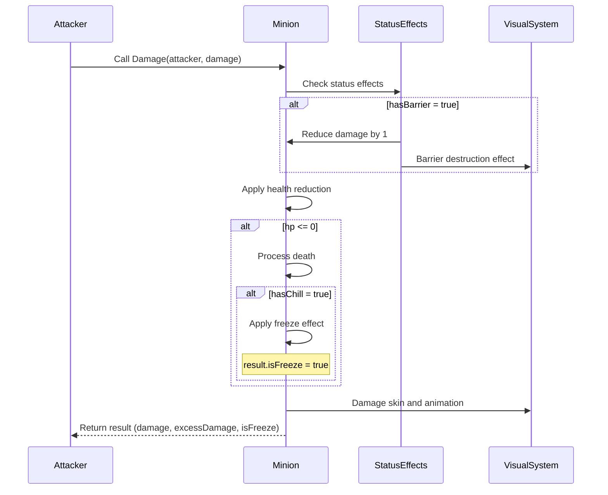
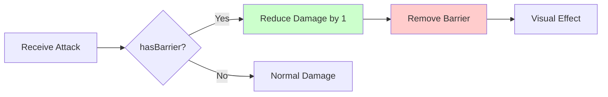
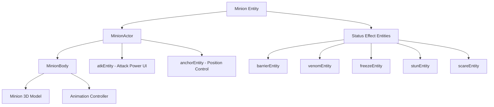
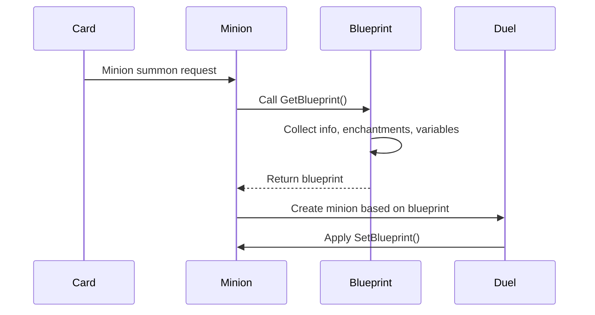

# Minion System (Minion.mlua)

## 📋 Overview

`Minion.mlua` is a core component in Maple Duel that implements unit cards placed on the field and continuously active. It inherits from `Unit` to have basic combat unit functionality, and additionally handles various status effects, special abilities, and visual representation. Minions are the core combat units of the game that battle each other on the field, attack players, and become targets of various card effects.

**Related Files**: 
- `RootDesk/MyDesk/Components/Objects/Minion.mlua`

## 🏗️ Minion System Architecture

### Inheritance Structure and Component Relationships

```mermaid
graph TB
    A[Minion Component] --> B[Unit Inheritance]
    A --> C[Status Effect System]
    A --> D[Visual Representation]
    A --> E[Combat Abilities]
    
    B --> B1[Health - hp]
    B --> B2[Attack Power - atk] 
    B --> B3[Basic Combat Logic]
    B --> B4[Enchantment System]
    
    C --> C1[Barrier - hasBarrier]
    C --> C2[Venom - hasVenom]
    C --> C3[Chill - hasChill]
    C --> C4[Freeze - isFreeze]
    C --> C5[Stun - isStun]
    C --> C6[Scare - isScare]
    
    D --> D1[MinionActor]
    D --> D2[MinionBody]
    D --> D3[Status Effect UI]
    D --> D4[Animation]
    
    E --> E1[Direct Attack - isDirectAttackable]
    E --> E2[Immunity - isImmuneToStrong]
    E --> E3[Battle Participation - IsBattler]
    E --> E4[Tag System - tagArray]
```



### Core Properties

#### Basic Attributes
- `player`: Player who owns the minion
- `field`: Field where the minion is placed
- `atk`: Current attack power (separate from Unit's base atk)
- `info`: Card information (name, variant, quality)

#### Status Effects
- `hasBarrier`: Whether has barrier
- `hasVenom`: Whether has venom 
- `hasChill`: Whether has chill
- `isFreeze`: Whether frozen
- `isStun`: Whether stunned
- `isScare`: Whether scared

#### Special Abilities
- `isDirectAttackable`: Can directly attack opponent player
- `isImmuneToStrong`: Immunity (immune to certain effects)
- `isPivotable`: Can change position
- `tagArray`: Minion's tag array (conditions for effect application)

#### Visual Elements
- `minionEntity`: Minion visual model
- `barrierEntity`: Barrier visual effect
- `venomEntity`: Venom visual effect
- `freezeEntity`: Freeze visual effect
- `stunEntity`: Stun visual effect
- `scareEntity`: Scare visual effect

## ⚔️ 1. Combat System

### Battle Participation Conditions

#### IsBattler() Mechanism
```lua
method boolean IsBattler()
    return not self.isFreeze
end
```

Core method that determines if a minion can participate in battle. Can only battle when not frozen.

#### IsDirectAttacker() Mechanism
```lua
method boolean IsDirectAttacker()  
    return self:IsBattler() and self.isDirectAttackable
end
```

Distinguishes minions that can directly attack opponent players.

### Damage Processing System

#### Advanced Damage Calculation


**Damage Processing Features**:
- **Barrier Application**: If `hasBarrier` exists, reduce damage by 1 then remove barrier
- **Excess Damage**: Damage exceeding health returned as `excessDamage`
- **Chill Freeze**: If `hasChill` exists at death, convert to frozen state
- **Visual Feedback**: Simultaneous processing of damage skin, animation, sound

### Attack Power System

#### SetAtk() Mechanism
```lua
method void SetAtk(integer atk)
    atk = math.max(0, atk)
    if self.atk == atk then
        return
    end
    
    self.atk = atk
    -- Visual UI update logic
end
```

Minion's attack power can be changed dynamically and is immediately reflected in UI when changed.

## 🛡️ 2. Status Effect System

### Barrier System (Barrier)

#### Barrier Mechanism


**SetBarrier() Features**:
- Set/clear barrier state
- Create/remove visual barrier entity
- One-time effect that blocks only one attack

### Venom System (Venom)

#### Venom Effects
The `hasVenom` state represents the ability to give continuous damage or special effects to opponents.

**SetVenom() Features**:
- Set venom possession state
- Display visual venom effect
- Can apply venom effects through enchantments

### Freeze System (Freeze)

#### Freeze Mechanism
```lua
method void SetFreeze(boolean isFreeze)
    if self.isFreeze == isFreeze then return end
    
    self.isFreeze = isFreeze
    
    if self:IsClient() then
        if isFreeze then
            -- Apply freeze visual effect
            self.freezeEntity.Enable = true
        else
            -- Remove freeze
            self.freezeEntity.Enable = false
        end
    end
end
```

**Freeze Effects**:
- `IsBattler() = false` — Cannot participate in battle
- Display visual ice effect
- Convert to frozen state when minion with chill (`hasChill`) dies

### Stun System (Stun)

#### Stun vs Freeze
- **Stun (`isStun`)**: Miss processing when attacking
- **Freeze (`isFreeze`)**: Cannot participate in battle at all

**SetStun() Features**:
- Visual display of stun state
- Integrated with Miss logic in Player's Damage processing

### Scare System (Scare)

**Scare Effects**:
- 50% chance to miss attacks
- Random determination in Player's damage processing
- Weaker than stun but continuous interference effect

## 🎨 3. Visual Representation System

### Actor and Body System

#### Minion Visual Structure


#### SpawnAndSetBody() System
```lua
method void SpawnAndSetBody()
    local bodyModelName = string.format("%s%s%sMinionBody", 
        self.name, self.variant, self.quality)
    local bodyModelId = _EntryService:GetModelIdByName(bodyModelName)
    
    self:SetBody(_SpawnService:SpawnByModelId(
        bodyModelId, bodyModelName, Vector3.zero, self.actor.Entity).MinionBody)
end
```

**Dynamic Model Loading**:
- **Name-based**: Model determined by card name + variant + quality
- **Quality Differentiation**: Different appearance based on quality like Normal, Gold
- **Variant System**: Support various skin versions of same card

### Status Effect Visualization

#### Status Effect Entity Management
Each status effect has independent visual entity, immediately reflected when state changes.

```lua
-- Example: Barrier visualization
if hasBarrier then
    self.barrierEntity.Enable = true
    -- Activate barrier visual effect
else
    self.barrierEntity.Enable = false
    -- Deactivate barrier effect
end
```

## 🔧 4. Blueprint System

### Minion Cloning and Creation

#### GetBlueprint() / SetBlueprint() System


**Blueprint Composition**:
```lua
method table GetBlueprint()
    return {
        info = self.info,                           -- Basic card information
        enchantmentArray = _Table:DeepCopy(self.enchantmentArray), -- Enchantments
        independentVariableTable = self:GetIndependentVariables()  -- Independent variables
    }
end
```

**Independent Variables**:
- `hasBarrier`: Barrier state
- `isFreeze`: Freeze state  
- `isStun`: Stun state
- `isScare`: Scare state

### Minion Information System

#### SetInfo() Mechanism
```lua
method void SetInfo(table info)
    self.info = info or {}
    self.name = info.name or ""
    self.variant = info.variant or ""
    self.quality = info.quality or ""
    
    -- Load basic stats from card manager
    self:SetBarrier(self.cardManager:HasBarrier(self.name))
    self:SetFreeze(false)
end
```

Sets minion's basic characteristics from card data.

## 🎯 5. Summoning and Animation

### Summoning Coroutine System

#### SummonCoroutine() Mechanism
```lua
method void SummonCoroutine()
    self.summonCoroutine = self.duel.actionManager:SummonCoroutine(self)
end
```

Handles spectacular summoning animation when minion appears on field, integrated with ActionManager.

### Animation State Management

#### Animation State Transitions
- `animationState`: Track current animation state
- Various animation playback through inherited Unit's `Animate()` method
- Situational animations for attack, hit, death, etc.

## 🔄 6. Synchronization and State Management

### Property Synchronization

#### GetProperties() Synchronization Data
```lua
method table GetProperties()
    return {
        id = self.id,
        enchantmentArray = self.enchantmentArray,
        auraEnchantmentArray = self.auraEnchantmentArray,
        player = self.player,
        field = self.field,
        info = self.info,
        -- Additional variables inherited from Unit
    }
end
```

**Real-time Synchronization Elements**:
- **Ownership Information**: Player and field references
- **Card Information**: Name, variant, quality
- **Status Effects**: States managed as independent variables
- **Enchantments**: Temporary effects

### GetIndependentVariables() System

Separately classify variables that need independent management:

```lua
method table GetIndependentVariables()
    return {
        hasBarrier = self.hasBarrier,
        isFreeze = self.isFreeze,
        isStun = self.isStun,
        isScare = self.isScare,
    }
end
```

These variables play important roles in server-client synchronization and blueprint systems.

## 🎮 7. Gameplay Integration

### Tag System

#### tagArray Utilization
Minion's `tagArray` is used for conditional application of various card effects:
- Apply effects only to minions with specific tags
- Tag-based damage correction (Player's `taggedSkillDamageTable`)
- Selective effect targeting

### Input State Management

#### GetInputState() Interaction Control
```lua
method table GetInputState(Character character)
    -- Determine interaction possibility with minion
    -- Used for targeting, effect application, etc.
end
```

Controls target selection possibility when players use card effects or abilities.

## 💡 Code References

Core minion system logic:
- `Minion.mlua :: SetBlueprint()` — Blueprint-based minion creation
- `Minion.mlua :: Damage()` — Advanced damage processing system
- `Minion.mlua :: IsBattler()` — Battle participation possibility
- `Minion.mlua :: SetBarrier()` — Barrier state management
- `Minion.mlua :: SetFreeze()` — Freeze state management
- `Minion.mlua :: SpawnAndSetBody()` — Visual model creation
- `Minion.mlua :: GetIndependentVariables()` — Independent variable management

The minion system is responsible for the core of Maple Duel's combat system and is an important system that provides strategic depth to the game through various status effects and tactical elements.
