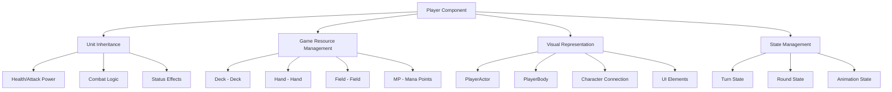
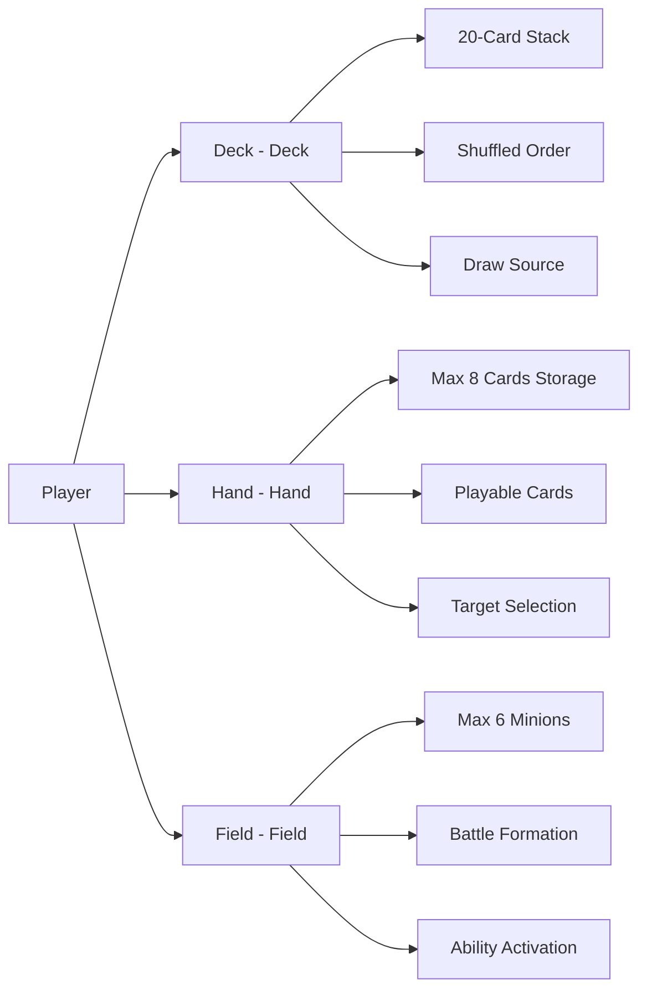
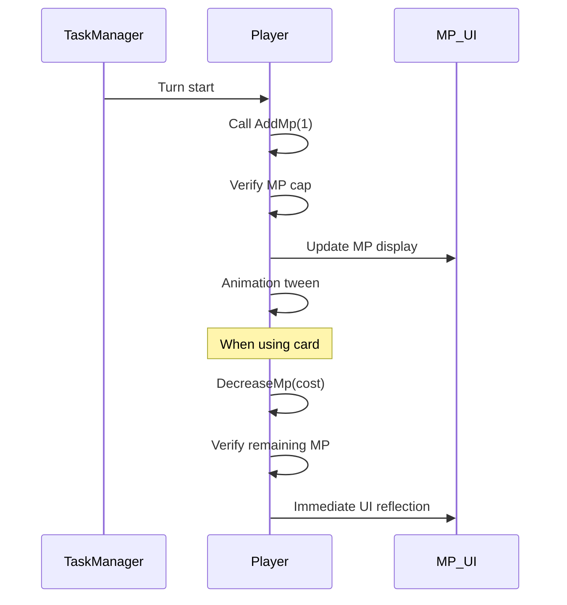
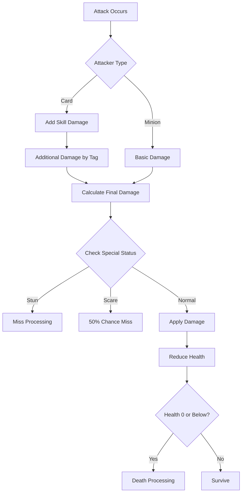
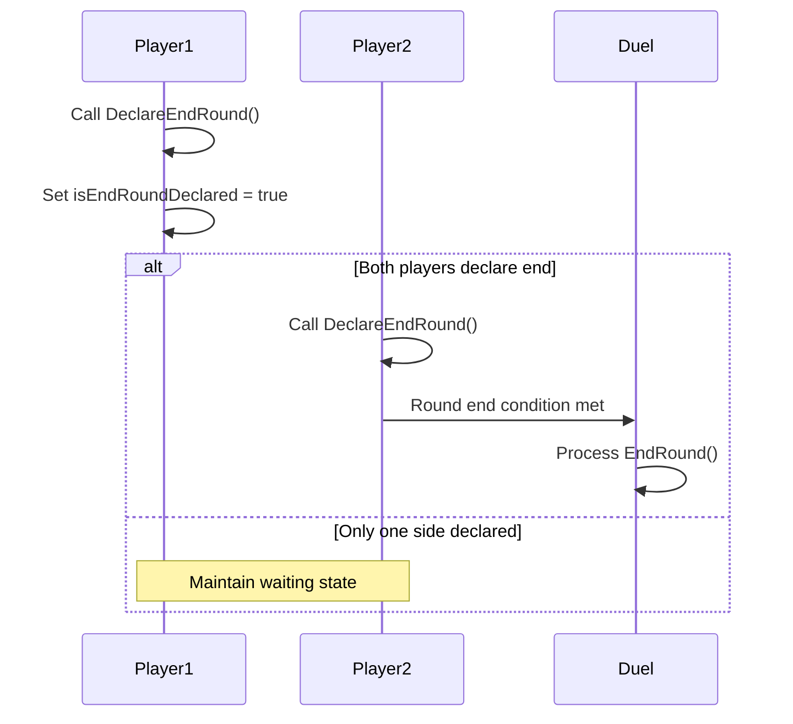
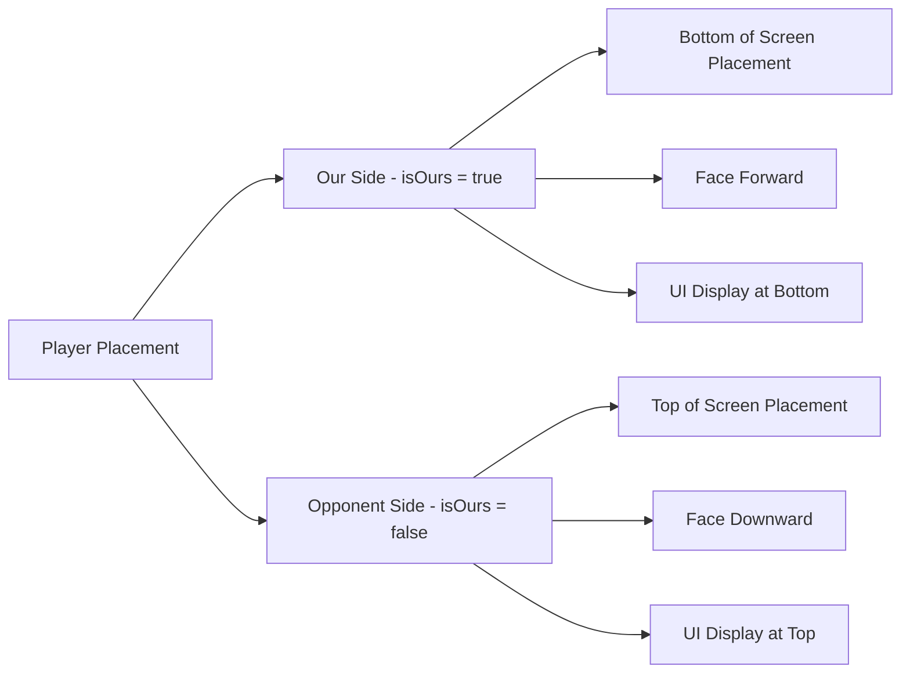
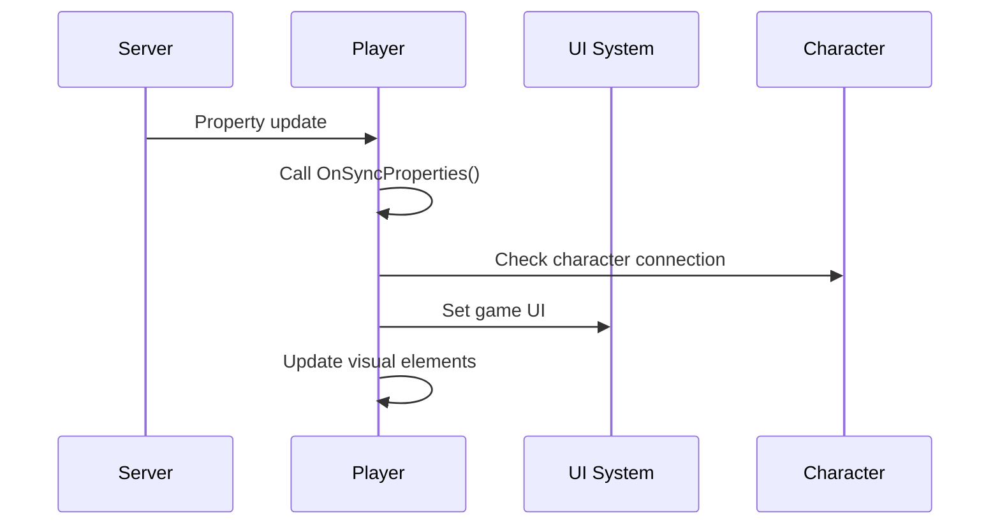

# Player System (Player.mlua)

## 📋 Overview

`Player.mlua` is a core component in Maple Duel that represents individual players. It inherits from `Unit` to have basic combat unit functionality while simultaneously serving as a card game player, handling all functions including deck, hand, field, and MP management. During gameplay, two Player instances are created to conduct battles, each managing independent game resources and states.

**Related Files**: 
- `RootDesk/MyDesk/Components/Objects/Player.mlua`

## 🏗️ Player System Architecture

### Hierarchical Structure and Relationships



### Core Properties

#### Game Resources
- `deck`: Player's deck component
- `hand`: Hand management component
- `field`: Field (minion placement area) component
- `opponent`: Opponent player reference

#### MP System
- `mp`: Current mana points (card usage resource)
- `maxMp`: Maximum mana point limit
- `mpInteger`: MP display UI component
- `mpTweener`: MP change animation handler

#### Character Connection
- `character`: Connected Character component (player data)
- `cardBack`: Selected card back design
- `class`: Deck's class (Warrior, Magician, etc.)

#### Game State
- `isReady`: Game ready state
- `isServing`: Whether currently in game
- `isOurs`: Our/opponent distinction
- `isEndRoundDeclared`: Whether round end declared
- `isPlaying`: Whether currently playing

## 🎮 1. Game Resource Management

### Player-specific Game Areas

Each player has independent game areas for conducting card games.



### MP (Mana Points) System

#### MP Management Mechanism


**MP-related Methods**:
- `SetMp(integer mp)` — Set absolute MP
- `AddMp(integer delta)` — Increase MP (at turn start)
- `DecreaseMp(integer delta)` — Decrease MP (when using cards)
- Automatic animation and UI updates when MP changes

**MP System Features**:
- **Increase Each Turn**: Increase by 1 at each turn start
- **Cap Limit**: Cannot exceed `maxMp`
- **Immediate Reflection**: Real-time deduction when using cards
- **Visual Feedback**: Show changes with tweening animation

### Character Integration System

#### Ready System
```lua
@ExecSpace("ServerOnly")
method void Ready(Character character)
    -- Verify ready conditions
    if not character:IsAbleToReady() then return end
    
    -- Connect character
    self.character = character
    character.player = self
    
    -- Set game data
    self.cardBack = character.cardBack
    self.class = character:GetDeck().class
    
    -- Complete ready processing
    self.isReady = true
    self.isServing = true
end
```

**Ready Process**:
1. **Condition Verification**: Check character's game participation availability
2. **Mutual Connection**: Set Player ↔ Character bidirectional references
3. **Data Synchronization**: Copy card back, class, deck information
4. **State Transition**: Change to game ready state

## 🎯 2. Combat System

### Damage Processing System

#### Complex Damage Calculation


**Damage Method's Advanced Processing**:
1. **Skill Damage Correction**: `skillDamage + taggedSkillDamageTable[tag]`
2. **Status Effect Application**: Avoidance mechanisms like stun, scare
3. **Visual Feedback**: Damage skin, animation, sound
4. **Result Return**: Actual damage dealt and status changes

### Animation System

#### Class-specific Specialized Animation
Player supports various skill-specific animations:

**Warrior Animations**:
- "PowerStrike" — Powerful sword swing (swingP1)
- "Brandish" — Consecutive cuts (swingP2)
- "Rage" — Rage state transition

**Magician Animations**:  
- "FireArrow" — Magic arrow casting (shoot1)
- "ThunderBolt" — Lightning magic (magic1)
- "Heal" — Healing magic (heal)

**Animation Processing Features**:
- **Timing Accuracy**: Precise frame timing for each skill
- **Sound Integration**: Sound effects synchronized with animation
- **Auto Recovery**: Automatic transition to Idle state after animation completion

## 🎮 3. Turn and Round Management

### Turn Confirmation System

#### IsOurTurn() Mechanism
```lua
method boolean IsOurTurn()
    return self.duel.turnPlayer == self
end
```

UI and input systems respond appropriately through per-player turn confirmation.

### Round End System

#### DeclareEndRound Mechanism  


**Round End Processing**:
- `DeclareEndRound(boolean isTimeout)` — Declare round end
- Handle distinction between timeout and voluntary declaration
- End round only when both players agree

## 🎨 4. Visual Representation System

### Position and Direction Management

#### Visual Placement System


**Direction Control Methods**:
- `LookLeft()` — Look left
- `LookRight()` — Look right  
- `LookNothing()` — Default position (distinguish our/opponent)

### UI Display System

#### Detail Information Display
Various player information is displayed during the game:

**ShowDetails() Features**:
- MP gauge display
- Class tag display  
- Round player display
- Friend request button (when applicable)

**HideDetails() Features**:
- UI cleanup at game end
- Hide unnecessary display elements

### Social System Integration

#### Friend Request Feature
```lua
method void ShowFriendRequestButton()
    if self:ShouldShowFriendRequestButton() then
        -- Display friend request button and animation
        local tweener = _Tween:ScaleTo(button.Entity, Vector2.one, 0.25)
    end
end
```

Support social interaction with opponents during game.

## 🔄 5. State Synchronization

### Property Synchronization

#### Synchronized Core Information
```lua
method table GetProperties()
    return {
        isServing = not self.duel.isDueling or self.isServing,
        character = self.character,
        cardBack = self.cardBack, 
        class = self.class,
        -- Health, status, etc. inherited from Unit
    }
end
```

**Real-time Synchronized Data**:
- **Game Participation State**: `isServing`
- **Character Information**: Connected Character component
- **Visual Settings**: Card back, class display
- **Unit State**: Health, attack power, status effects, etc.

### Client Updates

#### OnSyncProperties Processing


## 💡 Code References

Core player system logic:
- `Player.mlua :: Ready()` — Player game preparation
- `Player.mlua :: SetMp()` — MP system management
- `Player.mlua :: Damage()` — Combat damage processing
- `Player.mlua :: DeclareEndRound()` — Round end declaration
- `Player.mlua :: Animate()` — Skill animation playback
- `Player.mlua :: IsOurTurn()` — Turn confirmation

The Player system handles core player logic in the game and serves as an important bridge connecting the character system and duel system.
