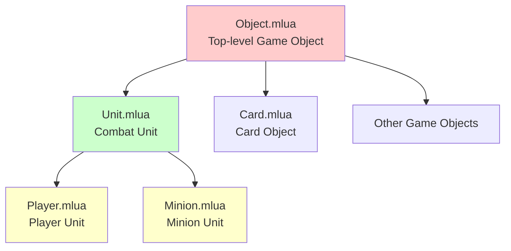
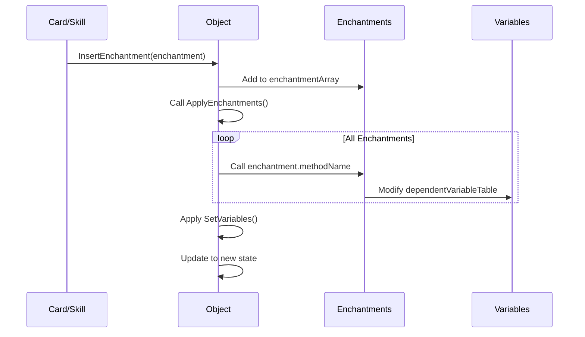
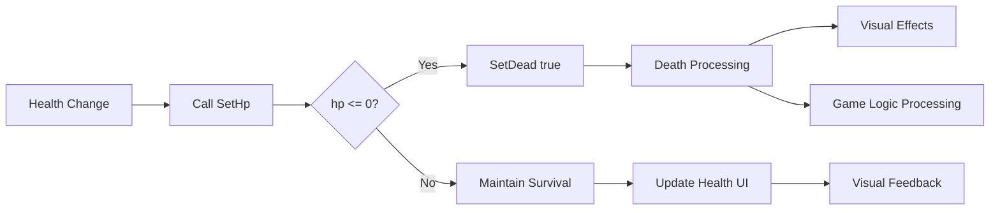
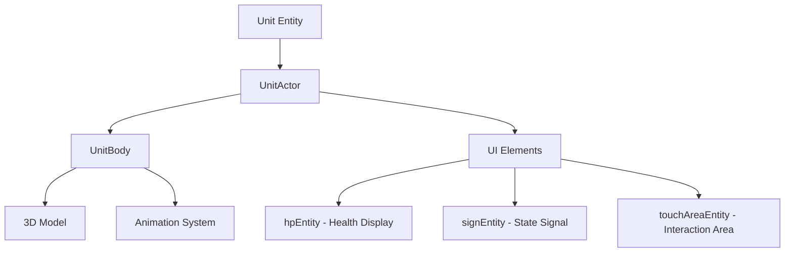
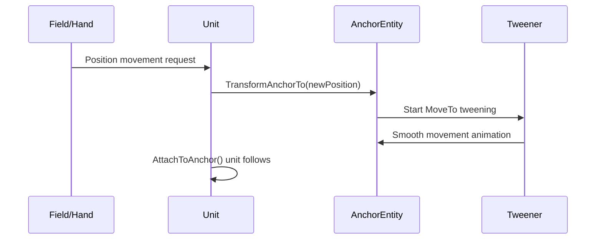
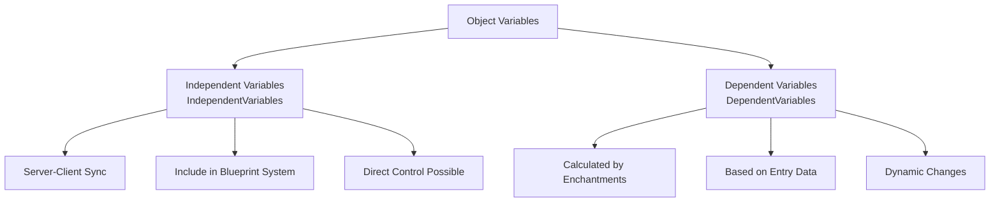
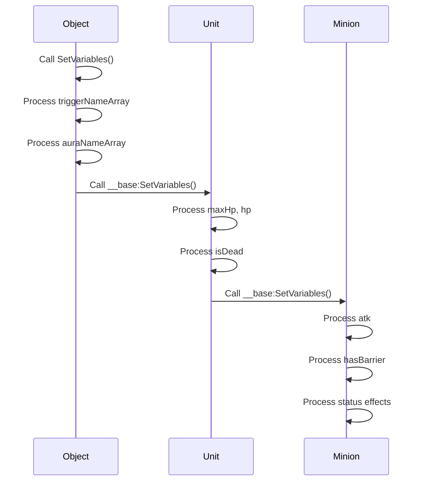

# Unit Base System (Unit.mlua & Object.mlua)

## 📋 Overview

Maple Duel's unit base system provides the core foundation for all interactive objects in the game. `Object.mlua` serves as the top-level base class for all game objects, providing basic functionality such as manager system integration, enchantment management, and type checking. `Unit.mlua` inherits from Object and adds common features for combat units such as health, combat, and animation.

**Related Files**: 
- `RootDesk/MyDesk/Components/Objects/Object.mlua` (Top-level base class)
- `RootDesk/MyDesk/Components/Objects/Unit.mlua` (Combat unit base class)

## 🏗️ System Architecture

### Inheritance Structure



### Object.mlua - Top-level Base Class

#### Core Responsibilities
- **Manager System Integration**: Manage references to all game managers
- **Enchantment System**: Manage temporary effects and buffs/debuffs
- **Type Checking**: Object type identification system
- **Blueprint System**: Support object cloning and creation
- **Synchronization Foundation**: Server-client property synchronization

#### Core Properties
```lua
-- Manager system references
property Duel duel = nil
property ActionManager actionManager = nil
property AuraManager auraManager = nil
property CommandManager commandManager = nil
-- ... other managers

-- Basic object information
property number id = 0
property string name = ""
property table entry = {}

-- Enchantment system
property table enchantmentArray = {}
property table auraEnchantmentArray = {}
property table dependentVariableTable = {}
```

### Unit.mlua - Combat Unit Base Class

#### Core Responsibilities
- **Combat System**: Health, survival, death management
- **Visual Representation**: Actor, body, animation system 
- **Position Control**: Anchor-based position and movement system
- **Interaction**: Touch area, targeting system
- **State Management**: Survival state and combat state

#### Core Properties
```lua
-- Visual representation
property UnitActor actor = nil
property UnitBody body = nil
property Entity signEntity = nil

-- Health system
property integer maxHp = nil
property integer hp = nil
property boolean isDead = nil

-- Position and animation
property Entity anchorEntity = nil
property any tweener = nil
property any anchorTweener = nil
```

## 🎯 1. Object.mlua Core Features

### Manager System Integration

#### OnBeginPlay() Auto-Connection
```lua
method void OnBeginPlay()
    local duel = self.Entity.CurrentMap.Map.duel
    if isvalid(duel) then
        self.duel = duel
        self.history = duel.history
        self.layout = duel.layout
        self.actionManager = duel.actionManager
        self.auraManager = duel.auraManager
        self.commandManager = duel.commandManager
        -- ... auto-connect all managers
    end
end
```

**Auto-Connection Benefits**:
- **Convenience**: All Object subclasses automatically get manager access
- **Consistency**: Unified manager access approach throughout the game
- **Extensibility**: Only need to modify in one place when adding new managers

### Type Check System

#### Dynamic Type Identification
```lua
method boolean IsUnit()
    return isvalid(self.Entity.Unit)
end

method boolean IsMinion()
    return isvalid(self.Entity.Minion)
end

method boolean IsPlayer()
    return isvalid(self.Entity.Player)
end

method boolean IsCard()
    return isvalid(self.Entity.Card)
end
```

**Use Cases**:
- **Conditional Effects**: Apply effects only to specific types
- **Skill Targeting**: Skills that apply only to minions
- **Damage Calculation**: Different processing for players vs minions

### Enchantment System

#### Dynamic Effect Application System


**Enchantment Structure**:
```lua
enchantment = {
    methodName = "SetMaxHpEnchantment",  -- Method name to apply
    args = {5},                          -- Method arguments
    remover = {                          -- Removal condition
        eventName = "TurnEnd",
        args = {}
    }
}
```

**Application Examples**:
- **Temporary Health Increase**: "Health +3 for this turn"
- **Attack Power Buff**: "Attack power +2 for this game"
- **Special Ability Grant**: "Gain a barrier"

### Blueprint System

#### GetBlueprint() / SetBlueprint() Pattern
```lua
-- Basic blueprint creation
method table GetBlueprint()
    return {
        info = self.info,
        enchantmentArray = _Table:DeepCopy(self.enchantmentArray),
        independentVariableTable = self:GetIndependentVariables()
    }
end

-- Construct object from blueprint
method void SetBlueprint(table blueprint)
    self:SetInfo(blueprint.info)
    self:SetEnchantments(blueprint.enchantmentArray)
    self:SetVariables(blueprint.independentVariableTable)
end
```

**Blueprint Usage**:
- **Card Summoning**: Create minion from card
- **Clone Effects**: "Clone a minion"
- **Transform Effects**: Transform to different minion

## ⚔️ 2. Unit.mlua Core Features

### Health Management System

#### Survival State Management


**SetHp() Mechanism**:
```lua
method void SetHp(integer hp)
    hp = math.max(0, math.min(hp, self.maxHp))
    if self.hp == hp then
        return
    end
    
    self.hp = hp
    
    if self.hp <= 0 then
        self:SetDead(true)
    end
    
    -- Visual update
    if self:IsClient() then
        self.hpInteger:SetInteger(self.hp)
        -- Apply animation effects
    end
end
```

### Actor System

#### Visual Representation Layer Structure


**SetActor() / ClearActor() Management**:
```lua
method void SetActor(any actor)
    self.actor = actor
    actor.object = self  -- Bidirectional reference
end

method void ClearActor()
    if isvalid(self.actor) then
        self.actor.object = nil
        self.actor = nil
    end
end
```

### Anchor-based Position System

#### Precise Position Control
Units implement accurate position control and smooth animations through anchor entities.



**Anchor System Methods**:
- `TransformAnchorTo()` — Move anchor to new position (animated)
- `TransformToAnchor()` — Move unit to anchor position
- `AttachToAnchor()` — Attach unit to anchor

### Touch and Interaction System

#### IsInTouchArea() Precise Detection
```lua
method boolean IsInTouchArea(Vector2 point)
    local transform = self.actor.Entity.TransformComponent
    local position = transform.WorldPosition
    local angle = math.rad(transform.ZRotation)
    
    -- Apply rotation transformation
    local localX = math.cos(angle) * (point.x - position.x) + math.sin(angle) * (point.y - position.y)
    local localY = -math.sin(angle) * (point.x - position.x) + math.cos(angle) * (point.y - position.y)
    
    local touchAreaHalfX = 0.92 * 0.5
    local touchAreaHalfY = 0.92 * 0.5
    
    return math.abs(localX) < touchAreaHalfX and math.abs(localY) < touchAreaHalfY
end
```

**Precise Detection Features**:
- **Consider Rotation**: Accurate area detection considering unit's rotation angle
- **Standard Size**: 0.92 × 0.92 standard touch area
- **Efficiency**: Real-time detection with fast mathematical operations

### Animation System

#### Animate() Abstract Method
```lua
method void Animate(string toAnimationState)
    -- Specific implementation in subclasses
    -- Player: Class-specific skill animations
    -- Minion: Unique animations per minion
end
```

Unit provides the basic framework for animation, with Player and Minion implementing animations specific to their characteristics.

## 🔄 3. Synchronization and State Management

### Variable System

#### Dependent/Independent Variable Separation


**Independent Variables (IndependentVariables)**:
- Object: `temp` (temporary data)
- Unit: `isDead`, `hp` (survival state)
- Minion: `hasBarrier`, `isFreeze`, etc. (status effects)

**Dependent Variables (DependentVariables)**:
- Entry data + enchantment application results
- Dynamically calculated final stats

### SetVariables() Chain System

#### Variable Application by Inheritance Layer


Each layer processes only the variables it's responsible for and calls the parent layer's processing in a systematic structure.

## 🎮 4. Gameplay Integration

### Targeting System

#### IsTargetable() Extensible System
```lua
-- Object basic implementation
method boolean IsTargetable(Player player)
    return true
end

-- Extended in Unit
method boolean IsTargetable(Player player)  
    return __base:IsTargetable(player)
end

-- Specific implementation in Minion
method boolean IsTargetable(Player player)
    return not self.isDead and self.field.player ~= player
end
```

Different targeting conditions can be implemented according to each object type.

### Signal System

#### commandManager.signableArray Registration
```lua
method void OnBeginPlay()
    if self:IsClient() then
        table.insert(self.commandManager.signableArray, self)
    end
end
```

Units automatically register with CommandManager's signal system to respond to game state changes.

## 🛠️ 5. Extensibility and Reusability

### Template Method Pattern

#### Separation of Common Logic and Specialized Logic
Object and Unit utilize the template method pattern, providing common logic in base classes while implementing specialized logic in subclasses.

**Common Logic Examples**:
- Manager system integration
- Enchantment application
- Property synchronization
- Blueprint system

**Specialized Logic Examples**:
- Player: MP system, skill animation
- Minion: Status effects, combat abilities
- Card: Card effects, play conditions

### Interface Consistency

#### Consistent Method Signatures
All game objects inheriting from Object provide consistent interfaces:
- `GetProperties()` / `SetProperties()`
- `GetBlueprint()` / `SetBlueprint()`
- `IsTargetable()` / `IsUnit()`, etc.

## 💡 Code References

Object.mlua core logic:
- `Object.mlua :: OnBeginPlay()` — Manager system auto-connection
- `Object.mlua :: ApplyEnchantments()` — Enchantment system core
- `Object.mlua :: IsMinion()` / `IsPlayer()`, etc. — Type check system
- `Object.mlua :: GetBlueprint()` — Blueprint creation

Unit.mlua core logic:
- `Unit.mlua :: SetHp()` — Health and survival state management
- `Unit.mlua :: TransformAnchorTo()` — Anchor-based position control
- `Unit.mlua :: IsInTouchArea()` — Precise touch area detection
- `Unit.mlua :: SetVariables()` — Hierarchical variable system

The unit base system provides a solid foundation for all game objects in Maple Duel, systematically managing complex game logic through an extensible and reusable architecture.
