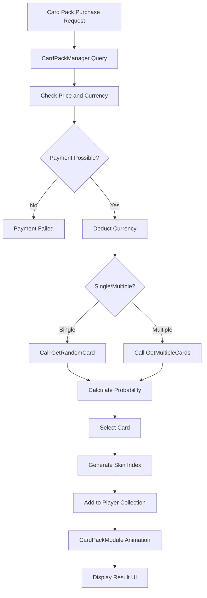

# Card Pack System

## Overview

MapleDuel's card pack system is a core economic system where players can acquire new cards through probability-based card drawing. It provides integrated CSV data-based card pack information management, probability calculation, card drawing logic, and visual animation.

## Core Components

### CardPackManager.mlua
The core manager of the card pack system responsible for card pack data management and card drawing logic.

**Main Responsibilities:**
- Card pack data loading and management
- Theme-based card pack classification
- Probability-based card drawing algorithm
- Price and currency information provision

```lua
@Component
script CardPackManager extends Component

property any dataSet = nil                    -- CardPack.csv data
property table cardPackNameTable = {}         -- Theme-based card pack name table
property CardManager cardManager = nil        -- Card manager reference

method void OnBeginPlay()
    self.dataSet = _DataService:GetTable("CardPack")
    
    -- Theme-based card pack classification
    for _, name in ipairs(self.dataSet:GetColumn("name")) do
        local theme = self:GetTheme(name)
        self.cardPackNameTable[theme] = self.cardPackNameTable[theme] or {}
        table.insert(self.cardPackNameTable[theme], name)
    end
end
```

## Card Pack Data Structure

### CardPack.csv Schema
All card pack information is managed through CSV files.

**Main Columns:**
- `name`: Unique card pack name
- `theme`: Card pack theme (Classic, Nautilus, etc.)
- `currency`: Purchase currency (Meso, Cash, etc.)
- `singlePrice`: Single purchase price
- `multiplePrice`: Multiple purchase price (discount applied)
- `rarity`: Guaranteed grade (Common, Rare, Epic, Unique, Legendary)
- `cards`: Included card list

```lua
-- Data access example
method string GetTheme(string cardPackName)
    return self.dataSet:FindRow("name", cardPackName):GetDataByName("theme")
end

method string GetCurrency(string cardPackName)
    return self.dataSet:FindRow("name", cardPackName):GetDataByName("currency")
end

method integer GetSinglePrice(string cardPackName)
    return self.dataSet:FindRow("name", cardPackName):GetDataByName("singlePrice")
end
```

## Probability-based Card Drawing System

### Basic Drawing Logic

```lua
method string GetRandomCard(string cardPackName)
    local cardPackRow = self.dataSet:FindRow("name", cardPackName)
    local cardNameArray = cardPackRow:GetDataByName("cards")
    
    -- Calculate probability weights
    local totalWeight = 0
    local weightArray = {}
    
    for _, cardName in ipairs(cardNameArray) do
        local rarity = self.cardManager:GetRarity(cardName)
        local weight = self:GetRarityWeight(rarity)
        
        table.insert(weightArray, weight)
        totalWeight += weight
    end
    
    -- Probabilistic selection
    local randomValue = _UserService:GetRandom() * totalWeight
    local currentWeight = 0
    
    for i, weight in ipairs(weightArray) do
        currentWeight += weight
        if randomValue <= currentWeight then
            return cardNameArray[i]
        end
    end
    
    -- Fallback: return last card
    return cardNameArray[#cardNameArray]
end
```

### Rarity-based Probability Weights

```lua
method number GetRarityWeight(string rarity)
    local weights = {
        Common = 45,      -- 45%
        Rare = 30,        -- 30%
        Epic = 15,        -- 15%
        Unique = 8,       -- 8%
        Legendary = 2,    -- 2%
    }
    return weights[rarity] or 1
end
```

## Card Pack Type System

### Theme-based Card Packs

**Classic Theme:**
- ClassicGoldCommon
- ClassicGoldRare
- ClassicGoldEpic
- ClassicGoldUnique
- ClassicGoldLegendary

**Nautilus Theme:**
- NautilusGoldCommon
- NautilusGoldRare
- NautilusGoldEpic
- NautilusGoldUnique
- NautilusGoldLegendary

### Grade Guarantee System

```lua
method string GetGuaranteedCard(string cardPackName)
    local cardPackRow = self.dataSet:FindRow("name", cardPackName)
    local guaranteedRarity = cardPackRow:GetDataByName("rarity")
    local cardNameArray = cardPackRow:GetDataByName("cards")
    
    -- Filter cards of guaranteed grade or higher
    local eligibleCards = {}
    for _, cardName in ipairs(cardNameArray) do
        local cardRarity = self.cardManager:GetRarity(cardName)
        if self:IsRarityEqualOrHigher(cardRarity, guaranteedRarity) then
            table.insert(eligibleCards, cardName)
        end
    end
    
    -- Random selection among guaranteed grade cards
    return eligibleCards[_UserService:GetRandom(1, #eligibleCards)]
end

method boolean IsRarityEqualOrHigher(string cardRarity, string baseRarity)
    local rarityOrder = {Common = 1, Rare = 2, Epic = 3, Unique = 4, Legendary = 5}
    return rarityOrder[cardRarity] >= rarityOrder[baseRarity]
end
```

## Multiple Card Pack System

### 11-Card Pack Logic

```lua
method table GetMultipleCards(string cardPackName, integer count)
    count = count or 11  -- Default 11 cards
    local cardArray = {}
    
    for i = 1, count do
        local cardName
        if i == count then
            -- Last card applies guaranteed grade
            cardName = self:GetGuaranteedCard(cardPackName)
        else
            -- Regular probability drawing
            cardName = self:GetRandomCard(cardPackName)
        end
        
        table.insert(cardArray, {
            name = cardName,
            skinIndex = self.cardManager:GetRandomSkinIndex(cardName),
            index = i
        })
    end
    
    return cardArray
end
```

### Discount Price System

```lua
method integer GetMultiplePrice(string cardPackName)
    local singlePrice = self:GetSinglePrice(cardPackName)
    local multiplePrice = self.dataSet:FindRow("name", cardPackName):GetDataByName("multiplePrice")
    
    -- Apply discount for multiple purchase
    return multiplePrice or (singlePrice * 10)  -- 10 cards worth for 11-card price
end

method number GetDiscountRate(string cardPackName)
    local singlePrice = self:GetSinglePrice(cardPackName)
    local multiplePrice = self:GetMultiplePrice(cardPackName)
    
    return (singlePrice * 11 - multiplePrice) / (singlePrice * 11) * 100
end
```

## Card Pack Visualization System

### CardPackModule.mlua Integration

Integrates with UI system that provides visual experience of opening card packs.

```lua
-- Call card pack opening animation
self.uiManager.CardPackModule:Open(cardPackName, count)
```

### Object Pooling

```lua
-- Object pooling for card pack animation
property table cardPackPool = {}
property table cardPool = {}

method Entity GetPooledCardPack(string cardPackName)
    if self.cardPackPool[cardPackName] and #self.cardPackPool[cardPackName] > 0 then
        return table.remove(self.cardPackPool[cardPackName])
    else
        return _SpawnService:SpawnByModelId(self:GetCardPackModelId(cardPackName))
    end
end

method void ReturnToPool(Entity cardPackEntity, string cardPackName)
    self.cardPackPool[cardPackName] = self.cardPackPool[cardPackName] or {}
    table.insert(self.cardPackPool[cardPackName], cardPackEntity)
    cardPackEntity.Enable = false
end
```

## Economic Balancing

### Price-to-Value Calculation

```lua
method number GetExpectedValue(string cardPackName)
    local cardPackRow = self.dataSet:FindRow("name", cardPackName)
    local cardNameArray = cardPackRow:GetDataByName("cards")
    local totalValue = 0
    local totalWeight = 0
    
    for _, cardName in ipairs(cardNameArray) do
        local rarity = self.cardManager:GetRarity(cardName)
        local weight = self:GetRarityWeight(rarity)
        local value = self:GetCardValue(cardName)
        
        totalValue += value * weight
        totalWeight += weight
    end
    
    return totalValue / totalWeight
end

method integer GetCardValue(string cardName)
    local rarity = self.cardManager:GetRarity(cardName)
    local values = {
        Common = 10,
        Rare = 25,
        Epic = 100,
        Unique = 500,
        Legendary = 2500,
    }
    return values[rarity] or 10
end
```

## Special Card Pack System

### Event Card Packs

```lua
method table GetEventCards(string eventName, integer day)
    local eventPacks = {
        SpecialEvent = {
            [1] = "ClassicGoldEpic",
            [2] = "ClassicGoldEpic", 
            [3] = "ClassicGoldEpic",
            [4] = "ClassicGoldEpic",
            [5] = "ClassicGoldEpic",
            [6] = "ClassicGoldUnique",
            [7] = "ClassicGoldUnique",
            [8] = "ClassicGoldUnique",
            [9] = "ClassicGoldUnique",
            [10] = "ClassicGoldUnique",
            [11] = "NautilusGoldEpic",
            [12] = "NautilusGoldEpic",
            [13] = "NautilusGoldEpic",
            [14] = "NautilusGoldEpic",
            [15] = "NautilusGoldEpic",
            [16] = "NautilusGoldLegendary",
            [17] = "NautilusGoldLegendary",
            [18] = "NautilusGoldLegendary",
            [19] = "NautilusGoldLegendary",
            [20] = "NautilusGoldLegendary",
        }
    }
    
    return eventPacks[eventName] and eventPacks[eventName][day] or "ClassicGoldCommon"
end
```

### Time-Limited Card Packs

```lua
method boolean IsCardPackAvailable(string cardPackName)
    local cardPackRow = self.dataSet:FindRow("name", cardPackName)
    local startDate = cardPackRow:GetDataByName("startDate")
    local endDate = cardPackRow:GetDataByName("endDate")
    
    if startDate and endDate then
        local now = _DateTime:KtcNow()
        return now >= DateTime(startDate) and now <= DateTime(endDate)
    end
    
    return true  -- No time restrictions
end
```

## Statistics and Analysis

### Drawing Result Tracking

```lua
property table packOpenStats = {}

method void RecordPackOpen(string cardPackName, table results)
    self.packOpenStats[cardPackName] = self.packOpenStats[cardPackName] or {}
    
    for _, cardResult in ipairs(results) do
        local rarity = self.cardManager:GetRarity(cardResult.name)
        self.packOpenStats[cardPackName][rarity] = 
            (self.packOpenStats[cardPackName][rarity] or 0) + 1
    end
end

method table GetPackStats(string cardPackName)
    return self.packOpenStats[cardPackName] or {}
end
```

### Probability Validation

```lua
method boolean ValidateProbabilities(string cardPackName, integer testCount)
    testCount = testCount or 10000
    local results = {}
    
    -- Mass simulation
    for i = 1, testCount do
        local cardName = self:GetRandomCard(cardPackName)
        local rarity = self.cardManager:GetRarity(cardName)
        results[rarity] = (results[rarity] or 0) + 1
    end
    
    -- Compare with actual probability
    for rarity, count in pairs(results) do
        local actualRate = count / testCount * 100
        local expectedRate = self:GetRarityWeight(rarity) / 100 * 100
        local deviation = math.abs(actualRate - expectedRate)
        
        if deviation > 5 then  -- Over 5% deviation
            return false
        end
    end
    
    return true
end
```

## Card Pack System Flow



## Performance Optimization

### Probability Table Caching

```lua
property table probabilityCache = {}

method table GetCachedProbabilities(string cardPackName)
    if not self.probabilityCache[cardPackName] then
        self.probabilityCache[cardPackName] = self:CalculateProbabilities(cardPackName)
    end
    return self.probabilityCache[cardPackName]
end
```

### Memory Management

```lua
method void CleanupUnusedPacks()
    local currentTime = _DateTime:KtcNow()
    
    for cardPackName, pool in pairs(self.cardPackPool) do
        -- Clean up unused pools
        if #pool > 10 then  -- Keep maximum 10
            for i = 11, #pool do
                if isvalid(pool[i]) then
                    pool[i]:Destroy()
                end
            end
            
            -- Resize array
            for i = #pool, 11, -1 do
                pool[i] = nil
            end
        end
    end
end
```

This card pack system ensures probability fairness while providing an exciting drawing experience, serving as an important economic system that simultaneously supports the game's core revenue model and player engagement.
