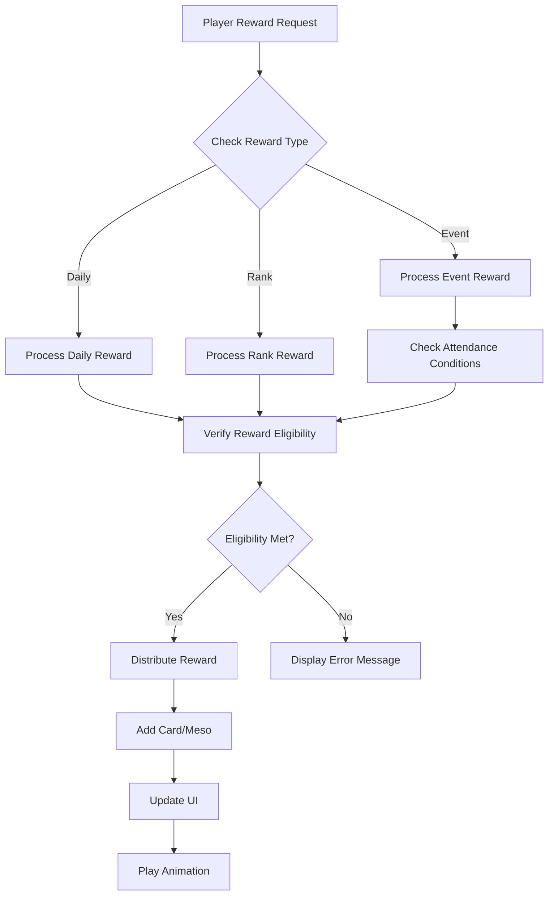

# Reward System

## Overview

MapleDuel's reward system is a multi-layered reward structure that encourages player engagement and continuous gameplay. It includes daily rewards, rank rewards, and special event rewards, providing value to players through Meso and card packs.

## Core Components

### RewardModule.mlua
The main UI component of the reward system that manages daily and rank rewards.

**Key Features:**
- Daily/rank reward tab switching
- Reward slot pagination (display 5 at a time)
- Rank-based Meso reward calculation
- Reward collection UI management

```lua
@Component
script RewardModule extends Component

property boolean isOpen = false
property string mode = ""           -- "Daily" or "Rank"
property integer pageIndex = 0      -- Current page
property table mesoArray = {}       -- Rank-based Meso reward table
property table dailyRewardSlotArray = {}  -- Daily reward slots
property table rankRewardSlotArray = {}   -- Rank reward slots
```

### EventModule.mlua
Component that manages special events and attendance rewards.

**Key Features:**
- Special event period management
- Attendance check system
- Event-specific reward distribution
- Real-time event timer

```lua
@Component  
script EventModule extends Component

property boolean isSpecialEventPeriod = false    -- Whether special event period
property table attendanceSlotArray = {}          -- Attendance slot array
property integer specialEventTimer = 0           -- Event timer
```

## Reward Type Systems

### Daily Reward System

**Daily Reward Slot Configuration:**
```lua
self.dailyRewardSlotArray = {
    self.dailyMenuEntity:GetChildByName("RewardSlot_1").RewardSlot,
    self.dailyMenuEntity:GetChildByName("RewardSlot_2").RewardSlot,
    self.dailyMenuEntity:GetChildByName("RewardSlot_3").RewardSlot,
    self.dailyMenuEntity:GetChildByName("RewardSlot_4").RewardSlot,
    self.dailyMenuEntity:GetChildByName("RewardSlot_5").RewardSlot,
}
```

**Daily Reward Display:**
```lua
@ExecSpace("ClientOnly")
method void ShowDailyRewards()
    for _, rewardSlot in ipairs(self.dailyRewardSlotArray) do
        rewardSlot:SetDailyReward()
    end
end
```

### Rank Reward System

**Meso Reward Structure:**
```lua
-- 20-level rank-based Meso reward table
self.mesoArray = {
    500, 500, 500, 3000,     -- Levels 1-4
    500, 500, 500, 5000,     -- Levels 5-8  
    1000, 1000, 1000, 10000, -- Levels 9-12
    1000, 1000, 1000, 20000, -- Levels 13-16
    3000, 3000, 3000, 40000  -- Levels 17-20
}
```

**Rank Reward Display (Pagination):**
```lua
@ExecSpace("ClientOnly")
method void ShowRankRewards(integer pageIndex)
    self.pageIndex = pageIndex
    
    -- Initialize existing slots
    for _, rewardSlot in ipairs(self.rankRewardSlotArray) do
        rewardSlot.Entity.Enable = false
    end
    
    -- Calculate rewards for current page
    local start = 1 + (pageIndex - 1) * #self.rankRewardSlotArray
    local finish = math.min(pageIndex * #self.rankRewardSlotArray, #self.mesoArray)
    
    -- Set reward information to each slot
    for i = start, finish do
        local rewardSlot = self.rankRewardSlotArray[(i - 1) % #self.rankRewardSlotArray + 1]
        local meso = self.mesoArray[i]
        
        rewardSlot.Entity.Enable = true
        rewardSlot:SetRankReward(500 + i * 100, meso)  -- (Required rank points, Meso reward)
    end
    
    -- Update page number
    self.pageNumberText.Text = string.format("%d/%d", 
        pageIndex, math.max(1, math.ceil(#self.mesoArray / #self.rankRewardSlotArray)))
end
```

### Special Event Reward System

**Attendance Event Management:**
```lua
-- Initialize attendance slots
self.attendanceSlotArray = self.Entity:GetChildComponentsByTypeName("AttendanceSlot", true)

for i, attendanceSlot in ipairs(self.attendanceSlotArray) do
    attendanceSlot.receiveButton.Entity:ConnectEvent(ButtonClickEvent, function()
        if _Server:IsRequesting() then return end
        
        _SoundService:PlaySound(self.resourceManager:GetResource("UI").buttonClickRawSound, 1)
        _Server:Request(character, "ReceiveCardPacksBySpecialEvent", {i})
    end)
end
```

**Event Period Check:**
```lua
@ExecSpace("ClientOnly")
method void Open()
    -- Dynamic event period check (until June 11, 2025)
    self.isSpecialEventPeriod = _DateTime:KtcNow() < DateTime(2025, 6, 11)
    
    if self.isSpecialEventPeriod then
        self:SetMode("SpecialEvent")
    else
        -- Disable button when event ends
        local resource = self.resourceManager:GetResource("EventModule")
        self.specialEventButton.Entity.SpriteGUIRendererComponent.ImageRUID = resource.disabledMode
        self:SetMode("HotTimeEvent")
    end
end
```

**Real-time Event Timer:**
```lua
-- Real-time display of time remaining until event end
self.specialEventTimer = _TimerService:SetTimerRepeat(function()
    local timeSpan = _DateTime:KtcNow() < DateTime(2025, 6, 11) and 
                     DateTime(2025, 6, 11) - _DateTime:KtcNow() or TimeSpan.Zero
    self.specialEventEndTimeText.Text = _LocalizationService:GetTextFormat(
        "SpecialEventEndTime", timeSpan.Days, timeSpan:ToFormattedString("hh':'mm':'ss"))
    self.specialEventUpdateTimeText.Text = _LocalizationService:GetTextFormat(
        "SpecialEventUpdateTime", timeSpan:ToFormattedString("hh':'mm':'ss"))
end, 0.01)
```

## Server-side Reward Distribution (Character.mlua)

### Special Event Card Pack Distribution

```lua
@ExecSpace("ServerOnly") 
method void ReceiveCardPacksBySpecialEvent(integer index)
    if not self.isLoaded then return end
    
    -- Check attendance conditions
    local canReceive = self.temp.specialEventAttendanceCount ~= nil and 
                      index <= self.temp.specialEventAttendanceCount and
                      not (self.temp.specialEventReceiveTable ~= nil and 
                          self.temp.specialEventReceiveTable[string.format("Day%d", index)])
    
    if not canReceive then
        self:ReceiveCardPacksBySpecialEventInOwner(cardPackName, count, index, false, {}, self.Entity.Name)
        return
    end
    
    -- Determine reward card packs based on attendance days
    local cardPackName, count
    if index <= 5 then
        cardPackName, count = "ClassicGoldEpic", 1
    elseif index <= 10 then  
        cardPackName, count = "ClassicGoldUnique", 1
    elseif index <= 15 then
        cardPackName, count = "NautilusGoldEpic", 1
    else
        cardPackName, count = "NautilusGoldLegendary", 2
    end
    
    -- Draw card packs and distribute
    local infos = {}
    for i = 1, count do
        local cardName = self.cardPackManager:GetRandomCard(cardPackName)
        local skinIndex = self.cardManager:GetRandomSkinIndex(cardName)
        
        local infoArray = {
            cardName = cardName,
            skinIndex = skinIndex,
            index = i,
        }
        table.insert(infos, infoArray)
        
        local cardInfo = {name = cardName, skinIndex = skinIndex}
        table.insert(self.cardArray, cardInfo)
    end
    
    if self:IsUser() then
        self:ReceiveCardPacksBySpecialEventInOwner(cardPackName, count, index, true, infos, self.Entity.Name)
    end
end
```

### Client-side Reward Collection Processing

```lua
@ExecSpace("Client")
method void ReceiveCardPacksBySpecialEventInOwner(string cardPackName, integer count, integer index, boolean success, table infos)
    if not success then return end
    
    -- Record collection status
    if self.temp.specialEventReceiveTable == nil then
        self.temp.specialEventReceiveTable = {}
    end
    self.temp.specialEventReceiveTable[string.format("Day%d", index)] = true
    
    -- Process card acquisition
    for _, infoArray in ipairs(infos) do
        self:GainCards(infoArray, nil)
    end
    
    -- Card pack opening animation
    self.uiManager.CardPackModule:Open(cardPackName, count)
    self.uiManager.EventModule:ReceiveCardPacksBySpecialEvent(index)
end
```

## UI State Management

### Mode Switching System

```lua
@ExecSpace("ClientOnly")
method void SetMode(string mode)
    if self.mode == mode then return end
    self.mode = mode
    
    local resource = self.resourceManager:GetResource("RewardModule")
    if self.mode == "Daily" then
        -- Daily reward mode
        self.dailyButton.Entity.SpriteGUIRendererComponent.ImageRUID = resource.selectedMode
        self.rankButton.Entity.SpriteGUIRendererComponent.ImageRUID = resource.unselectedMode
        self.dailyMenuEntity.Enable = true
        self.rankMenuEntity.Enable = false
        self:ShowDailyRewards()
    elseif self.mode == "Rank" then
        -- Rank reward mode
        self.dailyButton.Entity.SpriteGUIRendererComponent.ImageRUID = resource.unselectedMode
        self.rankButton.Entity.SpriteGUIRendererComponent.ImageRUID = resource.selectedMode
        self.dailyMenuEntity.Enable = false
        self.rankMenuEntity.Enable = true
        self:ShowRankRewards(1)
    end
end
```

### Button Activation Control

```lua
@ExecSpace("ClientOnly") 
method void SetPanelButtonsEnable(boolean enable)
    local character = _UserService.LocalPlayer.Character
    
    for i, attendanceSlot in ipairs(self.attendanceSlotArray) do
        -- Check if attendance reward can be collected
        local slotEnable = enable and 
                          (not (character.temp.specialEventReceiveTable ~= nil and 
                                character.temp.specialEventReceiveTable[string.format("Day%d", i)])) and
                          (character.temp.specialEventAttendanceCount ~= nil and 
                           i <= character.temp.specialEventAttendanceCount)
        
        attendanceSlot.receiveButton.Enable = slotEnable
        attendanceSlot.receiveButton.Entity.SpriteGUIRendererComponent.RaycastTarget = slotEnable
        
        -- Visual feedback
        if slotEnable then
            attendanceSlot.receiveButtonText.FontColor = Color.white
        else
            attendanceSlot.receiveButtonText.FontColor = Color.FromHexCode("#a0a0a0")
        end
    end
end
```

## Meso System Integration

### Character Meso Properties

```lua
-- Character.mlua
property integer meso = nil                    -- Base Meso
property integer dailyRankedWinMeso = nil      -- Daily ranked win Meso
property integer dailyRankedWinMesoKey = nil   -- Win Meso key
property integer dailyPlayMeso = nil           -- Daily play Meso
property integer dailyPlayMesoKey = nil        -- Play Meso key
property integer dailyRankedPlayCount = 0     -- Daily ranked play count
```

## Reward Architecture

### Reward System Flow



## Event System Features

### Multi-Event Support
- **Special Event**: Special attendance event
- **Hot Time Event**: Hot time event
- **Original World Event**: Original world event (Korean only)

### Regional Events
```lua
-- Provided only for Korean region and event winners
if _LocalizationService.CurrentLocaleId == "ko" and self.isOriginalWorldEventWinner then
    -- Activate original world event
end
```

### Dynamic UI Adjustment
```lua
-- Dynamic button position adjustment based on event period
if self.isSpecialEventPeriod then
    self:SetMode("SpecialEvent")
else
    self.specialEventButton.Entity.Parent.TransformComponent.Position.y = -1.13
    self.hotTimeEventButton.Entity.Parent.TransformComponent.Position.y = 0.03
    self.originalWorldEventButton.Entity.Parent.TransformComponent.Position.y = -0.555
end
```

This reward system provides various engagement motivations and encourages continuous player participation through a stepped reward structure and special events.
