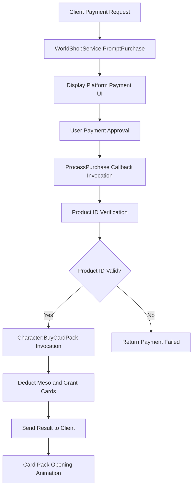

# Shop System

## Overview

MapleDuel's shop system is an in-app purchase system utilizing the MapleStory Worlds platform's `_WorldShopService`. Players can purchase card packs with real money, supporting both single card pack and multiple card pack purchases.

## Core Components

### Shop.mlua
The core logic of the shop system that handles product ID mapping and payment processing.

**Key Features:**
- Product ID and card pack name mapping management
- Payment request processing and validation
- Integration with WorldShopService

```lua
@Logic
script Shop extends Logic

property table singleIdTable = {}    -- Single card pack product ID mapping
property table multipleIdTable = {}  -- Multiple card pack product ID mapping
property table singleNameTable = {}  -- ID to name reverse mapping
property table multipleNameTable = {} -- ID to name reverse mapping
```

### Product ID Mapping System

The shop system maps internal card pack names to platform product IDs.

**Single Card Pack Product IDs:**
```lua
self.singleIdTable = {
    ClassicGoldEpic = "9K0PY7KKI",
    ClassicGoldUnique = "NUZ61P7S5", 
    ClassicGoldLegendary = "3KNE8K0MA",
    NautilusGoldEpic = "CMNO76NHT",
    NautilusGoldUnique = "EXTS8C437",
    NautilusGoldLegendary = "FN11GG4PL",
}
```

**Multiple Card Pack Product IDs:**
```lua
self.multipleIdTable = {
    ClassicGoldEpic = "K4UYFYLK0",
    ClassicGoldUnique = "IT5E1WLA3",
    ClassicGoldLegendary = "VVCT7DWFZ", 
    NautilusGoldEpic = "1KJJFMUDL",
    NautilusGoldUnique = "PDSFLZA0D",
    NautilusGoldLegendary = "QH8AIQ134",
}
```

### Payment Processing System

#### Server-side Payment Processing

```lua
@ExecSpace("ServerOnly")
method boolean ProcessPurchase(any purchaseInfo)
    local userEntity = _UserService:GetUserEntityByUserId(purchaseInfo.UserId)
    if not isvalid(userEntity) then
        return false
    end
    
    local character = userEntity.Character
    while not character.isLoaded do
        wait(0.01)  -- Wait for character loading
    end
    
    -- Use pcall for safe payment processing
    local success, result = pcall(function()
        local productId = purchaseInfo.ProductId
        if self.singleNameTable[productId] then
            return character:BuySingleCardPack(self.singleNameTable[productId])
        elseif self.multipleNameTable[productId] then
            return character:BuyMultipleCardPacks(self.multipleNameTable[productId])
        end
    end)
    
    if not success then
        return false  -- Payment failed
    else
        return result  -- Return payment success status
    end
end
```

#### Client-side Payment Request

```lua
@ExecSpace("ClientOnly")
method void PromptSinglePurchase(string cardPackName)
    _WorldShopService:PromptPurchase(self.singleIdTable[cardPackName])
end

@ExecSpace("ClientOnly") 
method void PromptMultiplePurchase(string cardPackName)
    _WorldShopService:PromptPurchase(self.multipleIdTable[cardPackName])
end
```

## Card Pack Purchase System (Character.mlua)

### Single Card Pack Purchase

```lua
@ExecSpace("ServerOnly")
method boolean BuySingleCardPack(string cardPackName)
    if not self.isLoaded then return false end
    if _Server:IsRequesting() then
        if self ~= _Server.sender then return false end
    end
    
    _Server.sender = nil
    
    -- Check card pack cost
    local currency = self.cardPackManager:GetCurrency(cardPackName)
    local price = self.cardPackManager:GetSinglePrice(cardPackName)
    local success = false
    
    if currency == "Meso" and self.meso >= price then
        self.meso -= price
        success = true
    end
    
    local infoArray = {}
    if success then
        -- Card drawing logic
        local cardName = self.cardPackManager:GetRandomCard(cardPackName)
        local skinIndex = self.cardManager:GetRandomSkinIndex(cardName)
        
        infoArray = {
            cardName = cardName,
            skinIndex = skinIndex,
            index = 1,
        }
        
        -- Add card
        local cardInfo = {name = cardName, skinIndex = skinIndex}
        table.insert(self.cardArray, cardInfo)
    end
    
    if self:IsUser() then
        self:BuySingleCardPackInOwner(cardPackName, success, infoArray, self.Entity.Name)
    end
    
    return success
end
```

### Multiple Card Pack Purchase

```lua
@ExecSpace("ServerOnly")
method boolean BuyMultipleCardPacks(string cardPackName)
    if not self.isLoaded then return false end
    
    local currency = self.cardPackManager:GetCurrency(cardPackName)
    local price = self.cardPackManager:GetMultiplePrice(cardPackName)
    local success = false
    
    if currency == "Meso" and self.meso >= price then
        self.meso -= price
        success = true
    end
    
    local infos = {}
    if success then
        -- Draw 11 cards (multiple card pack)
        for i = 1, 11 do
            local cardName = self.cardPackManager:GetRandomCard(cardPackName)
            local skinIndex = self.cardManager:GetRandomSkinIndex(cardName)
            
            local infoArray = {
                cardName = cardName,
                skinIndex = skinIndex, 
                index = i,
            }
            table.insert(infos, infoArray)
            
            local cardInfo = {name = cardName, skinIndex = skinIndex}
            table.insert(self.cardArray, cardInfo)
        end
    end
    
    if self:IsUser() then
        self:BuyMultipleCardPacksInOwner(cardPackName, success, infos, self.Entity.Name)
    end
    
    return success
end
```

### Client-side Purchase Result Processing

**Single Card Pack Purchase Result:**
```lua
@ExecSpace("Client")
method void BuySingleCardPackInOwner(string cardPackName, boolean success, table infoArray)
    if not success then
        self.uiManager.PopupModule:Open("NotEnoughMeso", true, nil, nil)
        return
    end
    
    self:GainCards(infoArray, nil)
    self.uiManager.CardPackModule:Open(cardPackName, 1)
end
```

**Multiple Card Pack Purchase Result:**
```lua
@ExecSpace("Client")
method void BuyMultipleCardPacksInOwner(string cardPackName, boolean success, table infos)
    local currency = self.cardPackManager:GetCurrency(cardPackName)
    local price = self.cardPackManager:GetMultiplePrice(cardPackName)
    
    if not success then
        if currency == "Meso" then
            self.uiManager.PopupModule:Open("NotEnoughMeso", true, nil, nil)
        end
        return
    end
    
    for _, infoArray in ipairs(infos) do
        self:GainCards(infoArray, nil)
    end
    self.uiManager.CardPackModule:Open(cardPackName, 11)
end
```

## WorldShopService Integration

### Payment Callback Registration

```lua
method void OnBeginPlay()
    _WorldShopService:SetProcessPurchaseCallback(self.ProcessPurchase)
    -- Initialize product ID tables
end
```

### Payment Processing Flow



## Card Pack Types and Pricing

### Supported Card Pack Themes
- **ClassicGold**: Classic gold card packs
- **NautilusGold**: Nautilus gold card packs

### Product by Card Pack Grades
- **Epic**: Epic grade guaranteed
- **Unique**: Unique grade guaranteed  
- **Legendary**: Legendary grade guaranteed

### Purchase Options
- **Single Purchase**: 1-card pack
- **Multiple Purchase**: 11-card pack (with discount)

## Currency System

### Meso System
The in-game primary currency used for purchasing card packs.

**Meso-related Properties:**
```lua
property integer meso = nil  -- Current Meso holdings
```

**Insufficient Meso Handling:**
```lua
if currency == "Meso" and self.meso >= price then
    self.meso -= price
    success = true
end
-- Display "NotEnoughMeso" message when insufficient Meso
```

## Security and Validation

### Server-side Validation
- Check user existence
- Wait for character loading completion
- Product ID validity verification
- Currency holdings validation

### Error Handling
- Safe function execution using `pcall`
- Display appropriate error messages on payment failure
- Prevent duplicate payments

### Synchronization
- Payment status synchronization between server and client
- UI updates after card distribution

## Special Features

### Event Card Packs
```lua
method void BuySingleCardPackByOpenEvent(string cardPackName)
    -- Special card packs purchasable only during event period
    -- Includes separate condition validation logic
end
```

### Card Pack Opening Animation
After completing card pack purchase, card reveal animation is played through `CardPackModule:Open()`.

This shop system integrates with the platform's secure payment system to provide players with a reliable purchase experience, increasing game profitability through various card pack options and discount benefits.
