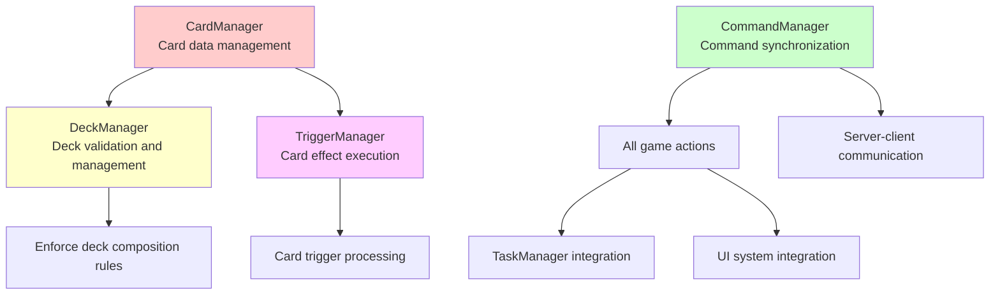
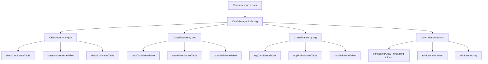
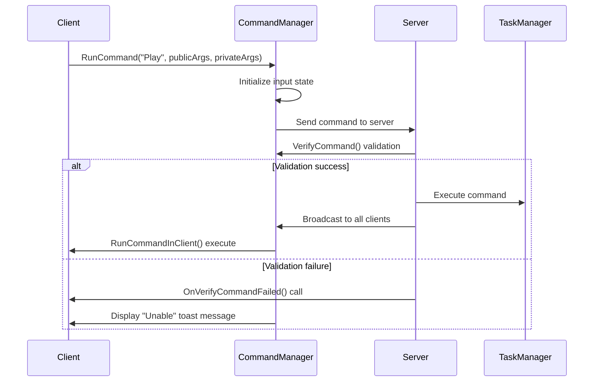
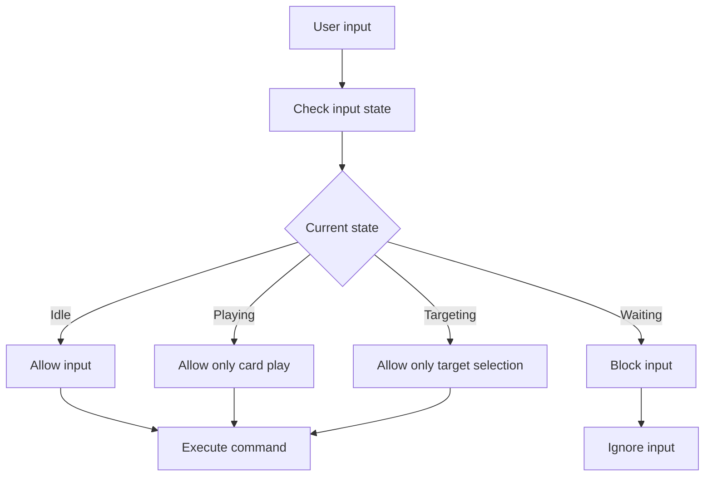
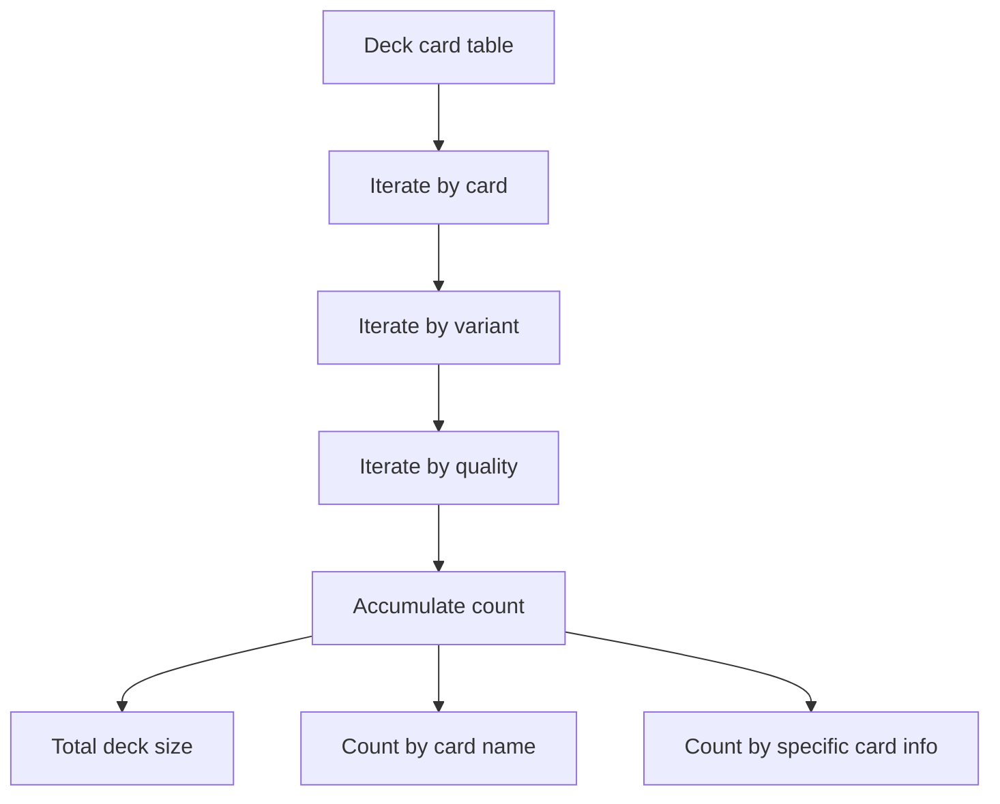
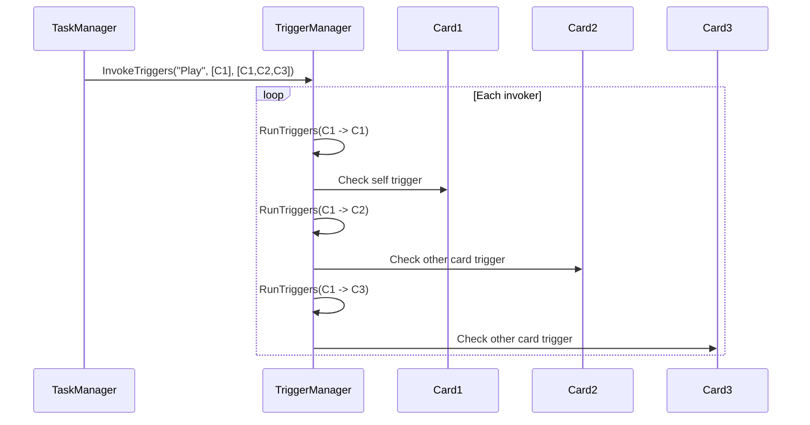
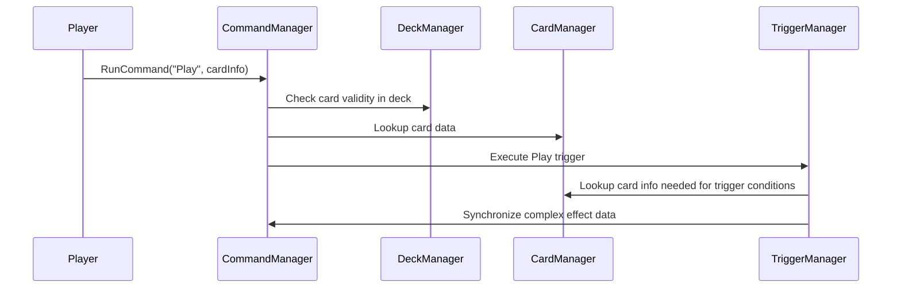

# Core Manager

## 📋 Overview

Maple Duel's Core Manager system is the heart of the architecture that centrally manages all major data and logic of the game. CardManager efficiently manages data for 266 cards, CommandManager synchronizes all game commands between server-client, DeckManager enforces deck composition rules, and TriggerManager orchestrates the chain execution of complex card effects. These organically integrate with each other to ensure game consistency and stability.

**Related Files**: 
- `RootDesk/MyDesk/Components/Managers/CardManager.mlua`
- `RootDesk/MyDesk/Components/Managers/CommandManager.mlua`
- `RootDesk/MyDesk/Components/Managers/DeckManager.mlua`
- `RootDesk/MyDesk/Components/Managers/TriggerManager.mlua`

## 🏗️ Core Manager Architecture

### Inter-Manager Relationships



## 🎴 1. CardManager - Card Data Manager

### Integrated Card Data Management

#### CSV-based Data Loading
```lua
method void OnBeginPlay()
    self.dataSet = _DataService:GetTable("Card")
    self.allCardNameArray = self.dataSet:GetColumn("name")
    
    -- Sort by cost
    _Table:StableSort(self.allCardNameArray, function(left, right) 
        return self:GetCost(left) < self:GetCost(right) 
    end)
end
```

CardManager loads all data from Card.csv into memory at startup and creates various indexing tables.

#### Multi-dimensional Indexing System


### Card Information Accessors

#### Core Card Data Methods
```lua
-- Card basic information
method string GetCategory(string name)    -- "Minion" or "Skill"
method string GetClass(string name)       -- "Warrior", "Magician", etc.
method string GetTheme(string name)       -- Theme information
method string GetRarity(string name)      -- "Normal", "Rare", etc.
method integer GetCost(string name)       -- MP cost
method boolean IsToken(string name)       -- Token card check

-- Minion-specific information
method integer GetMaxHp(string name)      -- Maximum health
method integer GetAtk(string name)        -- Attack power
method boolean HasBarrier(string name)    -- Barrier possession

-- Skill-specific information  
method integer GetDamage(string name)     -- Skill damage
method integer GetHeal(string name)       -- Healing amount

-- Tag system
method table GetTags(string name)         -- All tags array of the card
```

### Card Classification and Filtering

#### Efficient Card Search
```lua
-- Finding cards with specific conditions
local warriorMinions = self.classMinionNameTable["Warrior"]  -- Warrior minions
local cost3Cards = self.costCardNameTable[3]                -- 3-cost cards
local dragonCards = self.tagCardNameTable["Dragon"]         -- Dragon tag cards
```

**Search Optimization**:
- **Pre-indexing**: Create all classification tables at game start
- **O(1) Access**: Immediate search based on hash tables
- **Memory Trade-off**: Use memory for fast search

## 🎯 2. CommandManager - Command Synchronization Manager

### Client-Server Command System

#### Command Execution Flow


#### Command Verification System
```lua
@ExecSpace("ServerOnly")
method boolean VerifyCommand(string commandName, table args, integer commandId)
    -- Command ID verification (ensure synchronization)
    if self.duel.commandId ~= commandId then
        return false
    end
    
    -- Execute individual command verification
    return _Util:Call(self, "Verify" .. commandName, args)
end
```

**Security Verification Steps**:
1. **Command ID Synchronization**: Confirm game state match
2. **Individual Verification**: Check conditions for each command
3. **Permission Verification**: Check command execution authority
4. **State Verification**: Verify if command fits game situation

### Package System

#### Complex Data Synchronization
```lua
-- Data transmission from server
if self:IsServer() then
    local complexData = self:CalculateComplexData()
    self.commandManager:PushPackage(complexData)
else
    -- Data reception on client
    local complexData = self.commandManager:PopPackage()
end
```

**Package System Characteristics**:
- **Synchronization Guarantee**: Identical data between server-client
- **Complex Objects**: Full information transmission of cards, minions, etc.
- **Order Guarantee**: Safe data delivery in FIFO manner

### Input State Management

#### Input Control by Situation


## 📚 3. DeckManager - Deck Manager

### Deck Verification System

#### Comprehensive Deck Validity Check
```lua
method boolean IsDeckValid(table deck)
    -- Basic structure verification
    if _Table:IsEmpty(deck) then return false end
    
    -- Job validity verification
    if not (deck.class == "Warrior" or deck.class == "Magician" or 
            deck.class == "Bowman" or deck.class == "Thief" or 
            deck.class == "Pirate") then
        return false
    end
    
    -- Deck name verification
    if _UtilLogic:IsNilorEmptyString(deck.name) then return false end
    
    -- Card composition verification
    if deck.cardTable ~= nil then
        if self:GetDeckSize(deck) > 20 then return false end
        
        for name, _ in pairs(deck.cardTable) do
            local class = self.cardManager:GetClass(name)
            -- Job restriction verification
            if not (class == "Common" or class == deck.class) then
                return false
            end
            
            -- Card quantity limit verification  
            if self:GetCardCountByName(deck, name) > 2 then
                return false
            end
        end
    end
    
    return true
end
```

#### Deck Completeness Check
```lua
method boolean IsDeckComplete(table deck)
    if not self:IsDeckValid(deck) then return false end
    return self:GetDeckSize(deck) == 20
end
```

### Deck Size and Card Calculation

#### Precise Card Count Management


**Card Calculation Methods**:
- `GetDeckSize(deck)` — Total card count in deck
- `GetCardCountByName(deck, name)` — Total count of specific card name
- `GetCardCountByInfo(deck, info)` — Count of exact card information

### Deck Creation and Management

#### New Deck Generation System
```lua
method table GetNewDeck(string class, string localeId)
    local adjective = self.adjectiveArray[_UtilLogic:RandomIntegerRange(1, #self.adjectiveArray)]
    local name = _LocalizationService:GetText(adjective) .. " " .. _LocalizationService:GetText(class)
    
    return {
        class = class,
        name = name,
        cardTable = {}  -- Empty card table
    }
end
```

**Automatic Name Generation**:
- Load adjective list from Deck.csv
- Combine random adjective + job name
- Multi-language support (`ko`, `en`, etc.)

## 🎭 4. TriggerManager - Trigger System Manager

### Trigger Execution Engine

#### Hierarchical Trigger Processing


#### Trigger Condition Check
```lua
method boolean IsTriggerCondition(string triggerKey, string triggerName, Object invoker, Object receiver, table args, table result)
    return _Util:Call(self, triggerName .. "Condition", {triggerKey, invoker, receiver, result, _Table:Unpack(args)})
end
```

**Conditional Trigger Execution**:
- **Trigger Key Matching**: "Play", "Death", "Summon", etc.
- **Invoker/Receiver Relationship**: Distinguish opponent/ally
- **Additional Conditions**: Check health, state, position, etc.

### Card Effect Implementation

#### Trigger Method Examples
```lua
method void AirStrike(Card invoker, Card receiver)
    self.taskManager:RunProcess(function()
        local damage = 2
        -- Additional damage if opponent's hand is empty
        if #receiver.player.hand.cardArray == 0 then
            damage += 4
        end
        
        -- Damage to opponent player
        receiver.player:Damage(invoker, damage)
    end)
end

-- AirStrike trigger condition
method boolean AirStrikeCondition(string triggerKey, Object invoker, Object receiver, table result)
    return triggerKey == "Play" and 
           invoker:IsCard() and 
           receiver:IsPlayer() and 
           receiver ~= invoker.player
end
```

### Card Reveal System

#### Trigger-based Card Reveal
```lua
method table ShareOpenCards(table invokerArray, table receiverArray, string triggerKey, table args, table eachArgs, table resultTable)
    if self:IsServer() then
        local cardSet = {}
        for _, receiver in ipairs(receiverArray) do
            if receiver:IsCard() and receiver.triggerNameArray then
                for _, triggerName in ipairs(receiver.triggerNameArray) do
                    if self:IsTriggerCondition(triggerKey, triggerName, invoker, receiver, args, result) and
                       _Util:HasAttribute(self, triggerName, "Open") then
                        cardSet[receiver] = true
                    end
                end
            end
        end
        cardArray = table.keys(cardSet)
        self.commandManager:PushPackage(cardArray)
    else
        cardArray = self.commandManager:PopPackage()
    end
    
    return cardArray
end
```

**Automatic Card Reveal**:
- **Conditional Reveal**: Reveal only when trigger activates
- **Synchronization**: Same card reveal on server-client
- **Visual Effect**: Revealed cards turn to front face

## 🔄 5. Inter-Manager Integration

### Integrated Workflow

#### Manager Collaboration During Card Play


### Data Consistency Guarantee

#### Responsibility Separation by Manager
- **CardManager**: Read-only access to card source data
- **DeckManager**: Strict verification of deck composition rules  
- **CommandManager**: Synchronization of all changes
- **TriggerManager**: Sequential execution of complex interactions

## 🎯 6. Performance Optimization

### Memory Management

#### Efficient Data Structures
```lua
-- Pre-calculated indexing tables
property table classCardNameTable = {}    -- Card list by job
property table costCardNameTable = {}     -- Card list by cost  
property table tagCardNameTable = {}      -- Card list by tag
```

**Memory vs Performance Trade-off**:
- **Increased Memory Usage**: Maintain various indexing tables
- **Maximize Search Performance**: Achieve O(1) time complexity
- **Game Start Loading**: Complete all calculations initially

### Command Processing Optimization

#### Asynchronous Command Queue
```lua
-- Client command queue processing
while true do
    while _Queue:Front(self.commandQueue) do
        local command = _Queue:Pop(self.commandQueue)
        self:RunCommandInClient(command)
    end
    wait(0.01)  -- Frame-by-frame processing
end
```

## 💡 Code References

Core Manager System logic:
- `CardManager.mlua :: OnBeginPlay()` — Card data initialization and indexing
- `CommandManager.mlua :: RunCommand()` — Command execution and synchronization
- `DeckManager.mlua :: IsDeckValid()` — Deck validity verification
- `TriggerManager.mlua :: InvokeTriggers()` — Trigger system execution
- `TriggerManager.mlua :: ShareOpenCards()` — Card reveal synchronization

The Core Manager system systematically manages all data and logic of Maple Duel, serving as the brain that accurately and efficiently processes the rules and interactions of complex card games.
