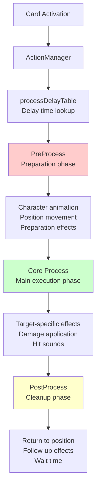
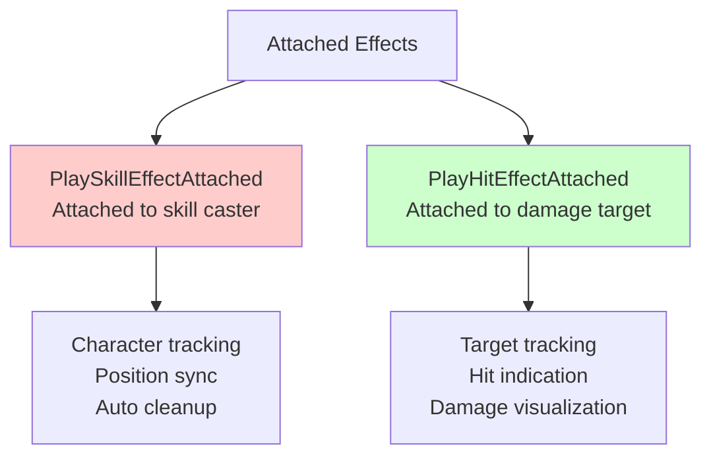

# Action System

## 📋 Overview

The Action System is the core system that precisely manages all visual presentations and animations in Maple Duel. ActionManager provides optimized animation sequences for each of the over 200 different cards through a 3-stage process (PreProcess → Core → PostProcess), implementing immersive combat presentations. Each card has unique timing and effects, transforming strategic card gameplay into visual spectacle through complex tweening, sound synchronization, and multiple effects.

**Related Files**:
- `RootDesk/MyDesk/Components/Managers/ActionManager.mlua` - All card action sequence definitions
- `RootDesk/MyDesk/Components/Managers/ResourceManager.mlua` - Sound and effect resource management
- `RootDesk/MyDesk/Components/Managers/TriggerManager.mlua` - Action trigger and context provision

## 🏗️ Action System Architecture

### 3-Stage Action Pipeline



## ⏱️ 1. Precision Timing System

### Card-specific Process Delays

#### Process Delay Table
```lua
method void OnBeginPlay()
    self.processDelayTable = {
        AirStrike = 3.96,    -- Large-scale skill: long presentation
        ArmorCrash = 1.52,   -- Medium skill: moderate presentation
        ArrowBomb = 1,       -- Simple skill: short presentation
        Genesis = 3.64,      -- Ultimate level: very long presentation
        BlueMushroom = 0.48, -- Basic minion: minimal presentation
        -- ... Optimized delays for 200+ cards
    }
    
    self.coreDelayTable = {
        ArrowBlow = 0.25,    -- Core action duration
        ArrowBomb = 0.15,
        Assaulter = 0.33,
        -- ... Actual damage application timing
    }
end
```

**Delay Design Principles**:
- **Gameplay Impact**: More powerful effects have longer presentations
- **Visual Consistency**: Similar categories have similar presentation lengths
- **Player Experience**: Optimal balance between not too long or too short

#### Dynamic Delay Lookup
```lua
method number GetProcessDelay(string name)
    return self.processDelayTable[name] or 1  -- Default 1 second
end

method number GetCoreDelay(string name)
    return self.coreDelayTable[name] or 0.25  -- Default 0.25 seconds
end
```

## 🎬 2. PreProcess - Preparation Stage Presentation

### Player Animation and Position Adjustment

#### AirStrike - Large-scale Ranged Skill Preparation
```lua
@ExecSpace("ClientOnly")
method void PreProcessAirStrike()
    local player = self.triggerManager.receiver.player
    local resource = self.resourceManager:GetResource("AirStrike")
    
    -- Stage 1: Player action animation
    player:Animate("AirStrike")
    _Effect:PlaySkillEffectAttached(resource.skillAnimation_1, player, Vector3.zero, nil)
    
    wait(0.6)  -- Preparation time
    
    -- Stage 2: Sky attack preparation effects
    _Effect:PlayEffect(resource.skillAnimation_2, Vector3(0, -2, 900), nil, _Effect:GetUnitLayerOptions(nil))
    _Effect:PlayEffect(resource.skillAnimation_3, Vector3(0, -2, 899.999), nil, _Effect:GetUnitLayerOptions(nil))
    _SoundService:PlaySound(resource.skillSound_1, 1)
    
    wait(1.8)  -- Attack delay
end
```

#### Genesis - Ultimate-level Multi-stage Preparation
```lua
@ExecSpace("ClientOnly")
method void PreProcessGenesis()
    local player = self.triggerManager.receiver.player
    local resource = self.resourceManager:GetResource("Genesis")
    
    -- Stage 1: Player front placement
    player:PlaceFront()
    _Tween:MoveTo(player.actor.Entity, Vector2.zero, 0.25, EaseType.CubicEaseOut, true)
    wait(0.25)
    
    -- Stage 2: Skill charging animation
    player:Animate("Alert")
    _Effect:PlaySkillEffectAttached(resource.skillAnimation_1, player, 0.001 * Vector3.back, nil)
    _Effect:PlaySkillEffectAttached(resource.skillAnimation_2, player, Vector3.zero, nil)
    _SoundService:PlaySound(resource.skillSound_1, 1)
    
    -- Stage 3: Multiple effect generation
    local animationArray = {resource.extraAnimation_1, resource.extraAnimation_2, resource.extraAnimation_3}
    local effectPosition = Vector3(0, 0, 900)
    _TimerService:SetTimerOnce(function()
        for i = 1, 3 do
            for j = 1, 5 do
                effectPosition.x = _UtilLogic:RandomDouble() * 10 - 5
                effectPosition.y = _UtilLogic:RandomDouble() * 2 - 2
                _Effect:PlayEffect(_Table:GetRandomElement(animationArray), effectPosition, nil, _Effect:GetUnitLayerOptions(nil))
                effectPosition.z -= 0.001
            end
            wait(0.05)
        end
    end, 0)
end
```

### Minion Action Preparation

#### Simple Minion Skill Preparation
```lua
@ExecSpace("ClientOnly")
method void PreProcessBlackSheep()
    local receiver = self.triggerManager.receiver
    local resource = self.resourceManager:GetResource("BlackSheep")
    
    receiver:Animate("Skill")
    _SoundService:PlaySound(resource.skillSound_1, 1)
    
    wait(0.6)  -- Preparation time
end
```

**PreProcess Patterns**:
- **Animation State Change**: Idle → Attack/Skill/Alert
- **Preparation Effects**: Visual signals for skill charging, weapon preparation, etc.
- **Position Adjustment**: Front placement, target direction rotation
- **Sound Start**: Skill preparation sound effects

## 💥 3. Core Process - Main Execution Stage

### Target-specific Core Action Processing

#### Single Target Attack (AirStrike Core)
```lua
@ExecSpace("ClientOnly")
method void PreCoreAirStrike(Minion minion)
    local player = self.triggerManager.receiver.player
    local resource = self.resourceManager:GetResource("AirStrike")
    
    -- Attack effect on individual minion
    _Effect:PlayHitEffectAttached(resource.hitAnimation_1, minion, Vector3.zero, player, nil)
    _SoundService:PlaySound(resource.hitSound_1, 1)
end
```

#### Melee Combat Action (RibbonPig)
```lua
@ExecSpace("ClientOnly")
method void PreCoreRibbonPig(Unit unit, Minion attacker)
    local receiver = self.triggerManager.receiver
    local resource = self.resourceManager:GetResource("RibbonPig")
    
    local offset = receiver.actor.Entity.TransformComponent.Position:ToVector2()
    
    -- Stage 1: Move to target
    _Tween:Lerp(receiver.actor.Entity, receiver.anchorEntity, unit.actor.Entity, 0, 1, 0.3, EaseType.CubicEaseIn, offset, nil)
    wait(0.2)
    
    _SoundService:PlaySound(resource.skillSound_1, 0.5)
    wait(0.1)
    
    -- Stage 2: Attack effect and return to position
    _Effect:PlayHitEffect(resource.hitAnimation_1, unit, Vector3.zero, receiver, nil)
    _Tween:Lerp(receiver.actor.Entity, receiver.anchorEntity, unit.actor.Entity, 1, 0, 0.5, EaseType.CubicEaseOut, offset, nil)
end
```

#### Complex Targeting Action (Flamethrower)
```lua
@ExecSpace("ClientOnly")
method void PreCoreFlamethrower(Minion minion)
    local player = self.triggerManager.receiver.player
    local resource = self.resourceManager:GetResource("Flamethrower")
    
    -- Stage 1: Player position adjustment
    player:PlaceFront()
    local playerPosition = player:GetOffsettedPosition(minion, 2 * Vector2.right, false)
    _Tween:MoveTo(player.actor.Entity, playerPosition, 0.25, EaseType.CubicEaseOut, true)
    wait(0.25)
    
    -- Stage 2: Flamethrower action
    player:Animate("Flamethrower")
    _Effect:PlaySkillEffectAttached(resource.skillAnimation_1, player, Vector3(0.42, 0.28, 0), nil)
    _SoundService:PlaySound(resource.skillSound_1, 1)
    wait(0.51)
    
    -- Stage 3: Target hit effect
    _Effect:PlayHitEffect(resource.hitAnimation_1, minion, Vector3.zero, player, nil)
    _SoundService:PlaySound(resource.hitSound_1, 1)
end
```

**Core Stage Characteristics**:
- **Actual Damage Application**: Damage timing synchronized with game logic
- **Individual Target Processing**: Separate Core method calls for each target
- **Hit Effects**: Visual/audio feedback for clear impact sensation
- **Position-based Presentation**: Enhanced distance perception and immersion

## 🏁 4. PostProcess - Cleanup Stage Presentation

### Follow-up Processing and Cleanup

#### Simple Cleanup (AirStrike)
```lua
@ExecSpace("ClientOnly")  
method void PostProcessAirStrike()
    wait(1.56)  -- Afterglow time
end
```

#### Complex Position Return (Flamethrower)
```lua
@ExecSpace("ClientOnly")
method void PostCoreFlamethrower(Minion minion)
    local player = self.triggerManager.receiver.player
    
    wait(0.15)  -- Brief wait
    
    -- Return to original position
    _Tween:MoveTo(player.actor.Entity, Vector2.zero, 0.5, EaseType.CubicEaseOut, false)
    wait(0.5)
    
    -- Restore to default state
    player:Animate("Idle")
    player:PlaceBack()
end
```

#### Long-duration Afterglow Effect (Genesis)
```lua
@ExecSpace("ClientOnly")
method void PostProcessGenesis()
    wait(3.39)  -- Ultimate skill afterglow time
end
```

**PostProcess Role**:
- **State Restoration**: Restore animation, position, scale, etc. to original state
- **Afterglow Time**: Appropriate wait time based on skill impact
- **Presentation Completion**: Natural transition to next action

## 🎭 5. Special Action System

### Minion Summoning System

#### Basic Summon Presentation
```lua
@ExecSpace("ClientOnly")
method void Summon(Minion minion)
    local resource = self.resourceManager:GetResource("Summon")
    
    -- Initial state: Start with small size
    local transform = minion.actor.Entity.TransformComponent
    transform.Position = Vector3.zero
    transform.Scale.x = 0
    transform.Scale.y = 0
    
    -- Stage 1: Appearance animation
    minion:PlaceFront()
    _Tween:MoveAndScaleTo(minion.actor.Entity, Vector2(0, 0.8), 1.25 * Vector2.one, 0.375, EaseType.CubicEaseOut, EaseType.CubicEaseOut, false)
    _SoundService:StopSound(resource.sound)
    _SoundService:PlaySound(resource.sound, 1)
    
    -- Stage 2: Adjust to normal size
    _TimerService:SetTimerOnce(function()
        _Tween:MoveAndScaleTo(minion.actor.Entity, Vector2.zero, Vector2.one, 0.375, EaseType.CubicEaseIn, EaseType.CubicEaseIn, false)
    end, 0.375)
    
    -- Stage 3: Summon effect
    _TimerService:SetTimerOnce(function()
        _Effect:PlayEffect(resource.animation, Vector3.zero, minion.actor.Entity, _Effect:GetUnitLayerOptions(nil))
    end, 0.4)
    
    wait(0.75)
    
    minion:PlaceBack()
end
```

#### Card-specific Specialized Summon (if exists)
```lua
method string GetSummonActionName(string name)
    local actionName = "Summon" .. name
    return self[actionName] == nil and "Summon" or actionName
end

@ExecSpace("ClientOnly")
method void PlaySummonAction(Minion minion)
    _Util:Call(self, self:GetSummonActionName(minion.name), {minion})
end
```

**Summon System Characteristics**:
- **Unified Basic Presentation**: All minions use basic Summon animation
- **Specialized Presentation Possible**: Special minions can define exclusive summon animations
- **Scale and Position Combination**: Impactful appearance effect

### Coroutine-based Action System

#### Asynchronous Action Execution
```lua
@ExecSpace("ClientOnly")
method table SummonCoroutine(Minion minion)
    return _Util:RunCoroutine(self, self:GetSummonActionName(minion.name), {minion})
end
```

**Coroutine Utilization**:
- **Non-blocking Execution**: Action processing that doesn't block other systems
- **Complex Timing**: Precise time control and synchronization
- **Resource Efficiency**: Optimized memory usage

## 🎨 6. Visual Effects System

### Effect Type Classification

#### Attached Effects (Attached Effects)


#### Standalone Effects (Standalone Effects)
```lua
-- Fixed position effect
_Effect:PlayEffect(resource.skillAnimation_2, Vector3(0, -2, 900), nil, _Effect:GetUnitLayerOptions(nil))

-- Entity-based effect  
_Effect:PlayEffect(resource.animation, Vector3.zero, minion.actor.Entity, _Effect:GetUnitLayerOptions(nil))
```

#### Multiple Effect Combination (Genesis Example)
```lua
local animationArray = {resource.extraAnimation_1, resource.extraAnimation_2, resource.extraAnimation_3}
local effectPosition = Vector3(0, 0, 900)

for i = 1, 3 do
    for j = 1, 5 do
        effectPosition.x = _UtilLogic:RandomDouble() * 10 - 5
        effectPosition.y = _UtilLogic:RandomDouble() * 2 - 2
        _Effect:PlayEffect(_Table:GetRandomElement(animationArray), effectPosition, nil, _Effect:GetUnitLayerOptions(nil))
        effectPosition.z -= 0.001  -- Layer separation
    end
    wait(0.05)
end
```

### Sound System Integration

#### Sound Synchronization Patterns
```lua
-- Sound cleanup then playback
_SoundService:StopSound(resource.sound)
_SoundService:PlaySound(resource.sound, 1)

-- Volume-adjusted playback
_SoundService:PlaySound(resource.skillSound_1, 0.5)

-- Multiple sound combination
_SoundService:PlaySound(resource.skillSound_1, 1)  -- Preparation sound
-- ... Perform action ...
_SoundService:PlaySound(resource.hitSound_1, 1)    -- Hit sound
```

## ⚡ 7. Performance Optimization

### Client-side Execution

#### ExecSpace Utilization
```lua
@ExecSpace("ClientOnly")
method void PreProcessAirStrike()
    -- All actions execute on client only
    -- Server handles only game logic, client handles presentation
end
```

**Separated Execution Spaces**:
- **Server**: Game logic, damage calculation, validation
- **Client**: Animation, effects, sound
- **Synchronization**: State sync through CommandManager

### Resource Management Optimization

#### Lazy Loading and Caching
```lua
method void SetName(string name)
    if not _UtilLogic:IsNilorEmptyString(self.name) then
        return
    end
    
    self.name = name
    self.entry = self.entryManager:GetEntry(self.name)
    self.resourceManager:LoadResource(self.name, nil)  -- Load only when needed
end
```

#### Memory Efficiency
```lua
-- Timer-based cleanup
_TimerService:SetTimerOnce(function()
    player:Animate("Idle")
    player:PlaceBack()
end, 0.88)

-- Resource reuse
local resource = self.resourceManager:GetResource("AirStrike")
-- Same resource object shared across all AirStrike actions
```

## 🧪 8. Debugging and Development Tools

### Action Testing System

#### Delay Time Adjustment
```lua
-- Real-time delay adjustment during development
self.processDelayTable = {
    -- Test short delays
    AirStrike = _Debug.FastAnimation and 0.5 or 3.96,
    Genesis = _Debug.FastAnimation and 1.0 or 3.64,
}
```

#### Action Logging
```lua
@ExecSpace("ClientOnly")
method void PreProcessAirStrike()
    if _Debug.ActionLogging then
        print("AirStrike PreProcess started")
    end
    
    -- ... Execute action ...
    
    if _Debug.ActionLogging then
        print("AirStrike PreProcess completed")
    end
end
```

### Visual Debugging

#### Hitbox Display
```lua
-- Visualize targeting range in development mode
if _Debug.ShowTargetArea then
    _Effect:PlayEffect("DebugTargetArea", target.actor.Entity.Position, nil, nil)
end
```

## 💡 Code References

Action System core logic:
- `ActionManager.mlua :: PreProcessGenesis()` — Complex multi-stage action sequence
- `ActionManager.mlua :: Summon()` — Basic minion summon presentation
- `ActionManager.mlua :: PreCoreFlamethrower()` — Close combat action
- `ActionManager.mlua :: GetProcessDelay()` — Card-specific timing lookup
- `ActionManager.mlua :: PlaySummonAction()` — Dynamic action method invocation

The Action System is the core system that transforms Maple Duel's strategic card gameplay into an immersive visual experience, visually representing each card's unique characteristics and strategic value through precise timing control and rich presentation.
