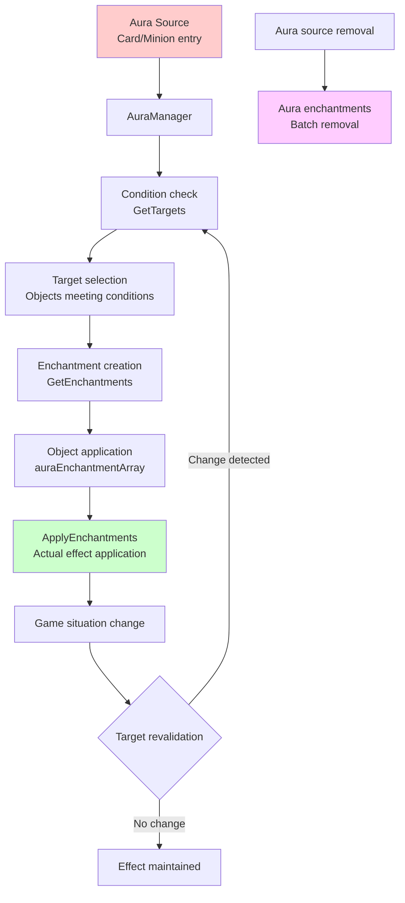
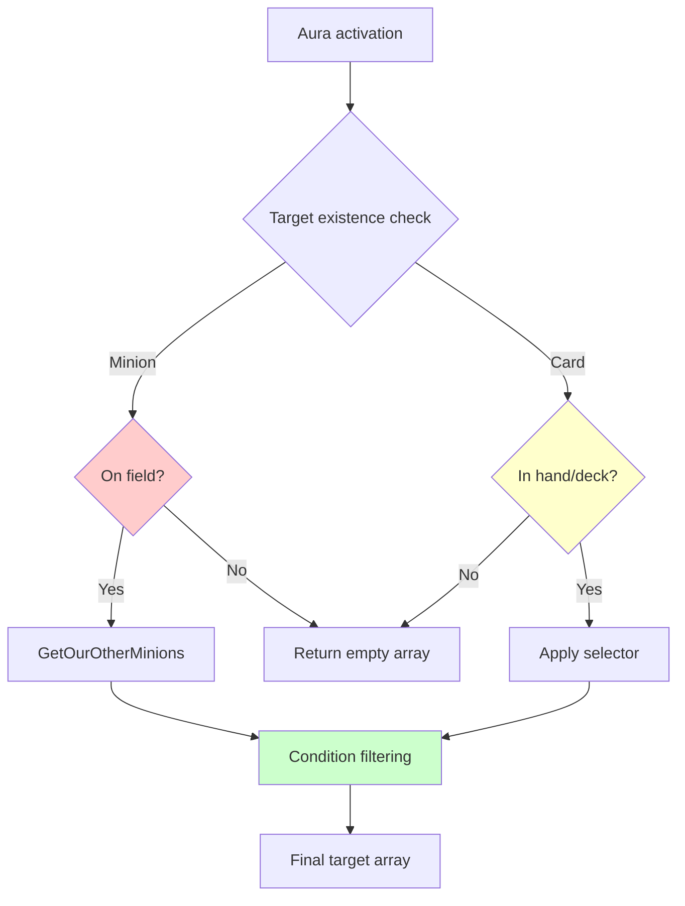
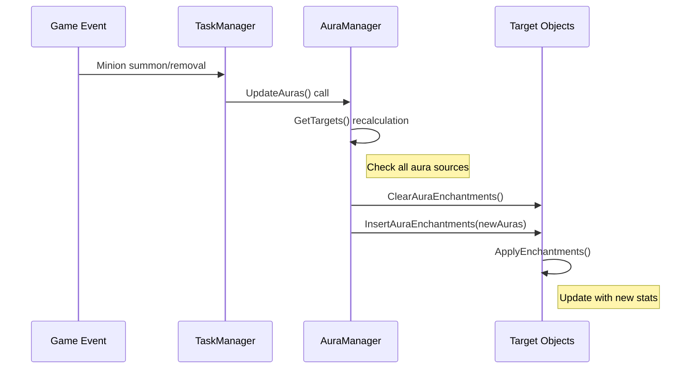

# Aura System

## 📋 Overview

The Aura System is an advanced effect system in Maple Duel where cards or minions continuously influence surrounding objects. AuraManager manages over 50 different aura effects, each dynamically selecting targets based on specific conditions and applying various enchantments. This system goes beyond simple buffs/debuffs to enable complex interactions that change in real-time based on game situations, significantly increasing strategic depth.

**Related Files**:
- `RootDesk/MyDesk/Components/Managers/AuraManager.mlua` - Aura effect definition and management
- `RootDesk/MyDesk/Components/Objects/Object.mlua` - Aura enchantment application mechanism
- `RootDesk/MyDesk/Components/Managers/EnchantmentManager.mlua` - Aura removal conditions

## 🏗️ Aura System Architecture

### Aura Lifecycle



## 🌟 1. Aura Effect Definition System

### Enchantment and Target Definition

#### Basic Aura Structure
```lua
-- Shumi Aura - Minion cost reduction
method table ShumiEnchantments()
    return {
        {methodName = "AddCostEnchantment", args = {-1}}
    }
end

method table ShumiTargets(Minion minion)
    return minion.player.hand:GetCards(self.taskManager.minionSelector)
end
```

**Aura Definition Pattern**:
- **Enchantments**: Method name and arguments for effects to apply
- **Targets**: Array of target objects to receive effects
- **Dynamic Conditions**: Target changes based on game situations

#### Conditional Aura System

##### Chicken - Attack increase for damaged minions
```lua
method table ChickenEnchantments()
    return {
        {methodName = "AddAtkEnchantment", args = {3}}
    }
end

method table ChickenTargets(Minion minion)
    if minion:IsDamaged() then
        return {minion}  -- Apply only when self is damaged
    end
end
```

##### DancesWithBalrog - Attack increase for other damaged minions
```lua
method table DancesWithBalrogEnchantments()
    return {
        {methodName = "AddAtkEnchantment", args = {2}}
    }
end

method table DancesWithBalrogTargets(Minion minion)
    return minion:GetOurOtherMinions(self.taskManager.damagedSelector)
end
```

### Complex Dynamic Calculation Auras

#### GrimPhantomWatch - Cost increase based on deck size
```lua
method table GrimPhantomWatchEnchantments(Card card)
    return {
        {methodName = "AddCostEnchantment", args = {#card.player.deck.cardArray}}
    }
end

method table GrimPhantomWatchTargets(Card card)
    return {card}  -- Apply to self
end
```

**Dynamic Calculation Characteristics**:
- **Real-time Value Calculation**: Cost varies based on deck card count
- **Game State Dependent**: Effect size changes as game progresses
- **Self-reference**: Aura source affects itself

#### Panda - Tag-based Cumulative Effect
```lua
method table PandaEnchantments(Card card)
    return {
        {methodName = "AddCostEnchantment", args = {-self.history:GetThisRoundMinionCountByTag(card.player, "Pet")}}
    }
end

method table PandaTargets(Card card)
    return {card}
end
```

**Advanced Calculation Elements**:
- **History Manager Integration**: Utilizes round-by-round statistics
- **Tag System**: Calculation based on specific category card count
- **Negative Effects**: Cost reduction (negative cost increase)

## 🎯 2. Aura Target Selection System

### Classification by Target Range

#### Player Target Auras
```lua
-- Focus - Player hand skill cost reduction
method table FocusTargets(Player player)
    return player.hand:GetCards(self.taskManager.skillSelector)
end

-- ShadowPartner - Player skill damage increase
method table ShadowPartnerTargets(Player player)
    return {player}
end
```

#### Field-based Auras
```lua
-- DrummingBunny - Attack increase for other friendly minions
method table DrummingBunnyTargets(Minion minion)
    return minion:GetOurOtherMinions(nil)
end

-- Octopus - Cost increase for all minion cards
method table OctopusTargets(Minion minion)
    return self.duel:GetCards(self.taskManager.minionSelector)
end
```

#### Game-wide Impact Auras
```lua
-- MrBouffon - Apply random battle to entire duel
method table MrBouffonTargets(Minion minion)
    return {self.duel}  -- Affects entire duel
end
```

### Conditional Target Selection

#### Complex Condition System


#### Target Validity Verification
```lua
method table GetTargets(any object, string auraName)
    -- Minion validity check
    if object:IsMinion() then
        if not isvalid(object.field) then
            return {}  -- Aura invalid if not on field
        end
    -- Card validity check  
    elseif object:IsCard() then
        if not isvalid(object.hand) and not isvalid(object.deck) then
            return {}  -- Aura invalid if not in hand or deck
        end
    end
    
    return _Util:Call(self, auraName .. "Targets", {object}) or {}
end
```

## 🔧 3. Enchantment Application Mechanism

### Object Component Integration

#### Aura Enchantment Management
```lua
-- Object.mlua's aura enchantment array
property table auraEnchantmentArray = {}

method void InsertAuraEnchantments(table auraEnchantmentArray)
    for _, auraEnchantment in ipairs(auraEnchantmentArray) do
        table.insert(self.auraEnchantmentArray, auraEnchantment)
    end
end

method void ClearAuraEnchantments()
    table.clear(self.auraEnchantmentArray)
end
```

#### Enchantment Application Process
```lua
method void ApplyEnchantments()
    -- 1. Initialize with original stats
    self.dependentVariableTable = _Table:ShallowCopy(self.entry)
    
    -- 2. Apply regular enchantments
    for _, enchantment in ipairs(self.enchantmentArray) do
        _Util:Call(self, enchantment.methodName, enchantment.args)
    end
    
    -- 3. Apply aura enchantments
    for _, auraEnchantment in ipairs(self.auraEnchantmentArray) do
        _Util:Call(self, auraEnchantment.methodName, auraEnchantment.args)
    end
    
    -- 4. Apply final stats
    self:SetVariables(self.dependentVariableTable)
end
```

**Importance of Application Order**:
- **Base values → Regular enchantments → Aura enchantments**
- **Cumulative Effects**: Multiple auras affecting the same stat accumulate
- **Real-time Recalculation**: Complete reapplication when game situation changes

### Enchantment Type-specific Processing

#### Stat Modification Enchantments
```lua
-- Cost modification
method void AddCostEnchantment(integer cost)
    local currentCost = self.dependentVariableTable.cost or self.entry.cost
    self.dependentVariableTable.cost = currentCost + cost
end

-- Attack modification  
method void AddAtkEnchantment(integer atk)
    local currentAtk = self.dependentVariableTable.atk or self.entry.atk
    self.dependentVariableTable.atk = currentAtk + atk
end

-- Skill damage modification
method void AddSkillDamageEnchantment(integer skillDamage)
    local currentDamage = self.dependentVariableTable.skillDamage or 0
    self.dependentVariableTable.skillDamage = currentDamage + skillDamage
end
```

#### State Flag Enchantments
```lua
-- Direct attack immunity
method void SetImmuneToDirectAttackEnchantment(boolean isImmune)
    self.dependentVariableTable.isImmuneToDirectAttack = isImmune
end

-- Random battle mode
method void SetRandomBattleEnchantment(boolean randomBattle)
    self.dependentVariableTable.randomBattle = randomBattle
end
```

## 🔄 4. Aura Dynamic Update System

### Real-time Aura Management

#### Game Event-based Updates


#### Condition Change Detection
```lua
-- Reevaluate Chicken aura when minion health changes
method void OnMinionDamaged(Minion minion)
    local chickenMinions = self.duel:GetMinions(function(m) 
        return m.name == "Chicken" 
    end)
    
    for _, chicken in ipairs(chickenMinions) do
        self:UpdateAuraTargets(chicken, "Chicken")
    end
end
```

**Update Trigger Events**:
- **Minion Summon/Removal**: Field situation changes
- **Card Draw/Play**: Hand composition changes  
- **Health/State Changes**: Condition satisfaction changes
- **Round Progress**: Time-based condition changes

## 🎲 5. Advanced Aura Effect Cases

### Cumulative Effect Auras

#### Roloduck - Self-enhancement based on field minion count
```lua
method table RoloduckEnchantments(Minion minion)
    return {
        {methodName = "AddAtkEnchantment", args = {#minion:GetOurOtherMinions(nil)}}
    }
end

method table RoloduckTargets(Minion minion)
    return {minion}  -- Self enhancement
end
```

**Cumulative Mechanism**:
- **Dynamic Value Calculation**: Attack increases proportional to friendly minion count
- **Real-time Updates**: Immediately reflected when minions are added/removed
- **Self Enhancement**: Becomes stronger when more minions are present

### Conditional Cost Manipulation

#### TripleThrow - Conditional cost reduction based on opponent's field
```lua
method table TripleThrowEnchantments()
    return {
        {methodName = "AddCostEnchantment", args = {-1}}
    }
end

method table TripleThrowTargets(Card card)
    if #card.player.opponent.field:GetMinions(nil) >= 2 then
        return {card}
    end
end
```

**Strategic Conditions**:
- **Opponent Dependent**: Effect activates based on opponent's strategy
- **Threshold Conditions**: Effect triggers only above specific values
- **Self Optimization**: Cost savings only in favorable situations

### Global Game Rule Changes

#### MrBouffon - Random battle mode activation
```lua
method table MrBouffonEnchantments()
    return {
        {methodName = "SetRandomBattleEnchantment", args = {true}}
    }
end

method table MrBouffonTargets(Minion minion)
    return {self.duel}  -- Affects entire duel
end
```

**Game Rule Modification**:
- **Global Effect**: Adds random elements to all battles
- **Meta Game Change**: Modifies basic game rules themselves
- **Unpredictability**: Makes strategic calculations more complex

## 🔍 6. Performance Optimization

### Lazy Evaluation System

#### On-demand Calculation
```lua
-- Calculate aura targets only when needed
method table GetTargets(any object, string auraName)
    if not self:IsObjectValid(object) then
        return {}  -- Prevent unnecessary calculations with quick fail
    end
    
    local targets = _Util:Call(self, auraName .. "Targets", {object})
    return targets or {}
end
```

#### Caching Strategy
```lua
-- Cache complex calculation results
local auraCache = {}

method table GetCachedAuraTargets(Object object, string auraName)
    local cacheKey = string.format("%s_%s_%d", object.name, auraName, self.duel.round)
    
    if auraCache[cacheKey] then
        return auraCache[cacheKey]
    end
    
    local targets = self:GetTargets(object, auraName)
    auraCache[cacheKey] = targets
    return targets
end
```

### Batch Updates

#### Single event triggers multiple aura updates
```lua
method void UpdateAllAuras()
    local allAuraSources = self.duel:GetObjects(function(obj)
        return not _Table:IsEmpty(obj.auraNameArray)
    end)
    
    -- Initialize all targets' aura enchantments
    for _, object in ipairs(self.duel.objectArray) do
        object:ClearAuraEnchantments()
    end
    
    -- Generate new enchantments from all aura sources
    for _, source in ipairs(allAuraSources) do
        for _, auraName in ipairs(source.auraNameArray) do
            local targets = self:GetTargets(source, auraName)
            local enchantments = self:GetEnchantments(source, auraName)
            
            for _, target in ipairs(targets) do
                target:InsertAuraEnchantments(enchantments)
            end
        end
    end
    
    -- Apply enchantments to all targets
    for _, object in ipairs(self.duel.objectArray) do
        object:ApplyEnchantments()
    end
end
```

## 💡 Code References

Aura System core logic:
- `AuraManager.mlua :: GetTargets()` — Dynamic aura target selection
- `AuraManager.mlua :: PandaEnchantments()` — Complex dynamic calculation aura
- `Object.mlua :: ApplyEnchantments()` — Enchantment application mechanism
- `Object.mlua :: InsertAuraEnchantments()` — Aura enchantment management
- `AuraManager.mlua :: MrBouffonTargets()` — Global game rule modification

The Aura System is an advanced system that significantly increases Maple Duel's strategic complexity by transforming static card stats into dynamic, situation-responsive strategic resources, providing new strategic possibilities every game through real-time interaction based on game situations.
