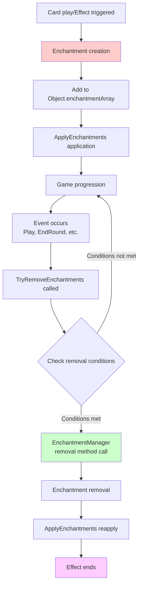
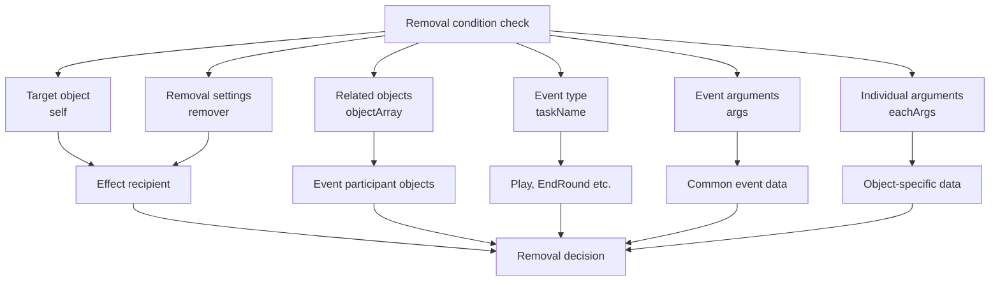
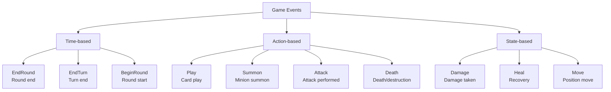

# Enchantment System

## 📋 Overview

The Enchantment System precisely manages the duration and removal conditions of temporary effects in Maple Duel. EnchantmentManager tracks the lifecycle of each enchantment and automatically removes effects based on specific game events or conditions. This system works closely with the Object component's `TryRemoveEnchantments` method to reliably manage complex conditional effects, playing a key role in maintaining the game's strategic depth and balance.

**Related Files**:
- `RootDesk/MyDesk/Components/Managers/EnchantmentManager.mlua` - Enchantment removal condition definitions
- `RootDesk/MyDesk/Components/Objects/Object.mlua` - Enchantment application and removal mechanism
- `RootDesk/MyDesk/Components/Managers/AuraManager.mlua` - Aura-based enchantment generation

## 🏗️ Enchantment Lifecycle System

### From Enchantment Creation to Removal



## ⏰ 1. Time-based Removal System

### End of Round Removal

#### Common Persistent Effects
```lua
-- Focus - Skill cost reduction until next round
method boolean Focus(Player player, table remover, table objectArray, string taskName, table args, table eachArgs)
    if taskName == "EndRound" then
        return true  -- Remove at round end
    end
    
    return false
end

-- ShadowPartner - Skill damage increase until round end
method boolean ShadowPartner(Player player, table remover, table objectArray, string taskName, table args, table eachArgs)
    if taskName == "EndRound" then
        return true
    end
    
    return false
end
```

#### Temporary Enhancement Effects
```lua
-- Haste - Cost reduction until round end
method boolean Haste(Card card, table remover, table objectArray, string taskName, table args, table eachArgs)
    if taskName == "EndRound" then
        return true
    end
    
    return false
end

-- PowerStance - Direct attack immunity until round end
method boolean PowerStance(Player player, table remover, table objectArray, string taskName, table args, table eachArgs)
    if taskName == "EndRound" then
        return true
    end
    
    return false
end
```

**Round-based Removal Characteristics**:
- **Consistent Duration**: Auto-removal at all round ends
- **Predictable**: Players can know exact effect duration
- **Strategic Timing**: Tactical advantage valid only within round

### End of Turn Removal

#### ChunJi - Area Enhancement Effect
```lua
method boolean ChunJi(Minion minion, table remover, table objectArray, string taskName, table args, table eachArgs)
    if taskName == "EndRound" then
        return true
    end
    
    return false
end
```

**Turn/Round Distinction Importance**:
- **EndRound**: After all actions of one player are complete
- **EndTurn**: After a game turn unit is complete
- **Strategic Difference**: Effect value differentiation based on duration

## 🎯 2. Action-based Removal System

### Removal on Specific Actions

#### Reindeer - Removal on Minion Summon
```lua
method boolean Reindeer(Player player, table remover, table objectArray, string taskName, table args, table eachArgs)
    if taskName == "Play" then
        local card = objectArray[1]
        -- Remove only when player summons a minion
        if card.player == player and card.category == "Minion" then
            return true
        end
    end
    
    return false
end
```

**Strategic Significance of Conditional Removal**:
- **Player Choice**: Player decides when to consume the effect
- **Opportunity Cost**: Trade-off between effect duration vs immediate action
- **Interaction**: Opponent's actions don't affect my effects

## 🔧 3. Enchantment Removal Mechanism

### Object Component Removal System

#### Automatic Removal Process
```lua
method void TryRemoveEnchantments(table objectArray, string taskName, table args, table eachArgs)
    if _Table:IsEmpty(self.enchantmentArray) then
        return
    end
    
    local indexArray = {}
    for i, enchantment in ipairs(self.enchantmentArray) do
        local remover = enchantment.remover
        if not remover then
            continue  -- Permanent effects without removal conditions
        end
        
        -- Check removal conditions in EnchantmentManager
        if _Util:Call(self.enchantmentManager, remover.checkerName, {self, remover, objectArray, taskName, args, eachArgs}) then
            table.insert(indexArray, i)
        end
    end
    
    -- Remove target enchantments in reverse order
    if not _Table:IsEmpty(indexArray) then
        for i = #indexArray, 1, -1 do
            table.remove(self.enchantmentArray, indexArray[i])
        end
        self:ApplyEnchantments()  -- Reapply effects
    end
end
```

#### Enchantment Structure
```lua
-- Example enchantment structure
enchantment = {
    methodName = "AddCostEnchantment",  -- Method to apply
    args = {-1},                       -- Method arguments
    remover = {                        -- Removal condition definition
        checkerName = "Focus",         -- EnchantmentManager method name
        -- Additional removal condition data
    }
}
```

**Removal Process Optimization**:
- **Skip Conditionless Effects**: Don't check permanent effects
- **Reverse Order Removal**: Maintain array index integrity
- **Batch Reapply**: Recalculate all effects after all removals

### Removal Condition Parameters

#### Various Context Information


## 🎮 4. Game Event Integration

### Collaboration with TaskManager

#### Event Trigger Points
```lua
-- Example of enchantment removal calls in TaskManager
method void EndRound()
    local objectArray = _Table:ShallowCopy(self.duel.objectArray)
    
    -- Check enchantment removal conditions for all objects
    for _, object in ipairs(objectArray) do
        object:TryRemoveEnchantments(objectArray, "EndRound", {}, {})
    end
    
    -- Other round end processing...
end

method void AfterPlay(Card card)
    local objectArray = _Table:ShallowCopy(self.duel.objectArray)
    
    -- Check enchantment removal after card play
    for _, object in ipairs(objectArray) do
        object:TryRemoveEnchantments(objectArray, "Play", {card}, {})
    end
end
```

### Event Type Classification

#### Major Removal Trigger Events


## 🧠 5. Strategic Enchantment Management

### Game Design of Effect Duration

#### Short-term vs Long-term Effects
```lua
-- Short-term effect - Immediate consumption type (Reindeer)
method boolean Reindeer(Player player, table remover, table objectArray, string taskName, table args, table eachArgs)
    if taskName == "Play" then
        local card = objectArray[1]
        if card.player == player and card.category == "Minion" then
            return true  -- Effect consumed immediately upon minion summon
        end
    end
    return false
end

-- Medium-term effect - Round unit (Focus)  
method boolean Focus(Player player, table remover, table objectArray, string taskName, table args, table eachArgs)
    if taskName == "EndRound" then
        return true  -- Valid only within round
    end
    return false
end

-- Permanent effect - No removal conditions (some aura effects)
-- No method defined in EnchantmentManager
```

**Strategic Considerations**:
- **Timing Management**: Strategic choice of when to use effects
- **Resource Efficiency**: Balance between duration and effect size
- **Interaction**: Impact of other players' actions on my effects

### Complexity of Conditional Removal

#### Multi-condition Check
```lua
-- Complex condition example (hypothetical)
method boolean ComplexEffect(Card card, table remover, table objectArray, string taskName, table args, table eachArgs)
    -- Basic removal at round end
    if taskName == "EndRound" then
        return true
    end
    
    -- Early removal under specific conditions
    if taskName == "Play" then
        local playedCard = objectArray[1]
        -- When opponent plays specific type card
        if playedCard.player ~= card.player and playedCard.category == "Skill" then
            return true
        end
    end
    
    -- Health condition check
    if taskName == "Damage" then
        local target = args[1]
        if target == card.player and target.hp <= target.maxHp * 0.5 then
            return true  -- Remove when player health drops to half or below
        end
    end
    
    return false
end
```

## ⚡ 6. Performance Optimization

### Efficient Removal Checking

#### Filtering Conditionless Effects
```lua
method void TryRemoveEnchantments(table objectArray, string taskName, table args, table eachArgs)
    if _Table:IsEmpty(self.enchantmentArray) then
        return  -- Return immediately for empty array
    end
    
    local indexArray = {}
    for i, enchantment in ipairs(self.enchantmentArray) do
        local remover = enchantment.remover
        if not remover then
            continue  -- Skip permanent effects
        end
        
        -- Check removal conditions only when necessary
        if _Util:Call(self.enchantmentManager, remover.checkerName, {self, remover, objectArray, taskName, args, eachArgs}) then
            table.insert(indexArray, i)
        end
    end
    
    -- Reapply only when there's something to remove
    if not _Table:IsEmpty(indexArray) then
        for i = #indexArray, 1, -1 do
            table.remove(self.enchantmentArray, indexArray[i])
        end
        self:ApplyEnchantments()
    end
end
```

### Batch Processing Optimization

#### Event-based Batch Processing
```lua
-- Batch process all objects in TaskManager
method void ProcessEndRoundEnchantments()
    local objectArray = _Table:ShallowCopy(self.duel.objectArray)
    local objectsToUpdate = {}
    
    -- Stage 1: Identify enchantments to be removed
    for _, object in ipairs(objectArray) do
        local hadEnchantments = not _Table:IsEmpty(object.enchantmentArray)
        object:TryRemoveEnchantments(objectArray, "EndRound", {}, {})
        
        if hadEnchantments then
            table.insert(objectsToUpdate, object)
        end
    end
    
    -- Stage 2: Follow-up processing like UI updates only for changed objects
    for _, object in ipairs(objectsToUpdate) do
        object:UpdateVisualEffects()
    end
end
```

## 🎯 7. Debugging and Monitoring

### Enchantment State Tracking

#### Debug Information Provision
```lua
-- Development enchantment state check method
method table GetEnchantmentInfo(Object object)
    local info = {
        totalEnchantments = #object.enchantmentArray,
        permanentEffects = 0,
        temporaryEffects = 0,
        removalConditions = {}
    }
    
    for _, enchantment in ipairs(object.enchantmentArray) do
        if enchantment.remover then
            info.temporaryEffects += 1
            table.insert(info.removalConditions, enchantment.remover.checkerName)
        else
            info.permanentEffects += 1
        end
    end
    
    return info
end
```

### Removal Log System

#### Effect Removal Tracking
```lua
-- Log removal events in debug mode
method boolean Focus(Player player, table remover, table objectArray, string taskName, table args, table eachArgs)
    if taskName == "EndRound" then
        if _Debug.EnchantmentLogging then
            print(string.format("Focus enchantment removed from %s at EndRound", player.Entity.Name))
        end
        return true
    end
    
    return false
end
```

## 💡 Code References

Enchantment System core logic:
- `EnchantmentManager.mlua :: Focus()` — Round end-based removal
- `EnchantmentManager.mlua :: Reindeer()` — Action-based conditional removal
- `Object.mlua :: TryRemoveEnchantments()` — Automatic removal mechanism
- `Object.mlua :: ApplyEnchantments()` — Effect reapplication after removal
- `TaskManager.mlua :: EndRound()` — Event-based removal trigger

The Enchantment System precisely manages temporary effects in Maple Duel, increasing the game's strategic complexity while providing predictable rules that allow players to make tactical plans considering effect duration.
