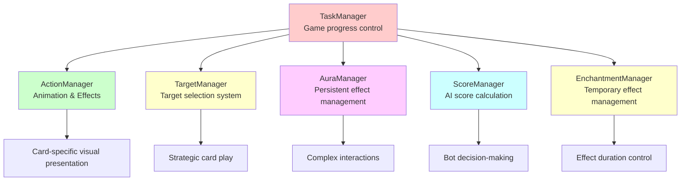
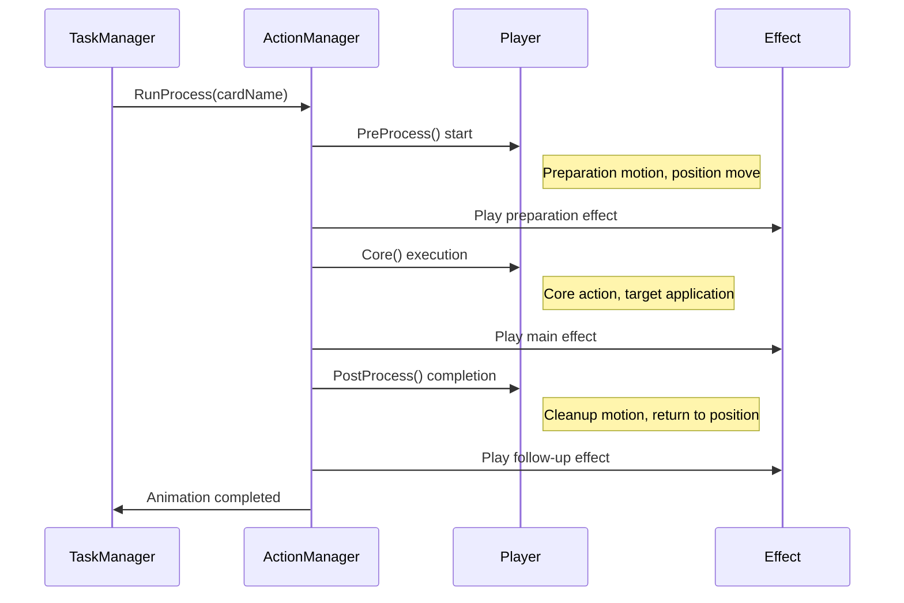
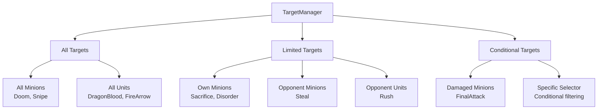
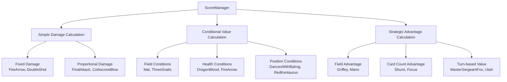
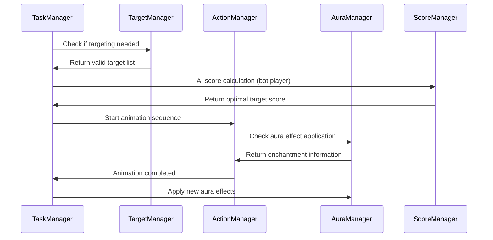

# Gameplay Manager

## 📋 Overview

Gameplay managers are the core systems that compose the actual gameplay experience of Maple Duel. ActionManager precisely manages animation and effect sequences for over 200 cards, AuraManager applies complex persistent effects in real-time, and TargetManager provides an intuitive targeting system. ScoreManager builds a sophisticated evaluation system for bot AI decision-making, while EnchantmentManager controls the lifecycle of temporary effects. These work closely with TaskManager to provide smooth and strategic gameplay experience.

**Related Files**:
- `RootDesk/MyDesk/Components/Managers/ActionManager.mlua`
- `RootDesk/MyDesk/Components/Managers/AuraManager.mlua`
- `RootDesk/MyDesk/Components/Managers/EnchantmentManager.mlua`
- `RootDesk/MyDesk/Components/Managers/TargetManager.mlua`
- `RootDesk/MyDesk/Components/Managers/ScoreManager.mlua`

## 🏗️ Gameplay Manager Architecture

### Manager Integration System



## 🎬 1. ActionManager - Animation & Effects Manager

### Card-specific Visual Presentation System

#### Process Delay System
```lua
method void OnBeginPlay()
    self.processDelayTable = {
        AirStrike = 3.96,
        ArmorCrash = 1.52,
        ArrowBomb = 1,
        ArrowRain = 3.28,
        AthenaPierce = 1,
        Avenger = 2.32,
        -- ... Delay times for 200+ cards
    }
    
    self.coreDelayTable = {
        ArrowBlow = 0.25,
        ArrowBomb = 0.15,
        ArrowRain = 0.25,
        Assaulter = 0.33,
        -- ... Delays for core actions
    }
end
```

**Precise Timing Control**:
- **Card-specific Custom Delays**: Timing suited to each card's visual characteristics
- **Process Separation**: Management by PreProcess, Core, PostProcess stages
- **Consistency Guarantee**: All players have identical visual experience

#### Complex Animation Sequences

##### Genesis Card Example - Large-scale Skill Presentation
```lua
@ExecSpace("ClientOnly")
method void PreProcessGenesis()
    local player = self.triggerManager.receiver.player
    local resource = self.resourceManager:GetResource("Genesis")
    
    -- 1. Player front placement
    player:PlaceFront()
    _Tween:MoveTo(player.actor.Entity, Vector2.zero, 0.25, EaseType.CubicEaseOut, true)
    wait(0.25)
    
    -- 2. Skill preparation motion
    player:Animate("Alert")
    _Effect:PlaySkillEffectAttached(resource.skillAnimation_1, player, 0.001 * Vector3.back, nil)
    _Effect:PlaySkillEffectAttached(resource.skillAnimation_2, player, Vector3.zero, nil)
    _SoundService:PlaySound(resource.skillSound_1, 1)
    
    -- 3. Multiple effect generation
    local animationArray = {resource.extraAnimation_1, resource.extraAnimation_2, resource.extraAnimation_3}
    local effectPosition = Vector3(0, 0, 900)
    _TimerService:SetTimerOnce(function()
        for i = 1, 3 do
            for j = 1, 5 do
                effectPosition.x = _UtilLogic:RandomDouble() * 10 - 5
                effectPosition.y = _UtilLogic:RandomDouble() * 2 - 2
                _Effect:PlayEffect(_Table:GetRandomElement(animationArray), effectPosition, nil, _Effect:GetUnitLayerOptions(nil))
                effectPosition.z -= 0.001
            end
            wait(0.05)
        end
    end, 0)
end
```

**Advanced Presentation Techniques**:
- **Multi-stage Animation**: Preparation → Execution → Cleanup
- **Dynamic Effect Generation**: Multiple effects at random positions
- **Timing Synchronization**: Maximize immersion through precise time control

### Stage-by-stage Processing

#### 3-stage Animation Pipeline


#### Specialized Processing by Effect Type

**Skill Effects**:
```lua
-- Targeted skill (Flamethrower)
_Effect:PlayHitEffect(resource.hitAnimation_1, minion, Vector3.zero, player, nil)

-- Area skill (Genesis)  
_Effect:PlaySkillEffect(resource.skillAnimation_1, player, Vector3.zero, {FadeOut = true})

-- Attached effect (Enhancement effect)
_Effect:PlaySkillEffectAttached(resource.skillAnimation_1, player, Vector3(0.42, 0.28, 0), nil)
```

## 🌟 2. AuraManager - Persistent Effect Manager

### Aura Effect System

#### Card-specific Aura Definitions
```lua
-- Cost reduction aura (Shumi)
method table ShumiEnchantments()
    return {
        {methodName = "AddCostEnchantment", args = {-1}}
    }
end

method table ShumiTargets(Minion minion)
    return minion.player.hand:GetCards(self.taskManager.minionSelector)
end

-- Conditional attack increase (Chicken)
method table ChickenEnchantments()
    return {
        {methodName = "AddAtkEnchantment", args = {3}}
    }
end

method table ChickenTargets(Minion minion)
    if minion:IsDamaged() then
        return {minion}
    end
end
```

**Aura System Characteristics**:
- **Dynamic Target Selection**: Target changes based on conditions
- **Various Enchantments**: Cost, attack, skill damage modification
- **Real-time Application**: Immediate response to game situation changes

#### Complex Conditional Auras

##### Panda - Conditional Cost Reduction
```lua
method table PandaEnchantments(Card card)
    return {
        {methodName = "AddCostEnchantment", args = {-self.history:GetThisRoundMinionCountByTag(card.player, "Pet")}}
    }
end

method table PandaTargets(Card card)
    return {card}
end
```

**Advanced Condition Processing**:
- **Dynamic Value Calculation**: Effect size determined by game state
- **Tag-based Calculation**: Effect based on specific tag minion count
- **Round-by-round Tracking**: Integration with History manager

### Aura Application and Removal

#### Target Verification System
```lua
method table GetTargets(any object, string auraName)
    -- Minions must be on field
    if object:IsMinion() then
        if not isvalid(object.field) then
            return {}
        end
    -- Cards must be in hand or deck
    elseif object:IsCard() then
        if not isvalid(object.hand) and not isvalid(object.deck) then
            return {}
        end
    end
    
    return _Util:Call(self, auraName .. "Targets", {object}) or {}
end
```

## 🎯 3. TargetManager - Target Selection Manager

### Targeting System

#### Card-specific Target Range Definition
```lua
-- All minions target (common single target skill)
method table Doom(Card card)
    return self.duel:GetMinions(nil)
end

-- All units target (including players)
method table DragonBlood(Card card)
    return self.duel:GetUnits()
end

-- Limited targets (own minions only)
method table Sacrifice(Card card)
    return card.player.field:GetMinions(nil)
end

-- Conditional targets (damaged minions only)
method table FinalAttack(Card card)
    return self.duel:GetMinions(self.taskManager.damagedSelector)
end
```

#### Dynamic Target Verification
```lua
@ExecSpace("ServerOnly")
method table GetCardTargetables(Card card)
    local targetableArray = _Util:Call(self, card.name, {card})
    if targetableArray then
        local ret = {}
        for _, targetable in ipairs(targetableArray) do
            if targetable:IsTargetable(card.player) then
                table.insert(ret, targetable)
            end
        end
        return ret
    else
        return {}
    end
end
```

**Server-side Verification**:
- **Double Verification**: Basic target pool + actual targeting possibility check
- **Cheat Prevention**: Final target verification only on server
- **Real-time Updates**: Target list updates based on game situation changes

### Targeting Pattern Classification

#### Classification by Target Range


## 🤖 4. ScoreManager - AI Score Calculation System

### Bot Decision-making Support

#### Card-specific Score Calculation
```lua
-- Basic score calculation
method number GetScore(Card card, Unit target, Minion pivot)
    return _Util:Call(self, card.name, {card, target, pivot}) or 1
end

-- PowerStrike score calculation - Complex damage calculation
method number PowerStrike(Card card, Minion target, Minion pivot)
    local sign = target.player == card.player and -1 or 1 
    local damage = 5 + card.player.skillDamage
    local value
    
    if 3 <= target.hp and target.hp <= damage then
        value = 2  -- Certain elimination
    elseif target.hp > damage then
        value = 1  -- Damage only
    else
        value = 0  -- Excessive damage
    end
    
    return sign * value - 1
end
```

#### Strategic Score Calculation

##### Situation-aware AI
```lua
-- Conditional score calculation (Mai)
method number Mai(Card card, Unit target, Minion pivot)
    return #card.player.field:GetMinions(nil) >= 1 and 1 or -1
end

-- Field advantage calculation (Griffey)
method number Griffey(Card card, Unit target, Minion pivot)
    return #card.player.opponent.field:GetMinions(nil) - #card.player.field:GetMinions(nil)
end

-- Position-based calculation (DancesWithBalrog)
method number DancesWithBalrog(Card card, Unit target, Minion pivot)
    return card.player.field:GetRightmostMinion() == pivot and 1 or 0
end
```

**AI Calculation Elements**:
- **Ally/Enemy Distinction**: Reverse value with sign variable for enemy/ally
- **Efficiency Evaluation**: Damage-to-health ratio calculation
- **Strategic Value**: Comprehensive evaluation of field situation, position, conditions
- **Risk Management**: Prevent over-investment or waste

### Score System Patterns

#### Score Calculation Classification


## ⚡ 5. EnchantmentManager - Temporary Effect Manager

### Enchantment Lifecycle Management

#### Removal Condition System
```lua
-- Remove at round end (Focus)
method boolean Focus(Player player, table remover, table objectArray, string taskName, table args, table eachArgs)
    if taskName == "EndRound" then
        return true  -- Removal condition met
    end
    
    return false
end

-- Remove on specific action (Reindeer)
method boolean Reindeer(Player player, table remover, table objectArray, string taskName, table args, table eachArgs)
    if taskName == "Play" then
        local card = objectArray[1]
        if card.player == player and card.category == "Minion" then
            return true  -- Remove when minion played
        end
    end
    
    return false
end
```

**Removal Condition Patterns**:
- **Time-based**: Round/turn end timing
- **Action-based**: Specific card play, attack, etc.
- **State-based**: Health change, position movement, etc.

## 🔄 6. Inter-Manager Collaboration System

### Integrated Gameplay Flow

#### Manager Coordination During Card Play


### Performance Optimization

#### Lazy Evaluation System
```lua
-- Aura targets calculated only when needed
method table GetTargets(any object, string auraName)
    if not self:IsObjectValid(object) then
        return {}  -- Quick fail
    end
    
    return _Util:Call(self, auraName .. "Targets", {object}) or {}
end

-- Conditional score calculation caching
local scoreCache = {}
method number GetScore(Card card, Unit target, Minion pivot)
    local cacheKey = self:GenerateCacheKey(card, target, pivot)
    if scoreCache[cacheKey] then
        return scoreCache[cacheKey]
    end
    
    local score = _Util:Call(self, card.name, {card, target, pivot}) or 1
    scoreCache[cacheKey] = score
    return score
end
```

## 💡 Code References

Gameplay Manager core logic:
- `ActionManager.mlua :: PreProcessGenesis()` — Large-scale skill animation sequence
- `AuraManager.mlua :: GetTargets()` — Dynamic aura target selection
- `TargetManager.mlua :: GetCardTargetables()` — Server-side target verification
- `ScoreManager.mlua :: PowerStrike()` — Complex AI score calculation
- `EnchantmentManager.mlua :: Reindeer()` — Conditional effect removal

Gameplay managers are the core systems that implement Maple Duel's strategic depth and visual appeal, providing optimized functionality in their respective specialized areas while organically integrating with each other to create rich and immersive gaming experiences.
