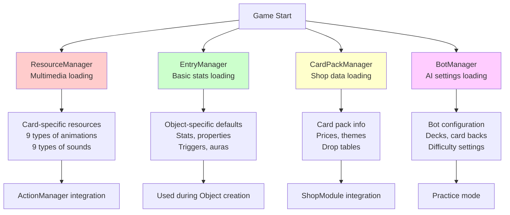
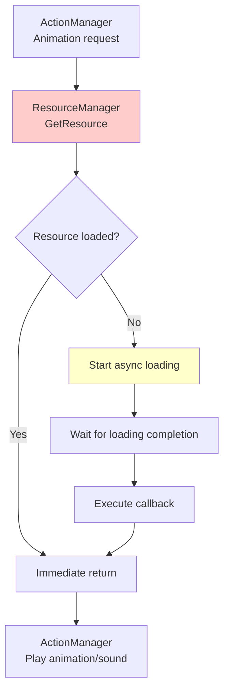
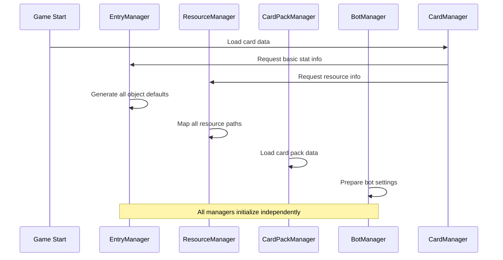
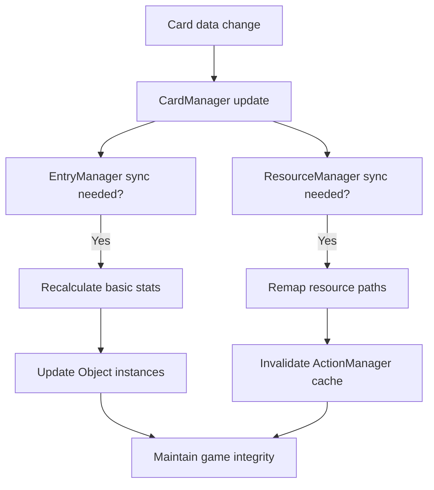

# Resource Manager

## 📋 Overview

The Resource Manager system is a support system that systematically manages all external resources and metadata of Maple Duel. ResourceManager loads and manages over 1000 resources in real-time including animations and sounds for over 200 cards, while EntryManager centralizes basic stats and properties for all game objects. CardPackManager manages complex card pack systems and economic structures, and BotManager defines AI opponent data and behavior. These work together to reliably handle all external dependencies of the game and maximize development efficiency.

**Related Files**:
- `RootDesk/MyDesk/Components/Managers/ResourceManager.mlua` - Multimedia resource management
- `RootDesk/MyDesk/Components/Managers/EntryManager.mlua` - Game object basic data
- `RootDesk/MyDesk/Components/Managers/CardPackManager.mlua` - Card pack system management
- `RootDesk/MyDesk/Components/Managers/BotManager.mlua` - AI bot data management

## 🏗️ Resource Management Architecture

### Integrated Resource System



## 🎨 1. ResourceManager - Multimedia Resource Manager

### Comprehensive Resource Loading System

#### Resource Management by Category
```lua
@ExecSpace("ClientOnly")
method void OnBeginPlay()
    local resourceNameArray = {
        -- UI system resources
        "UI", "GuideModule", "RoomChannelModule", "DeckEditPanel", "CardPanel",
        "CardPackModule", "ShopModule", "RewardModule", "InteractionModule",
        
        -- Global game elements
        "Input", "Emote", "Rank", "Border", "Background", "CardPack", "Deck",
        "Digit", "Notice", "Countdown", "Scope", "Player", "NameTag", "Thumbnail",
        
        -- Gameplay tasks
        "BeginDuel", "EndDuel", "DeclareEndRound", "Battle", "DirectAttack",
        "Damage", "Summon", "Dead", "Transform", "Kick", "Overdraw", "Discard",
    }
    
    -- System resource loading
    for _, name in ipairs(resourceNameArray) do
        self.resourceTable[name] = self[name](self)
        self:LoadResource(name, nil)
    end
end
```

#### Automatic Card-specific Resource Generation
```lua
-- Auto-mapping 9 types of animations and 9 types of sounds for all cards
for _, name in ipairs(self.cardManager:GetAllCardNames()) do
    self.resourceTable[name] = {
        -- Skill animations (3 types)
        skillAnimation_1 = self.cardManager:GetSkillAnimation_1(name),
        skillAnimation_2 = self.cardManager:GetSkillAnimation_2(name), 
        skillAnimation_3 = self.cardManager:GetSkillAnimation_3(name),
        
        -- Projectile animations (3 types)
        ballAnimation_1 = self.cardManager:GetBallAnimation_1(name),
        ballAnimation_2 = self.cardManager:GetBallAnimation_2(name),
        ballAnimation_3 = self.cardManager:GetBallAnimation_3(name),
        
        -- Hit animations (3 types)
        hitAnimation_1 = self.cardManager:GetHitAnimation_1(name),
        hitAnimation_2 = self.cardManager:GetHitAnimation_2(name),
        hitAnimation_3 = self.cardManager:GetHitAnimation_3(name),
        
        -- Special animations (3 types)
        extraAnimation_1 = self.cardManager:GetExtraAnimation_1(name),
        extraAnimation_2 = self.cardManager:GetExtraAnimation_2(name),
        extraAnimation_3 = self.cardManager:GetExtraAnimation_3(name),
        
        -- Sound resources (9 types)
        damageSound = self.cardManager:GetDamageSound(name),
        dieSound = self.cardManager:GetDieSound(name),
        skillSound_1 = self.cardManager:GetSkillSound_1(name),
        skillSound_2 = self.cardManager:GetSkillSound_2(name),
        skillSound_3 = self.cardManager:GetSkillSound_3(name),
        hitSound_1 = self.cardManager:GetHitSound_1(name),
        hitSound_2 = self.cardManager:GetHitSound_2(name),
        hitSound_3 = self.cardManager:GetHitSound_3(name),
        extraSound_1 = self.cardManager:GetExtraSound_1(name),
        extraSound_2 = self.cardManager:GetExtraSound_2(name),
        extraSound_3 = self.cardManager:GetExtraSound_3(name),
    }
end
```

**Resource Slot System**:
- **Systematic Classification**: Resource slots clearly categorized by purpose
- **Expandability**: Support for up to 9 animations and 9 sounds per card
- **Consistency**: All cards have identical resource structure
- **Efficiency**: Only define and use necessary resources

### Dynamic Resource Loading

#### Lazy Loading System
```lua
@ExecSpace("ClientOnly")
method table GetResource(string name)
    return self.resourceTable[name]
end

@ExecSpace("ClientOnly")
method void LoadResource(string name, any callback)
    local resource = self.resourceTable[name]
    if resource then
        -- Asynchronous loading when resource exists
        -- Loading completion notification through callback
    end
end
```

#### Resource Usage Patterns


## 📊 2. EntryManager - Basic Data Manager

### Game Object Basic Settings

#### System Object Defaults
```lua
method table Player()
    return {
        maxHp = 20,          -- Basic health
        atk = 0,             -- Basic attack (players cannot attack directly)
        maxMp = 14,          -- Maximum MP
        skillDamage = 0,     -- Basic skill damage modifier
        isImmuneToDirectAttack = false,  -- Direct attack immunity
        taggedSkillDamageTable = {},     -- Tag-specific skill damage modifiers
        triggerNameArray = {},           -- Player triggers
        auraNameArray = {}              -- Player auras
    }
end

method table Duel()
    return {
        isRandomBattle = false,  -- Random battle mode
        triggerNameArray = {},   -- Game-wide triggers
        auraNameArray = {},      -- Game-wide auras
    }
end
```

#### Container Object Settings
```lua
method table Deck()
    return {
        triggerNameArray = {},  -- Deck level triggers
        auraNameArray = {}      -- Deck level auras
    }
end

method table Hand()
    return {
        triggerNameArray = {},  -- Hand level triggers  
        auraNameArray = {}      -- Hand level auras
    }
end

method table Field()
    return {
        triggerNameArray = {},  -- Field level triggers
        auraNameArray = {}      -- Field level auras
    }
end
```

### Card-specific Basic Data Mapping

#### Card Basic Information
```lua
for _, name in ipairs(self.cardManager:GetAllCardNames()) do
    self.entryTable[name] = {
        cost = self.cardManager:GetCost(name),                    -- MP cost
        maxHp = self.cardManager:GetMaxHp(name),                  -- Maximum health
        atk = self.cardManager:GetAtk(name),                      -- Attack power
        triggerNameArray = self.cardManager:GetCardTriggerNames(name), -- Card triggers
        auraNameArray = self.cardManager:GetCardAuraNames(name)        -- Card auras
    }
end
```

#### Additional Data by Minion
```lua
local category = self.cardManager:GetCategory(name)
if category == "Minion" then
    self.entryTable[name .. "Minion"] = {
        maxHp = self.cardManager:GetMaxHp(name),
        atk = self.cardManager:GetAtk(name),
        hasVenom = self.cardManager:HasVenom(name),               -- Poison possession
        hasChill = self.cardManager:HasChill(name),               -- Freeze possession  
        isDirectAttackable = self.cardManager:IsDirectAttackable(name), -- Direct attack possibility
        isImmuneToStrong = self.cardManager:IsImmuneToStrong(name),     -- Strong attack immunity
        triggerNameArray = self.cardManager:GetMinionTriggerNames(name), -- Minion triggers
        auraNameArray = self.cardManager:GetMinionAuraNames(name)        -- Minion auras
    }
end
```

**Dual Data Structure**:
- **Card Form**: Basic stats and properties when in hand
- **Minion Form**: Additional properties and abilities after summoning to field
- **Data Inheritance**: Basic values inherited from Card → Minion then specialized

## 💰 3. CardPackManager - Card Pack Economy System

### Card Pack Data Structure

#### Theme-based Card Pack Classification
```lua
method void OnBeginPlay()
    self.dataSet = _DataService:GetTable("CardPack")
    
    -- Group card packs by theme
    for _, name in ipairs(self.dataSet:GetColumn("name")) do
        local theme = self:GetTheme(name)
        self.cardPackNameTable[theme] = self.cardPackNameTable[theme] or {}
        table.insert(self.cardPackNameTable[theme], name)
    end
    
    -- Pre-define card placement positions
    self.positionArray = {
        Vector2(0, 2.5),      -- Center
        Vector2(-1, 2.2),     -- Left top
        Vector2(-0.5, 1.1),   -- Left bottom  
        Vector2(0.5, 1.1),    -- Right bottom
        Vector2(1, 2.2)       -- Right top
    }
end
```

#### Price System Management
```lua
-- Price inquiry by currency
method integer GetSinglePrice(string name)
    local currency = self:GetCurrency(name)
    if currency == "Meso" then
        return self:GetSingleMesoPrice(name)
    elseif currency == "WorldCoin" then
        return self:GetSingleWorldCoinPrice(name)
    end
end

method integer GetMultiplePrice(string name)
    local currency = self:GetCurrency(name)
    if currency == "Meso" then
        return self:GetMultipleMesoPrice(name)
    elseif currency == "WorldCoin" then
        return self:GetMultipleWorldCoinPrice(name)
    end
end
```

### Card Pack Generation System

#### Probability-based Card Generation
```lua
@ExecSpace("ServerOnly")
method table GetInfos(string cardPackName)
    local cardPackTheme = self:GetTheme(cardPackName)
    local cardPackQuality = self:GetQuality(cardPackName)  
    local cardPackRarity = self:GetRarity(cardPackName)
    
    local infoArray = {}
    for i = 1, 5 do  -- Generate 5 cards
        local name
        local variant  
        local quality
        
        -- Complex probability calculation logic
        local value = _UtilLogic:RandomDouble()
        
        -- Probability branching by rarity
        -- Card pool selection by theme
        -- Quality variant determination
        
        table.insert(infoArray, {
            name = name,
            variant = variant,
            quality = quality
        })
    end
    
    return infoArray
end
```

**Card Pack Economy Model**:
- **Dual Currency**: Meso (in-game currency) vs WorldCoin (premium currency)  
- **Bulk Purchase Discount**: Different pricing for single vs multiple purchases
- **Theme Classification**: Dedicated packs containing only specific theme cards
- **Quality System**: Normal, Rare, Epic, Unique, Legendary grades

### Visual Card Pack System

#### Card Placement and Presentation
```lua
-- Pre-defined card positions for card pack opening
self.positionArray = {Vector2(0, 2.5), Vector2(-1, 2.2), Vector2(-0.5, 1.1), Vector2(0.5, 1.1), Vector2(1, 2.2)}

-- Z position management for 3D layering
property number zPosition = 3000

-- Performance optimization through pooling
property table cardPackPool = {}
property table thumbnailPool = {}
```

## 🤖 4. BotManager - AI Bot Management System

### Job-specific Practice Bots

#### Starter Deck-based Bot Configuration
```lua
method table PracticeWarriorBot()
    return {
        cardBack = "OrangeMushroom",  -- Bot-exclusive card back
        deckArray = {self.deckManager:GetWarriorStarterDeck(nil)},
        deckIndex = 1,
    }
end

method table PracticeMagicianBot()
    return {
        cardBack = "Yeti",
        deckArray = {self.deckManager:GetMagicianStarterDeck(nil)},
        deckIndex = 1,
    }
end

method table PracticeBowmanBot()
    return {
        cardBack = "StoneSpirit", 
        deckArray = {self.deckManager:GetBowmanStarterDeck(nil)},
        deckIndex = 1,
    }
end
```

#### Special Purpose Bots
```lua
method table TutorialBot()
    return {
        cardBack = "Yeti",
        deckArray = {},  -- Empty deck - dynamically configured in tutorial
        deckIndex = 1,
    }
end
```

**Bot Design Principles**:
- **Educational Purpose**: Representative decks for players to learn each job's characteristics
- **Equal Difficulty**: All job bots provide similar level of challenge
- **Visual Distinction**: Unique card backs for bot identification
- **Expandability**: Easy to add new bot types

### Dynamic Bot Data Access

#### Runtime Bot Data Lookup
```lua
method table GetData(string botName)
    return _Util:Call(self, botName, {})
end
```

**Flexible Bot System**:
- **String-based Access**: Dynamic method calls by bot name
- **Runtime Expansion**: Add new bot types without code changes
- **Data Encapsulation**: Each bot's settings managed independently

## 🔄 5. Inter-Manager Integration System

### Resource Management Workflow

#### Initialization Order at Game Start


#### Runtime Integration Patterns
```lua
-- EntryManager integration during Object creation
method void SetName(string name)
    self.name = name
    self.entry = self.entryManager:GetEntry(self.name)  -- Load defaults
    self.resourceManager:LoadResource(self.name, nil)   -- Load resources
end

-- ResourceManager integration in ActionManager  
method void PreProcessAirStrike()
    local resource = self.resourceManager:GetResource("AirStrike")  -- Resource lookup
    _SoundService:PlaySound(resource.skillSound_1, 1)
    _Effect:PlaySkillEffectAttached(resource.skillAnimation_1, player, Vector3.zero, nil)
end
```

### Data Integrity Assurance

#### Reference Integrity Checking


## ⚡ 6. Performance Optimization

### Memory Efficiency

#### Resource Pooling System
```lua
-- CardPackManager object pooling
property table cardPackPool = {}
property table thumbnailPool = {}

-- Manage reusable UI components in pool
-- Minimize object creation/deletion costs when opening/closing card packs
```

#### Lazy Initialization
```lua
-- EntryManager - Generate all card info once at game start
-- ResourceManager - Async loading at actual usage time
-- CardPackManager - Pre-load only card pack data, generate actual cards when opened
```

### Data Access Optimization

#### Hash-based Fast Lookup
```lua
-- EntryManager 
property table entryTable = {}  -- name -> entry mapping
method table GetEntry(string name)
    return self.entryTable[name]  -- O(1) lookup
end

-- ResourceManager
property table resourceTable = {}  -- name -> resource mapping  
method table GetResource(string name)
    return self.resourceTable[name]  -- O(1) lookup
end
```

## 💡 Code References

Resource Manager core logic:
- `ResourceManager.mlua :: OnBeginPlay()` — Complete resource system initialization
- `EntryManager.mlua :: GetEntry()` — Game object basic data lookup
- `CardPackManager.mlua :: GetInfos()` — Server-side card pack generation logic
- `BotManager.mlua :: GetData()` — Dynamic bot data access
- `ResourceManager.mlua :: GetResource()` — Multimedia resource lookup

Resource managers systematically manage all external resources of Maple Duel to ensure game stability and expandability, automating and abstracting complex resource management so developers can focus on game logic.
