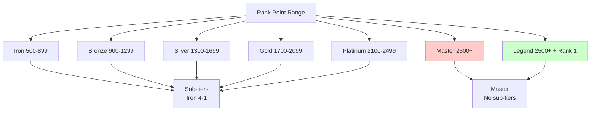
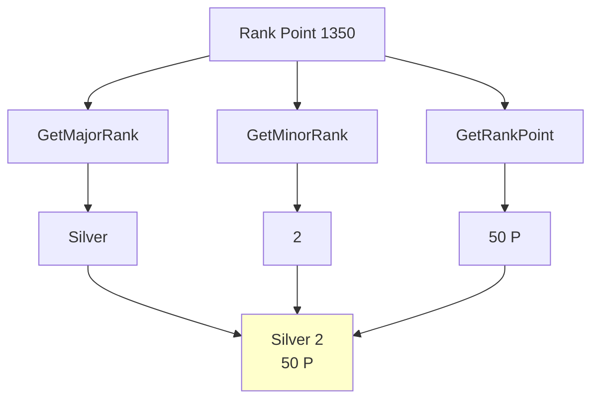
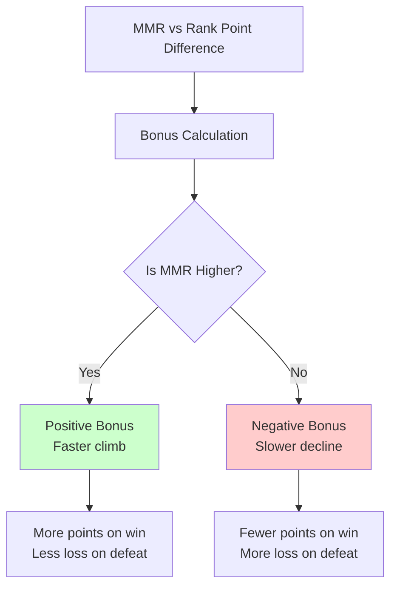
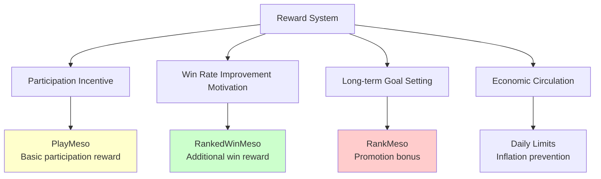
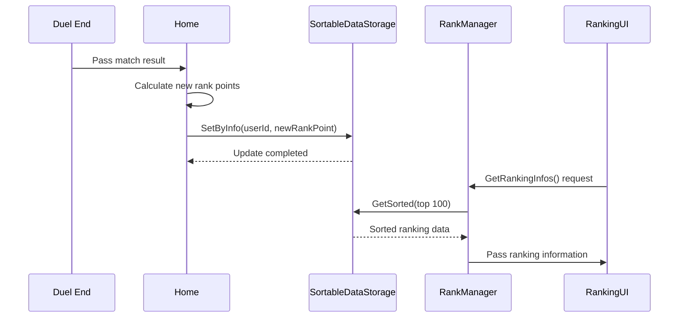

# Ranked Match System

## 📋 Overview

The Ranked Match System is the core of Maple Duel's competitive gameplay, providing a fair and balanced matchmaking environment through an ELO-based MMR (Match Making Rating) system and a 6-tier structure. This system operates tiers from Iron to Legend within the 500~2500 rank point range, stimulating players' continuous competitive spirit through dynamic score adjustment based on wins/losses, daily reward systems, and real-time leaderboards.

**Related Files**:
- `RootDesk/MyDesk/Components/Managers/RankManager.mlua` - Tier system and rank calculation
- `RootDesk/MyDesk/Components/Home.mlua` - ELO matching and rank point updates
- `RootDesk/MyDesk/Logics/Matching.mlua` - Leaderboard system
- `RootDesk/MyDesk/Components/Objects/Duel.mlua` - Match result processing

## 🏗️ Rank System Architecture

### Tier and Rank Structure



## 🏆 1. Tier System

### Major Rank Calculation

#### 6-Tier Structure
```lua
method string GetMajorRank(integer rankPoint, integer ranking)
    -- Legend: 2500+ points + Rank 1
    if rankPoint >= 2500 and ranking > 0 and ranking == 1 then
        return "Legend"
    end
    
    -- Iron~Master: 400 point intervals
    local majorRankArray = {"Iron", "Bronze", "Silver", "Gold", "Platinum", "Master"}
    return majorRankArray[math.floor((math.min(rankPoint, 2500) - 500) / 400) + 1]
end
```

#### Minor Rank Calculation (Sub-tiers)
```lua
method integer GetMinorRank(integer rankPoint)
    local majorRank = self:GetMajorRank(rankPoint, 0)
    
    -- Master, Legend have no sub-tiers
    if majorRank == "Master" or majorRank == "Legend" then
        return
    else
        -- 4-3-2-1 (higher numbers = higher tier)
        return 4 - math.floor(((rankPoint - 500) % 400) / 100)
    end
end
```

### Tier Name and Point Display

#### Integrated Rank Information System


#### Rank Display Logic
```lua
method string GetRankName(integer rankPoint, integer ranking)
    local majorRank = self:GetMajorRank(rankPoint, ranking)
    
    if majorRank == "Master" or majorRank == "Legend" then
        return _LocalizationService:GetText(majorRank)
    else
        return string.format("%s %d", _LocalizationService:GetText(majorRank), self:GetMinorRank(rankPoint))
    end
end

method string GetRankPoint(integer rankPoint)
    local majorRank = self:GetMajorRank(rankPoint, 0)
    local remainder
    
    if majorRank == "Master" or majorRank == "Legend" then
        remainder = rankPoint - 2500  -- Show excess over 2500 for Master+
    else
        remainder = rankPoint % 100   -- Show remainder in 100-unit for regular tiers
    end
    
    return string.format("%d P", remainder)
end
```

## 📊 2. ELO-based Matching System

### MMR and Rank Point Relationship

#### Dual Rating System
```lua
-- Match result processing in Home.mlua
local befMmr = result.befMmr
local afterMmr
if matchResultInfo == nil then
    afterMmr = befMmr  -- Invalid game
else
    if userId == matchResultInfo.Home.UserId then
        afterMmr = matchResultInfo.Home.Score
    else
        afterMmr = matchResultInfo.Away.Score
    end
end

-- Convert MMR to rank points
local targetRankPoint = 2 * (afterMmr - 1500) + 1500
local bonus = math.floor((targetRankPoint - befRankPoint) / 40)
```

**Dual System Advantages**:
- **MMR**: Actual skill-based matching (hidden score)
- **Rank Points**: Score displayed to players
- **Buffer Effect**: Prevents sudden rank fluctuations
- **Accurate Matching**: Minimizes skill differences

### Dynamic Score Adjustment

#### Score Change Calculation by Win/Loss
```lua
local delta
if _UtilLogic:IsNilorEmptyString(winnerUserId) then
    delta = 0  -- Draw
elseif winnerUserId == userId then
    -- Victory: Gain 10~40 points (including bonus)
    delta = math.max(math.min(20 + bonus, 40), 10)
else
    -- Defeat: Lose 10~40 points (including bonus)
    delta = math.min(math.max(-20 + bonus, -40), -10)
end

local afterRankPoint = math.max(befRankPoint + delta, 500)  -- Minimum 500 points guaranteed
```

#### Bonus System


**Bonus System Purpose**:
- **Quick Adjustment**: Fast correction when in wrong tier relative to skill
- **Smurf Prevention**: Prevents skilled players from staying in low tiers
- **Fairness**: Fast climb on winstreaks, gradual decline on loss streaks

## 🎁 3. Reward System

### Multi-layered Reward Structure

#### Match Completion Rewards
```lua
-- Reward calculation in Duel.mlua
local playMesoDelta = 100  -- Basic participation reward

local rankedWinMesoDelta
if isRankedMatch and player == winner then
    rankedWinMesoDelta = math.floor(math.min(
        (hotTime and 1.5 or 1) * 450, 
        math.max(0, 4500 - character:GetDailyRankedWinMeso())
    ))
    character:AddDailyRankedWinMeso(rankedWinMesoDelta)
end
```

#### Daily Activity Rewards
```lua
local rankedPlayMesoDelta
local dailyRankedPlayCount
if isRankedMatch and self.startDate ~= nil and 
   DateTime.UtcNow - DateTime(self.startDate) > TimeSpan(0, 1, 0) and 
   self.history:GetThisGameMp(player) >= 6 then
    
    character:IncreaseDailyRankedPlayCount()
    dailyRankedPlayCount = character:GetDailyRankedPlayCount()
    
    if dailyRankedPlayCount == 1 then
        rankedPlayMesoDelta = 1000    -- First game bonus
    elseif dailyRankedPlayCount == 3 then
        rankedPlayMesoDelta = 2000    -- 3 games achievement
    elseif dailyRankedPlayCount == 6 then
        rankedPlayMesoDelta = 3000    -- 6 games achievement
    end
end
```

### Rank Promotion Rewards

#### Step-by-step Promotion Bonus
```lua
local rankMesoDelta
if isRankedMatch then
    local rankPoint = character.rankPoint
    local topRankPoint = character.topRankPoint
    
    -- 100-point promotion rewards
    local mesoArray = {500, 500, 500, 3000, 500, 500, 500, 5000, 1000, 1000, 1000, 10000, 1000, 1000, 1000, 20000, 3000, 3000, 3000, 40000}
    for i, meso in ipairs(mesoArray) do
        local hurdle = 500 + i * 100
        if topRankPoint < hurdle and hurdle <= rankPoint then
            rankMesoDelta = rankMesoDelta and rankMesoDelta + meso or meso
        end
    end

    if rankPoint > topRankPoint then
        character:SetTopRankPoint(rankPoint)  -- Update highest rank
    end
end
```

### Reward System Analysis

#### Purpose by Reward Type


## 🏅 4. Leaderboard System

### Real-time Ranking Management

#### SortableDataStorage Utilization
```lua
@ExecSpace("ServerOnly")
method void GetRankingInfos()
    local sortableDataStorage = _DataStorageService:GetSortableDataStorage("Ranking")
    local resultCode, pages = sortableDataStorage:GetSortedAndWait(SortDirection.Descending, 0, 100000)
    
    local rankingInfoArray = {}
    local count = 1
    
    while true do
        local items = pages:GetCurrentPageDatas()
        for _, item in pairs(items) do
            local userId = item.KeyInfo.Key
            local nickname = item.KeyInfo.Tag
            local rankPoint = item.Value
            
            table.insert(rankingInfoArray, {
                nickname = nickname, 
                rankPoint = rankPoint, 
                ranking = count
            })
            
            count += 1
            if count > 100 then break end  -- Top 100 only
        end
        
        if count > 100 or pages.IsLastPage then break end
        pages:MoveToNextPageAndWait()
    end
    
    self:GetRankingInfosInSender(rankingInfoArray, senderUserId)
end
```

### Leaderboard Data Management

#### Ranking Update System


## 🔒 5. Match Integrity Assurance

### Game Validity Check

#### Minimum Play Conditions
```lua
-- Only games 1+ minutes long with 6+ MP used count
if isRankedMatch and self.startDate ~= nil and 
   DateTime.UtcNow - DateTime(self.startDate) > TimeSpan(0, 1, 0) and 
   self.history:GetThisGameMp(player) >= 6 then
    
    -- Recognized as valid ranked game
    character:IncreaseDailyRankedPlayCount()
end
```

### Abuse Prevention

#### Score Manipulation Prevention System
```lua
-- Minimum rank point guarantee (cannot drop below 500 points)
local afterRankPoint = math.max(befRankPoint + delta, 500)

-- Score change limits (max ±40 points per game)
delta = math.max(math.min(20 + bonus, 40), 10)      -- Victory
delta = math.min(math.max(-20 + bonus, -40), -10)   -- Defeat
```

## 📈 6. Season System (Expandable)

### Future Expandability Consideration

#### Season Structure Design
```lua
-- Expansion example (not implemented)
method void StartNewSeason()
    -- Reset all players' rank points
    local resetPoint = math.max(500, currentRankPoint * 0.8)
    
    -- Give season rewards
    local seasonReward = self:CalculateSeasonReward(finalRank)
    
    -- Start new season
    self:InitializeSeasonData(newSeasonId)
end
```

#### Meta Changes by Season
- **Card Balance**: Adjust card effects each season
- **New Rewards**: Season-exclusive card backs, titles, etc.
- **Special Events**: Special match modes during season

## 💡 Code References

Ranked Match System core logic:
- `RankManager.mlua :: GetMajorRank()` — Tier calculation logic
- `Home.mlua :: UpdateMatchResult()` — ELO-based rank point calculation
- `Duel.mlua :: EndMatch()` — Match result processing and reward distribution
- `RankManager.mlua :: GetRankingInfos()` — Real-time leaderboard management
- `Matching.mlua :: GetOrCreateLeaderBoard()` — Leaderboard system initialization

The Ranked Match System is the core system supporting Maple Duel's competitive gameplay, inducing players' continuous participation and skill improvement through fair ELO-based matching and multi-layered reward structures, while being built with expandable design to easily integrate future season systems or additional features.
