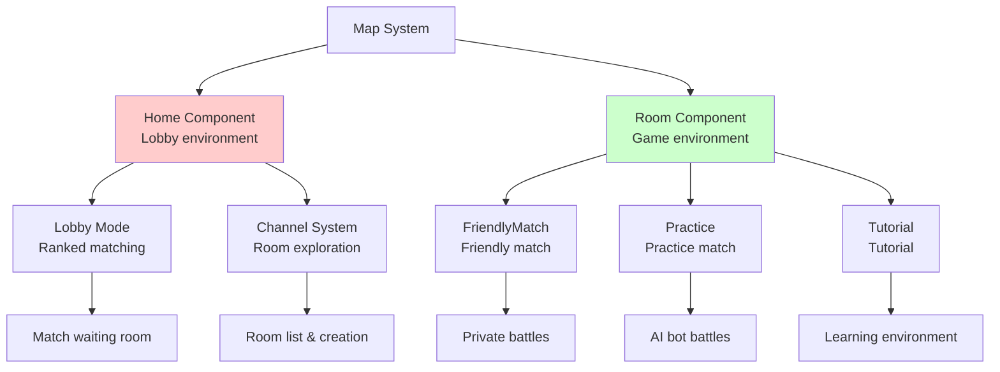
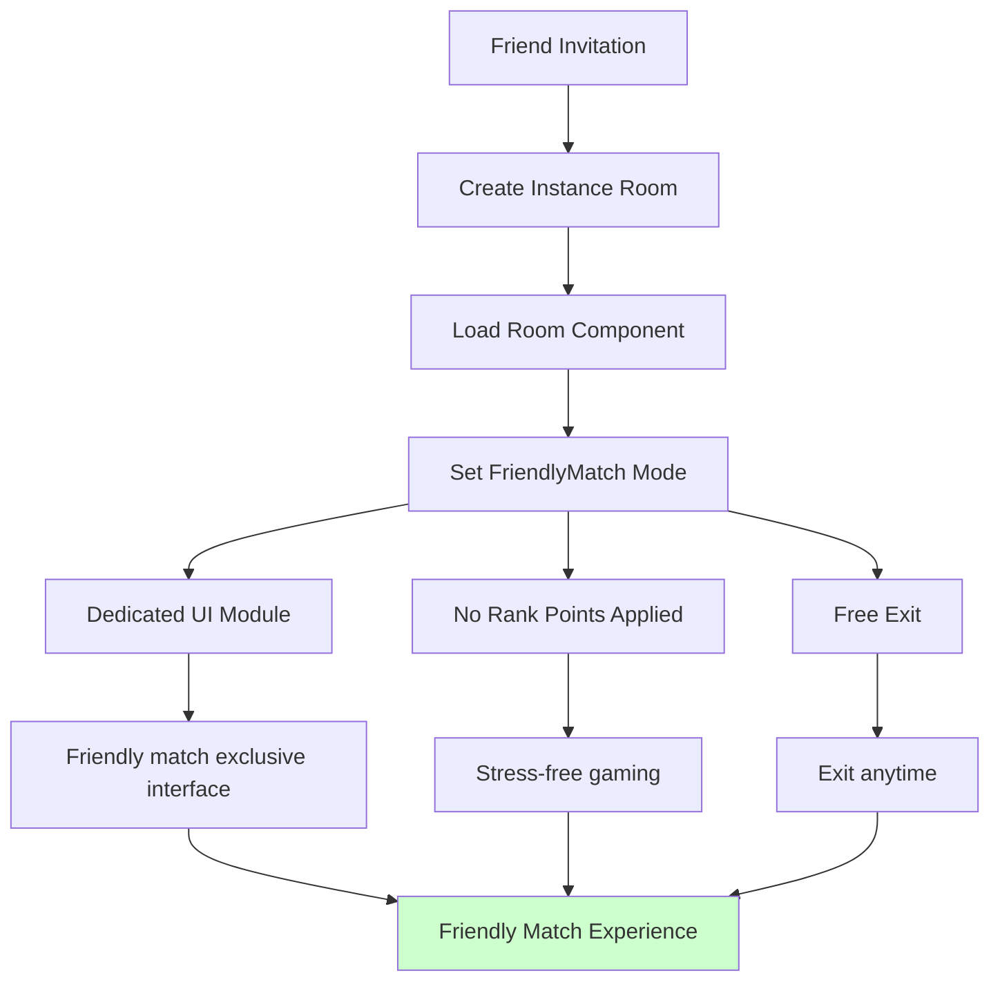
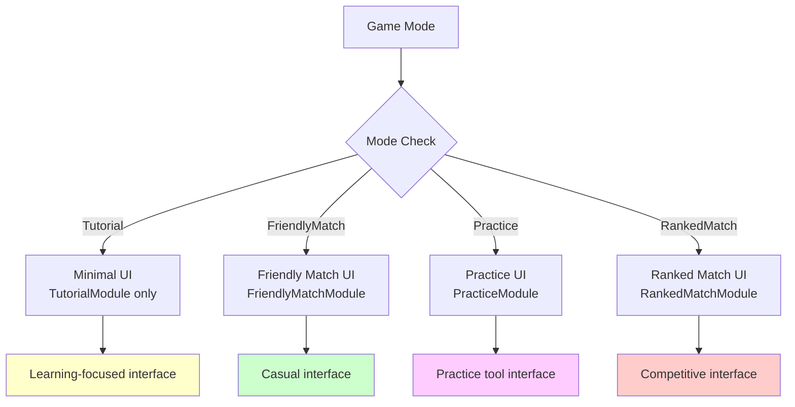

# Room System

## 📋 Overview

The Room System is a flexible instance management system for Maple Duel's friendly matches and various game modes. Through Room and Home components, it supports various game modes including friendly matches, practice matches, and tutorials, providing optimized environments for each mode through channel-based user management and dynamic UI module loading. This system integrates with MapleStory Worlds' instance room functionality to provide isolated gaming environments, ensuring private battles between friends or safe environments for learning purposes.

**Related Files**:
- `RootDesk/MyDesk/Components/Room.mlua` - Friendly match room management
- `RootDesk/MyDesk/Components/Home.mlua` - Lobby and channel system  
- `RootDesk/MyDesk/Components/UIs/RoomChannelModule.mlua` - Room/channel UI management
- `RootDesk/MyDesk/Components/UIs/FriendlyMatchModule.mlua` - Friendly match dedicated UI

## 🏗️ Room System Architecture

### Environment Separation by Game Mode



## 🏠 1. Home Component - Lobby System

### Lobby Environment Management

#### Lobby Mode Initialization
```lua
@ExecSpace("Client")
method void OnSyncProperties()
    __base:OnSyncProperties()
    
    if _UtilLogic:IsNilorEmptyString(self.mode) then
        return
    end
    
    -- Basic UI modules
    self.uiManager:SpawnAndSetModule("GalleryModule", self.Entity)
    self.uiManager:SpawnAndSetModule("CardModule", self.Entity)
    self.uiManager:SpawnAndSetModule("ShopModule", self.Entity)
    self.uiManager:SpawnAndSetModule("CardPackModule", self.Entity)
    self.uiManager:SpawnAndSetModule("RoomChannelModule", self.Entity)
    self.uiManager:SpawnAndSetModule("GuideModule", self.Entity)
    
    if self.mode == "Lobby" then
        -- Lobby-exclusive modules
        self.uiManager:SpawnAndSetModule("LobbyModule", self.Entity)
        self.uiManager:SpawnAndSetModule("RankedMatchModule", self.Entity)
        self.uiManager:SpawnAndSetModule("RankingModule", self.Entity)
        self.uiManager:SpawnAndSetModule("NoticeModule", self.Entity)
        self.uiManager:SpawnAndSetModule("RewardModule", self.Entity)
        self.uiManager:SpawnAndSetModule("EventModule", self.Entity)
    end
end
```

### Channel System

#### Channel-based Room Management
```lua
property table channel = nil  -- Current channel information

method table GetProperties()
    local propertyTable = {
        channel = self.channel,
    }
    
    _Table:Assign(__base:GetProperties(), propertyTable)
    
    return propertyTable
end
```

**Channel System Features**:
- **Room Exploration**: Provide active room list within channel
- **User Distribution**: Manage user count per channel
- **Performance Optimization**: Load balancing by channel
- **Social Features**: Interaction between players in same channel

## 🎮 2. Room Component - Game Environment

### UI Configuration by Game Mode

#### Dynamic Module Loading System
```lua
@ExecSpace("Client") 
method void OnSyncProperties()
    __base:OnSyncProperties()
    
    if _UtilLogic:IsNilorEmptyString(self.mode) then
        return
    end
    
    -- Common UI modules
    self.uiManager:SpawnAndSetModule("GalleryModule", self.Entity)
    
    if self.mode == "Tutorial" then
        -- Tutorial-exclusive environment
        self.uiManager:SpawnAndSetModule("TutorialModule", self.Entity)
    else
        -- Regular game environment
        self.uiManager:SpawnAndSetModule("NoticeModule", self.Entity)
        self.uiManager:SpawnAndSetModule("RewardModule", self.Entity)
        self.uiManager:SpawnAndSetModule("EventModule", self.Entity)
        
        self.uiManager:SpawnAndSetModule("DuelModule", self.Entity)
        self.uiManager:SpawnAndSetModule("PlayerModule", self.Entity)
        
        self.uiManager:SpawnAndSetModule("CardModule", self.Entity)
        self.uiManager:SpawnAndSetModule("ShopModule", self.Entity)
        self.uiManager:SpawnAndSetModule("CardPackModule", self.Entity)
    end
    
    self.uiManager:SpawnAndSetModule("GuideModule", self.Entity)
    
    -- Mode-specific specialized UI
    self:LoadModeSpecificUI()
end
```

#### Mode-specific Specialized UI Loading
```lua
method void LoadModeSpecificUI()
    if self.mode == "FriendlyMatch" then
        self.uiManager:SpawnAndSetModule("FriendlyMatchModule", self.Entity)
        self.duel.mainModule = self.uiManager.FriendlyMatchModule
        self.uiManager.LocationModule:SetFriendlyMatch()
        
    elseif self.mode == "Practice" then
        self.uiManager:SpawnAndSetModule("PracticeModule", self.Entity)
        self.duel.mainModule = self.uiManager.PracticeModule
        self.uiManager.LocationModule:SetPractice()
        
    elseif self.mode == "RankedMatch" then
        self.uiManager:SpawnAndSetModule("RankedMatchModule", self.Entity)
        self.duel.mainModule = self.uiManager.RankedMatchModule
        self.uiManager.LocationModule:SetRankedMatch()
    end
end
```

### Room Property Management

#### Room Information Synchronization
```lua
property table room = nil  -- Room-related information

method table GetProperties()
    local propertyTable = {
        room = self.room,
    }
    
    _Table:Assign(__base:GetProperties(), propertyTable)
    
    return propertyTable
end
```

## 🤝 3. Friendly Match System

### Friendly Match Specialized Features

#### Private Battle Environment


#### Friendly Match Module Features
- **Unofficial Game**: No impact on rank points or official records
- **Friends Only**: Only invited people can enter
- **Free Environment**: No penalties for leaving mid-game
- **Learning Purpose**: Experimenting with new strategies or fun battles with friends

### Room Creation and Participation

#### Instance Room Utilization
```lua
-- Follow friend feature in Character.mlua
local warpRecord = _TeleportService:GetWarpRecord(self.Entity.Name)
if warpRecord ~= nil and not _UtilLogic:IsNilorEmptyString(warpRecord.Data) and not _RoomService:IsInstanceRoom() then
    local friend = _MSON:FastStringToAny(warpRecord.Data)
    local room = friend.location.room
    if _RoomService.InstanceRooms[room.key] then
        _RoomService:MoveUserToInstanceRoom(room.key, self.Entity.Name)
        return
    end
end
```

**Instance Room Advantages**:
- **Isolated Environment**: No interference from other players
- **Personalization**: Possible room settings and rule customization
- **Stability**: Room disconnection doesn't affect other rooms
- **Expandability**: Future tournament or event mode support

## 🤖 4. Practice System

### Practice Environment with AI Bots

#### Practice Mode Specialization
```lua
if self.mode == "Practice" then
    self.uiManager:SpawnAndSetModule("PracticeModule", self.Entity)
    self.duel.mainModule = self.uiManager.PracticeModule
    self.uiManager.LocationModule:SetPractice()
end
```

#### Practice Match Features
- **AI Opponents**: Battle against bots of various difficulties
- **Skill Improvement**: Practice strategies without rank pressure
- **Job Learning**: Understanding characteristics of each job
- **Unlimited Challenge**: Unlimited repetitive practice without restrictions

### Tutorial System

#### New Player Onboarding
```lua
if self.mode == "Tutorial" then
    self.uiManager:SpawnAndSetModule("TutorialModule", self.Entity)
else
    -- Regular game UI loading
    self.uiManager:SpawnAndSetModule("NoticeModule", self.Entity)
    // ... Other modules
end
```

**Tutorial Environment**:
- **Step-by-step Learning**: From basic rules to advanced strategies
- **Guide System**: Situation-specific hints and explanations
- **Safe Environment**: Learning space without pressure from mistakes
- **Progress Saving**: Continue learning after interruption

## 🔧 5. UI Module System

### UI Optimization by Mode

#### Dynamic UI Configuration


### Common Modules and Dedicated Modules

#### Efficient Resource Management
- **Common Modules**: GalleryModule, GuideModule, etc. used in all modes
- **Game Modules**: CardModule, DuelModule, etc. related to actual gameplay
- **Dedicated Modules**: Modules providing only mode-specific features
- **Conditional Loading**: Load only necessary modules for memory efficiency

## 🌐 6. Channel and Room Navigation System

### RoomChannelModule Integration

#### Room List and Creation
```lua
-- Activate RoomChannelModule in Home.mlua
self.uiManager:SpawnAndSetModule("RoomChannelModule", self.Entity)
```

#### Channel System Features
- **Channel Selection**: Players can move to desired channel
- **Room Navigation**: Check active room list in current channel
- **Room Creation**: Create new friendly match rooms and invitations
- **User Management**: Display user count and status per channel

### Room State Management

#### Real-time Room Information
```lua
property table matchUserInfos = {}  -- Match participant information
property boolean isEndMatch = false  -- Game end state
```

**Room State Information**:
- **Participant List**: Players currently in room
- **Game Progress State**: Waiting/In Progress/Ended
- **Room Settings**: Mode, time limit, other rules
- **Host Authority**: Room settings change and game start authority

## 🔒 7. Security and Integrity

### Room Access Control

#### Authentication and Permission Management
```lua
-- Allow room access only through friend invitations
if warpRecord ~= nil and not _UtilLogic:IsNilorEmptyString(warpRecord.Data) then
    local friend = _MSON:FastStringToAny(warpRecord.Data)
    -- Process entry after confirming valid invitation
end
```

#### Abuse Prevention
- **Invitation Only**: No random entry, only invited users can access
- **Room Capacity**: Maximum 2 people can enter
- **Timeout**: Inactive rooms automatically cleaned up
- **Report System**: Report and handle inappropriate behavior

### Network Optimization

#### Load Balancing by Instance
- **Independent Processing**: Each room runs in separate instance
- **Resource Isolation**: Problems in one room don't affect other rooms
- **Dynamic Allocation**: Create/remove instances as needed
- **Efficient Synchronization**: Send data only to players within room

## 💡 Code References

Room System core logic:
- `Room.mlua :: OnSyncProperties()` — Mode-specific dynamic UI loading
- `Home.mlua :: OnSyncProperties()` — Lobby environment and channel system  
- `Character.mlua :: Load()` — Instance room access processing
- `Room.mlua :: LoadModeSpecificUI()` — Game mode-specific specialized interface
- `Home.mlua :: GetProperties()` — Channel information synchronization

The Room System is a flexible infrastructure supporting various game modes in Maple Duel, providing optimized gaming environments for each purpose from the private and free environment of friendly matches to systematic learning through tutorials, built with expandable design to easily integrate future new game modes or features.
