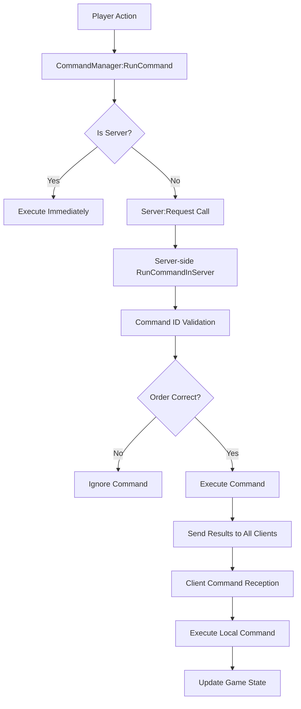

# Command Processing System

## Overview

MapleDuel's command processing system is a core network system responsible for client-server game state synchronization, centered around `CommandManager.mlua`. Due to the nature of turn-based games, all players must maintain identical game states, implementing synchronization through command queues, random seed sharing, and package systems.

## Core Components

### CommandManager.mlua
A manager that converts all game actions into commands and processes them sequentially.

**Main Responsibilities:**
- Client command server transmission
- Server-side command validation and execution
- Shared identical random seeds among all players
- Game state consistency guarantee

```lua
@Component
script CommandManager extends Component

property Duel duel = nil                    -- Duel reference
property table commandQueue = {}            -- Command queue
property integer randomSeed = 0             -- Random seed
property table packageQueue = {}            -- Package queue
property boolean isProcessing = false       -- Processing state
```

## Command Execution System

### Client Command Transmission

```lua
method void RunCommand(string commandName, table publicArgs, table privateArgs)
    if self:IsServer() then
        -- Execute directly on server
        self:RunCommandInServer(commandName, publicArgs, privateArgs, self.duel.commandId)
    else
        -- Send from client to server
        _Server:Request(self, "RunCommandInServer", {commandName, publicArgs, privateArgs, self.duel.commandId})
    end
end
```

### Server-side Command Processing

```lua
@ExecSpace("ServerOnly")
method void RunCommandInServer(string commandName, table publicArgs, table privateArgs, integer commandId)
    -- Command ID validation (order guarantee)
    if commandId ~= self.duel.commandId then
        return -- Ignore incorrect command order
    end
    
    -- Command execution
    local args = publicArgs or {}
    if privateArgs then
        for key, value in pairs(privateArgs) do
            args[key] = value
        end
    end
    
    -- Call actual command method
    local success, result = pcall(_Util.Call, _Util, self, commandName, args)
    if not success then
        log("Command execution failed: " .. commandName .. " - " .. tostring(result))
        return
    end
    
    -- Increment command ID
    self.duel.commandId += 1
    
    -- Send execution result to all clients
    self:RunCommandInClients(commandName, publicArgs, commandId, self.duel.Entity.Name)
end
```

### Client Command Reception

```lua
@ExecSpace("Client")
method void RunCommandInClients(string commandName, table publicArgs, integer commandId)
    -- Check command ID synchronization
    if commandId ~= self.duel.commandId then
        -- Store in queue when order mismatch
        table.insert(self.commandQueue, {
            commandName = commandName,
            publicArgs = publicArgs,
            commandId = commandId
        })
        return
    end
    
    -- Execute command
    _Util:Call(self, commandName, publicArgs or {})
    self.duel.commandId += 1
    
    -- Process queued commands
    self:ProcessQueuedCommands()
end
```

## Random Seed Synchronization

### Seed Generation and Sharing

```lua
@ExecSpace("ServerOnly")
method void InitializeRandomSeed()
    -- Generate seed on server
    self.randomSeed = _UserService:GetRandom(1, 2147483647)
    
    -- Send seed to all clients
    self:SyncRandomSeed(self.randomSeed, self.duel.Entity.Name)
end

@ExecSpace("Client")
method void SyncRandomSeed(integer seed)
    self.randomSeed = seed
    _UserService:SetRandomSeed(seed)
end
```

### Synchronized Random Usage

```lua
method integer GetSyncedRandom(integer min, integer max)
    -- All clients generate identical random values
    local value = _UserService:GetRandom(min or 1, max or 100)
    
    -- Update seed state (for next random)
    self.randomSeed = _UserService:GetCurrentSeed()
    
    return value
end

method string GetRandomCardFromDeck()
    local deckSize = #self.duel.player1.deck.cardArray
    if deckSize == 0 then return nil end
    
    -- Select card with synchronized random
    local randomIndex = self:GetSyncedRandom(1, deckSize)
    return self.duel.player1.deck.cardArray[randomIndex]
end
```

## Package System

### Command Packaging

Complex game actions are divided into multiple commands and managed as packages.

```lua
method void StartPackage(string packageName)
    self.currentPackage = {
        name = packageName,
        commands = {},
        startTime = _TimerService:GetCurrentTime()
    }
end

method void AddCommandToPackage(string commandName, table args)
    if not self.currentPackage then
        -- Execute immediately if no package
        self:RunCommand(commandName, args)
        return
    end
    
    table.insert(self.currentPackage.commands, {
        commandName = commandName,
        args = args
    })
end

method void ExecutePackage()
    if not self.currentPackage then return end
    
    -- Execute all commands in package sequentially
    for _, command in ipairs(self.currentPackage.commands) do
        self:RunCommand(command.commandName, command.args)
    end
    
    self.currentPackage = nil
end
```

### Complex Action Processing Example

```lua
method void PlayCard(Card card, Unit target)
    self:StartPackage("PlayCard")
    
    -- 1. Validate card play
    self:AddCommandToPackage("ValidateCardPlay", {
        cardId = card.id,
        targetId = target and target.id or nil
    })
    
    -- 2. Consume mana
    self:AddCommandToPackage("ConsumeMana", {
        amount = card:GetCost()
    })
    
    -- 3. Execute card effect
    self:AddCommandToPackage("ExecuteCardEffect", {
        cardId = card.id,
        targetId = target and target.id or nil
    })
    
    -- 4. Move card to dump
    self:AddCommandToPackage("MoveCardToDump", {
        cardId = card.id
    })
    
    -- Execute package
    self:ExecutePackage()
end
```

## Input State Management

### Player Input Control

```lua
property boolean acceptInput = false
property table inputQueue = {}

method void EnableInput()
    self.acceptInput = true
    self:ProcessQueuedInput()
end

method void DisableInput()
    self.acceptInput = false
end

method boolean ProcessPlayerInput(string inputType, table inputData)
    if not self.acceptInput then
        -- Store in queue when input not allowed
        table.insert(self.inputQueue, {
            type = inputType,
            data = inputData,
            timestamp = _TimerService:GetCurrentTime()
        })
        return false
    end
    
    -- Process by input type
    if inputType == "CardPlay" then
        return self:HandleCardPlay(inputData)
    elseif inputType == "EndTurn" then
        return self:HandleEndTurn(inputData)
    elseif inputType == "TargetSelect" then
        return self:HandleTargetSelect(inputData)
    end
    
    return false
end
```

### Turn-based Input Synchronization

```lua
method void StartPlayerTurn(Player player)
    -- Enable input only for that player
    if _UserService.LocalPlayer.Character.player == player then
        self:EnableInput()
        self.duel.taskManager:SetActivePlayer(player)
    else
        self:DisableInput()
    end
    
    -- Start turn timer
    self:StartTurnTimer(30) -- 30 second limit
end

method void EndPlayerTurn(Player player)
    -- Disable input for all players
    self:DisableInput()
    
    -- Clear input queue
    self.inputQueue = {}
    
    -- Stop turn timer
    self:StopTurnTimer()
end
```

## Network Optimization

### Command Compression

```lua
method table CompressCommand(string commandName, table args)
    -- Compress frequently used commands to short IDs
    local commandMap = {
        PlayCard = "PC",
        EndTurn = "ET", 
        AttackTarget = "AT",
        UseSkill = "US"
    }
    
    local compressedCommand = {
        id = commandMap[commandName] or commandName,
        args = self:CompressArgs(args)
    }
    
    return compressedCommand
end

method table CompressArgs(table args)
    -- Convert object references to IDs
    local compressed = {}
    for key, value in pairs(args) do
        if type(value) == "userdata" and value.id then
            compressed[key] = value.id
        else
            compressed[key] = value
        end
    end
    return compressed
end
```

### Batch Processing

```lua
property table commandBatch = {}
property integer batchTimer = 0

method void BatchCommand(string commandName, table args)
    table.insert(self.commandBatch, {
        commandName = commandName,
        args = args
    })
    
    -- Set batch timer (16ms = 60FPS)
    if self.batchTimer == 0 then
        self.batchTimer = _TimerService:SetTimer(function()
            self:FlushCommandBatch()
        end, 0.016)
    end
end

method void FlushCommandBatch()
    if #self.commandBatch == 0 then return end
    
    -- Send to server in batch
    _Server:Request(self, "RunCommandBatch", {self.commandBatch})
    
    self.commandBatch = {}
    self.batchTimer = 0
end
```

## Error Handling and Recovery

### Command Validation

```lua
method boolean ValidateCommand(string commandName, table args, Player sender)
    -- Basic validation
    if not commandName or not args then return false end
    
    -- Player validation
    if not isvalid(sender) or sender.duel ~= self.duel then return false end
    
    -- Turn validation
    if not self.duel.taskManager:IsPlayerTurn(sender) then return false end
    
    -- Command-specific detailed validation
    if commandName == "PlayCard" then
        return self:ValidateCardPlay(args, sender)
    elseif commandName == "EndTurn" then
        return self:ValidateEndTurn(args, sender)
    end
    
    return true
end
```

### Synchronization Failure Recovery

```lua
method void HandleSyncFailure(string reason)
    log("Sync failure: " .. reason)
    
    -- Request game state resynchronization
    if not self:IsServer() then
        _Server:Request(self, "RequestFullSync", {})
    else
        -- Retransmit full state from server
        self:BroadcastFullGameState()
    end
end

@ExecSpace("ServerOnly")
method void RequestFullSync()
    -- Send current game state to all clients
    local gameState = {
        commandId = self.duel.commandId,
        randomSeed = self.randomSeed,
        player1State = self.duel.player1:GetState(),
        player2State = self.duel.player2:GetState(),
        fieldState = self.duel.field:GetState()
    }
    
    self:SyncFullGameState(gameState, self.duel.Entity.Name)
end
```

## Performance Monitoring

### Command Processing Statistics

```lua
property table commandStats = {}

method void RecordCommandPerformance(string commandName, number executionTime)
    if not self.commandStats[commandName] then
        self.commandStats[commandName] = {
            count = 0,
            totalTime = 0,
            maxTime = 0,
            minTime = math.huge
        }
    end
    
    local stats = self.commandStats[commandName]
    stats.count += 1
    stats.totalTime += executionTime
    stats.maxTime = math.max(stats.maxTime, executionTime)
    stats.minTime = math.min(stats.minTime, executionTime)
end

method table GetPerformanceReport()
    local report = {}
    for commandName, stats in pairs(self.commandStats) do
        report[commandName] = {
            averageTime = stats.totalTime / stats.count,
            maxTime = stats.maxTime,
            minTime = stats.minTime,
            executionCount = stats.count
        }
    end
    return report
end
```

## Command System Flow



This command processing system is the core infrastructure that ensures all players have identical game experiences in MapleDuel's turn-based multiplayer gameplay.
