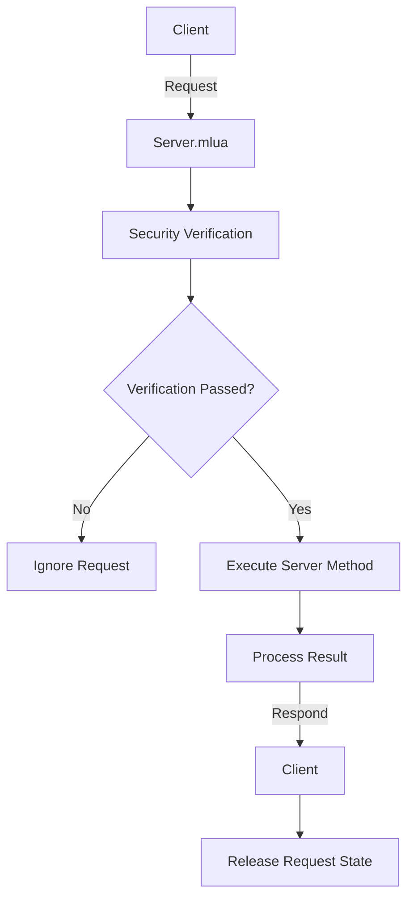

# Server Communication System

## Overview

MapleDuel's server communication system provides safe and reliable communication between client and server through `Server.mlua`. It ensures network stability for multiplayer games through request state management, method security verification, exception handling, and duplicate request prevention.

## Core Components

### Server.mlua
A logic component that centrally manages all communication between client and server.

**Main Responsibilities:**
- Client request reception and routing
- Safe execution of server-side methods
- Request-response state management
- Security verification and exception handling

```lua
@Logic
script Server extends Logic

property boolean isRequesting = false  -- Client request state
property Character sender = nil        -- Current request sender
```

## Communication Architecture

### Request-Response Pattern

MapleDuel structures client-server communication through a clear request-response pattern.



### Client Request System

```lua
@ExecSpace("ClientOnly")
method void Request(Component component, string methodName, table args)
    -- Prevent duplicate requests
    self.isRequesting = true
    
    -- Send request to server
    self:Send(_UserService.LocalPlayer.Character, component, methodName, args)
end
```

**Features:**
- Set `isRequesting` flag when request starts
- Automatic duplicate request prevention
- All requests sent through current player character

### Server Request Processing

```lua
@ExecSpace("Server")
method void Send(Character sender, Component component, string methodName, table args)
    -- Sender validity verification
    if not isvalid(sender) or sender.Entity.Name ~= senderUserId then
        return
    end
    
    -- Method access permission verification
    if not _Util:HasAttribute(component, methodName, "Server") then
        return
    end
    
    -- Set sender (for reference during processing)
    self.sender = sender
    
    -- Safe method execution
    local success, result = pcall(_Util.Call, _Util, component, methodName, args)
    if not success then
        log(result)  -- Error logging
    end
    
    -- Release sender
    self.sender = nil
    
    -- Send response
    if isvalid(sender) then
        self:Respond(senderUserId)
    end
end
```

### Client Response Processing

```lua
@ExecSpace("Client")
method void Respond()
    -- Release request state
    self.isRequesting = false
end
```

## Security and Verification System

### Sender Authentication

```lua
-- Sender validity verification
if not isvalid(sender) or sender.Entity.Name ~= senderUserId then
    return  -- Ignore requests from invalid senders
end
```

**Verification Elements:**
- Sender object validity (`isvalid(sender)`)
- Sender ID and actual user ID match (`sender.Entity.Name == senderUserId`)

### Method Access Permission Verification

```lua
-- Server attribute check
if not _Util:HasAttribute(component, methodName, "Server") then
    return  -- Deny execution of methods without server access permission
end
```

**Server Attribute Example:**
```lua
-- Character.mlua example
method void BuySingleCardPackServerAttribute()
    -- Define server access permission
end

@ExecSpace("ServerOnly")
method boolean BuySingleCardPack(string cardPackName)
    -- Actual server logic
end
```

## Request State Management

### Duplicate Request Prevention

```lua
method boolean IsRequesting()
    if self:IsServer() then
        -- Check if there's a request being processed on server
        return isvalid(self.sender)
    else
        -- Check request state flag on client
        return self.isRequesting
    end
end
```

### Request State Check Usage Example

```lua
-- Prevent duplicate clicks in UI
self.buyButton.Entity:ConnectEvent(ButtonClickEvent, function()
    if _Server:IsRequesting() then
        return  -- Ignore if already processing request
    end
    
    _Server:Request(character, "BuySingleCardPack", {"ClassicGoldEpic"})
end)
```

## Exception Handling System

### Safe Method Execution

```lua
-- Exception handling through pcall
local success, result = pcall(_Util.Call, _Util, component, methodName, args)
if not success then
    log(result)  -- Log detailed error content
    -- Send response even when error occurs to release client waiting state
end
```

**Advantages:**
- System doesn't halt even if server method errors occur
- Client doesn't get stuck in infinite waiting state
- Preserve detailed error information for debugging

### Error Recovery Mechanism

```lua
-- Safe processing even when sender is invalid
if isvalid(sender) then
    self:Respond(senderUserId)
else
    log("Sender invalid during response")
    -- Handle case when client connection is lost
end
```

## Performance Optimization

### Request Queuing System

```lua
-- Expandable request queuing (example)
property table requestQueue = {}
property boolean processingQueue = false

method void QueueRequest(Component component, string methodName, table args)
    if not self.processingQueue then
        -- Process immediately
        self:Request(component, methodName, args)
    else
        -- Add to queue
        table.insert(self.requestQueue, {
            component = component,
            methodName = methodName,
            args = args,
            timestamp = _TimerService:GetCurrentTime()
        })
    end
end
```

### Timeout Processing

```lua
property table requestTimers = {}

method void RequestWithTimeout(Component component, string methodName, table args, number timeout)
    timeout = timeout or 30  -- Default 30 second timeout
    
    -- Send request
    self:Request(component, methodName, args)
    
    -- Set timeout timer
    local timerId = _TimerService:SetTimer(function()
        if self.isRequesting then
            log("Request timeout: " .. methodName)
            self.isRequesting = false
            -- UI feedback on timeout
            _UIManager:ShowTimeoutMessage()
        end
    end, timeout)
    
    self.requestTimers[methodName] = timerId
end
```

## Communication Pattern Use Cases

### Game Action Request

```lua
-- Card play request
_Server:Request(character.player, "PlayCard", {
    cardName = "PowerStrike",
    targetId = enemy.id
})
```

### Shop Purchase Request

```lua
-- Card pack purchase request
_Server:Request(character, "BuySingleCardPack", {
    cardPackName = "ClassicGoldEpic"
})
```

### Friend System Request

```lua
-- Friend request
_Server:Request(character, "SendFriendRequest", {
    targetCharacter = otherCharacter
})
```

### Matchmaking System Request

```lua
-- Ranked match start request
_Server:Request(character, "StartRankedMatch", {})
```

## Debugging and Monitoring

### Request Logging System

```lua
property table requestLog = {}

method void LogRequest(string methodName, table args, Character sender)
    table.insert(self.requestLog, {
        methodName = methodName,
        args = args,
        sender = sender.Entity.Name,
        timestamp = _DateTime:KtcNow():ToString(),
        success = nil  -- Update later
    })
    
    -- Limit log size (keep only recent 1000)
    if #self.requestLog > 1000 then
        table.remove(self.requestLog, 1)
    end
end
```

### Performance Metrics

```lua
property table performanceMetrics = {
    totalRequests = 0,
    successfulRequests = 0,
    failedRequests = 0,
    averageResponseTime = 0
}

method void UpdateMetrics(boolean success, number responseTime)
    self.performanceMetrics.totalRequests += 1
    
    if success then
        self.performanceMetrics.successfulRequests += 1
    else
        self.performanceMetrics.failedRequests += 1
    end
    
    -- Calculate moving average
    local total = self.performanceMetrics.totalRequests
    self.performanceMetrics.averageResponseTime = 
        (self.performanceMetrics.averageResponseTime * (total - 1) + responseTime) / total
end
```

## Network Stability

### Connection Status Check

```lua
method boolean IsConnectionStable()
    -- Check success rate of recent requests
    local recentRequests = self:GetRecentRequests(10)
    local successCount = 0
    
    for _, request in ipairs(recentRequests) do
        if request.success then
            successCount += 1
        end
    end
    
    return successCount / #recentRequests >= 0.8  -- 80% or higher success rate
end
```

### Automatic Retry Mechanism

```lua
method void RequestWithRetry(Component component, string methodName, table args, integer maxRetries)
    maxRetries = maxRetries or 3
    local retryCount = 0
    
    local function attemptRequest()
        self:Request(component, methodName, args)
        
        -- Timer to check response
        _TimerService:SetTimer(function()
            if self.isRequesting and retryCount < maxRetries then
                retryCount += 1
                log("Retrying request: " .. methodName .. " (attempt " .. retryCount .. ")")
                attemptRequest()
            elseif self.isRequesting then
                log("Max retries exceeded for: " .. methodName)
                self.isRequesting = false
            end
        end, 5)  -- Retry after 5 seconds
    end
    
    attemptRequest()
end
```

## Security Enhancement

### Request Frequency Limiting

```lua
property table rateLimiter = {}

method boolean CheckRateLimit(string userId, string methodName)
    local key = userId .. ":" .. methodName
    local now = _TimerService:GetCurrentTime()
    
    if not self.rateLimiter[key] then
        self.rateLimiter[key] = {
            count = 0,
            windowStart = now
        }
    end
    
    local limiter = self.rateLimiter[key]
    
    -- Reset time window (1 minute)
    if now - limiter.windowStart > 60 then
        limiter.count = 0
        limiter.windowStart = now
    end
    
    -- Check request limit (maximum 60 per minute)
    if limiter.count >= 60 then
        return false
    end
    
    limiter.count += 1
    return true
end
```

## Server Communication System Features

### Reliability
- Clear response guarantee for all requests
- Automatic duplicate request prevention
- Stable operation even in exceptional situations

### Security
- Sender authentication and permission verification
- Server attribute-based method access control
- Request frequency limiting and abuse prevention

### Scalability
- Component-based request routing
- Support for various request patterns
- Modular structure for easy expansion

### Debugging Support
- Detailed error logging
- Request tracking and monitoring
- Performance metrics collection

This server communication system safely and efficiently handles all client-server interactions in MapleDuel, providing a core infrastructure for stable multiplayer game experience.
