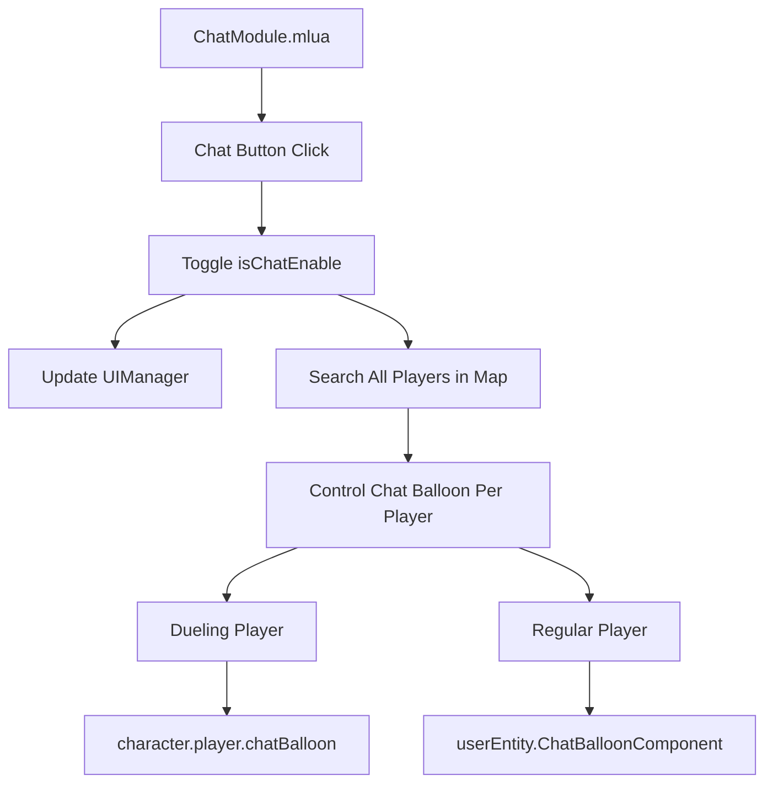

# Chat System

## Overview

Maple Duel's chat system is a feature that supports real-time communication between players. It satisfies various communication requirements through chat balloon display, chat enable/disable settings, and developer command processing.

## Core Components

### ChatModule.mlua
The main UI component of the chat system, providing chat enable/disable toggle functionality.

**Key Features:**
- Chat enable/disable toggle
- Simultaneous control of all players' chat balloons
- Visual indication when chat is disabled

```lua
@Component
script ChatModule extends Component

property boolean isChatEnable = true

@ExecSpace("ClientOnly")
method void OnBeginPlay()
    self.chatButton.Entity:ConnectEvent(ButtonClickEvent, function()
        if _Server:IsRequesting() then
            return
        end
        
        _SoundService:PlaySound(self.resourceManager:GetResource("UI").buttonClickRawSound, 1)
        
        self.isChatEnable = not self.isChatEnable
        self.disableIcon.Entity.Enable = not self.isChatEnable
        self.uiManager:UpdateChat()
        
        -- Control chat balloons for all players in current map
        local currentMap = _UserService.LocalPlayer.CurrentMap
        for _, userEntity in ipairs(_UserService:GetUsersByMapComponent(currentMap.MapComponent)) do
            local character = userEntity.Character
            if isvalid(character.player) then
                character.player.chatBalloon.Enable = self.isChatEnable
                if not self.isChatEnable then
                    character.player:ClearChat()
                end
            else
                userEntity.ChatBalloonComponent.Enable = self.isChatEnable
            end
        end
    end)
end
```

### Chat Balloon System

Chat balloons are speech bubble-type chat UI displayed above characters.

**Key Features:**
- Independent chat balloons for each player
- Separate handling for dueling players vs regular players
- Immediate removal when chat is disabled

**Chat Balloon Control Logic:**
```lua
-- Chat balloon control for dueling players
if isvalid(character.player) then
    character.player.chatBalloon.Enable = self.isChatEnable
    if not self.isChatEnable then
        character.player:ClearChat()  -- Remove chat content immediately
    end
else
    -- Chat balloon control for regular players
    userEntity.ChatBalloonComponent.Enable = self.isChatEnable
end
```

## Developer Command System (Developer.mlua)

### Developer Tools Overview

`Developer.mlua` provides a special command system for game development and debugging. Only users with maker (creator) privileges can access it.

**Key Features:**
- Game data initialization
- Player data management
- Developer logging
- Maker privilege verification

### Maker Privilege Verification

```lua
@ExecSpace("Server")
method void Reset(Character character, string localeId)
    if not isvalid(character) or character.Entity.Name ~= senderUserId then
        return
    end
    
    if not _UserService:IsMakerUserId(character.Entity.Name) then
        return  -- Stop execution if no maker privileges
    end
    
    self:Log("reset start", senderUserId)
    -- Execute initialization logic
end
```

### Data Initialization Feature

**Player Data Initialization:**
```lua
-- Character data initialization
character:Clear(localeId)

-- Delete ranking data
_DataStorageService:DeleteSortableDataStorageAndWait("Ranking")

-- Delete all user data storage
local resultCode, pages = _DataStorageService:GetUserDataStoragePagesAndWait()
if resultCode ~= 0 then
    log(resultCode)
    return
end

while true do
    local datas = pages:GetCurrentPageDatas()
    for _, userDataStorage in pairs(datas) do
        _DataStorageService:DeleteUserDataStorageAndWait(userDataStorage.UserId)
    end
    
    if pages.IsLastPage == true then
        break
    end
    
    local loadResultCode = pages:LoadNextPageAndWait()
    if loadResultCode ~= 0 then
        break
    end
end
```

### Developer Logging System

```lua
@ExecSpace("Client")
method void Log(string message)
    log(message)  -- Output client log
end

-- Logging with user ID tracking on server side
self:Log("reset start", senderUserId)
```

## Chat-Related Player Methods

### Player.mlua Chat Features

Player component manages the display and removal of chat balloons.

**ClearChat Method:**
```lua
-- Implemented in Player.mlua (assumed)
method void ClearChat()
    -- Immediately remove currently displayed chat content
    -- Set chat balloon text to empty string
    -- Stop chat balloon fade-out animation
end
```

## Chat System Architecture

### Client-Server Structure



### State Management

**Chat Enabled State:**
- `isChatEnable = true`: Display all chat balloons
- `disableIcon.Entity.Enable = false`: Hide disable icon

**Chat Disabled State:**
- `isChatEnable = false`: Hide all chat balloons
- `disableIcon.Entity.Enable = true`: Display disable icon
- Remove existing chat content immediately (`ClearChat()` call)

## UI Components

### Chat Button
- **Position**: Fixed position at bottom or side of UI
- **Function**: Toggle chat enable/disable
- **Visual Feedback**: Play sound on click

### Disable Icon
- **Display Condition**: Only shown when chat is disabled
- **Purpose**: Notify user that chat is currently off

### Chat Balloon
- **Position**: Displayed above each character
- **Content**: Chat messages entered by players
- **Control**: Show/hide according to global chat module settings

## Integrated Management System

### UIManager Integration

```lua
-- Update UIManager call from ChatModule
self.uiManager:UpdateChat()
```

UIManager notifies other UI components of chat state changes to synchronize overall UI state.

### Map-based Player Management

```lua
local currentMap = _UserService.LocalPlayer.CurrentMap
for _, userEntity in ipairs(_UserService:GetUsersByMapComponent(currentMap.MapComponent)) do
    -- Control each player's chat balloon
end
```

Controls chat state of all players in the current map simultaneously to provide consistent user experience.

## Developer Tools Chat Command Processing

### Command Parsing and Execution
Developer.mlua can also handle parsing and executing developer commands entered through chat.

**Privilege-based Command Execution:**
1. Check user privileges (`_UserService:IsMakerUserId`)
2. Validate command validity
3. Safe execution on server side
4. Log execution results

## Security and Safety

### Permission Control
- Developer commands restricted to maker privilege users only
- Double security through user ID verification

### Server Request State Check
```lua
if _Server:IsRequesting() then
    return  -- Prevent duplicate requests
end
```

### Safe Data Deletion
- Sufficient validation before data deletion
- Safe bulk data processing through pagination
- Appropriate handling of error situations

This chat system provides smooth communication between players while offering flexibility to control chat when needed and powerful management features through developer tools.
