# Card Management UI

## 📋 Overview

MapleDuel's Card Management UI is an integrated system that supports all card-related activities including checking card collections, editing decks, and opening card packs. Through intuitive grid layout, various filtering options, drag-and-drop deck editing, and spectacular card pack opening presentations, it transforms collection management, the core of card games, into an enjoyable and efficient experience.

**Related Files**: 
- `RootDesk/MyDesk/Components/UIs/CardModule.mlua` (Integrated Manager)
- `RootDesk/MyDesk/Components/UIs/CardPanel.mlua` (Card Collection)
- `RootDesk/MyDesk/Components/UIs/DeckEditPanel.mlua` (Deck Editing)
- `RootDesk/MyDesk/Components/UIs/CardPackModule.mlua` (Card Pack Opening)
- `RootDesk/MyDesk/Components/UIs/DeckMenu.mlua` (Deck Selection)

## 🏗️ Card Management UI Architecture

### Integrated System Structure


### Mode-based UI Switching

#### CardModule Mode System


## 🎴 1. Card Collection System (CardPanel)

### Grid-based Card Display

#### Multi-dimensional Filtering System


#### Class Button System
```lua
-- Event setup for each class button
self.warriorButton.Entity:ConnectEvent(ButtonClickEvent, function()
    self:SetClass("Warrior")
end)

self.magicianButton.Entity:ConnectEvent(ButtonClickEvent, function()
    self:SetClass("Magician")
end)
-- ... Same pattern for other classes
```

**Filtering Features**:
- **Deck Edit Mode**: Display only current deck's class and Common cards
- **Collection Mode**: Display all cards of selected class
- **Unowned Cards**: Distinguished display through transparency adjustment
- **Real-time Updates**: Immediate grid reconstruction on filter changes

### Pagination System

#### Dynamic Page Calculation
```lua
-- Page calculation based on grid size
local totalCards = #self.infoArray
local cardsPerPage = self.gridSize.x * self.gridSize.y
local totalPages = math.ceil(totalCards / cardsPerPage)

-- Page navigation
if self.pageIndex > 1 then
    self.leftArrowButton.Entity.Enable = true
else
    self.leftArrowButton.Entity.Enable = false
end
```

#### Card Grid Layout

```mermaid
graph TB
    A[Page 1] --> B["Cards 1-12<br/> 3x4 Grid"]
    A --> C[← Previous Button<br/> Disabled]
    A --> D[Next Button →]
    
    E[Page 2] --> F["Cards 13-24<br/> 3x4 Grid"]
    E --> G[← Previous Button]
    E --> H[Next Button →]
```


### Card Status Display

#### Visual Status Distinction
- **New Cards**: Marked with NewSign
- **Warning Display**: WarningSign (for cards removed from deck, etc.)
- **Ownership Count**: Display owned quantity with CardCount
- **Selection State**: Highlight currently selected card with SelectedSign

## ⚙️ 2. Deck Editing System (DeckEditPanel)

### Thumbnail-based Deck Management

#### Deck Composition Visualization


#### Deck Editing Interaction
```lua
method void Open()
    -- Clear existing thumbnails
    for _, thumbnail in ipairs(self.thumbnailArray) do
        self:DestroyAnchor(thumbnail)
        thumbnail.Entity:Destroy()
    end
    table.clear(self.thumbnailArray)
    
    -- Copy and display current deck
    local character = _UserService.LocalPlayer.Character
    self.deck = _Table:DeepCopy(character:GetDeck())
    
    -- Update deck information
    self.deckNameText.Text = self.deck.name
    self:SetDeckSize()
    
    -- Create thumbnails
    for _, info in ipairs(self.cardManager:ToInfoArray(self.deck.cardTable)) do
        local thumbnail = _SpawnService:SpawnByModelId(_EntryService:GetModelIdByName("Thumbnail"), "Thumbnail", Vector3.zero, self.Entity).Thumbnail
        table.insert(self.thumbnailArray, thumbnail)
        thumbnail:SetInfo(info)
        -- ... Position setting and event connection
    end
end
```

### Deck Completion Validation

#### Smart Completion System


### Change Tracking

#### isDirty Flag System
```lua
property boolean isDirty = false

-- Automatically set when adding/removing cards
method void AddCardToDeck(info)
    -- Deck card addition logic
    self.isDirty = true
    self:SetDeckSize()
end

method void RemoveCardFromDeck(thumbnail)
    -- Deck card removal logic
    self.isDirty = true
    self:SetDeckSize()
end
```

**Change Confirmation**:
- Save confirmation popup when clicking X button
- Prevent auto-save to avoid unintended changes
- Real-time deck size updates

## 🎁 3. Card Pack Opening System (CardPackModule)

### Step-by-step Opening Presentation

#### Card Pack Opening Flow


#### 5-Card Layout System
```lua
-- Pre-defined card placement positions
self.positionArray = {
    Vector2(0, 2.2),      -- Top center
    Vector2(-2.1, 1.5),   -- Top-left
    Vector2(-1.05, -0.7), -- Bottom-left
    Vector2(1.05, -0.7),  -- Bottom-right
    Vector2(2.1, 1.5)     -- Top-right
}

-- Simultaneous 5-card animation when opening card pack
method void ShowCards(cardInfoArray)
    for i, cardInfo in ipairs(cardInfoArray) do
        local card = self.cardArray[i]
        card:SetBlueprint({
            info = cardInfo,
            enchantmentArray = {},
            independentVariableTable = {}
        })
        
        local targetPosition = self.positionArray[i]
        -- Apply animation per card
        local tweener = _Tween:MoveTo(card.actor.Entity, targetPosition, 0.5, EaseType.CubicEaseOut)
        table.insert(self.cardTweenerArray, tweener)
    end
end
```

### Multi-Card Pack Support

#### Continuous Opening System
- **Count Management**: Repeat for the number of purchased card packs
- **State Preservation**: Block access to other UIs during opening
- **Animation Optimization**: Clear existing tweeners before starting new animation

## 🎯 4. Deck Selection System (DeckMenu)

### Deck Navigation

#### Left/Right Arrow Navigation

```mermaid
graph LR
    A[← Previous Deck] --> B[Current Deck Display]
    B --> C[Next Deck →]
    
    B --> D[Deck Name]
    B --> E[Deck Index]
    B --> F[Deck Preview Image]
    B --> G[Warning Signal]
```


#### Deck Switching Animation
```lua
character.Entity:ConnectEvent(SetDeckIndex, function()
    -- Reset deck image scale
    deckImageTransform.Scale.x = 0
    deckImageTransform.Scale.y = 0
    
    -- Update deck information
    local deck = character:GetDeck()
    self.deckNameText.Text = deck.name
    self.deckIndexText.Text = string.format("%d / %d", character.deckIndex, #character.deckArray)
    
    -- Update image and warning display
    self:UpdateDeckImage()
    self:UpdateWarningSign()
    
    -- Smooth transition with scale animation
    if self.deckImageTweener then
        self.deckImageTweener:Destroy()
    end
    self.deckImageTweener = _Tween:ScaleTo(self.deckImage.Entity, self.deckImageScale, 0.175, EaseType.Linear)
end)
```

### Deck Status Display

#### Warning System
- **WarningSign**: Display when deck is incomplete or has problems
- **Position Synchronization**: Precisely overlay above deck image
- **Animation**: Automatically disappears when problems are resolved

## 🎨 5. UI Interaction Optimization

### State-based Control

#### Game State-based Access Control
All card management UIs have access restrictions based on game situation:

```lua
-- Common verification pattern
if not character.isLoaded or _Server:IsRequesting() then
    return  -- Character not loaded or server processing
end

if isvalid(character.player) or character.isMatching then
    return  -- In game or matching
end
```

### Animation System

#### Smooth Transition Effects


**Main Animation Patterns**:
- **ScaleTo**: Panel open/close
- **MoveTo**: Card position movement
- **Emphasize**: Emphasis effects
- **FadeIn/Out**: Transparency transition

## 🔄 6. Data Synchronization

### Real-time Card Information Updates

#### Character Event Integration
```lua
-- Automatic processing of deck-related events
character.Entity:ConnectEvent(CreateDeck, function()
    -- Switch to edit mode when creating new deck
end)

character.Entity:ConnectEvent(FinishDeck, function()
    -- Return to collection mode when deck completed
end)

character.Entity:ConnectEvent(SaveDeck, function()
    -- Close module when deck saved
end)
```

### Real-time Card Ownership Reflection

#### Dynamic Collection Updates
- Immediate collection update after card pack opening
- Real-time unowned card status changes
- Automatic New mark display/removal

## 🎯 7. User Experience Optimization

### Intuitive Drag and Drop

#### Visual Feedback
- Card highlight during drag
- Valid drop zone indication
- Real-time deck size updates
- Result confirmation through animation

### Smart Filtering

#### Context Recognition
- **Deck Edit Mode**: Display only current deck's class
- **Collection Mode**: Display entire collection
- **Unowned Toggle**: Selective display as needed

## 💡 Code Reference

Core card management UI logic:
- `CardModule.mlua :: SetMode()` — Collection/edit mode switching
- `CardPanel.mlua :: SetClass()` — Class-based filtering
- `DeckEditPanel.mlua :: AddCardToDeck()` — Deck editing logic
- `CardPackModule.mlua :: ShowCards()` — Card pack opening presentation
- `DeckMenu.mlua :: UpdateDeckImage()` — Deck preview update

The Card Management UI system enables intuitive and efficient management of card collections and deck composition, which are the core of MapleDuel, and is an important system that maximizes the enjoyment of card games through beautiful visual presentations.
