# Gameplay UI

## 📋 Overview

MapleDuel's Gameplay UI provides all the visual information and interaction means necessary for players during actual card battles. It consists of UI elements directly involved in game progression such as turn indicators, player information, game status notifications, and emotion expressions, designed to maximize game immersion and convenience.

**Related Files**: 
- `RootDesk/MyDesk/Components/TurnSign.mlua`
- `RootDesk/MyDesk/Components/Integer.mlua`
- `RootDesk/MyDesk/Components/Notice.mlua`
- `RootDesk/MyDesk/Components/UIs/EmoteModule.mlua`

## 🏗️ Gameplay UI Architecture

### UI Hierarchy Structure


## 🎯 1. Turn Display System (TurnSign)

### Turn State Management

#### TurnSign State Transition System


**SetState() State-specific Features**:
- `TurnSign.mlua :: SetState()` — Sets rotation, text, and color for each state
- Each state has its unique visual representation

### Round End Interaction

#### Touch-based Round End System


**Touch Event Processing**:
```lua
self.imageEntity:ConnectEvent(TouchEvent, function(event)
    if not _Server:IsRequesting() and 
       (self.duel.turnSign.state == "EndRound" or self.duel.turnSign.state == "JobsDone") then
        local player = _UserService.LocalPlayer.Character.player
        if isvalid(player) then
            self.commandManager:RunCommand("DeclareEndRound", {player, false}, {})
        end
    end
end)
```

### Visual Effects

#### Animation and Visual Feedback
- **Rotation Effects**: 15-degree rotation for visual emphasis during state changes
- **Color Changes**: Intuitive state representation through situation-specific colors
- **Text Display**: Clear text guidance for current state
- **Tweening**: Smooth state transition animations

## 🔢 2. Number Display System (Integer)

### Dynamic Number Rendering

#### Multi-Digit System


#### Sprite-based Number Display
- `Integer.mlua :: SetInteger()` — Number value setting and digit positioning
- Visual rendering through `GetDigits()` and `PlaceDigits()` integration

**Number Decomposition Algorithm**:
- **Negative Number Handling**: Separate processing for negative signs
- **Zero Special Handling**: Display single digit even for zero
- **Digit Calculation**: Accurate display even for large numbers

#### Precise Positioning System
**Position Adjustment:**
- `positionGapX` — Set digit spacing
- `sortingLayer`, `orderInLayer` — Control UI display order

### Special Number Display

#### SetPositiveInteger() System
Feature that automatically adds '+' sign when displaying positive numbers:
- `Integer.mlua :: SetPositiveInteger()` — Automatic '+' sign addition

**Use Cases**:
- **Health Recovery**: Display "+5 HP"
- **MP Increase**: Display "+1 MP"  
- **Score Increase**: Display "+100"
- **Buff Effects**: Display "+2 ATK"

## 📢 3. Game Notification System (Notice)

### Real-time Notification Display

#### ShowText() Central Notification System


#### Visual/Audio Effects Integration
**Notification Display:**
- `Notice.mlua :: ShowText()` — Notification display and emphasis animation
- Visual emphasis using `_Tween:Emphasize()`
    local resource = self.resourceManager:GetResource("Notice")
    _EffectService:RemoveEffect(self.effectSerial)
    _SoundService:StopSound(resource.sound)
    
    -- Play visual effects and sound simultaneously
    self.effectSerial = _EffectService:PlayEffect(
        resource.animation, self.Entity, Vector3.zero, 0, Vector3(2, 2, 1))
    _SoundService:PlaySound(resource.sound, 2)
end
```

**Notification Message Examples**:
- **"Turn Started!"** - Turn start notification
- **"Round End!"** - Round end
- **"Victory!"** / **"Defeat!"** - Game results
- **"Card Played!"** - Card usage notification

## 😀 4. Emotion Expression System (EmoteModule)

### Circular Emotion Expression UI

#### 6-Direction Circular Layout

```mermaid
graph TB
    A[EmoteModule<br/>Emotion Expression System] --> B[Circular UI Layout]
    
    B --> C[Top - Joy 😊]
    B --> D[Top-left - Anger 😠]
    B --> E[Bottom-left - Sadness 😢]
    B --> F[Bottom - Confusion 😰]
    B --> G[Bottom-right - Surprise 😲]
    B --> H[Top-right - Victory 🎉]
```


#### Polar Coordinate-based Input Processing
**Emotion Selection Logic:**
- Convert touch position to polar coordinates
- Determine emotion selection area by radius and angle
- Call `_Server:Request(character, "PlayEmote")`

### Dynamic Position Calculation

#### Character Position-based Display


**Position Calculation**:
- Dynamic UI placement based on character position
- Display above character with 0.28 offset

## 🎛️ 5. Control Menu System (ControlMenu)

### Pagination UI

#### Multi-Content Management

```mermaid
graph LR
    A[Page 1] --> B[Page 2] --> C[Page 3]
    
    A --> D[← Left Arrow]
    C --> E[Right Arrow →]
    
    B --> F[Current Page Display]
    F --> G[Demo Card Display]
    F --> H[Description Text]
```


**Page Transition System**:
- Page navigation with left/right arrow buttons
- Content switching through `ControlMenu.mlua :: ShowContent()` call

#### Demo Card System
Display guide demo cards on UI layer:
- Utilize `GetChildComponentsByTypeName()`
- Set sprite renderer to UI layer
for _, renderer in ipairs(rendererArray) do
    renderer.SortingLayer = "UI"
    renderer.OrderInLayer = 5
end
```

## 🔊 6. Feedback System

### Audio Feedback

#### Situation-specific Sound System
Appropriate sounds are applied to all UI interactions:

```lua
-- Button click sound types
_SoundService:PlaySound(self.resourceManager:GetResource("UI").buttonClickOpenSound, 1)    -- Module open
_SoundService:PlaySound(self.resourceManager:GetResource("UI").buttonClickRawSound, 1)     -- General button
_SoundService:PlaySound(self.resourceManager:GetResource("UI").buttonClickSwitchSound, 1)  -- Switch button
```

### Visual Feedback

#### Emphasis and Transition Effects
- **_Tween:Emphasize()**: Notification emphasis effects
- **_Tween:ScaleTo()**: Size transformation animation
- **Color Changes**: State-specific color feedback
- **Transparency Control**: Disabled state display

## 🎯 7. UI Interaction Optimization

### State-based Control

#### Safe Interaction Guarantee
All gameplay UI ensures safe interaction by checking game state:

```lua
-- Common state verification pattern
if not character.isLoaded or _Server:IsRequesting() then
    return  -- Character not loaded or server request in progress
end

if character.isMatching or isvalid(character.player) then
    return  -- Matching in progress or in game
end
```

### Responsive Layout

#### Multi-screen Size Support
- **World Coordinate-based**: UI elements fixed to game world
- **Screen Coordinate Conversion**: Accurate position calculation for touch input
- **Dynamic Scaling**: UI scaling according to screen size

## 🎨 8. Performance and Optimization

### Resource Management

#### Efficient UI Creation/Cleanup
- `Integer.mlua :: Clear()` — Number display UI element cleanup and memory release
- Initialize digit entity arrays

### Memory Optimization

#### Reusable Components
- **Integer**: Common usage across multiple UIs
- **Notice**: Notification system throughout the game
- **TurnSign**: Core UI for turn-based games

## 💡 Code Reference

Core gameplay UI logic:
- `TurnSign.mlua :: SetState()` — Turn state visualization
- `Integer.mlua :: SetInteger()` — Dynamic number display
- `Notice.mlua :: ShowText()` — Central notification system
- `EmoteModule.mlua :: Open()` — Circular emotion expression UI
- `ControlMenu.mlua :: ShowContent()` — Pagination system

The Gameplay UI system is a core system that provides an intuitive and responsive interface for players to immerse themselves in the game, effectively conveying important information that helps with tactical decision-making in the game.
