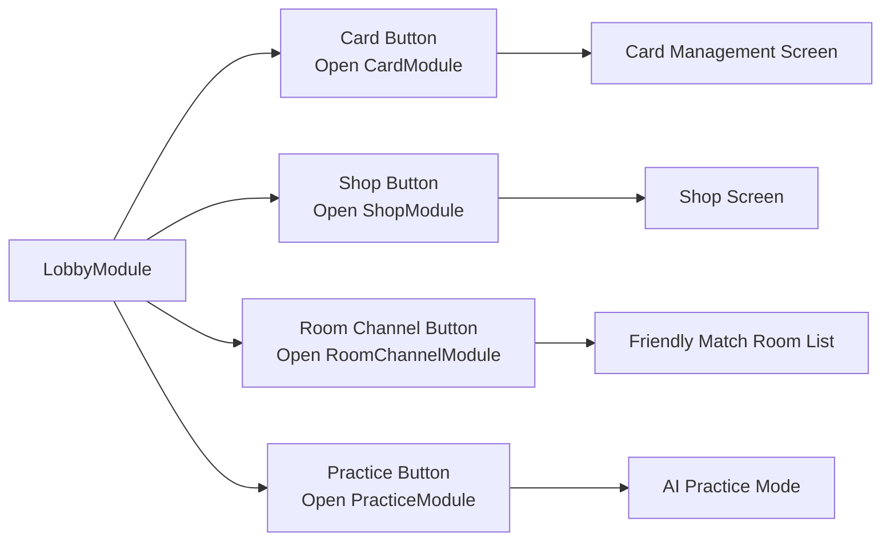
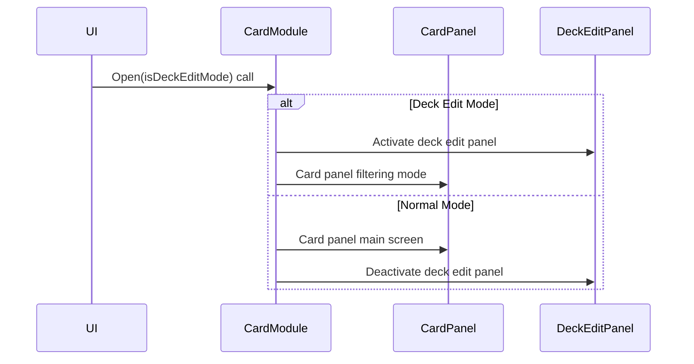
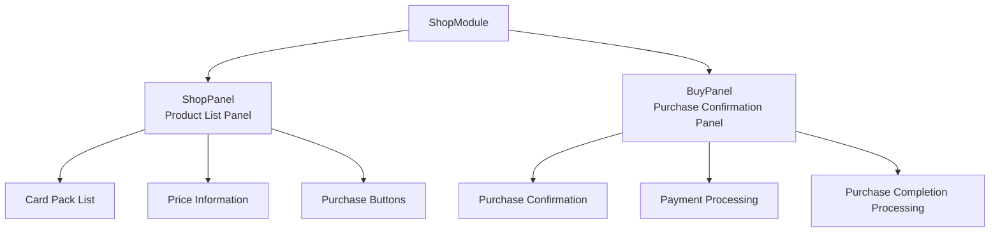
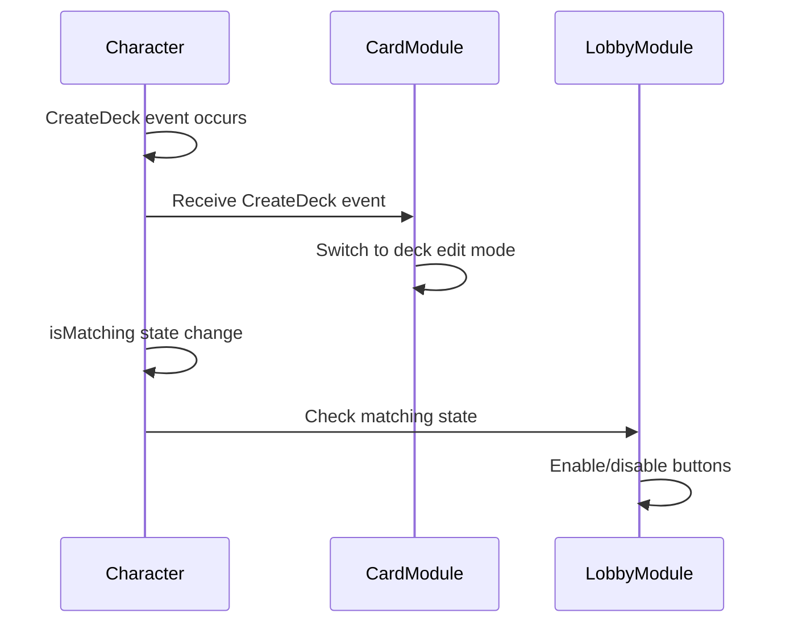

# Main UI Module

## 📋 Overview

MapleDuel's UI system provides independent UI modules for each game function through a module-based architecture. Each module focuses on specific game features and is managed integrally through the `UIManager`. All major game features including lobby, duel, card management, shop, and social features are implemented through their dedicated UI modules.

**Related Files**: 
- All UI modules in the `RootDesk/MyDesk/Components/UIs/` folder

## 🏗️ UI System Architecture

### Module-based Structure

```mermaid
graph TB
    A[UIManager<br/>Central UI Manager] --> B[Game Progress Modules]
    A --> C[Card Management Modules]
    A --> D[Social Feature Modules]
    A --> E[Shop & Economy Modules]
    A --> F[System Modules]
    
    B --> B1[LobbyModule - Lobby]
    B --> B2[DuelModule - Duel Game]
    B --> B3[RankedMatchModule - Ranked Match]
    B --> B4[FriendlyMatchModule - Friendly Match]
    B --> B5[PracticeModule - Practice Mode]
    
    C --> C1[CardModule - Card Management]
    C --> C2[DeckEditPanel - Deck Editing]
    C --> C3[CardPackModule - Card Pack Opening]
    
    D --> D1[SocialModule - Friend System]
    D --> D2[ChatModule - Chat]
    D --> D3[InteractionModule - Interaction]
    D --> D4[RankingModule - Ranking]
    
    E --> E1[ShopModule - Shop]
    E --> E2[RewardModule - Rewards]
    E --> E3[MesoModule - Meso Management]
    
    F --> F1[GuideModule - Guide]
    F --> F2[TutorialModule - Tutorial]  
    F --> F3[PopupModule - Popup]
    F --> F4[NoticeModule - Notice]
```



### Common Module Pattern

#### Basic Module Structure
**Common Component Pattern:**
- Manager references (`UIManager`, `ResourceManager`)
- UI state (`isOpen`, `menuEntity`, `menuTweener`)
- Basic methods (`Open()`, `Close()`, `SetButtonsEnable()`)

## 🎮 1. Game Progress Modules

### LobbyModule - Lobby System

#### Core Functions
LobbyModule manages the lobby UI that serves as the main hub of the game.



**Main Button Functions**:
- **cardButton**: Open card collection and deck management screen
- **shopButton**: Open card pack purchase shop
- **roomChannelButton**: Open friendly match room channel list
- **practiceButton**: Start practice game with AI

#### State Verification System
Common verification logic is applied to all button clicks:

```lua
if not character.isLoaded or _Server:IsRequesting() then
    return  -- Character loading incomplete or server request in progress
end

if character.isMatching then
    return  -- Cannot use other features while matching
end
```

### DuelModule - Duel Game UI

#### In-Game UI Management
DuelModule manages the UI while actual card games are in progress.

**Main Features**:
- **cardButton**: Check cards during game (only when not in game)
- **shopButton**: Access shop during game (only when not in game)  
- **returnButton**: Return to lobby (disabled while game in progress)

**Game State Verification:**
- Check if player is participating in game (`isvalid(character.player)`)

#### Event Card Pack Display
- Connect `SetOpenEventCardPackCount` event
- Display notification when event card pack can be opened

### RankedMatchModule & FriendlyMatchModule

#### Matchmaking System
- **RankedMatchModule**: Competitive matchmaking based on rank score
- **FriendlyMatchModule**: Friendly games with friends or general users

## 🎴 2. Card Management Modules

### CardModule - Integrated Card Management

#### Mode Switching System


#### Deck Edit State Management
```lua
-- X button click save confirmation
if self.isDeckEditMode then
    if self.deckEditPanel.isDirty then
        -- Show save confirmation popup if there are changes
        self.uiManager.PopupModule:Open("DoubleCheckSaveDeck", 
            false, 
            function() self.deckEditPanel:RequestSaveDeck() end,
            function() self:Close() end)
    else
        self:Close()  -- Close immediately if no changes
    end
end
```

#### Deck Management Event Processing
Responds to deck state changes through integration with Character component:
- `CreateDeck`: Switch to edit mode when creating new deck
- `FinishDeck`: Switch to normal mode when deck is completed
- `SaveDeck`: Close module when deck is saved
- `DeleteDeck`: Switch to normal mode when deck is deleted

### CardPackModule - Card Pack Opening

Manages the entire process of purchasing and opening card packs:
- Card pack purchase animation
- Card reveal presentation
- Display newly acquired cards

## 🛒 3. Shop & Economy Modules

### ShopModule - Integrated Shop System

#### Panel Management Structure


#### Mutually Exclusive Panel Control
```lua
method void SetButtonsEnable(boolean enable)
    self.buyPanel:SetButtonsEnable(enable)
    
    -- Disable ShopPanel buttons if BuyPanel is open
    enable = enable and not self.buyPanel.isOpen
    self.shopPanel:SetButtonsEnable(enable)
    self.xButton.Entity.SpriteGUIRendererComponent.RaycastTarget = enable
end
```

### RewardModule & MesoModule

#### Reward System UI
- **RewardModule**: Manage daily rewards, rank rewards, event rewards
- **MesoModule**: Display and manage Meso (game currency)
- **Various Meso UIs**: PlayMeso, RankedWinMeso, RankedPlayMeso, RankMeso, etc.

## 👥 4. Social Feature Modules

### SocialModule - Friend System

#### Integrated Social Feature Management
- Display and manage friend list
- Send and receive friend requests
- Display online status
- Game invitations with friends

### ChatModule - Chat System

#### Real-time Chat Support
- Lobby chat
- Developer command processing (`/` commands)
- Chat balloon display system

### InteractionModule - Interaction

Manages direct interactions between players:
- Display friend request button
- Check player information
- Game invitation feature

### RankingModule - Ranking System

#### Rank Display and Management
- Overall ranking list
- Personal rank information
- Tier system display

## 🔧 5. System & Utility Modules

### PopupModule - Popup System

#### Dynamic Popup Management
```lua
-- Confirmation/cancel popup example
self.uiManager.PopupModule:Open("DoubleCheckSaveDeck", 
    false,                          -- Popup type
    function() -- Confirmation callback
        self.deckEditPanel:RequestSaveDeck() 
    end,
    function() -- Cancel callback
        self:Close() 
    end)
```

Manages confirmation, warning, and information popups used in various situations integrally.

### NoticeModule - Notice System

Displays in-game announcements, system messages, event notifications, etc.

### GuideModule & TutorialModule

#### New User Support
- **GuideModule**: Guides and help for each game feature
- **TutorialModule**: Tutorial progress management and step-by-step guidance

## 🎯 6. UI Module Interactions

### UIManager Mediation System

#### Global UI State Management
```lua
-- Common processing when opening/closing modules
method void Open()
    self.isOpen = true
    self.uiManager:UpdateButtons()        -- Update button state
    self.uiManager:UpdatePlayerController()  -- Update player control  
    self.uiManager:UpdateMobileUI()       -- Update mobile UI
end
```

#### Mutually Exclusive Module Management
System to prevent multiple modules from opening simultaneously:
- Only one main module active at a time
- Layer management between popup and main modules
- Access control based on game state

### Event-based Communication

#### Character Event Integration


## 🎨 7. User Experience Optimization

### Consistent State Verification

#### Common Verification Pattern
Consistent user state verification applied across all UI modules:
- Check character loading completion
- Check server request in progress  
- Check game participation state
- Check matching progress state

### Visual Feedback

#### Sound System Integration
```lua
_SoundService:PlaySound(
    self.resourceManager:GetResource("UI").buttonClickOpenSound, 1)
```

Provide appropriate sound feedback for all user actions

### Animation System

#### Smooth Transition Effects
- Module open/close animation
- Button interaction effects
- Visual feedback for state changes

## 💡 Code Reference

Main UI module logic:
- `LobbyModule.mlua :: OnBeginPlay()` — Lobby button event setup
- `CardModule.mlua :: SetMode()` — Card module mode switching
- `ShopModule.mlua :: SetButtonsEnable()` — Shop panel interaction control
- `DuelModule.mlua` — In-game UI access control
- `PopupModule.mlua` — Dynamic popup creation and management

The Main UI Module system systematically manages all user interfaces in MapleDuel and is a core system that provides an intuitive and consistent user experience.
