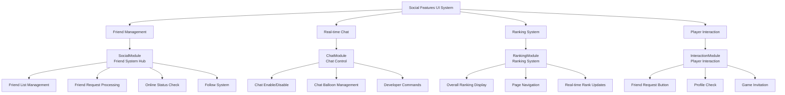
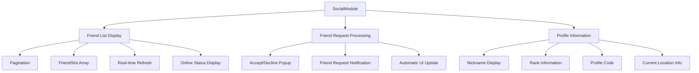
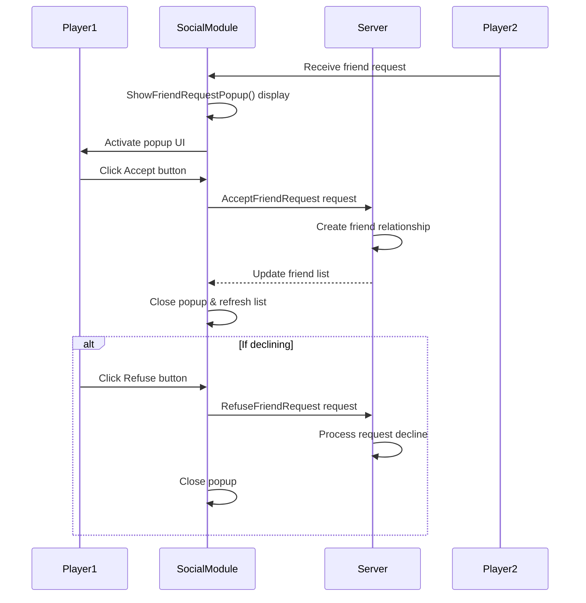
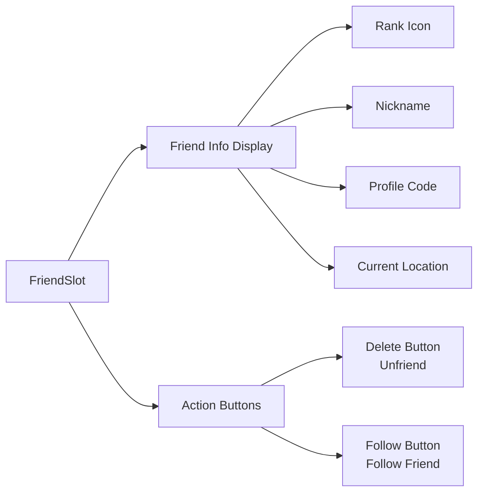
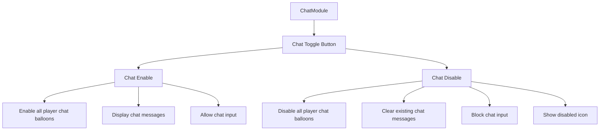
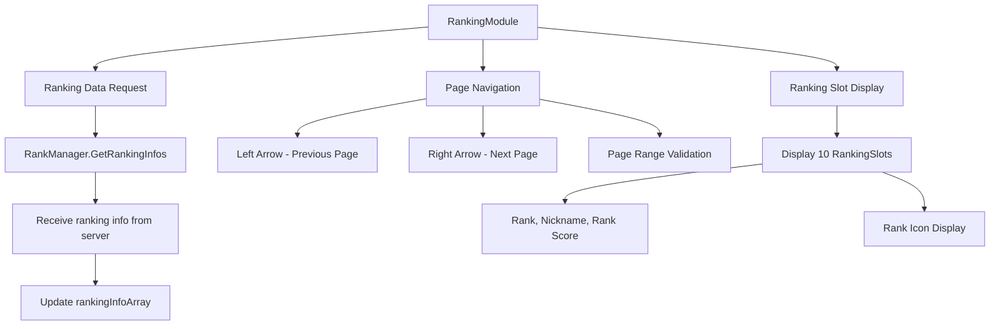
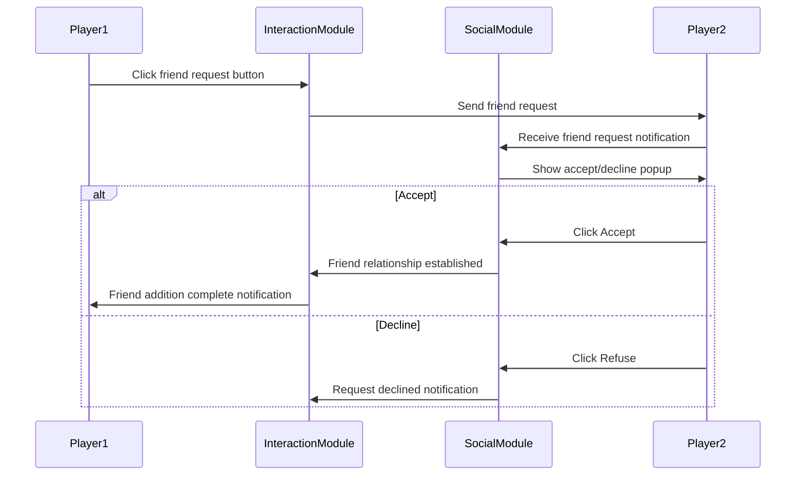
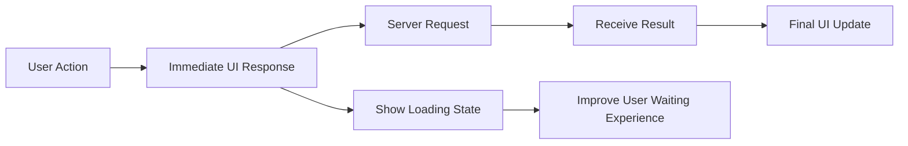

# Social Features UI

## 📋 Overview

MapleDuel's Social Features UI is a core system that supports player interaction and community engagement. Through friend management, real-time chat, ranking systems, and player interactions, it transforms a simple card game into a living social platform. It provides a healthy and enjoyable community environment through intuitive UI and safe interaction systems.

**Related Files**: 
- `RootDesk/MyDesk/Components/UIs/SocialModule.mlua` (Friend System)
- `RootDesk/MyDesk/Components/UIs/ChatModule.mlua` (Chat System)
- `RootDesk/MyDesk/Components/UIs/RankingModule.mlua` (Ranking System)
- `RootDesk/MyDesk/Components/UIs/FriendSlot.mlua` (Friend Slot)
- `RootDesk/MyDesk/Components/UIs/InteractionModule.mlua` (Player Interaction)

## 🏗️ Social UI System Architecture

### Integrated Social Feature Structure



## 👥 1. Friend System (SocialModule)

### Friend Management Hub

#### Friend List System


#### Friend Request Processing System


#### Automatic Refresh System
```lua
-- Periodic friend list update
if self.refreshTimer then
    _TimerService:ClearTimer(self.refreshTimer)
end
self.refreshTimer = _TimerService:SetTimer(function()
    if self.isOpen then
        _Server:Request(character, "GetFriends", {})
    end
end, 10, true)  -- Refresh every 10 seconds
```

### Friend Slot Interaction (FriendSlot)

#### Individual Friend Management


#### Follow System
```lua
self.followButton.Entity:ConnectEvent(ButtonClickEvent, function()
    -- State verification
    if character.isMatching then
        self.uiManager.PopupModule:Open("NotPossibleWhileMatching", true, nil, nil)
        return
    end
    
    -- Check same location
    if isvalid(_UserService:GetUserEntityByUserId(self.userId)) then
        self.uiManager.PopupModule:Open("SameLocation", true, nil, nil)
        return
    end
    
    -- Confirmation popup when in game
    if isvalid(character.player) and character.player.duel.isDueling then
        self.uiManager.PopupModule:Open("DoubleCheckFollow", false, function()
            _Server:Request(map, "Follow", {character, self.userId, self.friend})
        end, nil)
    else
        _Server:Request(map, "Follow", {character, self.userId, self.friend})
    end
end)
```

**Follow Feature Characteristics**:
- **Location Movement**: Instantly move to the room where friend is located
- **Status Check**: Restricted during matching or in-game
- **Confirmation System**: Confirmation popup when interrupting game
- **Same Location**: Notification when already in same place

## 💬 2. Chat System (ChatModule)

### Chat Control System

#### Integrated Chat Management


#### Global Chat State Management
```lua
method void OnBeginPlay()
    self.chatButton.Entity:ConnectEvent(ButtonClickEvent, function()
        -- Toggle chat state
        self.isChatEnable = not self.isChatEnable
        self.disableIcon.Entity.Enable = not self.isChatEnable
        self.uiManager:UpdateChat()
        
        -- Apply to all users in current map
        local currentMap = _UserService.LocalPlayer.CurrentMap
        for _, userEntity in ipairs(_UserService:GetUsersByMapComponent(currentMap.MapComponent)) do
            local character = userEntity.Character
            if isvalid(character.player) then
                -- Player in game
                character.player.chatBalloon.Enable = self.isChatEnable
                if not self.isChatEnable then
                    character.player:ClearChat()
                end
            else
                -- Player in lobby
                userEntity.ChatBalloonComponent.Enable = self.isChatEnable
            end
        end
    end)
end
```

### Chat Balloon System

#### Situation-specific Chat Display
- **Lobby Chat**: Use general ChatBalloonComponent
- **In-Game Chat**: Use Player's dedicated chat balloon
- **Developer Commands**: Support `/` prefix commands
- **Automatic Cleanup**: Remove existing messages when chat disabled

## 🏆 3. Ranking System (RankingModule)

### Hierarchical Ranking Display

#### Paginated Ranking System


#### Dynamic Page Calculation
```lua
-- Calculate number of pages
local totalPages = math.ceil(#self.rankingInfoArray / #self.rankingSlotArray)

-- Page navigation control
self.leftArrowButton.Entity:ConnectEvent(ButtonClickEvent, function()
    if self.pageIndex > 1 then
        self:ShowRanking(self.pageIndex - 1)
    end
end)

self.rightArrowButton.Entity:ConnectEvent(ButtonClickEvent, function()
    if self.pageIndex < totalPages then
        self:ShowRanking(self.pageIndex + 1)
    end
end)
```

### Ranking Slot System

#### Hierarchical Information Display
- **RankingSlot_1~10**: 10 players' ranking info per page
- **Ranking Info**: Overall rank and rank within page
- **Player Info**: Nickname, rank icon, score
- **Real-time Updates**: Request latest info every time module opens

## 🤝 4. Player Interaction (InteractionModule)

### Social Interaction During Game

#### Friend Request System
Provides instant friend request feature with opponent during game.



### Profile Information Display

#### Real-time Player Information
- **Rank Information**: Current tier and rank points
- **Game Statistics**: Win rate, number of games, etc.
- **Online Status**: Current activity status
- **Friend Relationship**: Whether already friends

## 🛡️ 5. Safety & Security System

### State-based Restrictions

#### Smart Interaction Restrictions
```lua
-- Common safety verification pattern
if not character.isLoaded or _Server:IsRequesting() then
    return  -- Character not loaded or server processing
end

if character.isMatching then
    self.uiManager.PopupModule:Open("NotPossibleWhileMatching", true, nil, nil)
    return  -- Restricted during matching
end

if isvalid(character.player) and character.player.duel.isDueling then
    -- Special handling during game (confirmation popup, etc.)
end
```

### Anti-abuse System

#### Spam Prevention and Restrictions
- **Request Limiting**: Prevent duplicate requests during server processing
- **Time Restrictions**: Limit intervals between friend requests
- **Status Check**: Restrict features based on game situation
- **Automatic Cleanup**: Automatic recovery from abnormal states

## 🎨 6. UI/UX Optimization

### Responsiveness Enhancement

#### Immediate Feedback System


#### Smart Refresh
- **Conditional Updates**: Server requests only when necessary
- **Caching**: Local storage of recent data
- **Incremental Updates**: Update only changed parts

### Visual Consistency

#### Unified Design Patterns
- **Common Button Styles**: Accept/Refuse, Delete/Follow, etc.
- **Consistent Animation**: Scale, fade, slide effects
- **Standard Colors**: Unified color codes by state
- **Responsive Layout**: Support for various screen sizes

## 🔄 7. Real-time Update System

### Event-based Synchronization

#### Character Event Integration
```lua
-- Automatic processing of friend-related events
character.Entity:ConnectEvent(Unfriend, function(event)
    local userId = event.userId
    -- Automatic cleanup of corresponding friend slot
    for _, slot in ipairs(self.friendSlotArray) do
        if slot.userId == userId then
            slot:Clear()
            break
        end
    end
end)

character.Entity:ConnectEvent(FriendStatusChanged, function(event)
    -- Immediate UI update when friend status changes
    self:RefreshFriendList()
end)
```

### Network Optimization

#### Efficient Data Transfer
- **Change Detection**: Transfer only when actual changes occur
- **Batch Requests**: Combine multiple operations into single request
- **Compressed Responses**: Transfer only selected necessary information

## 💡 Code Reference

Core social UI logic:
- `SocialModule.mlua :: ShowFriendRequestPopup()` — Friend request popup
- `SocialModule.mlua :: RefreshFriendList()` — Friend list refresh
- `FriendSlot.mlua :: Follow()` — Follow friend feature
- `ChatModule.mlua :: UpdateChat()` — Chat state switching
- `RankingModule.mlua :: ShowRanking()` — Ranking page display

The Social Features UI system is a core system that makes MapleDuel more than just a simple card game into a living community, supporting safe and enjoyable interactions between players.
