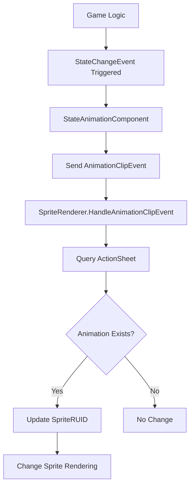
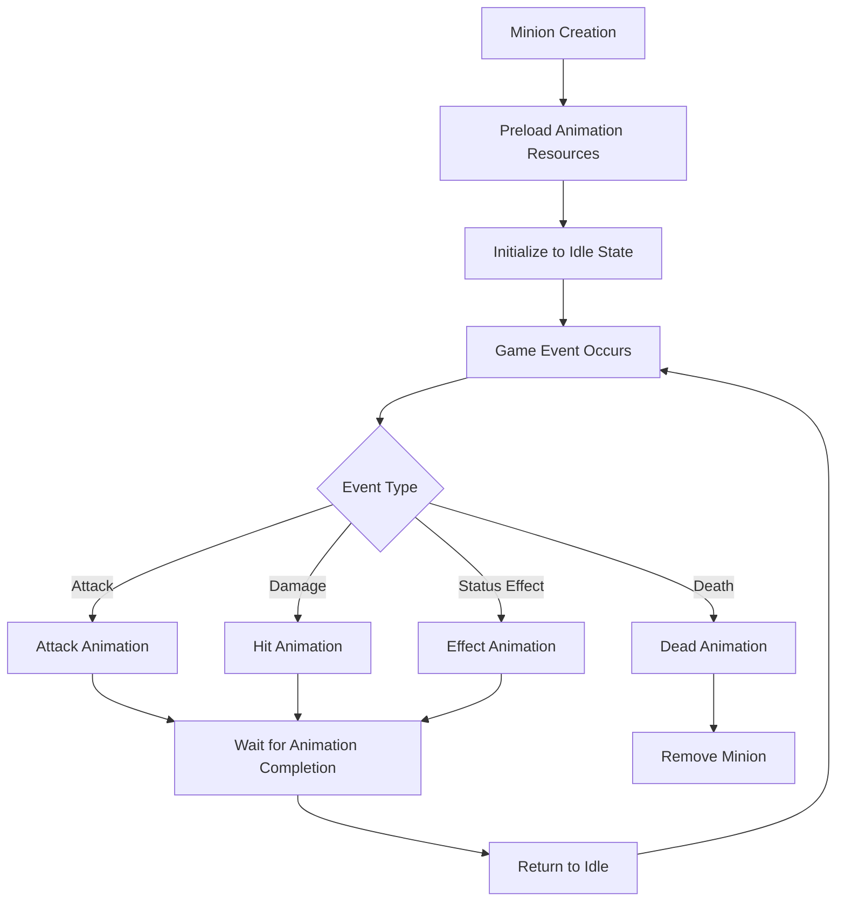
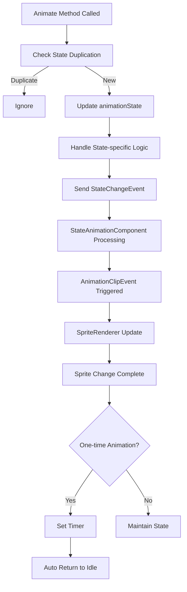

# Sprite Animation System

## Overview

The sprite animation system of Maple Duel manages dynamic sprite changes and animation clip integration for game entities through `SpriteRenderer.mlua`. This system works in conjunction with MapleStory Worlds' native animation system to handle visual state changes for minions, characters, effects, and more.

## Core Sprite Rendering System

### SpriteRenderer.mlua
Custom renderer component that extends `SpriteRendererComponent`.

**Structure:**
```lua
@Component
script SpriteRenderer extends SpriteRendererComponent

    @EventSender("Self")
    handler HandleAnimationClipEvent(AnimationClipEvent event)
        -- Handle native events
        -- Sender: StateAnimationComponent
        -- Execution space: Server, Client
        
        local ClipName = event.ClipName
        
        local stateAnimationComponent = self.Entity.StateAnimationComponent
        if isvalid(stateAnimationComponent) then
            local success, animation = stateAnimationComponent.ActionSheet:TryGetValue(ClipName)
            if success then
                self.SpriteRUID = animation  -- Dynamic sprite change
            end
        end
    end
end
```

**Key Features:**
- **Animation Clip Event Handling**: Receives `AnimationClipEvent` to dynamically change sprites
- **ActionSheet Integration**: Retrieves animation resources from `StateAnimationComponent`'s action sheet
- **Automatic Sprite Switching**: Automatic sprite RUID setting based on clip name

## Animation System Architecture

### StateAnimationComponent Integration

**ActionSheet Structure:**
```lua
-- Animation action sheet managed by StateAnimationComponent
ActionSheet = {
    ["Idle"] = "Animation_RUID_1",
    ["Attack"] = "Animation_RUID_2", 
    ["Dead"] = "Animation_RUID_3",
    -- ... other animation states
}
```

### Event-Based Sprite Changes



## Animation State Management

### Minion Animation System

Minions have various animation states:

```lua
-- Animation state management in Minion.mlua
property string animationState = ""  -- Current animation state

method void Animate(string toAnimationState)
    if self.animationState == toAnimationState then
        return  -- Ignore if same state
    end
    
    local fromAnimationState = self.animationState
    self.animationState = toAnimationState
    
    if toAnimationState == "Idle" then
        if self.isFreeze then
            toAnimationState = "freeze"  -- Freeze state override
        end
    end
    
    -- Trigger StateChangeEvent
    self.minionEntity:SendEvent(StateChangeEvent(toAnimationState, toAnimationState))
    
    -- Return to Idle after animation completion
    if toAnimationState ~= "Idle" then
        _TimerService:SetTimerOnce(function()
            self:Animate("Idle")
        end, _Resource:GetTotalDelay(self.minionEntity.StateAnimationComponent.ActionSheet[toAnimationState]) - 0.03)
    else
        -- Convert to lowercase for final state setting
        toAnimationState = string.lower(toAnimationState)
        self.minionEntity:SendEvent(StateChangeEvent(toAnimationState, toAnimationState))
    end
end
```

### Major Animation States

**Basic States:**
- **"Idle"**: Standby state (default)
- **"Attack"**: Attack animation
- **"Dead"**: Death animation
- **"Summon"**: Summoning animation

**Status Effects:**
- **"freeze"**: Frozen state (Idle override)
- **"stun"**: Stunned state
- **"barrier"**: Shield state

## Resource Preloading

### Animation Resource Optimization

```lua
// MinionBody.mlua - Animation resource preloading
@ExecSpace("ClientOnly")  
method void OnBeginPlay()
    __base:OnBeginPlay()
    
    // Preload all animation resources
    _ResourceService:PreloadAsync(
        self.minionEntity.StateAnimationComponent.ActionSheet.Values, nil)
    
    // Create status effect entities
    self.barrierEntity = _SpawnService:SpawnByModelId(...)
    // ... other effects
end
```

**Advantages of Preloading:**
- Seamless playback during animation transitions
- Prevents visual stuttering due to network delays
- Smooth user experience during gameplay

## Dynamic Sprite Changes

### Runtime Sprite Updates

```lua
// Dynamic sprite change example
local spriteRenderer = entity.SpriteRendererComponent
spriteRenderer.SpriteRUID = "New_Animation_RUID"

// Or automatic change through events
entity:SendEvent(StateChangeEvent("Attack", "Attack"))
```

### UI Element Sprite Changes

```lua
// Card pack image setting in CardPackModule.mlua
self.cardPackImage.SpriteRUID = self.resourceManager:GetResource("CardPack")[self.cardPackName]

// Player background setting in Map.mlua  
player.backgroundEntity.SpriteRendererComponent.SpriteRUID = playerBackground
```

## Animation Timing Control

### Duration-Based Timing

```lua
// Query total animation duration through Resource.mlua
local totalDelay = _Resource:GetTotalDelay(animationRUID)

// Transition to next state 0.03 seconds before animation completion
_TimerService:SetTimerOnce(function()
    self:Animate("Idle")
end, totalDelay - 0.03)
```

### Frame-Based Timing

```lua
// Animation start frame delay
local startFrameDelay = _Resource:GetStartFrameDelay(animationRUID)

// Animation end frame delay  
local endFrameDelay = _Resource:GetEndFrameDelay(animationRUID)
```

## Sprite Rendering Optimization

### Rendering Layer Management

```lua
// Sprite renderer layer settings
spriteRenderer.SortingLayer = "Unit"      // Rendering layer
spriteRenderer.OrderInLayer = 1           // Order within layer
spriteRenderer.FlipX = true               // Horizontal flip
spriteRenderer.Color.a = 0.8              // Opacity setting
```

### Memory and Performance Optimization

**Preloading Strategy:**
- Selective loading of only necessary animations
- Global preloading of common animations
- Special effects loaded only when needed

**Rendering Optimization:**
- Prevent unnecessary sprite changes
- Prevent duplicate state processing
- Efficient layer configuration

## Animation State Flow

### Minion Animation Lifecycle



### Animation Event Processing Flow



## Extension and Customization

### Adding New Animation States

```lua
// 1. Register new animation in ActionSheet
ActionSheet["NewState"] = "New_Animation_RUID"

// 2. Add state handling in Animate method
method void Animate(string toAnimationState)
    -- Existing logic...
    
    if toAnimationState == "NewState" then
        // Handle special logic
        self:HandleNewState()
    end
    
    -- Send StateChangeEvent...
end
```

### Custom Animation Events

```lua
// Add new animation event handler
@EventSender("Self")
handler HandleCustomAnimationEvent(CustomAnimationEvent event)
    local customClipName = event.CustomClipName
    local customData = event.CustomData
    
    // Process custom logic
    self:ProcessCustomAnimation(customClipName, customData)
end
```

## Code Reference

### Core Components
- `RootDesk/MyDesk/Components/SpriteRenderer.mlua` — Custom sprite renderer
- `Environment/NativeScripts/Component/StateAnimationComponent.d.mlua` — Native animation component

### Animation Usage
- `RootDesk/MyDesk/Components/Objects/Minion.mlua` — Minion animation state management
- `RootDesk/MyDesk/Components/Helpers/MinionBody.mlua` — Minion animation resource preloading
- `RootDesk/MyDesk/Logics/Resource.mlua` — Animation timing information provider

### Integration Systems
- `RootDesk/MyDesk/Components/Map.mlua` — Entity-specific sprite settings
- `RootDesk/MyDesk/Components/UIs/CardPackModule.mlua` — Dynamic UI sprite changes
- `RootDesk/MyDesk/Logics/Effect.mlua` — Integration with effect animations

## Sprite Animation System Features

### Event-Based Architecture
- Automatic sprite switching through `AnimationClipEvent`
- Separation of game logic and visual representation
- Extensible event handling structure

### Performance Optimization
- Seamless animations through preloading
- Minimize unnecessary calculations by preventing duplicate state processing
- Efficient timing control

### Flexible Extensibility
- Easy addition of new animation states
- Custom event handler support
- Applicable to various entity types

### Consistency Assurance
- All animations processed with identical patterns
- State management consistency
- Predictable animation flow

This sprite animation system provides the core foundation for all visual elements in Maple Duel to respond naturally and consistently to game state changes.
