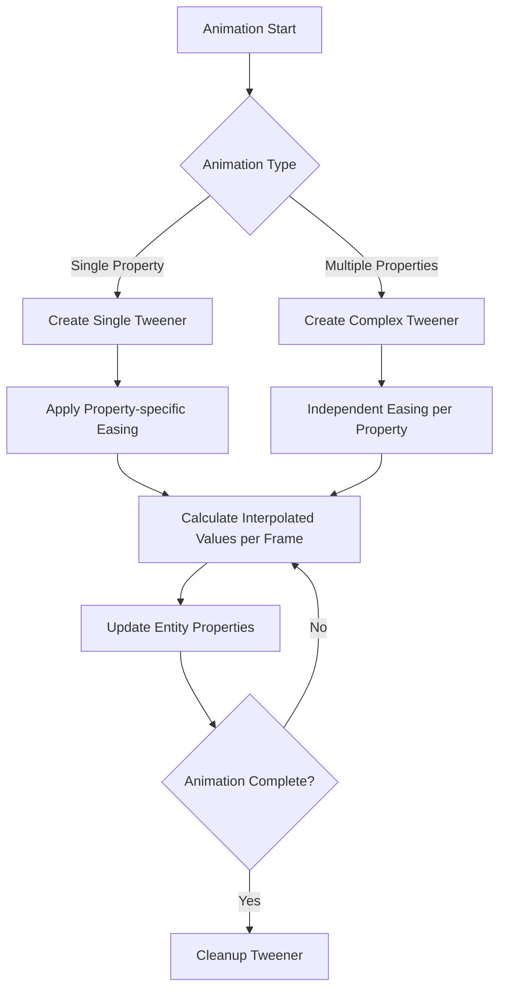
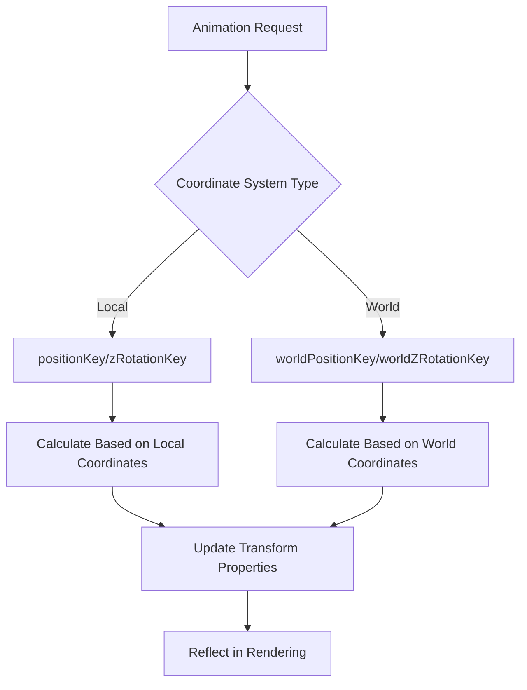

# Tweening System

## Overview

The tweening system of Maple Duel handles all animation effects in the game through `Tween.mlua`. It provides smooth transitions for UI elements, card emphasis effects, dynamic movements of characters and effects, adding vitality and visual appeal to the game.

## Core Tweening System

### Tween.mlua
Central logic component responsible for all entity-based animations.

**Main Properties:**
```lua
property string worldPositionKey = "WorldPosition"  -- World position key
property string positionKey = "Position"             -- Local position key  
property string worldZRotationKey = "WorldZRotation" -- World rotation key
property string zRotationKey = "ZRotation"           -- Local rotation key
```

**Roles:**
- Provide various animation patterns
- Support world/local coordinate systems
- Integrate easing functions
- Manage tweener objects

## Special Effect Animations

### Emphasize Effect

Scale animation used to emphasize cards or UI elements.

```lua
method any Emphasize(Entity entity, number amplitude, number duration)
    local scale = entity.TransformComponent.Scale
    return _TweenLogic:PlayTween(0, 1, duration, EaseType.Linear, function(t)
        local value
        if t < 0.5 then
            -- First half: expand from 0 to amplitude
            value = _TweenLogic:Ease(0, amplitude, 1, EaseType.QuintEaseOut, t * 2)
        else
            -- Second half: contract from amplitude to 0
            value = _TweenLogic:Ease(amplitude, 0, 1, EaseType.QuintEaseIn, t * 2 - 1)
        end
        scale.x = value
        scale.y = value
    end)
end
```

**Features:**
- Two-phase animation (expand → contract)
- Natural emphasis effect with QuintEase easing
- Simultaneous X, Y axis scale changes

### Damp (Damping Vibration Effect)

Vibration animation that simulates impact or recoil.

```lua
method any Damp(Entity entity, Vector2 toScale, number amplitude, number duration)
    local scale = entity.TransformComponent.Scale
    local fromScale = toScale:Clone()
    return _TweenLogic:PlayTween(0, 1, duration, EaseType.Linear, function(t)
        -- Vibration combining sine wave and damping function
        local value = amplitude * _TweenLogic:Ease(1, 0, 1, EaseType.CubicEaseOut, t) * math.sin(t * 6 * math.pi)
        scale.x = fromScale.x + value
        scale.y = fromScale.y + value
    end)
end
```

**Features:**
- 6 sine wave vibrations
- Gradual decay with CubicEaseOut
- Vibration around target scale

### Twitch (Shaking Effect)

Rotational shaking that expresses nervousness or unstable state.

```lua
method any Twitch(Entity entity, number toZRotation, number amplitude, number duration)
    local transform = entity.TransformComponent
    local fromZRotation = toZRotation
    return _TweenLogic:PlayTween(0, 1, duration, EaseType.Linear, function(t)
        -- 8 sine wave rotational vibrations
        local value = amplitude * _TweenLogic:Ease(1, 0, 1, EaseType.Linear, t) * math.sin(t * 8 * math.pi)
        transform.ZRotation = fromZRotation + value
    end)
end
```

**Features:**
- 8 rapid rotational vibrations
- Linear decay for direct intensity reduction
- Shaking effect around rotation axis

## Basic Transform Animations

### Rotation Animation

```lua
method any Spin(Entity entity, number angle, any duration, any type, boolean isWorldSpace)
    local transform = entity.TransformComponent
    local zRotationKey = isWorldSpace and self.worldZRotationKey or self.zRotationKey
    local fromZRotation = transform[zRotationKey]
    return _TweenLogic:PlayTween(0, 1, duration, EaseType.Linear, function(t)
        transform[zRotationKey] = fromZRotation + _TweenLogic:Ease(0, angle, 1, type, t)
    end)
end
```

**Features:**
- Support for world/local coordinate systems
- Apply custom easing types
- Cumulative rotation (additional rotation from current angle)

### Position Movement Animation

```lua
method any MoveTo(Entity entity, Vector2 toPosition, number duration, any type, boolean isWorldSpace)
    local transform = entity.TransformComponent
    local positionKey = isWorldSpace and self.worldPositionKey or self.positionKey
    local fromPosition = transform[positionKey]:Clone()
    return _TweenLogic:PlayTween(0, 1, duration, EaseType.Linear, function(t)
        transform[positionKey].x = _TweenLogic:Ease(fromPosition.x, toPosition.x, 1, type, t)
        transform[positionKey].y = _TweenLogic:Ease(fromPosition.y, toPosition.y, 1, type, t)
    end)
end
```

**X-axis Only Movement:**
```lua
method any MoveXTo(Entity entity, number toXPosition, number duration, any type, boolean isWorldSpace)
    local transform = entity.TransformComponent
    local positionKey = isWorldSpace and self.worldPositionKey or self.positionKey
    local fromXPosition = transform[positionKey].x
    return _TweenLogic:PlayTween(0, 1, duration, EaseType.Linear, function(t)
        transform[positionKey].x = _TweenLogic:Ease(fromXPosition, toXPosition, 1, type, t)
    end)
end
```

### Scale Animation

```lua
method any ScaleTo(Entity entity, Vector2 toScale, number duration, any type)
    local scale = entity.TransformComponent.Scale
    local fromScale = scale:Clone()
    return _TweenLogic:PlayTween(0, 1, duration, EaseType.Linear, function(t)
        scale.x = _TweenLogic:Ease(fromScale.x, toScale.x, 1, type, t)
        scale.y = _TweenLogic:Ease(fromScale.y, toScale.y, 1, type, t)
    end)
end
```

## Complex Animations

### Movement + Rotation Animation

```lua
method any MoveAndRotateTo(Entity entity, Vector2 toPosition, number toZRotation, 
                          number duration, any moveType, any rotateType, boolean isWorldSpace)
    local transform = entity.TransformComponent
    local positionKey = isWorldSpace and self.worldPositionKey or self.positionKey
    local zRotationKey = isWorldSpace and self.worldZRotationKey or self.zRotationKey
    local fromPosition = transform[positionKey]:ToVector2()
    
    // Rotation angle optimization (shortest path)
    local fromZRotation = math.fmod(transform[zRotationKey], 360)
    toZRotation = math.fmod(toZRotation, 360)
    if toZRotation - fromZRotation > 180 then
        fromZRotation = fromZRotation + 360
    elseif fromZRotation - toZRotation > 180 then
        toZRotation = toZRotation + 360
    end
    
    return _TweenLogic:PlayTween(0, 1, duration, EaseType.Linear, function(t)
        transform[positionKey].x = _TweenLogic:Ease(fromPosition.x, toPosition.x, 1, moveType, t)
        transform[positionKey].y = _TweenLogic:Ease(fromPosition.y, toPosition.y, 1, moveType, t)
        transform[zRotationKey] = _TweenLogic:Ease(fromZRotation, toZRotation, 1, rotateType, t)
    end)
end
```

**Rotation Optimization:**
- Shortest path rotation based on 360 degrees
- Direction adjustment for differences over 180 degrees
- Ensures smooth rotation

### Movement + Spin Animation

```lua
method any MoveAndSpinTo(Entity entity, Vector2 toPosition, number angle, 
                        number duration, any type, boolean isWorldSpace)
    local transform = entity.TransformComponent
    local positionKey = isWorldSpace and self.worldPositionKey or self.positionKey
    local fromPosition = transform[positionKey]:Clone()
    local zRotationKey = isWorldSpace and self.worldZRotationKey or self.zRotationKey
    local fromZRotation = transform[zRotationKey]
    
    return _TweenLogic:PlayTween(0, 1, duration, type, function(t)
        // Linear for movement, custom easing for rotation
        transform[positionKey].x = _TweenLogic:Ease(fromPosition.x, toPosition.x, 1, EaseType.Linear, t)
        transform[positionKey].y = _TweenLogic:Ease(fromPosition.y, toPosition.y, 1, EaseType.Linear, t)
        transform[zRotationKey] = fromZRotation + _TweenLogic:Ease(0, angle, 1, type, t)
    end)
end
```

### Movement + Scale Animation

```lua
method any MoveAndScaleTo(Entity entity, Vector2 toPosition, Vector2 toScale, 
                         number duration, any moveType, any scaleType, boolean isWorldSpace)
    local transform = entity.TransformComponent
    local positionKey = isWorldSpace and self.worldPositionKey or self.positionKey
    local fromPosition = transform[positionKey]:ToVector2()
    local fromScale = transform.Scale:ToVector2()
    
    return _TweenLogic:PlayTween(0, 1, duration, EaseType.Linear, function(t)
        transform[positionKey].x = _TweenLogic:Ease(fromPosition.x, toPosition.x, 1, moveType, t)
        transform[positionKey].y = _TweenLogic:Ease(fromPosition.y, toPosition.y, 1, moveType, t)
        transform.Scale.x = _TweenLogic:Ease(fromScale.x, toScale.x, 1, scaleType, t)
        transform.Scale.y = _TweenLogic:Ease(fromScale.y, toScale.y, 1, scaleType, t)
    end)
end
```

### Full Transform Animation

```lua
method any TransformTo(Entity entity, Vector2 toPosition, number toZRotation, Vector2 toScale,
                      number duration, any moveType, any rotateType, any scaleType, boolean isWorldSpace)
    // Simultaneous animation of movement, rotation, and scale
    // Independent easing types can be applied to each
end
```

## Color and Special Animations

### Color Change Animation

```lua
method any ColorTo(Entity entity, Color toColor, number duration, any type)
    local spriteRenderer = entity.SpriteRendererComponent
    local fromColor = spriteRenderer.Color:Clone()
    
    return _TweenLogic:PlayTween(0, 1, duration, type, function(t)
        spriteRenderer.Color.r = _TweenLogic:Ease(fromColor.r, toColor.r, 1, EaseType.Linear, t)
        spriteRenderer.Color.g = _TweenLogic:Ease(fromColor.g, toColor.g, 1, EaseType.Linear, t)
        spriteRenderer.Color.b = _TweenLogic:Ease(fromColor.b, toColor.b, 1, EaseType.Linear, t)
        spriteRenderer.Color.a = _TweenLogic:Ease(fromColor.a, toColor.a, 1, EaseType.Linear, t)
    end)
end
```

**Features:**
- Independent interpolation of RGBA channels
- Dependent on SpriteRendererComponent
- Supports fade in/out effects

### Entity Interpolation (Lerp)

```lua
method any Lerp(Entity entity, Entity fromEntity, Entity toEntity, number fromT, number toT, 
               number duration, any type, Vector2 fromOffset, Vector2 toOffset)
    local transform = entity.TransformComponent
    return _TweenLogic:PlayTween(fromT, toT, duration, type, function(t)
        local fromWorldPosition = fromEntity.TransformComponent.WorldPosition
        local toWorldPosition = toEntity.TransformComponent.WorldPosition
        
        // Position interpolation including offsets
        transform.WorldPosition.x = (fromWorldPosition.x + (fromOffset and fromOffset.x or 0)) * (1 - t) + 
                                   (toWorldPosition.x + (toOffset and toOffset.x or 0)) * t
        transform.WorldPosition.y = (fromWorldPosition.y + (fromOffset and fromOffset.y or 0)) * (1 - t) + 
                                   (toWorldPosition.y + (toOffset and toOffset.y or 0)) * t
    end)
end
```

**Features:**
- Relative position animation between two entities
- Fine position control with offset support
- Enables dynamic tracking animations

## Tweening System Usage Patterns

### Card Emphasis Effect
```lua
// Card emphasis on selection
local tweener = _Tween:Emphasize(cardEntity, 0.1, 0.3)
```

### Smooth UI Transitions
```lua
// Panel slide in
local tweener = _Tween:MoveTo(panelEntity, Vector2(0, 0), 0.5, EaseType.QuintEaseOut, false)
```

### Explosion Effect
```lua
// Combination of scale and fade out
local scaleTweener = _Tween:ScaleTo(effectEntity, Vector2(3, 3), 0.8, EaseType.QuartEaseOut)
local colorTweener = _Tween:ColorTo(effectEntity, Color(1, 1, 1, 0), 0.8, EaseType.Linear)
```

### Card Drag Return
```lua
// Card returning to original position animation
local tweener = _Tween:MoveAndRotateTo(cardEntity, originalPos, 0, 0.4, 
                                      EaseType.BackEaseOut, EaseType.QuintEaseOut, false)
```

## Tweening System Flow

### Complex Animation Execution Flow



### Coordinate System Handling Flow



## Performance Optimization

### Tweener Memory Management
```lua
// Tweener objects are automatically cleaned up after animation completion
// But can also be controlled manually
tweener:Destroy()  -- Early termination and memory release
```

### Easing Function Optimization
- Linear easing is optimized with minimal calculations
- Complex easing is used only when necessary
- Calculation optimization to prevent frame drops

### Prevent Unnecessary Updates
- Skip changes to identical values
- Prevent errors with entity validity checks
- Priority processing for short-duration animations

## Code Reference

### Core Files
- `RootDesk/MyDesk/Logics/Tween.mlua` — Tweening system main logic

### Integration Systems
- `Environment/NativeScripts/Logic/TweenLogic.d.mlua` — Native tweening engine
- `RootDesk/MyDesk/Logics/Effect.mlua` — Effect and tweening integration
- Various UI modules — Interface animation application

### Major Method Categories
- **Special Effects**: `Emphasize()`, `Damp()`, `Twitch()`
- **Basic Transforms**: `MoveTo()`, `ScaleTo()`, `Spin()`
- **Complex Transforms**: `MoveAndRotateTo()`, `TransformTo()`
- **Color/Interpolation**: `ColorTo()`, `Lerp()`

## Tweening System Features

### Intuitive API
- Clear functionality expression through method names
- Consistent parameter structure
- Transparent support for world/local coordinate systems

### Flexible Combination
- Various animation pattern provision
- Independent easing function application
- Complex animations capable of simultaneous execution

### Game Optimization
- Emphasis effects specialized for card games
- Timing optimized for UI transitions
- Memory management considering performance

This tweening system is the core engine responsible for all visual movements and transition effects in Maple Duel, providing smooth and satisfying visual experiences to players.
