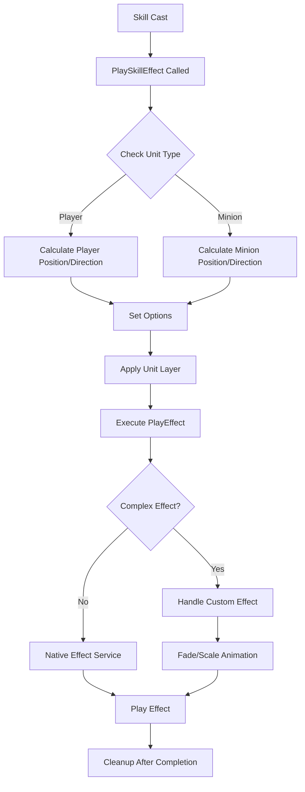
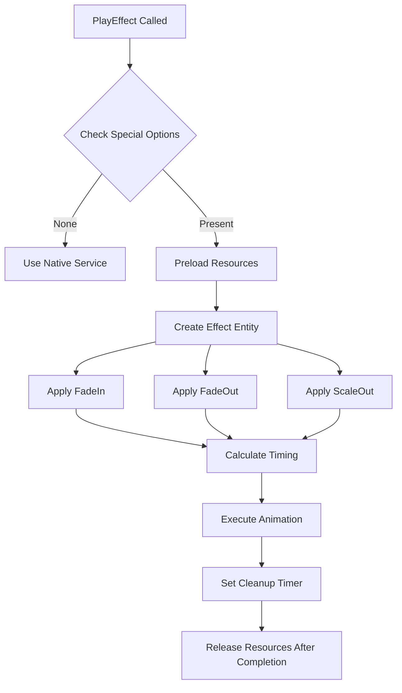

# Visual Effects System

## Overview

The visual effects system of Maple Duel manages all visual effects in the game through `Effect.mlua`. It provides various visual feedback including card casting effects, minion skill animations, UI transition effects, etc., enhancing the game's immersion.

## Core Effects System

### Effect.mlua
Central logic component that manages all visual effects.

**Main Roles:**
- Create and manage effect sprites
- Control animation timing
- Manage layers and rendering order
- Provide various effect patterns

## Layer Management System

### Layer Options Configuration

```lua
@ExecSpace("ClientOnly")
method table GetLayerOptions(table options, string sortingLayer, integer orderInLayer)
    options = options or {}
    options.SortingLayer = sortingLayer
    options.OrderInLayer = orderInLayer
    return options
end
```

### Unit Layer Configuration

```lua
@ExecSpace("ClientOnly")
method table GetUnitLayerOptions(table options)
    return self:GetLayerOptions(options, "Unit", 1)
end
```

**Layer Structure:**
- **"Effect"**: General effects layer (default)
- **"Unit"**: Unit-related effects layer
- **OrderInLayer**: Rendering order within the same layer (higher numbers appear in front)

## Effect Creation System

### Basic Effect Creation

```lua
@ExecSpace("ClientOnly")
method Entity SpawnEffect(string animation, Vector3 position, Entity parent, table options)
    local sortingLayer = options and options.SortingLayer or "Effect"
    local orderInLayer = options and options.OrderInLayer or 0
    local alpha = options and options.Alpha or 1
    local flipX = options and options.FlipX or false
    local fadeIn = options and options.FadeIn or false
    
    // Create effect entity
    local effectEntity = _SpawnService:SpawnByModelId(
        _EntryService:GetModelIdByName("Effect"), "Effect", 
        position, parent or _UserService.LocalPlayer.CurrentMap)
    
    // Configure sprite renderer
    local spriteRenderer = effectEntity.SpriteRendererComponent
    spriteRenderer.Color.a = fadeIn and 0 or alpha
    spriteRenderer.SpriteRUID = animation
    spriteRenderer.SortingLayer = sortingLayer
    spriteRenderer.OrderInLayer = orderInLayer
    spriteRenderer.FlipX = flipX
    
    return effectEntity
end
```

**Option Parameters:**
- **SortingLayer**: Rendering layer
- **OrderInLayer**: Order within layer
- **Alpha**: Opacity (0.0 ~ 1.0)
- **FlipX**: Horizontal flip flag
- **FadeIn**: Fade-in effect flag

## Advanced Effect Playback

### Complex Animation Effects

```lua
@ExecSpace("ClientOnly")
method void PlayEffect(string animation, Vector3 position, Entity parent, table options)
    local fadeIn = options and options.FadeIn or false
    local fadeOut = options and options.FadeOut or false
    local scaleOut = options and options.ScaleOut or false
    
    local shouldSpawnEffect = fadeIn or fadeOut or scaleOut
    if not shouldSpawnEffect then
        // Use native service for simple effects
        if isvalid(parent) then
            _EffectService:PlayEffectAttached(animation, parent, position, 0, Vector3.one, false, options)
        else
            _EffectService:PlayEffect(animation, _UserService.LocalPlayer, position, 0, Vector3.one, false, options)
        end
        return
    end
    
    // Handle complex effects
    _ResourceService:PreloadAsync({animation}, function()
        local effectEntity = self:SpawnEffect(animation, position, parent, options)
        local transform = effectEntity.TransformComponent
        local spriteRenderer = effectEntity.SpriteRendererComponent
        local timerArray = {}
        local tweenerArray = {}
        local totalDelay = _Resource:GetTotalDelay(animation) - 0.03
        
        // Fade-in effect
        if fadeIn then
            local alpha = options and options.Alpha or 1
            local tweener = _TweenLogic:PlayTween(0, alpha, 
                _Resource:GetStartFrameDelay(animation), EaseType.Linear, 
                function(t) spriteRenderer.Color.a = t end)
            table.insert(tweenerArray, tweener)
        end
        
        // Fade-out effect
        if fadeOut then
            local alpha = options and options.Alpha or 1
            local endFrameDelay = _Resource:GetEndFrameDelay(animation)
            local timer = _TimerService:SetTimerOnce(function()
                local tweener = _TweenLogic:PlayTween(alpha, 0, endFrameDelay, EaseType.Linear,
                    function(t) spriteRenderer.Color.a = t end)
                table.insert(tweenerArray, tweener)
            end, math.max(0, totalDelay - endFrameDelay))
            table.insert(timerArray, timer)
        end
        
        // Scale-out effect
        if scaleOut then
            local endFrameDelay = _Resource:GetEndFrameDelay(animation)
            local timer = _TimerService:SetTimerOnce(function()
                local tweener = _TweenLogic:PlayTween(1, 2, endFrameDelay, EaseType.Linear,
                    function(t)
                        transform.Scale.x = t
                        transform.Scale.y = t
                    end)
                table.insert(tweenerArray, tweener)
            end, math.max(0, totalDelay - endFrameDelay))
            table.insert(timerArray, timer)
        end
        
        // Cleanup timer
        _TimerService:SetTimerOnce(function()
            for _, timer in ipairs(timerArray) do
                _TimerService:ClearTimer(timer)
            end
            for _, tweener in ipairs(tweenerArray) do
                tweener:Destroy()
            end
            effectEntity:Destroy()
        end, totalDelay)
    end)
end
```

## Dynamic Effect Patterns

### Movement Effect

```lua
@ExecSpace("ClientOnly")
method void MoveEffect(string animation, Vector2 fromPosition, Vector2 toPosition, 
                      number zPosition, number duration, any easeType, table options)
    local position = Vector3(fromPosition.x, fromPosition.y, zPosition)
    local effectEntity = self:SpawnEffect(animation, position, nil, options)
    
    // Movement animation
    local tweener = _Tween:MoveTo(effectEntity, toPosition, duration, easeType, true)
    
    // Cleanup on completion
    _TimerService:SetTimerOnce(function()
        tweener:Destroy()
        effectEntity:Destroy()
    end, duration)
end
```

### Movement + Rotation Effect

```lua
@ExecSpace("ClientOnly")
method void MoveAndSpinEffect(string animation, Vector2 fromPosition, Vector2 toPosition,
                             number zPosition, number angle, number duration, any easeType, table options)
    local position = Vector3(fromPosition.x, fromPosition.y, zPosition)
    local effectEntity = self:SpawnEffect(animation, position, nil, options)
    
    // Simultaneous movement and rotation animation
    local tweener = _Tween:MoveAndSpinTo(effectEntity, toPosition, angle, duration, easeType, true)
    
    _TimerService:SetTimerOnce(function()
        tweener:Destroy()
        effectEntity:Destroy()
    end, duration)
end
```

### Projectile Effect

```lua
@ExecSpace("ClientOnly")
method void ThrowEffect(string animation, Vector2 fromPosition, Vector2 toPosition,
                       number zPosition, number duration, any easeType, table options)
    local dx = toPosition.x - fromPosition.x
    local dy = toPosition.y - fromPosition.y
    
    // Flip horizontally based on movement direction
    options.FlipX = dx > 0
    
    local position = Vector3(fromPosition.x, fromPosition.y, zPosition)
    local effectEntity = self:SpawnEffect(animation, position, nil, options)
    
    // Set projectile angle
    local transform = effectEntity.TransformComponent
    transform.WorldZRotation = math.deg(_Math:Atan2(dy, dx)) + (dx > 0 and 0 or 180)
    
    // Movement animation
    local tweener = _Tween:MoveTo(effectEntity, toPosition, duration, easeType, true)
    _TimerService:SetTimerOnce(function()
        tweener:Destroy()
        effectEntity:Destroy()
    end, duration)
end
```

## Unit-Specific Effects

### Skill Effects

**Skill Effect Processing**:
- `Effect.mlua :: PlaySkillEffect()` — Play unit-specific skill effects
- Position calculation and direction setting for players/minions

### Attached Skill Effects

**Attached Skill Effects**:
- `Effect.mlua :: PlaySkillEffectAttached()` — Effects attached to units
- Uses `_EffectService:PlayEffectAttached()` to connect to parent entity

### Hit Effects

**Hit Effect Processing**:
- `Effect.mlua :: PlayHitEffect()` — Play effects on hit
- Automatic effect direction determination based on attacker direction

## Effect Optimization

### Resource Preloading

**Resource Preloading**:
- Use `_ResourceService:PreloadAsync()` to prevent stuttering

### Memory Management

**Memory Management**:
- Automatic cleanup system for timers and tweeners
- Automatic release using `_TimerService:SetTimerOnce()`

### Performance Optimization

- **Conditional Complex Effects**: Use custom effects only when necessary
- **Native Service Utilization**: Use _EffectService directly for simple effects
- **Automatic Cleanup**: Automatic resource release after effect completion

## Effect System Flow

### Skill Effect Execution Flow



### Complex Animation Flow



## Effect Usage Examples

### Card Cast Effect
**Play Skill Effect**:
- Call `_Effect:PlaySkillEffect()` for unit-based effect processing

### Projectile Attack
**Projectile Effect**:
- Use `_Effect:ThrowEffect()` for start-to-target movement effects

### Explosion Effect
**Expanding Explosion Effect**:
- Use `_Effect:PlayEffect()` with ScaleOut/FadeOut combination

## Code Reference

### Core Files
- `RootDesk/MyDesk/Logics/Effect.mlua` — Visual effects system main logic

### Integration Systems
- `RootDesk/MyDesk/Logics/Resource.mlua` — Animation timing information provider
- `RootDesk/MyDesk/Logics/Tween.mlua` — Effect animation processing
- `RootDesk/MyDesk/Components/Managers/ActionManager.mlua` — Game action and effect integration

### Key Methods
- `Effect:PlayEffect()` — Play complex effects
- `Effect:SpawnEffect()` — Create effect entities
- `Effect:PlaySkillEffect()` — Unit skill effects
- `Effect:MoveEffect()` — Movement effects
- `Effect:ThrowEffect()` — Projectile effects

## Visual Effects System Features

### Flexible Option System
- Can combine various animation effects
- Precise control over layers and rendering order
- Fully customizable timing and easing

### Performance Optimization
- Conditional complex effects prevent unnecessary processing
- Automatic resource cleanup prevents memory leaks
- Efficient integration with native services

### Game Integration
- Unit-specific effect systems
- Visual feedback optimized for card games
- Consistent effect style and timing

This visual effects system is a core component that provides vitality and immersion to all visual actions in Maple Duel, delivering a satisfying gaming experience to players.
