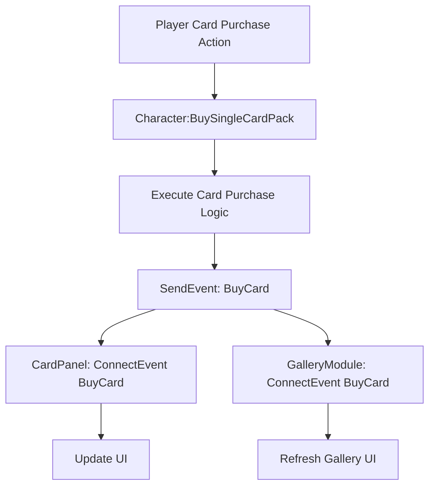
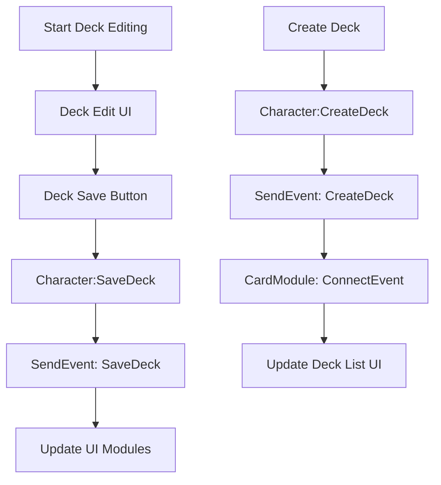

# Game Event System

## Overview

The game event system of Maple Duel provides an event-driven architecture for handling various in-game actions and state changes. All major gameplay elements including card buying/selling, deck management, economy system, and player state changes communicate through events.

## Event System Structure

### Event Type Definition

All game events are defined in the `RootDesk/MyDesk/Events/` folder by extending `EventType`.

**Basic Structure:**
```lua
@Event
script [EventName] extends EventType

    property [dataType] [propertyName] = [defaultValue]  -- Optional

end
```

### Event Factory (Event.mlua)

`Event.mlua` is a factory class responsible for event instance creation and data configuration.

```lua
@Logic
script Event extends Logic

method BuyCard BuyCard(table info)
    local event = BuyCard()
    event.info = info
    return event
end

method SellCard SellCard(table info)
    local event = SellCard()
    event.info = info
    return event
end
```

## Major Game Events

### Card-Related Events

#### BuyCard
Event triggered when purchasing cards.

**Structure:**
- `RootDesk/MyDesk/Events/BuyCard.mlua`
- `property table info = {}`

**Usage Example:**
```lua
-- Trigger event (Character.mlua)
local info = {
    cardName = cardName,
    skinIndex = skinIndex,
    index = index
}
self.Entity:SendEvent(_Event:BuyCard(info))

-- Receive event (CardPanel.mlua)
character.Entity:ConnectEvent(BuyCard, function(event)
    local info = event.info
    -- Card purchase processing logic
end)
```

#### SellCard
Event triggered when selling cards.

**Structure:**
- `RootDesk/MyDesk/Events/SellCard.mlua`
- `property table info = {}`

**Usage Example:**
```lua
-- Trigger event
self.Entity:SendEvent(_Event:SellCard(info))

-- Receive event
character.Entity:ConnectEvent(SellCard, function(event)
    -- Card selling processing logic
end)
```

### Deck Management Events

#### CreateDeck
Event triggered when creating a new deck.

**Structure:**
- `RootDesk/MyDesk/Events/CreateDeck.mlua`
- No additional properties

**Usage Example:**
```lua
-- Trigger event (Character.mlua)
self.Entity:SendEvent(CreateDeck())

-- Receive event (CardModule.mlua)
character.Entity:ConnectEvent(CreateDeck, function()
    -- Deck creation UI update
end)
```

#### SaveDeck
Event triggered when saving a deck.

**Structure:**
- `RootDesk/MyDesk/Events/SaveDeck.mlua`
- No additional properties

**Usage Example:**
```lua
-- Triggered in Character.mlua
self.Entity:SendEvent(SaveDeck())
```

#### DeleteDeck
Event triggered when deleting a deck.

**Structure:**
- `RootDesk/MyDesk/Events/DeleteDeck.mlua`
- No additional properties

**Usage Example:**
```lua
-- Triggered in Character.mlua
self.Entity:SendEvent(DeleteDeck())
```

#### FinishDeck
Event triggered when deck editing is completed.

**Structure:**
- `RootDesk/MyDesk/Events/FinishDeck.mlua`
- No additional properties

**Usage Example:**
```lua
-- Triggered in Character.mlua
self.Entity:SendEvent(FinishDeck())
```

### Player State Events

#### SetMeso
Event triggered when changing player mesos.

**Structure:**
- `RootDesk/MyDesk/Events/SetMeso.mlua`
- No additional properties

#### SetRank
Event triggered when changing player rank.

**Structure:**
- `RootDesk/MyDesk/Events/SetRank.mlua`
- No additional properties

#### SetDeckIndex
Event triggered when changing the currently selected deck index.

**Structure:**
- `RootDesk/MyDesk/Events/SetDeckIndex.mlua`
- No additional properties

#### SetCardBack
Event triggered when changing card backs.

**Structure:**
- `RootDesk/MyDesk/Events/SetCardBack.mlua`
- No additional properties

### Special Events

#### SetOpenEventCardPackCount
Event for setting open event card pack quantities.

**Structure:**
- `RootDesk/MyDesk/Events/SetOpenEventCardPackCount.mlua`
- No additional properties

## Social-Related Events

### GetFriends
Event for delivering friend list query results.

**Structure:**
- `RootDesk/MyDesk/Events/GetFriends.mlua`
- No additional properties (data set in Event.mlua)

**Usage Example:**
```lua
-- Triggered in Map.mlua
self.Entity:SendEvent(_Event:GetFriends(userIdArray, friendArray))
```

### Unfriend
Event for ending friendship relationships.

**Structure:**
- `RootDesk/MyDesk/Events/Unfriend.mlua`
- No additional properties (userId set in Event.mlua)

**Usage Example:**
```lua
-- Triggered in Character.mlua
self.Entity:SendEvent(_Event:Unfriend(userId))
```

### GetChannels
Event for delivering channel list query results.

**Structure:**
- `RootDesk/MyDesk/Events/GetChannels.mlua`
- No additional properties (channelArray set in Event.mlua)

**Usage Example:**
```lua
-- Triggered in Home.mlua
self.Entity:SendEvent(_Event:GetChannels(channelArray))
```

### GetFriendlyMatchRooms
Event for delivering friendly match room list query results.

**Structure:**
- `RootDesk/MyDesk/Events/GetFriendlyMatchRooms.mlua`
- No additional properties (roomArray set in Event.mlua)

### SetRoom
Event for setting current room.

**Structure:**
- `RootDesk/MyDesk/Events/SetRoom.mlua`
- No additional properties (room set in Event.mlua)

## Special Events

### Coroutine
Event related to coroutines.

**Structure:**
- `RootDesk/MyDesk/Events/Coroutine.mlua`
- No additional properties

## Event Usage Patterns

### Event Triggering

```lua
-- Simple event (no data)
self.Entity:SendEvent(CreateDeck())

-- Event through factory (with data)
self.Entity:SendEvent(_Event:BuyCard(cardInfo))
```

### Event Receiving

```lua
-- Basic pattern
character.Entity:ConnectEvent(EventType, function(event)
    -- Access data through event.property
    local data = event.info
    -- Processing logic
end)

-- Simple event without data
character.Entity:ConnectEvent(CreateDeck, function()
    -- Processing logic
end)
```

## Event Flow

### Card Purchase Flow



### Deck Management Flow



## Code Reference

### Event Definition Files
- `RootDesk/MyDesk/Events/BuyCard.mlua` — Card purchase event
- `RootDesk/MyDesk/Events/SellCard.mlua` — Card selling event
- `RootDesk/MyDesk/Events/CreateDeck.mlua` — Deck creation event
- `RootDesk/MyDesk/Events/DeleteDeck.mlua` — Deck deletion event
- `RootDesk/MyDesk/Events/SaveDeck.mlua` — Deck save event
- `RootDesk/MyDesk/Events/FinishDeck.mlua` — Deck edit completion event

### Factory and Usage
- `RootDesk/MyDesk/Logics/Event.mlua` — Event factory class
- `RootDesk/MyDesk/Components/Character.mlua` — Main game event source
- `RootDesk/MyDesk/Components/UIs/CardPanel.mlua` — Card-related event receiver
- `RootDesk/MyDesk/Components/UIs/CardModule.mlua` — Deck-related event receiver
- `RootDesk/MyDesk/Components/Managers/GalleryModule.mlua` — Card gallery event receiver

## Event System Features

### Advantages
1. **Loose Coupling**: Communication without direct dependencies between components
2. **Extensibility**: Easy addition of new event listeners
3. **Consistency**: All game actions processed with identical patterns
4. **Debugging**: Clear state tracking through event flow

### Considerations
1. **Timing**: Need to consider event triggering and receiving order
2. **Memory**: Prevent memory leaks by releasing event listeners
3. **Data**: Manage event data lifecycle

This event system is the core foundation that organically connects all gameplay elements of Maple Duel, forming an extensible and maintainable game architecture.
