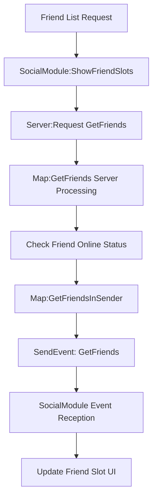
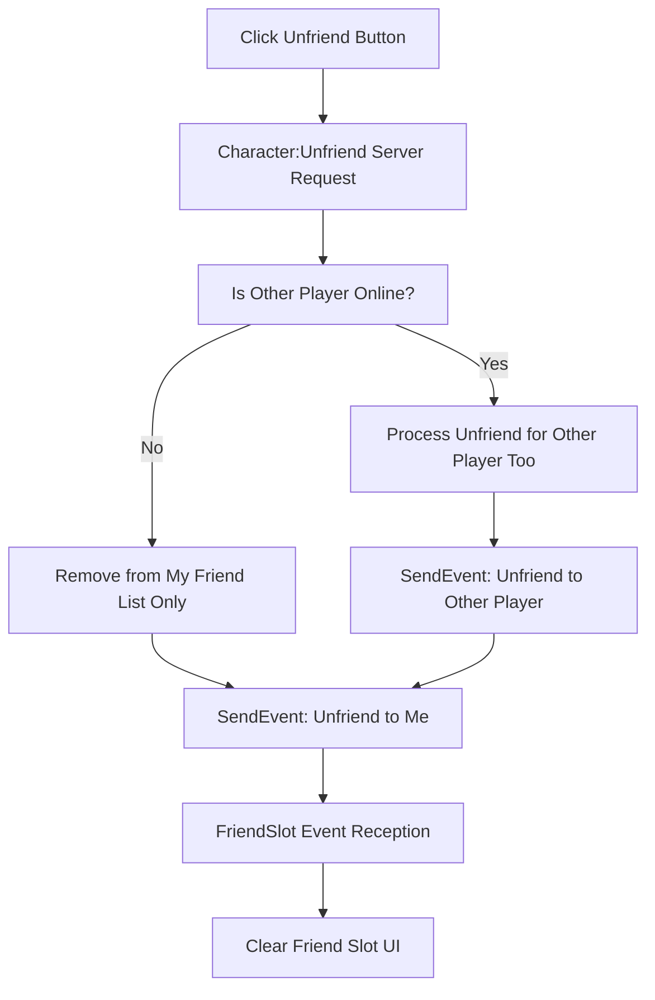
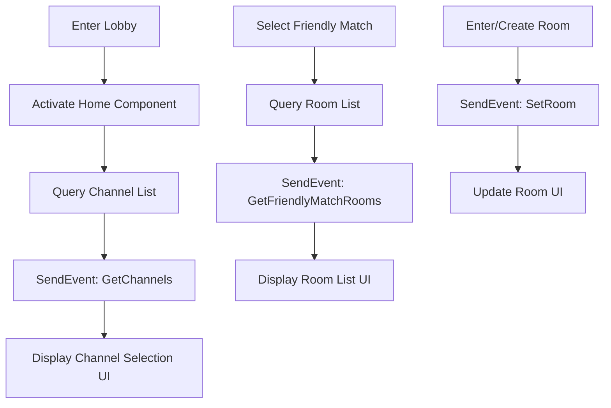

# Social Event System

## Overview

The social event system of Maple Duel handles events that support player-to-player interaction and community features such as friend management, chat, channel/room management. These events are responsible for real-time social status updates and player connections.

## Major Social Events

### Friend System Events

#### GetFriends
Event that delivers friend list query results.

**Structure:**
- `RootDesk/MyDesk/Events/GetFriends.mlua`
- Extends EventType, no additional properties
- Data set in Event.mlua

**Factory Method:**
```lua
method GetFriends GetFriends(table userIdArray, table friendArray)
    local event = GetFriends()
    event.userIdArray = userIdArray
    event.friendArray = friendArray
    return event
end
```

**Usage Example:**
```lua
-- Send friend information results after query in Map.mlua
@ExecSpace("Client")
method void GetFriendsInSender(table userIdArray, table friendArray)
    local character = _UserService.LocalPlayer.Character
    for i, friend in ipairs(friendArray) do
        local userId = userIdArray[i]
        if not _Table:IsEmpty(friend) and friend.nickname ~= character.friendTable[userId].nickname then
            character.friendTable[userId].nickname = friend.nickname
        end
    end
    
    self.Entity:SendEvent(_Event:GetFriends(userIdArray, friendArray))
end
```

**Data Structure:**
- `userIdArray`: Array of queried user IDs
- `friendArray`: Array of friend information for each user (including online/offline status)

#### Unfriend
Event triggered when ending friendship relationships.

**Structure:**
- `RootDesk/MyDesk/Events/Unfriend.mlua`
- Extends EventType, no additional properties
- userId set in Event.mlua

**Factory Method:**
```lua
method Unfriend Unfriend(string userId)
    local event = Unfriend()
    event.userId = userId
    return event
end
```

**Usage Example:**
```lua
-- Process unfriend in Character.mlua
@ExecSpace("Client")
method void UnfriendInOther()
    local other = _UserService.LocalPlayer.Character
    other.friendTable[self.Entity.Name] = nil
    
    other.Entity:SendEvent(_Event:Unfriend(self.Entity.Name))
end

@ExecSpace("Client")
method void UnfriendInOwner(string userId)
    self.friendTable[userId] = nil
    self.uiManager.InteractionModule:Close()
    
    self.Entity:SendEvent(_Event:Unfriend(userId))
end
```

**Event Reception:**
```lua
-- Handle unfriend event in FriendSlot.mlua
character.Entity:ConnectEvent(Unfriend, function(event)
    local userId = event.userId
    
    if self.userId == userId then
        self:Clear()  -- Clear friend slot
    end
end)
```

### Channel System Events

#### GetChannels
Event that delivers channel list query results.

**Structure:**
- `RootDesk/MyDesk/Events/GetChannels.mlua`
- Extends EventType, no additional properties
- channelArray set in Event.mlua

**Factory Method:**
```lua
method GetChannels GetChannels(table channelArray)
    local event = GetChannels()
    event.channelArray = channelArray
    return event
end
```

**Usage Example:**
```lua
-- Send channel information in Home.mlua
self.Entity:SendEvent(_Event:GetChannels(channelArray))
```

**Data Structure:**
- `channelArray`: Array of available channel information
  - Each channel includes id, user count, status, etc.

### Room System Events

#### GetFriendlyMatchRooms
Event that delivers friendly match room list query results.

**Structure:**
- `RootDesk/MyDesk/Events/GetFriendlyMatchRooms.mlua`
- Extends EventType, no additional properties
- roomArray set in Event.mlua

**Factory Method:**
```lua
method GetFriendlyMatchRooms GetFriendlyMatchRooms(table roomArray)
    local event = GetFriendlyMatchRooms()
    event.roomArray = roomArray
    return event
end
```

**Data Structure:**
- `roomArray`: Array of friendly match room information
  - Room ID, room name, current players, max players, host information, etc.

#### SetRoom
Event for changing current room settings.

**Structure:**
- `RootDesk/MyDesk/Events/SetRoom.mlua`
- Extends EventType, no additional properties
- room data set in Event.mlua

**Factory Method:**
```lua
method SetRoom SetRoom(table room)
    local event = SetRoom()
    event.room = room
    return event
end
```

**Data Structure:**
- `room`: Room information object
  - Room settings, participant list, game mode, etc.

## Social Event Flow

### Friend List Query Flow



### Unfriend Flow



### Channel/Room Management Flow



## Real-time Status Updates

### Friend Online Status Updates

```lua
-- SocialModule.mlua - Update friend status every 5 seconds
self.refreshTimer = _TimerService:SetTimerRepeat(function()
    self:ShowFriendSlots(self.pageIndex)
end, 5)
```

### Friend Information Synchronization

```lua
-- Map.mlua - Real-time synchronization when friend information changes
for i, friend in ipairs(friendArray) do
    local userId = userIdArray[i]
    if not _Table:IsEmpty(friend) and friend.nickname ~= character.friendTable[userId].nickname then
        character.friendTable[userId].nickname = friend.nickname
    end
end
```

## Event Data Details

### Friend Information Structure
```lua
friend = {
    nickname = "PlayerName",
    profileCode = "1234", 
    majorRank = "Gold",
    location = {
        mode = "Lobby" | "RankedMatch" | "FriendlyMatch" | "Practice" | "Tutorial",
        channel = { id = 1 },
        room = { channel = { id = 1 }, id = 1 }
    }
}
```

### Channel Information Structure
```lua
channel = {
    id = 1,
    userCount = 15,
    maxUsers = 50,
    status = "active" | "maintenance"
}
```

### Room Information Structure
```lua
room = {
    id = 1,
    name = "FriendlyMatchRoom",
    hostId = "user123",
    currentPlayers = 1,
    maxPlayers = 2,
    gameMode = "FriendlyMatch",
    isPrivate = false,
    channel = { id = 1 }
}
```

## Code Reference

### Event Definitions
- `RootDesk/MyDesk/Events/GetFriends.mlua` — Friend list query result event
- `RootDesk/MyDesk/Events/Unfriend.mlua` — Unfriend event
- `RootDesk/MyDesk/Events/GetChannels.mlua` — Channel list query result event
- `RootDesk/MyDesk/Events/GetFriendlyMatchRooms.mlua` — Friendly match room list query result event
- `RootDesk/MyDesk/Events/SetRoom.mlua` — Room setting change event

### Event Triggering and Processing
- `RootDesk/MyDesk/Logics/Event.mlua` — Social event factory methods
- `RootDesk/MyDesk/Components/Map.mlua` — GetFriends event triggering
- `RootDesk/MyDesk/Components/Character.mlua` — Unfriend event triggering and processing
- `RootDesk/MyDesk/Components/Home.mlua` — GetChannels event triggering
- `RootDesk/MyDesk/Components/UIs/SocialModule.mlua` — Friend-related event reception
- `RootDesk/MyDesk/Components/UIs/FriendSlot.mlua` — Unfriend event reception

## Social Event System Features

### Real-time Nature
- Real-time friend online status updates (5-second intervals)
- Immediate reflection of friendship relationship changes
- Dynamic channel/room status updates

### Bidirectional Synchronization
- Friend relationships synchronized bidirectionally
- Automatic reflection to other party when one side unfriends
- Online status changes propagated to all friends

### UI Responsiveness
- Immediate UI updates based on events
- Local state management independent of network delays
- Final state synchronization after server response

### Extensibility
- Only need to extend events when adding new social features
- Independent processing without affecting existing components
- Multiple UI components can receive same events

This social event system supports the community features of Maple Duel, providing an environment where players can communicate and enjoy games together.
