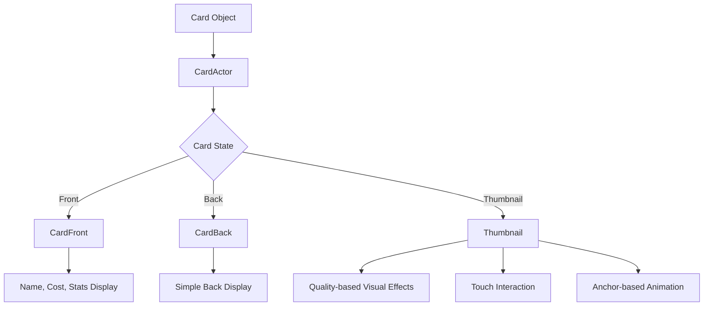
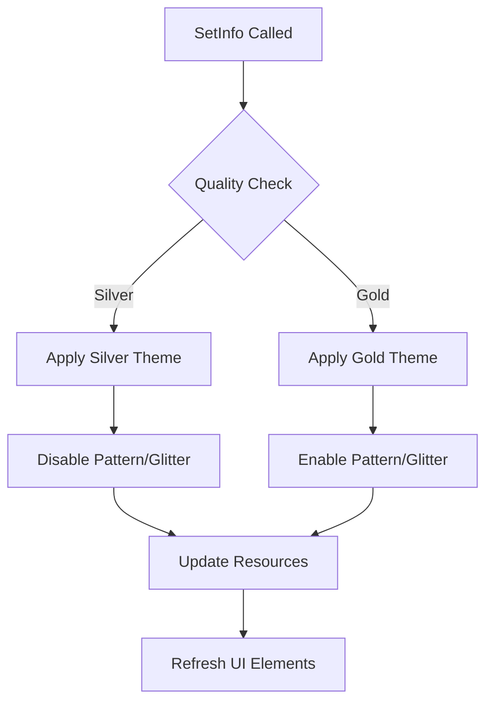
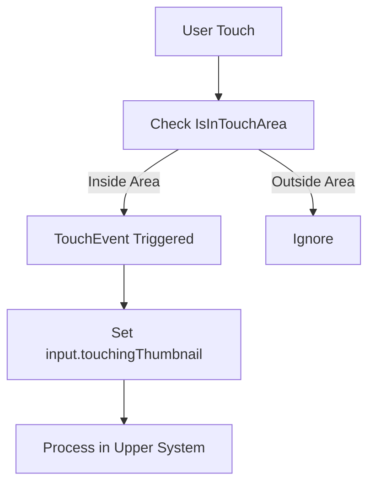

# Card Helper System

## Overview

The card helper system in Maple Duel is a collection of lightweight components responsible for the visual representation and interaction of cards. Located in the `RootDesk/MyDesk/Components/Helpers/` folder, these helpers efficiently manage various visual states and UI elements of cards.

## Core Card Helper Components

### CardActor.mlua
The base actor component that connects card objects to visual representations.

**Structure:**
```lua
@Component
script CardActor extends Component
    property Card object = nil
end
```

**Role:**
- Bridge between Card object and UI entity
- Basic identifier for cards
- Reference point for other helper components

### CardFront.mlua
Helper that manages all UI elements of the card front.

**Key Properties:**
```lua
property Card object = nil                -- Connected card object
property Entity signEntity = nil          -- Signal display entity
property NameTagComponent nametag = nil   -- Card name tag
property Entity touchAreaEntity = nil     -- Touch area
property Entity costEntity = nil          -- Cost display area
property Integer costInteger = nil        -- Cost number
property Entity hpEntity = nil            -- HP display area
property Integer hpInteger = nil          -- HP number
property Entity atkEntity = nil           -- Attack display area
property Integer atkInteger = nil         -- Attack number
```

**Initialization:**
```lua
@ExecSpace("ClientOnly")
method void OnBeginPlay()
    self.signEntity.Enable = false  -- Disable signal entity
end
```

**UI Elements:**
- **Name Tag**: Card name display
- **Cost Display**: MP cost visualization
- **Stat Display**: Attack/HP for minion cards
- **Signal**: Special status indication (disabled by default)
- **Touch Area**: Touch detection for card interaction

### CardBack.mlua
Handles simple representation of card backs.

**Structure:**
```lua
@Component
script CardBack extends Component
    property Card object = nil            -- Connected card object
    property Entity touchAreaEntity = nil -- Touch area
end
```

**Features:**
- Minimal structure for card back representation
- Only supports touch detection (drag, click, etc.)
- Hidden card content state

### Thumbnail.mlua
Advanced helper that manages complex visual representation of card thumbnails.

**Key Properties:**
```lua
property CardManager cardManager = nil
property ResourceManager resourceManager = nil

-- UI entities
property Entity costEntity = nil          -- Cost display
property SpriteRendererComponent costImage = nil
property Integer costInteger = nil
property Entity rarityEntity = nil        -- Rarity display
property Entity touchAreaEntity = nil     -- Touch area
property Entity backgroundEntity = nil    -- Background image
property Entity borderEntity = nil        -- Border
property Entity patternEntity = nil       -- Pattern effect
property Entity glitterEntity = nil       -- Glitter effect
property Entity anchorEntity = nil        -- Anchor point

-- Card information
property table info = nil                 -- Card information table
property string name = nil                -- Card name
property string variant = nil             -- Variant (Default, Skin1, etc.)
property string quality = nil             -- Quality (Silver, Gold)
property integer cost = nil               -- Cost
property string rarity = nil              -- Rarity

-- Animation and state
property any tweener = nil                -- Main tweener
property any anchorTweener = nil          -- Anchor tweener
property boolean isDisplayable = true     -- Displayable status
property integer displayTimer = 0         -- Display timer
```

## Thumbnail System Detailed Features

### Card Information Setup

```lua
@ExecSpace("ClientOnly")
method void SetInfo(table info)
    local name = info.name
    local variant = info.variant
    local quality = info.quality
    
    self.info = info
    self.name = name
    self.variant = variant
    self.quality = quality
    
    // Get information from card manager
    self.cost = self.cardManager:GetCost(info.name)
    self.rarity = self.cardManager:GetRarity(info.name)
    
    local resource = self.resourceManager:GetResource("Thumbnail")
    
    // Set visuals by quality
    local costImage, borderImage
    if self.quality == "Silver" then
        costImage = resource.silverCost
        borderImage = resource.silverBorder
        self.patternEntity.Enable = false
        self.glitterEntity.Enable = false
    elseif self.quality == "Gold" then
        costImage = resource.goldCost
        borderImage = resource.goldBorder
        self.patternEntity.Enable = true
        self.glitterEntity.Enable = true
    end
    
    // Update UI elements
    self.costInteger:SetInteger(self.cost)
    self.costImage.SpriteRUID = costImage
    self.backgroundEntity.SpriteRendererComponent.SpriteRUID = resource[name .. variant] or ""
    self.borderEntity.SpriteRendererComponent.SpriteRUID = borderImage
    self.rarityEntity.SpriteRendererComponent.SpriteRUID = resource[self.rarity] or ""
end
```

### Quality System (Silver/Gold)

**Silver Quality:**
- Basic silver border and cost icon
- Pattern and glitter effects disabled
- Simple visual representation

**Gold Quality:**
- Premium gold border and cost icon
- Pattern and glitter effects enabled
- Luxurious visual representation

### Touch Area Management

```lua
@ExecSpace("ClientOnly")
method boolean IsInTouchArea(Vector2 point)
    local transform = self.Entity.TransformComponent
    local position = transform.WorldPosition
    local angle = math.rad(transform.ZRotation)
    local x = position.x
    local y = position.y
    
    // Coordinate transformation (considering rotation)
    point.x = point.x - x
    point.y = point.y - y
    point.x = math.cos(angle) * point.x + math.sin(angle) * point.y
    point.y = -math.sin(angle) * point.x + math.cos(angle) * point.y
    
    // Touch area size (0.70 x 0.95)
    local touchAreaHalfX = 0.70 * 0.5
    local touchAreaHalfY = 0.95 * 0.5
    
    return point.x > -touchAreaHalfX and point.x < touchAreaHalfX
        and point.y > -touchAreaHalfY and point.y < touchAreaHalfY
end
```

**Touch Event Processing:**
```lua
@ExecSpace("ClientOnly")
method void OnBeginPlay()
    self.touchAreaEntity:ConnectEvent(TouchEvent, function()
        self.Entity.CurrentMap.Map.input.touchingThumbnail = self
    end)
end
```

### Anchor System

Anchor system for managing thumbnail position and movement:

```lua
-- Set anchor position immediately
method void SetAnchorTransform(Vector2 position)
    self:DestroyAnchorTweener()
    
    local worldPosition = self.Entity.TransformComponent.WorldPosition:Clone()
    
    local transform = self.anchorEntity.TransformComponent
    transform.Position.x = position.x
    transform.Position.y = position.y
    
    self.Entity.TransformComponent.WorldPosition = worldPosition
end

-- Animate move to anchor position
method void TransformAnchorTo(Vector2 position)
    if not isvalid(self.anchorEntity) then return end
    
    self:DestroyAnchorTweener()
    self.anchorTweener = _Tween:MoveTo(self.anchorEntity, position, 0.5, EaseType.QuintEaseOut, false)
end

-- Move thumbnail to anchor position
method void TransformToAnchor()
    if not isvalid(self.anchorEntity) then return end
    
    self:DestroyTweener()
    self.Entity.TransformComponent.Position.z = 0
    self.tweener = _Tween:MoveTo(self.Entity, Vector2.zero, 0.125, EaseType.Linear, false)
end
```

### Blueprint System

Provides blueprints for card creation:

```lua
-- Blueprint based on current thumbnail
method table GetBlueprint()
    return {
        info = self.info,
        enchantmentArray = {},
        independentVariableTable = {}
    }
end

-- Blueprint based on specific card name
method table GetBlueprintByName(string name)
    local blueprint
    if _UtilLogic:IsNilorEmptyString(name) then
        blueprint = {}
    else
        local modelName = string.format("%s%s%sCardFront", name, self.variant, self.quality)
        local modelId = _EntryService:GetModelIdByName(modelName)
        local variant = _UtilLogic:IsNilorEmptyString(modelId) and "Default" or self.variant
        blueprint = {
            info = {name = name, variant = variant, quality = self.quality},
            enchantmentArray = {},
            independentVariableTable = {}
        }
    end
    
    return blueprint
end
```

## Animation and Effects

### Layer Management

```lua
-- Bring to front (z = -40)
method void PlaceFront()
    self.Entity.TransformComponent.Position.z = -40
end

-- Send to back (z = 0)
method void PlaceBack()
    self.Entity.TransformComponent.Position.z = 0
end
```

### Tweener Management

```lua
-- Clean up main tweener
method void DestroyTweener()
    if self.tweener then
        self.tweener:Destroy()
    end
end

-- Clean up anchor tweener
method void DestroyAnchorTweener()
    if self.anchorTweener then
        self.anchorTweener:Destroy()
    end
end
```

### Display Control

```lua
-- Set non-displayable after certain time
method void SetDisplayTimer(number delaySeconds)
    self.displayTimer = _TimerService:SetTimerOnce(function()
        self.isDisplayable = false
    end, delaySeconds)
end

-- Clear display timer
method void ClearDisplayTimer()
    _TimerService:ClearTimer(self.displayTimer)
end
```

## Card Helper System Usage

### Card State Representation



### Quality System Flow



### Touch Interaction Flow



## Performance Optimization

### Resource Management
- Activate effects only when needed (Gold quality)
- Prevent memory leaks by proper tweener cleanup
- Efficient touch area calculation

### Animation Optimization
- Natural animations using EaseType
- Ensure responsiveness with short durations
- Prevent unnecessary animation duplication

## Code References

### Helper Components
- `RootDesk/MyDesk/Components/Helpers/CardActor.mlua` — Card actor base component
- `RootDesk/MyDesk/Components/Helpers/CardFront.mlua` — Card front UI management
- `RootDesk/MyDesk/Components/Helpers/CardBack.mlua` — Card back UI management
- `RootDesk/MyDesk/Components/Helpers/Thumbnail.mlua` — Card thumbnail system

### Integrated Systems
- `RootDesk/MyDesk/Components/Managers/CardManager.mlua` — Card data provision
- `RootDesk/MyDesk/Components/Managers/ResourceManager.mlua` — Visual resource management
- `RootDesk/MyDesk/Components/Input.mlua` — Touch input processing

## Characteristics of Card Helper System

### Modular Design
- Each helper focuses on specific role
- Reusable as independent functionality
- Layered by visual complexity

### Extensibility
- Easy addition of new card qualities
- Applicable to various visual effects
- Support for extended touch interaction patterns

### Performance Efficiency
- Lightweight component structure
- Effects activated only when needed
- Efficient animation management

This card helper system provides a flexible and efficient foundation for cards in Maple Duel to offer appropriate visual representations and interactions in various situations.
