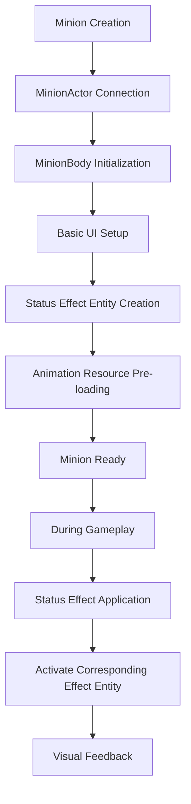
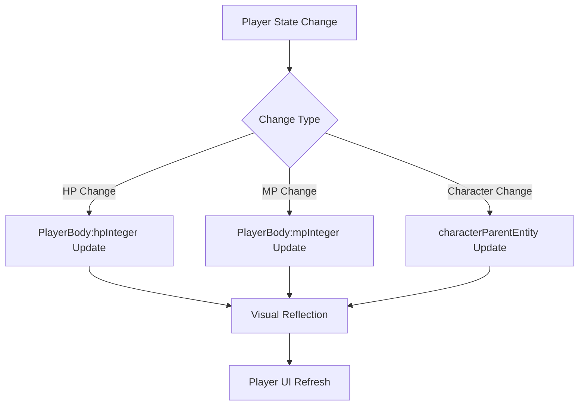
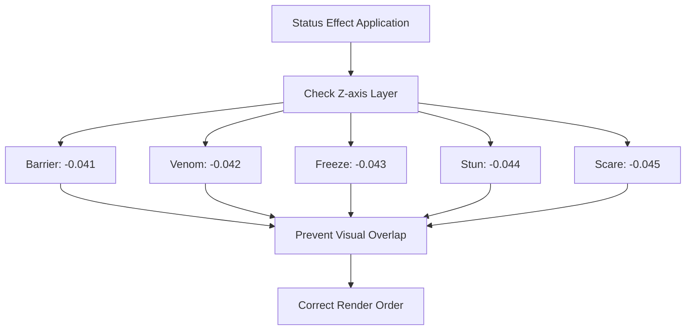

# Unit Helper System

## Overview

The unit helper system in Maple Duel is a layered component structure that manages visual representations and UI elements of players and minions. Located in the `RootDesk/MyDesk/Components/Helpers/` folder, this system inherits from base unit classes to provide specialized functionality for each unit type.

## Unit Helper Hierarchy

### Inheritance Structure

```
Component
├── UnitActor (Base unit actor)
│   ├── PlayerActor (Player actor)
│   └── MinionActor (Minion actor)
└── UnitBody (Base unit body)
    ├── PlayerBody (Player body)
    └── MinionBody (Minion body)
```

## Base Unit Helpers

### UnitActor.mlua
The base class for all unit actors.

**Structure:**
```lua
@Component
script UnitActor extends Component
    property Unit object = nil  -- Connected unit object
end
```

**Role:**
- Basic connection between unit object and visual representation
- Provides common foundation for inheritance classes
- Unit identification and reference point

### UnitBody.mlua
The base body class that manages UI elements of units.

**Key Properties:**
```lua
property Unit object = nil                -- Connected unit object
property Entity signEntity = nil          -- Signal display entity
property Entity touchAreaEntity = nil     -- Touch area
property Entity hpEntity = nil            -- HP display area
property Integer hpInteger = nil          -- HP number
```

**Initialization:**
```lua
@ExecSpace("ClientOnly")
method void OnBeginPlay()
    self.signEntity.Enable = false  -- Disable signal entity by default
end
```

**Common Features:**
- HP display management
- Touch interaction area provision
- Signal display system (disabled by default)

## Player Helpers

### PlayerActor.mlua
Player-specific actor component.

**Structure:**
```lua
@Component
script PlayerActor extends UnitActor
    property Player object = nil          -- Player object reference
    property Entity backgroundEntity = nil -- Background entity
end
```

**Features:**
- Inherits from UnitActor to provide player-specific functionality
- Player area visualization through background entity
- Player-specific UI element management

### PlayerBody.mlua
Manages player body and MP system.

**Key Properties:**
```lua
@Component
script PlayerBody extends UnitBody
    property Player object = nil               -- Player object reference
    property Entity characterParentEntity = nil -- Character parent entity
    property Entity mpEntity = nil             -- MP display area
    property Integer mpInteger = nil           -- MP number
end
```

**Specialized Features:**
- **MP System**: Visual display of player's mana points
- **Character Integration**: Integration with character avatar
- **Basic UI**: Inherits HP system from UnitBody

## Minion Helpers

### MinionActor.mlua
Minion-specific actor component.

**Structure:**
```lua
@Component
script MinionActor extends UnitActor
    property Minion object = nil  -- Minion object reference
end
```

**Features:**
- Minion-specialized version inheriting from UnitActor
- Direct connection with minion object
- Simple and efficient structure

### MinionBody.mlua
Core component that manages complex visual representation and status effects of minions.

**Key Properties:**
```lua
@Component
script MinionBody extends UnitBody
    property Minion object = nil          -- Minion object reference
    
    // Stat display
    property Entity atkEntity = nil       -- Attack display area
    property Integer atkInteger = nil     -- Attack number
    
    // Minion model
    property Entity minionEntity = nil    -- Minion model entity
    
    // Status effect entities
    property Entity barrierEntity = nil   -- Barrier effect
    property Entity venomEntity = nil     -- Venom effect
    property Entity freezeEntity = nil    -- Freeze effect
    property Entity stunEntity = nil      -- Stun effect
    property Entity scareEntity = nil     -- Scare effect
end
```

## Status Effect System

### Status Effect Initialization

```lua
@ExecSpace("ClientOnly")
method void OnBeginPlay()
    __base:OnBeginPlay()  -- Call UnitBody initialization
    
    // Pre-load minion animation resources
    _ResourceService:PreloadAsync(self.minionEntity.StateAnimationComponent.ActionSheet.Values, nil)
    
    // Dynamically create status effect entities
    self.barrierEntity = _SpawnService:SpawnByModelId(
        _EntryService:GetModelIdByName("Barrier"), "Barrier", 
        Vector3(0, 0.14, -0.041), self.Entity)
        
    self.venomEntity = _SpawnService:SpawnByModelId(
        _EntryService:GetModelIdByName("Venom"), "Venom", 
        Vector3(0, 0, -0.042), self.Entity)
        
    self.freezeEntity = _SpawnService:SpawnByModelId(
        _EntryService:GetModelIdByName("Freeze"), "Freeze", 
        Vector3(0, 0.45, -0.043), self.Entity)
        
    self.stunEntity = _SpawnService:SpawnByModelId(
        _EntryService:GetModelIdByName("Stun"), "Stun", 
        Vector3(0, 0.45, -0.044), self.Entity)
        
    self.scareEntity = _SpawnService:SpawnByModelId(
        _EntryService:GetModelIdByName("Scare"), "Scare", 
        Vector3(0, 0.45, -0.045), self.Entity)
end
```

### Position and Layer for Each Status Effect

**Position Placement:**
- **Barrier**: (0, 0.14, -0.041) - Slightly above minion center
- **Venom**: (0, 0, -0.042) - Minion center
- **Freeze**: (0, 0.45, -0.043) - Top of minion
- **Stun**: (0, 0.45, -0.044) - Top of minion (behind Freeze)
- **Scare**: (0, 0.45, -0.045) - Top of minion (furthest back)

**Z-axis Layering:**
Layer separation with subtle Z-axis differences to prevent status effects from overlapping

## Status Effect Types

### Barrier (Shield)
- **Position**: Minion center area
- **Function**: Visual representation of damage absorption
- **Status**: Active when shield is possessed

### Venom (Poison)
- **Position**: Minion center
- **Function**: Poison damage indication
- **Status**: Poisoned state display

### Freeze (Frozen)
- **Position**: Top of minion
- **Function**: Action disabled state display
- **Status**: Active when frozen

### Stun (Stunned)
- **Position**: Top of minion
- **Function**: Turn skip state display
- **Status**: Active when stunned

### Scare (Fear)
- **Position**: Top of minion
- **Function**: Attack disabled state display
- **Status**: Active when in fear state

## Unit Helper System Flow

### Minion Creation and Initialization



### Player UI Update



### Status Effect Layer Management



## Performance Optimization

### Resource Pre-loading
```lua
// Pre-load minion animation resources
_ResourceService:PreloadAsync(self.minionEntity.StateAnimationComponent.ActionSheet.Values, nil)
```

### Dynamic Entity Creation
- Status effect entities created only once during initialization
- Performance optimization through Enable/Disable toggle as needed
- Minimize memory usage

### Hierarchical Inheritance Structure
- Common functionality handled in base classes
- Only specialized functionality implemented in derived classes
- Minimize code duplication

## Extensibility

### Adding New Status Effects
```lua
// Example MinionBody.mlua extension
property Entity newEffectEntity = nil

// Add in OnBeginPlay
self.newEffectEntity = _SpawnService:SpawnByModelId(
    _EntryService:GetModelIdByName("NewEffect"), "NewEffect", 
    Vector3(0, 0.3, -0.046), self.Entity)
```

### Custom Unit Types
- Create new unit types by inheriting from UnitActor/UnitBody
- Add specialized functionality while maintaining basic functionality
- Provide consistent interface

## Code References

### Base Helpers
- `RootDesk/MyDesk/Components/Helpers/UnitActor.mlua` — Base unit actor
- `RootDesk/MyDesk/Components/Helpers/UnitBody.mlua` — Base unit body

### Player Helpers
- `RootDesk/MyDesk/Components/Helpers/PlayerActor.mlua` — Player actor
- `RootDesk/MyDesk/Components/Helpers/PlayerBody.mlua` — Player body (MP system)

### Minion Helpers
- `RootDesk/MyDesk/Components/Helpers/MinionActor.mlua` — Minion actor
- `RootDesk/MyDesk/Components/Helpers/MinionBody.mlua` — Minion body (status effect system)

### Integrated Components
- `RootDesk/MyDesk/Components/Objects/Player.mlua` — Player logic component
- `RootDesk/MyDesk/Components/Objects/Minion.mlua` — Minion logic component
- `RootDesk/MyDesk/Components/Objects/Unit.mlua` — Base unit logic

## Characteristics of Unit Helper System

### Hierarchical Design
- Code reusability through inheritance
- Clear separation of common and specialized functionality
- Improved maintainability

### Status Effect Specialization
- Systematic management of various minion status effects
- Prevention of overlap through visual layer separation
- Performance optimization through dynamic creation

### Extensibility
- Easy addition of new unit types
- Support for status effect system expansion
- Maintains consistent interface

### Performance Efficiency
- Rendering optimization through pre-loading
- Effect system activated only when needed
- Minimized memory usage

This unit helper system provides a flexible architecture that allows players and minions in Maple Duel to have visual representations and interactions suited to their respective characteristics while efficiently reusing common functionality.
