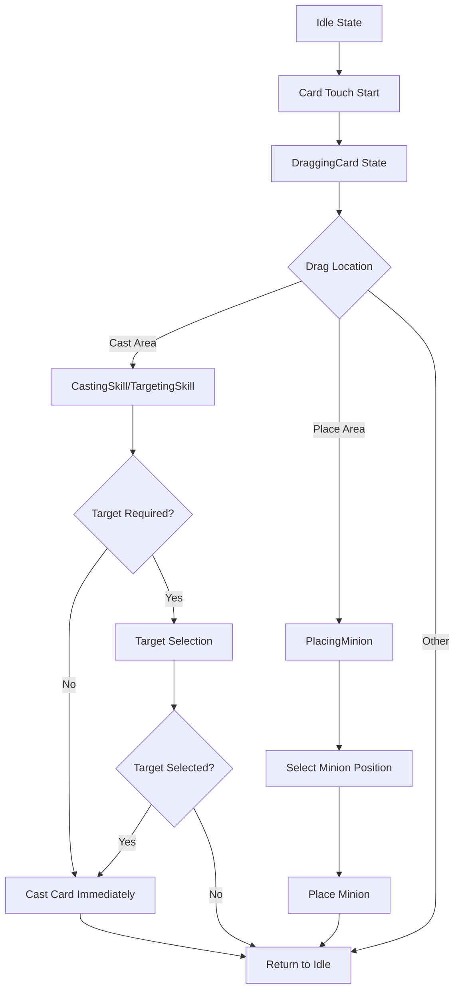
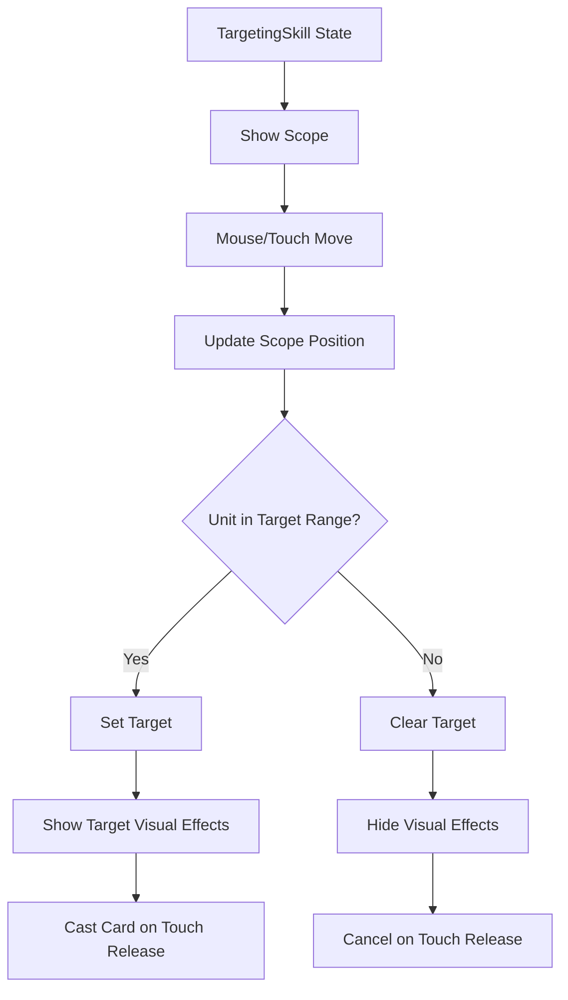

# Input Processing System

## Overview

The input processing system of Maple Duel manages complex game interactions such as card drag and drop, targeting, and minion placement by receiving touch/mouse events through `Input.mlua`. Designed with a state-based architecture, it consistently handles various input scenarios.

## Core Input System

### Input.mlua
Component that centrally manages all game inputs.

**Main Properties:**
```lua
@Component
script Input extends Component

    // Manager dependencies
    property DeckManager deckManager = nil
    property ResourceManager resourceManager = nil
    property UIManager uiManager = nil
    property Duel duel = nil
    property CommandManager commandManager = nil
    
    // Area entities
    property Entity castAreaEntity = nil      -- Skill cast area
    property Entity placeAreaEntity = nil     -- Minion placement area
    property Entity putAreaEntity = nil       -- Deck edit card addition area
    property Entity eraseAreaEntity = nil     -- Card/thumbnail deletion area
    property Entity scopeEntity = nil         -- Targeting scope entity
    property Entity lineEntity = nil          -- Targeting line entity
    
    // State management
    property string state = "Idle"            -- Current input state
    
    // Currently touching/dragging objects
    property Card touchingCard = nil          -- Card being touched
    property Minion touchingMinion = nil      -- Minion being touched
    property Thumbnail touchingThumbnail = nil -- Thumbnail being touched
    
    // Currently active objects
    property Card card = nil                  -- Card being dragged
    property Unit target = nil                -- Unit being targeted
    property Thumbnail thumbnail = nil        -- Thumbnail in operation
end
```

## State-Based Input Management

### Input State Definition

**Basic States:**
- **"Idle"** - Waiting state (doing nothing)

**Card-Related States:**
- **"DraggingCard"** - Dragging card
- **"CastingSkill"** - Casting skill card (no target required)
- **"TargetingSkill"** - Selecting skill target (target required)
- **"PlacingMinion"** - Placing minion card

**Deck Editing States:**
- **"PuttingCard"** - Adding card to deck
- **"PuttingThumbnail"** - Placing thumbnail in deck
- **"ErasingThumbnail"** - Deleting thumbnail
- **"ErasingCard"** - Deleting card

### State Transition System

```lua
method void SetState(string toState)
    if self.state == toState then
        return  // Ignore if same state
    end
    
    local fromState = self.state
    self.state = toState
    
    // Handle state-specific transition logic
    // ... (various fromState -> toState combination handling)
end
```

## Touch Event Processing

### Touch Start (ScreenTouchPressEvent)

```lua
@EventSender("Service", "InputService")
handler HandleScreenTouchPressEvent(ScreenTouchPressEvent event)
    local TouchId = event.TouchId
    local TouchPoint = event.TouchPoint
    
    local worldPosition = _UILogic:ScreenToWorldPosition(TouchPoint)
    
    // Identify touched objects
    if isvalid(self.touchingCard) and self.touchingCard:IsInTouchArea(worldPosition) then
        // Handle card touch
        if self.touchingCard.isDisplayable then
            _SoundService:PlaySound(pickCardSound, 1)
            self:SetState("DraggingCard")
        end
    end
    
    if isvalid(self.touchingThumbnail) then
        // Handle thumbnail touch
        if cardModule.isDeckEditMode and not self.touchingThumbnail:IsInTouchArea(worldPosition) then
            _SoundService:PlaySound(pickCardSound, 1)
            self:SetState("ErasingThumbnail")
        end
    end
end
```

### Touch Move (ScreenTouchEvent)

```lua
@EventSender("Service", "InputService") 
handler HandleScreenTouchEvent(ScreenTouchEvent event)
    local TouchId = event.TouchId
    local TouchPoint = event.TouchPoint
    local worldPosition = _UILogic:ScreenToWorldPosition(TouchPoint)
    
    local state = self.state
    
    // Handle drag by state
    if state == "DraggingCard" or state == "CastingSkill" or state == "PlacingMinion" 
       or state == "PuttingCard" or state == "PuttingThumbnail" then
        // Update card/thumbnail position
        local transform = self.card.actor.Entity.TransformComponent
        transform.WorldPosition.x = worldPosition.x
        transform.WorldPosition.y = worldPosition.y
        transform.WorldZRotation = 0
        self.card:PlaceFront()
    end
    
    if state == "TargetingSkill" then
        // Update targeting scope position
        self:PlaceScope(worldPosition)
    end
    
    if state == "PlacingMinion" then
        // Update minion placement position
        local minion = self.duel.placingMinion
        local transform = minion.actor.Entity.TransformComponent
        transform.WorldPosition.x = worldPosition.x
        transform.WorldPosition.y = worldPosition.y
        minion:PlaceFront()
        
        // Calculate placement position within field
        local field = self.card.player.field
        field:InsertPlacingMinon(worldPosition.x)
    end
end
```

### Touch Release (ScreenTouchReleaseEvent)

```lua
@EventSender("Service", "InputService")
handler HandleScreenTouchReleaseEvent(ScreenTouchReleaseEvent event)
    local TouchId = event.TouchId
    local TouchPoint = event.TouchPoint
    local worldPosition = _UILogic:ScreenToWorldPosition(TouchPoint)
    local state = self.state
    
    // Handle card click (gallery mode)
    if isvalid(self.touchingCard) and self.touchingCard:IsInTouchArea(worldPosition) then
        if self.uiManager.GalleryModule.isOpen then
            if self.touchingCard.isFront then
                self.uiManager.GalleryModule:SelectNext()
            end
        end
    end
    
    // Handle completion by state
    if state == "CastingSkill" then
        self:PlayCard()
        self:SetState("Idle")
    elseif state == "TargetingSkill" then
        if isvalid(self.target) then
            self:PlayCard()
            self:SetState("Idle")
        end
    elseif state == "PlacingMinion" then
        self:PlayCard()
        self:SetState("Idle")
    end
    
    // Return other states to Idle
    if state ~= "Idle" then
        self:SetState("Idle")
    end
end
```

## Area-Based Interactions

### Trigger Area System

**Cast Area (Skill Cast Area):**
```lua
self.castAreaEntity:ConnectEvent(TriggerEnterEvent, function(event)
    local TriggerBodyEntity = event.TriggerBodyEntity
    
    if self.state == "DraggingCard" and TriggerBodyEntity == self.card.actor.Entity then
        if self.card.isPlayable and self.card.category == "Skill" then
            if self.card.requiresTarget then
                self:SetState("TargetingSkill")
            else
                self:SetState("CastingSkill")
            end
        else
            self:SetState("Idle")
            self.touchingCard = nil
        end
    end
end)
```

**Place Area (Minion Placement Area):**
```lua
self.placeAreaEntity:ConnectEvent(TriggerEnterEvent, function(event)
    local TriggerBodyEntity = event.TriggerBodyEntity
    
    if self.state == "DraggingCard" and TriggerBodyEntity == self.card.actor.Entity then
        if self.card.isPlayable then
            local field = self.card.player.field
            if self.card.category == "Minion" and not field:IsFull() and field.isPlaceable then
                self:SetState("PlacingMinion")
            end
        else
            self:SetState("Idle")
            self.touchingCard = nil
        end
    end
end)
```

**Scope Area (Targeting Range):**
```lua
self.scopeEntity:ConnectEvent(TriggerEnterEvent, function(event)
    local TriggerBodyEntity = event.TriggerBodyEntity
    
    local unit = TriggerBodyEntity.UnitBody and TriggerBodyEntity.UnitBody.object
    if self.state == "TargetingSkill" and isvalid(unit) and 
       unit.signState == "Targetable" and not isvalid(self.target) then
        self:SetTarget(unit)
    end
end)
```

## State-Specific Transition Logic

### Idle → DraggingCard

```lua
if fromState == "Idle" and toState == "DraggingCard" then
    self.card = self.touchingCard
    self.card:DestroyTweener()  // Clear existing animations
    self.card.actor.Entity:AttachTo(self.card.hand.Entity)  // Attach to hand
    self.card:SetDisplayTimer(0.25)  // Set display timer
end
```

### DraggingCard → TargetingSkill

```lua
if fromState == "DraggingCard" and toState == "TargetingSkill" then
    self.commandManager:SetTargetableSigns(self.card)  // Show targetable units
    self.card:TransformToTarget()  // Transform card to targeting mode
end
```

### DraggingCard → PlacingMinion

```lua
if fromState == "DraggingCard" and toState == "PlacingMinion" then
    self.card.actor.Entity.Visible = false  // Hide original card
    self.card.touchAreaEntity.Enable = false  // Disable touch
    self.duel.placingMinion:SetBlueprint(self.card:GetMinionBlueprint())  // Set minion preview
end
```

### Gameplay States → Idle

```lua
if (fromState == "CastingSkill" or fromState == "TargetingSkill" or fromState == "PlacingMinion") 
   and toState == "Idle" then
    self.card:AttachToAnchor()  // Reattach to anchor
    self.card:TransformToAnchor()  // Animate return to original position
    self.card.isDisplayable = true  // Restore displayable state
    self.card = nil  // Clear reference
end
```

## Visual Feedback System

### Targeting Visual Effects

```lua
method void PlaceScope(Vector2 worldPosition)
    // Set targeting scope position
    local scopeTransform = self.scopeEntity.TransformComponent
    scopeTransform.WorldPosition.x = worldPosition.x
    scopeTransform.WorldPosition.y = worldPosition.y
end

method void ShowScope()
    self.scopeEntity.Enable = true
end

method void HideScope() 
    self.scopeEntity.Enable = false
end
```

### Target Setting and Clearing

```lua
method void SetTarget(Unit target)
    if self.target == target then return end
    
    if isvalid(self.target) then
        self.target:SetSign("Targetable")  // Clear previous target indication
    end
    
    self.target = target
    
    if isvalid(self.target) then
        self.target:SetSign("Targeted")  // Show new target indication
        self:ShowScope()
        self:ShowLine()
    else
        self:HideScope()
        self:HideLine()
    end
end
```

## Card Play Execution

### Card Play Command

```lua
method void PlayCard()
    if not isvalid(self.card) then return end
    
    if self.card.category == "Skill" and self.card.requiresTarget then
        if isvalid(self.target) then
            // Execute skill with target
            self.commandManager:RunCommand("PlayCard", 
                {self.card, self.target}, {})
        end
    else
        // Execute normal card or skill without target
        self.commandManager:RunCommand("PlayCard", 
            {self.card}, {})
    end
end
```

## Input State Flow

### Card Drag and Drop Flow



### Targeting System Flow



## Code Reference

### Core Components
- `RootDesk/MyDesk/Components/Input.mlua` — Input processing main system

### Integration Systems
- `RootDesk/MyDesk/Components/Managers/CommandManager.mlua` — Card play command processing
- `RootDesk/MyDesk/Components/Objects/Card.mlua` — Card interaction support
- `RootDesk/MyDesk/Components/Helpers/Thumbnail.mlua` — Thumbnail touch area calculation
- `RootDesk/MyDesk/Components/Managers/UIManager.mlua` — UI state integration

### Key Methods
- `Input:SetState()` — Input state transition management
- `Input:PlayCard()` — Card play execution
- `Input:SetTarget()` — Target setting and visual effects
- `Input:PlaceScope()` — Targeting scope position setting

## Input Processing System Features

### State-Based Management
- Clear state definition for input mode distinction
- Automatic UI updates with state transitions
- Consistent handling of complex drag and drop scenarios

### Area-Based Interactions
- Intuitive interactions through trigger areas
- Automatic state transitions based on card type
- Visual feedback integrated with area detection

### Multimodal Support
- Unified handling of touch and mouse events
- Support for both mobile and desktop environments
- Consistent user experience

### Performance Optimization
- Prevention of unnecessary state transitions
- Efficient touch area calculations
- Reference cleanup to prevent memory leaks

This input processing system is the core system that handles complex card game interactions in Maple Duel intuitively and responsively, providing satisfying control to players.
