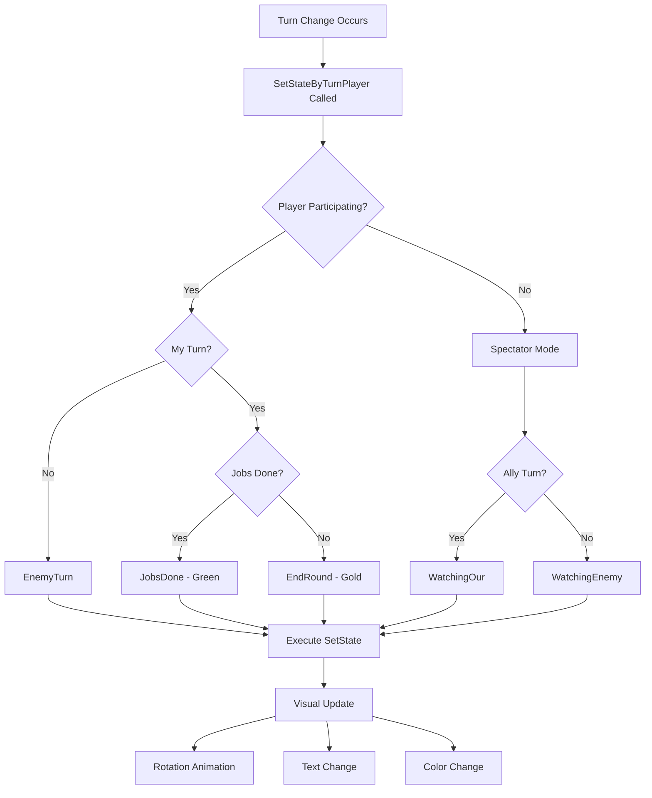
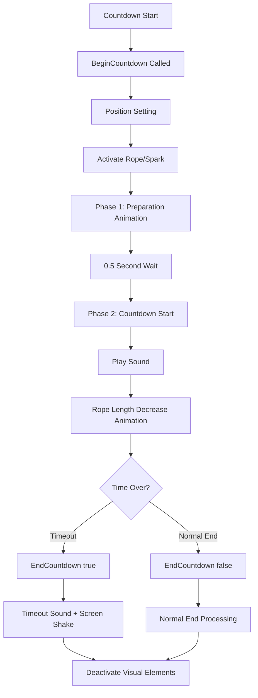
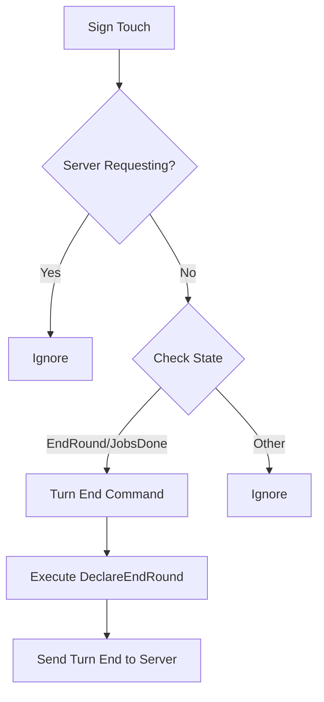

# Turn System UI

## Overview

The turn system UI of Maple Duel visually displays the current game turn state and manages player interactions through `TurnSign.mlua`. It clearly communicates the progress of turn-based gameplay through turn indicators, countdown timers, and touch interactions.

## Core Turn Display System

### TurnSign.mlua
UI component responsible for turn state display and interaction.

**Main Properties:**
```lua
@Component
script TurnSign extends Component

    // Manager dependencies
    property ResourceManager resourceManager = nil
    property Duel duel = nil
    property CommandManager commandManager = nil
    
    // UI entities
    property Entity signEntity = nil         -- Sign entity
    property Entity imageEntity = nil        -- Background image
    property Entity jobsDoneEntity = nil     -- Jobs done indicator
    property Entity textEntity = nil         -- Text entity
    property TextComponent textComponent = nil -- Text component
    
    // Countdown system
    property ClimbableSpriteRendererComponent rope = nil -- Rope visualization
    property TransformComponent spark = nil              -- Spark effect
    
    // Animation management
    property any signTweener = nil           -- Sign animation
    property any textTweener = nil           -- Text animation
    property any countdownTweener = nil      -- Countdown animation
    property any countdownTimer = nil        -- Countdown timer
    
    // State management
    property string state = "Idle"           -- Current turn state
end
```

## Turn State System

### Turn State Definition

**Basic State:**
- **"Idle"** - Waiting state (default)

**Player Turn States:**
- **"EndRound"** - My turn, can end round
- **"JobsDone"** - My turn, all jobs completed (green)

**Opponent Turn State:**
- **"EnemyTurn"** - Opponent's turn

**Spectator States:**
- **"WatchingOur"** - Watching ally
- **"WatchingEnemy"** - Watching enemy

**Game Progress States:**
- **"Waiting"** - Waiting
- **"Battle"** - In battle

### State-Specific Visual Settings

```lua
method void SetState(string toState)
    if self.state == toState then return end
    
    local fromState = self.state
    self.state = toState
    
    local zRotation, text, color, jobsDone
    
    if toState == "Idle" then
        zRotation = 0
        text = ""
        color = Color.FromHexCode("#DEA214")  -- Gold
        jobsDone = false
    elseif toState == "EndRound" then
        zRotation = 15   -- Right tilt
        text = "EndRound"
        color = Color.FromHexCode("#DEA214")  -- Gold
        jobsDone = false
    elseif toState == "JobsDone" then
        zRotation = 15   -- Right tilt
        text = "EndRound"
        color = Color.FromHexCode("#2CB571")  -- Green (completed state)
        jobsDone = true
    elseif toState == "EnemyTurn" then
        zRotation = -15  -- Left tilt
        text = "EnemyTurn"
        color = Color.FromHexCode("#9B9B9A")  -- Gray
        jobsDone = false
    elseif toState == "WatchingOur" then
        zRotation = 15   -- Right tilt
        text = "Watching"
        color = Color.FromHexCode("#9B9B9A")  -- Gray
    elseif toState == "WatchingEnemy" then
        zRotation = -15  -- Left tilt
        text = "Watching"
        color = Color.FromHexCode("#9B9B9A")  -- Gray
    elseif toState == "Waiting" then
        zRotation = 0    -- Center align
        text = "Waiting"
        color = Color.FromHexCode("#9B9B9A")  -- Gray
    elseif toState == "Battle" then
        zRotation = 0    -- Center align
        text = "Battle"
        color = Color.FromHexCode("#F78427")  -- Orange (battle state)
    end
    
    // Update visual elements
    self:RotateSign(zRotation)
    self:SetText(text)
    self:SetColor(color)
    self.jobsDoneEntity.Enable = jobsDone
end
```

## Player-Based State Setting

### Automatic State Determination

```lua
method void SetStateByTurnPlayer(Player turnPlayer)
    local state
    local player = _UserService.LocalPlayer.Character.player
    
    if isvalid(player) then
        // Player is participating in game
        if player == turnPlayer then
            // My turn
            if player:JobsDone() then
                state = "JobsDone"      -- All jobs completed
            else
                state = "EndRound"      -- Can end round
            end
        else
            // Opponent's turn
            state = "EnemyTurn"
        end
    else
        // Spectator mode
        state = turnPlayer.isOurs and "WatchingOur" or "WatchingEnemy"
    end
    
    self:SetState(state)
end
```

**State Determination Logic:**
1. Check if current player is game participant
2. Distinguish my turn/opponent turn by comparing with turn player
3. Determine detailed state based on job completion during my turn
4. Determine state based on ally/enemy for spectators

## Visual Animations

### Sign Rotation Animation

```lua
method void RotateSign(number zRotation)
    // Clear existing animation
    if self.signTweener then
        self.signTweener:Destroy()
    end
    
    // Smooth rotation with elastic easing
    local currentRotation = self.signEntity.TransformComponent.ZRotation
    self.signTweener = _TweenLogic:RotateTo(
        self.signEntity, 
        zRotation - currentRotation, 
        1,                           -- 1 second duration
        EaseType.ElasticEaseOut     -- Elastic effect
    )
end
```

### Text Damping Effect

```lua
method void SetText(string text)
    self.textComponent.Text = text
    
    // Clear existing animation
    if self.textTweener then
        self.textTweener:Destroy()
    end
    
    // Damping vibration effect on text change
    self.textTweener = _Tween:Damp(
        self.textEntity, 
        Vector2.one,    -- Target scale
        0.75,           -- Amplitude
        0.5             -- Duration
    )
end
```

### Color Setting

```lua
method void SetColor(Color color)
    self.imageEntity.SpriteRendererComponent.Color = color
end
```

## Countdown System

### Countdown Start

```lua
method void BeginCountdown(number countdownTime, boolean isOurTurn)
    // Position adjustment (based on my turn/opponent turn)
    local yPositionDelta = isOurTurn and 0 or 0.25
    self.rope.Entity.TransformComponent.Position.y = -0.55 + yPositionDelta
    
    // Activate visual elements
    self.rope.Entity.Visible = true
    self.spark.Entity.Visible = true
    
    local resource = self.resourceManager:GetResource("Countdown")
    local spareTime = 0.5  // Preparation time
    
    // Phase 1: Preparation phase animation (0.5 seconds)
    self.countdownTweener = _TweenLogic:PlayTween(0, 1, spareTime, EaseType.Linear, 
        function(t)
            self:PlaceRope(t, isOurTurn)
        end)
    
    // Phase 2: Start actual countdown
    self.countdownTimer = _TimerService:SetTimerOnce(function()
        // Play countdown sound
        _SoundService:PlaySound(resource.sound, 1.5)
        
        // Countdown animation (reverse)
        self.countdownTweener = _TweenLogic:PlayTween(
            countdownTime - spareTime, 0,           -- Time to 0
            countdownTime - spareTime,              -- Actual countdown time
            EaseType.Linear, 
            function(t)
                local value = math.max(0, (t - 1) / (countdownTime - spareTime))
                self:PlaceRope(value, isOurTurn)
            end)
    end, spareTime)
end
```

### Countdown End

```lua
method void EndCountdown(boolean isTimeout)
    // Clear animations
    if self.countdownTweener then
        self.countdownTweener:Destroy()
    end
    _TimerService:ClearTimer(self.countdownTimer)
    
    // Deactivate visual elements
    self.rope.Entity.Visible = false
    self.spark.Entity.Visible = false
    
    local resource = self.resourceManager:GetResource("Countdown")
    _SoundService:StopSound(resource.sound)
    
    // Handle timeout
    if isTimeout then
        _SoundService:PlaySound(resource.timeoutSound, 1.5)
        _CameraService:GetCurrentCameraComponent():ShakeCamera(1, 0.5) -- Screen shake
    end
end
```

### Rope Visualization

```lua
method void PlaceRope(number value, boolean isOurTurn)
    local yPositionDelta = isOurTurn and 0 or 0.3
    
    // Adjust rope length (shortens over time)
    self.rope.TiledSize.y = 0.01 + 3.99 * value
    
    // Adjust spark position (placed at rope end)
    self.spark.Position.y = -0.35 - 1.3 * value + yPositionDelta
end
```

**Visualization Principle:**
- **Rope**: Adjust length with `TiledSize.y` (gets shorter over time)
- **Spark**: Positioned at rope end to visualize timing
- **Position Offset**: Position differentiation based on my turn/opponent turn

## Touch Interaction

### Turn End Touch

```lua
method void OnBeginPlay()
    self.imageEntity:ConnectEvent(TouchEvent, function(event)
        local TouchId = event.TouchId
        local TouchPoint = event.TouchPoint
        
        // Check conditions
        if not _Server:IsRequesting() and 
           (self.duel.turnSign.state == "EndRound" or self.duel.turnSign.state == "JobsDone") then
            
            local player = _UserService.LocalPlayer.Character.player
            if isvalid(player) then
                // Execute turn end command
                self.commandManager:RunCommand("DeclareEndRound", {player, false}, {})
            end
        end
    end)
end
```

**Interaction Conditions:**
1. Not requesting from server
2. Current state is "EndRound" or "JobsDone"
3. Valid player exists

## Turn System UI Flow

### Turn State Change Flow



### Countdown System Flow



### Touch Interaction Flow



## State-Specific Visual Characteristics

### Color Scheme

**Gold (#DEA214):**
- Idle, EndRound states
- Represents basic active state

**Green (#2CB571):**
- JobsDone state
- All jobs completed (positive)

**Gray (#9B9B9A):**
- EnemyTurn, Watching, Waiting states
- Inactive or waiting state

**Orange (#F78427):**
- Battle state
- Battle in progress (tension)

### Rotation Angles

**Center Align (0 degrees):**
- Idle, Waiting, Battle

**Right Tilt (+15 degrees):**
- EndRound, JobsDone, WatchingOur
- Ally-related states

**Left Tilt (-15 degrees):**
- EnemyTurn, WatchingEnemy  
- Enemy-related states

## Code Reference

### Core Components
- `RootDesk/MyDesk/Components/TurnSign.mlua` — Turn system UI main component

### Integration Systems
- `RootDesk/MyDesk/Components/Managers/CommandManager.mlua` — Turn end command processing
- `RootDesk/MyDesk/Components/Objects/Duel.mlua` — Turn state information provider
- `RootDesk/MyDesk/Components/Objects/Player.mlua` — Player job completion status check

### Key Methods
- `TurnSign:SetState()` — Turn state visual setting
- `TurnSign:SetStateByTurnPlayer()` — Automatic state determination based on player
- `TurnSign:BeginCountdown()` — Countdown start
- `TurnSign:EndCountdown()` — Countdown end

## Turn System UI Features

### Intuitive Visual Design
- State distinction by color (gold/green/gray/orange)
- Turn affiliation indication by rotation angle (ally/enemy/neutral)
- Clear text labels showing current state

### Real-time Feedback
- State change emphasis with elastic animation
- Text change visualization with damping effect
- Time visualization with countdown rope/spark

### User Interaction
- Turn end possible through touch
- Conditional interaction based on state
- Visual/audio feedback on timeout

### Performance Optimization
- Prevent unnecessary state changes
- Proper cleanup of animation tweeners
- Efficient countdown timer management

This turn system UI is a core interface that clearly communicates the current situation in Maple Duel's turn-based gameplay and guides players to act at appropriate timing.
