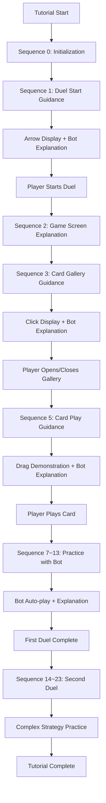
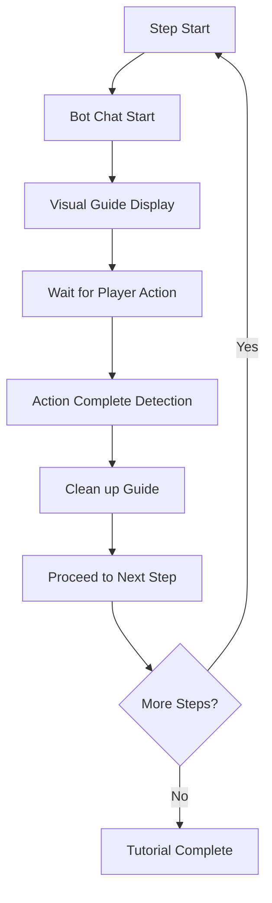
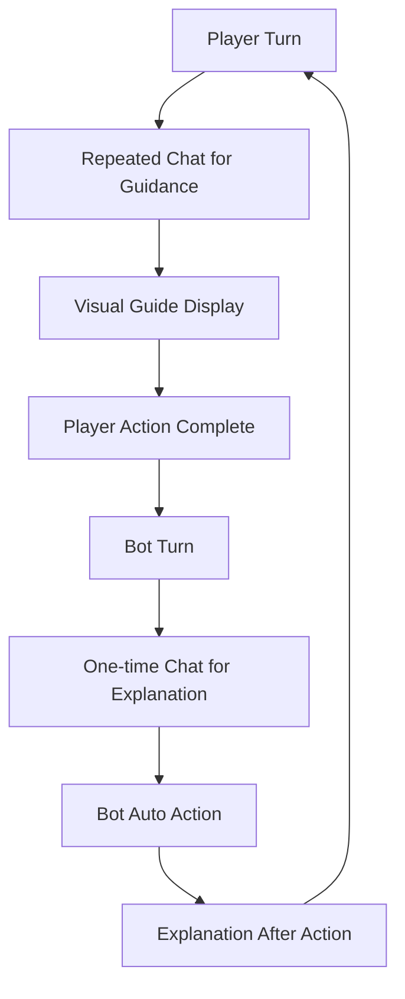

# Tutorial Guide System

## Overview

The tutorial guide system in Maple Duel provides step-by-step instruction on basic game controls and rules for new players through `Tutorial.mlua`. It combines visual guides (arrows, clicks, drag indicators) with bot conversations to deliver an intuitive and systematic learning experience.

## Core Tutorial System

### Tutorial.mlua
A component that manages tutorial progression and visual guides.

**Key Properties:**
```lua
@Component
script Tutorial extends Component

    // Visual guide entities
    property Entity arrowEntity = nil        -- Arrow guide
    property Entity clickEntity = nil        -- Click guide
    property Entity dragEntity = nil         -- Drag guide
    
    // Tutorial progression management
    property Bot bot = nil                   -- Tutorial bot
    property integer duelId = 0              -- Duel ID
    property integer sequence = 0            -- Current tutorial step
    
    // Drag animation management
    property integer dragTimer_1 = 0         -- Drag timer 1
    property integer dragTimer_2 = 0         -- Drag timer 2
    property any dragTweener = nil           -- Drag animation
end
```

## Visual Guide System

### Arrow Guide

```lua
@ExecSpace("ClientOnly")
method void SetArrow(Vector3 position)
    // Display arrow at specified position
    self.arrowEntity.TransformComponent.WorldPosition = position:Clone()
end

@ExecSpace("ClientOnly")
method void ClearArrow()
    // Hide arrow by moving off-screen
    self.arrowEntity.TransformComponent.WorldPosition = Vector3(100, 100, 0)
end
```

**Usage Example:**
```lua
// Arrow pointing to duel start button
self:SetArrow(Vector3(-3.05, -0.5, 0))
```

### Click Guide

```lua
@ExecSpace("ClientOnly")
method void SetClick(Vector3 position)
    // Display click indicator at specified position
    self.clickEntity.TransformComponent.WorldPosition = position:Clone()
end

@ExecSpace("ClientOnly")
method void ClearClick()
    // Hide click indicator by moving off-screen
    self.clickEntity.TransformComponent.WorldPosition = Vector3(100, 100, 0)
end
```

**Usage Example:**
```lua
// Indicator to click on card
self:SetClick(Vector3(0, -2.8, 0))
```

### Drag Guide

```lua
@ExecSpace("ClientOnly")
method void SetDrag(Vector3 source, Vector3 destination)
    // Clean up existing timers and animation
    _TimerService:ClearTimer(self.dragTimer_1)
    _TimerService:ClearTimer(self.dragTimer_2)
    if self.dragTweener then
        self.dragTweener:Destroy()
    end
    
    // Execute drag animation repeatedly
    self.dragTimer_1 = _TimerService:SetTimerRepeat(function()
        // Place drag entity at start position
        self.dragEntity.TransformComponent.WorldPosition = source:Clone()
        _Util:Restart(self.dragEntity.SpriteRendererComponent)  // Restart sprite
        
        // Start movement animation to destination after 0.5 seconds
        self.dragTimer_2 = _TimerService:SetTimerOnce(function()
            self.dragTweener = _Tween:MoveTo(
                self.dragEntity, 
                destination:ToVector2(), 
                0.8,                    // 0.8 seconds duration
                EaseType.CubicEaseOut,  // Smooth easing
                true                    // Use world coordinates
            )
        end, 0.5)
    end, 1.6)  // Repeat every 1.6 seconds
end

@ExecSpace("ClientOnly")
method void ClearDrag()
    // Clean up all drag-related timers and animation
    _TimerService:ClearTimer(self.dragTimer_1)
    _TimerService:ClearTimer(self.dragTimer_2)
    if self.dragTweener then
        self.dragTweener:Destroy()
    end
    
    // Move drag entity off-screen
    self.dragEntity.TransformComponent.WorldPosition = Vector3(100, 100, 0)
end
```

**Usage Example:**
```lua
// Show how to drag card from hand to field
self:SetDrag(Vector3(0, -2.8, 0), Vector3(0, -1, 0))
```

## Tutorial Progression System

### Sequence-based Progression

```lua
@ExecSpace("ServerOnly")
method void Progress(string key)
    _Server.sender = nil
    
    local success = false
    
    // Check progression conditions by matching current sequence and key
    if self.sequence == 0 then
        success = true
    elseif self.sequence == 1 and key == "PreBeginDuel" then
        success = true
    elseif self.sequence == 2 and key == "PostBeginDuel" then
        success = true
    elseif self.sequence == 3 and key == "OpenGallery" then
        success = true
    elseif self.sequence == 4 and key == "CloseGallery" then
        success = true
    elseif self.sequence == 5 and key == "PrePlay" then
        success = true
    elseif self.sequence == 6 and key == "PostPlay" then
        success = true
    // ... more sequences
    end
    
    if success then
        self.sequence += 1  // Proceed to next step
        self:ProgressInClient()  // Update client
        
        // Execute bot actions at specific steps
        local botPlayer = self.bot.Entity.Character.player
        if self.sequence == 7 then
            _TimerService:SetTimerOnce(function()
                self.bot:Play(botPlayer.hand.cardArray[1], nil, nil)
            end, 4)
        elseif self.sequence == 10 then
            _TimerService:SetTimerOnce(function()
                self.bot:DeclareEndRound()
            end, 4)
        end
        // ... other bot actions
    end
end
```

### Client Progression Processing

```lua
@ExecSpace("Client")
method void ProgressInClient()
    self.sequence += 1
    
    // Display tutorial guides by step
    if self.sequence == 1 then
        // Step 1: Duel start guidance
        self.bot:ChatRepeat(_LocalizationService:GetText("TutorialTalk_1"), 1, 0)
        self:SetArrow(Vector3(-3.05, -0.5, 0))  // Arrow to duel button
        
    elseif self.sequence == 2 then
        // Step 2: After duel start
        self.duelId += 1
        self.bot:ChatOnce(_LocalizationService:GetText("TutorialTalk_2"), 3)
        self:ClearArrow()
        
    elseif self.sequence == 3 then
        // Step 3: Open card gallery
        self.bot:ChatRepeat(_LocalizationService:GetText("TutorialTalk_3"), 1, 0)
        self:SetClick(Vector3(0, -2.8, 0))  // Click indicator on card
        
    elseif self.sequence == 4 then
        // Step 4: Close gallery
        self.bot:StopChat()
        self:ClearClick()
        
    elseif self.sequence == 5 then
        // Step 5: Card drag guidance
        self.bot:ChatRepeat(_LocalizationService:GetText("TutorialTalk_4"), 1, 0)
        self:SetDrag(Vector3(0, -2.8, 0), Vector3(0, -1, 0))  // Drag demonstration
        
    elseif self.sequence == 6 then
        // Step 6: Card play completed
        self.bot:StopChat()
        self:ClearDrag()
        
    elseif self.sequence == 7 then
        // Step 7: Bot turn explanation
        self.bot:ChatOnce(_LocalizationService:GetText("TutorialTalk_5"), 4)
        
    // ... more steps
    end
end
```

## Tutorial Step Details

### Main Tutorial Keys

**Game Progression Related:**
- **"PreBeginDuel"** - Before duel start
- **"PostBeginDuel"** - After duel start
- **"PrePlay"** - Before card play
- **"PostPlay"** - After card play
- **"PreDeclareEndRound"** - Before round end declaration
- **"PostDeclareEndRound"** - After round end declaration
- **"PostEndDuel"** - After duel end

**UI Interaction Related:**
- **"OpenGallery"** - Open card gallery
- **"CloseGallery"** - Close card gallery

### Bot Interaction

```lua
// Repeated chat (continuous guidance)
self.bot:ChatRepeat(message, interval, delay)

// One-time chat (single explanation)
self.bot:ChatOnce(message, duration)

// Stop chat
self.bot:StopChat()

// Bot automatic actions
self.bot:Play(card, target, position)
self.bot:DeclareEndRound()
self.bot:Run()  // Switch to AI mode
```

## Property Synchronization System

### Server-Client Synchronization

```lua
method table GetProperties()
    // Collect properties to synchronize
    local propertyTable = {
        bot = self.bot,
    }
    return propertyTable
end

method void SetProperties(table propertyTable)
    // Set properties in batch
    for propertyName, propertyValue in pairs(propertyTable) do
        self[propertyName] = propertyValue
    end
end

@ExecSpace("ServerOnly")
method void SyncProperties(string userId)
    // Synchronize properties to client
    self:SetPropertiesInClient(self:GetProperties(), userId)
end
```

## Tutorial Flow

### Overall Progression Structure



### Visual Guide Timing



### Bot Interaction Patterns



## Localization Support

### Multi-language Messages

```lua
// Tutorial messages
"TutorialTalk_1" - Game start guidance
"TutorialTalk_2" - Game screen explanation  
"TutorialTalk_3" - Card information viewing guidance
"TutorialTalk_4" - Card play method
"TutorialTalk_5" - Bot turn explanation
"TutorialTalk_6" - Round end method
"TutorialTalk_7" - Turn system explanation
"TutorialTalk_8" - Combat system explanation
"TutorialTalk_9" - Advanced strategy guidance
// ... more messages
```

## Code References

### Core Components
- `RootDesk/MyDesk/Components/Tutorial.mlua` — Tutorial guide main system

### Integrated Systems
- `RootDesk/MyDesk/Components/Bot.mlua` — Tutorial bot AI
- `RootDesk/MyDesk/Logics/Tween.mlua` — Guide animations
- Localization Service — Multi-language message support

### Key Methods
- `Tutorial:SetArrow()` — Display arrow guide
- `Tutorial:SetClick()` — Display click guide
- `Tutorial:SetDrag()` — Drag guide animation
- `Tutorial:Progress()` — Tutorial step progression
- `Tutorial:ProgressInClient()` — Client guide update

## Characteristics of Tutorial Guide System

### Step-by-step Learning
- Systematic progression structure with 24 steps
- Clear learning objectives for each step
- Progression to next step after player action completion

### Visual Intuitiveness
- Arrow: Clear indication of where to click
- Click Display: Highlighting interactive elements
- Drag Animation: Demonstration of complex operations

### Bot Interaction
- Friendly conversational game rule explanations
- Real-time feedback and encouragement
- Re-guidance when player makes mistakes

### Progressive Complexity Increase
- Basic Operation → Game Rules → Strategic Thinking
- First Duel: Basic learning
- Second Duel: Application and advancement

### Performance Optimization
- Off-screen placement of unnecessary guide elements
- Proper cleanup of timers and animations
- Efficient server-client synchronization

This tutorial guide system is a core educational tool that helps new players learn the complex card game mechanics of Maple Duel in an easy and fun way.
