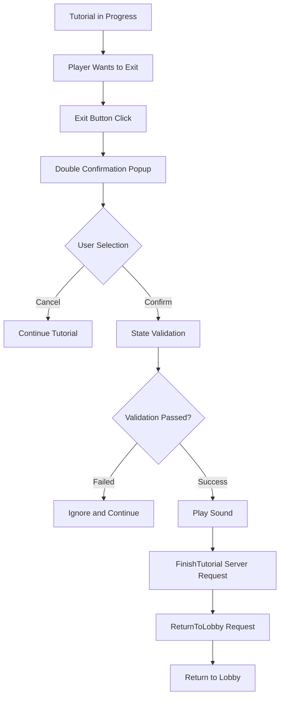
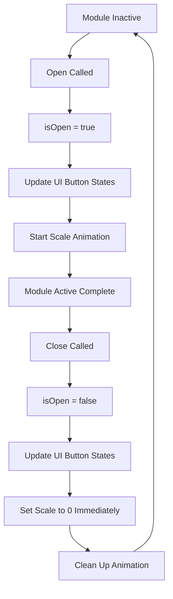

# Tutorial UI Module

## Overview

The tutorial UI module in Maple Duel provides an interface accessible to players during tutorial progression through `TutorialModule.mlua`. It primarily handles tutorial exit confirmation and lobby return functionality, allowing players to exit the tutorial and return to the main game when desired.

## Core Tutorial UI System

### TutorialModule.mlua
A module that manages the tutorial-specific UI interface.

**Key Properties:**
```lua
@Component
script TutorialModule extends Component

    // Manager dependencies
    property ResourceManager resourceManager = nil
    property UIManager uiManager = nil
    
    // UI elements
    property Entity menuEntity = nil         -- Menu entity
    property ButtonComponent leaveButton = nil -- Tutorial exit button
    
    // State management
    property boolean isOpen = false          -- Module open state
    
    // Animation
    property any menuTweener = nil           -- Menu animation tweener
end
```

**Features:**
- Simple and intuitive UI composition
- Focus on tutorial-specific functionality
- Safe exit process through confirmation popup

## Tutorial Exit System

### Exit Button Event

```lua
@ExecSpace("ClientOnly")
method void OnBeginPlay()
    local character = _UserService.LocalPlayer.Character
    
    // Tutorial exit button event handling
    self.leaveButton.Entity:ConnectEvent(ButtonClickEvent, function()
        // Display double confirmation popup
        self.uiManager.PopupModule:Open("DoubleCheckFinishTutorial", false, 
            function()  -- Confirmation callback
                // Safety check
                if not character.isLoaded or _Server:IsRequesting() then
                    return
                end
                
                // Play sound
                _SoundService:PlaySound(
                    self.resourceManager:GetResource("UI").buttonClickOpenSound, 1)
                
                // Request tutorial completion to server
                _Server:Request(character, "FinishTutorial", {})
                
                // Return to lobby
                local room = self.Entity.CurrentMap.Room
                _Server:Request(room, "ReturnToLobby", {character})
            end, 
            nil  -- Cancel callback (none)
        )
    end)
end
```

**Exit Process:**
1. Exit button click
2. Display double confirmation popup ("DoubleCheckFinishTutorial")
3. Upon player confirmation:
   - Check character load state and server request status
   - Play confirmation sound
   - Notify server of tutorial completion
   - Automatically return to lobby

## UI State Management

### Opening Module

```lua
@ExecSpace("ClientOnly")
method void Open()
    self.isOpen = true
    self.uiManager:UpdateButtons()  // Update UI button states
    
    // Clean up existing animation
    if self.menuTweener then
        self.menuTweener:Destroy()
    end
    
    // Display menu with scale animation
    self.menuTweener = _Tween:ScaleTo(
        self.menuEntity, 
        Vector2.one,        // Target scale (1, 1)
        0.125,             // 0.125 seconds duration
        EaseType.Linear    // Linear easing
    )
end
```

### Closing Module

```lua
@ExecSpace("ClientOnly")
method void Close()
    self.isOpen = false
    self.uiManager:UpdateButtons()  // Update UI button states
    
    // Hide menu immediately (set scale to 0)
    local menulTransform = self.menuEntity.TransformComponent
    menulTransform.Scale.x = 0
    menulTransform.Scale.y = 0
    
    // Clean up animation
    if self.menuTweener then
        self.menuTweener:Destroy()
    end
end
```

**Animation Characteristics:**
- **Opening**: Smoothly appears with scale animation
- **Closing**: Immediately hidden (fast responsiveness)

### Button State Control

```lua
@ExecSpace("ClientOnly")
method void SetButtonsEnable(boolean enable)
    // Enable/disable buttons by setting raycast target
    self.leaveButton.Entity.SpriteGUIRendererComponent.RaycastTarget = enable
end
```

**Purpose:**
- Disable buttons in specific situations
- Prevent accidental exit during tutorial progression
- Dynamic control based on UI state

## Safety and User Experience

### Double Confirmation System

```lua
// Confirmation popup through PopupModule
self.uiManager.PopupModule:Open("DoubleCheckFinishTutorial", false, ...)
```

**"DoubleCheckFinishTutorial" Popup:**
- Final confirmation before tutorial exit
- Prevention of progress loss due to mistakes
- Clear intention expression

### State Validation

```lua
// Safety check
if not character.isLoaded or _Server:IsRequesting() then
    return
end
```

**Validation Items:**
- **character.isLoaded**: Whether character data loading is complete
- **_Server:IsRequesting()**: Whether server request is in progress

**Purpose:**
- Prevent data inconsistency
- Prevent duplicate requests
- Maintain stable game state

## Tutorial UI Flow

### General Usage Flow



### Module State Changes



## Server Communication

### Tutorial Completion Processing

```lua
// Notify character of tutorial completion
_Server:Request(character, "FinishTutorial", {})
```

**Expected Server-side Processing:**
- Update character's tutorial completion status
- Clean up tutorial progress data
- Grant main game access permission

### Lobby Return

```lua
// Request return to lobby from room
local room = self.Entity.CurrentMap.Room
_Server:Request(room, "ReturnToLobby", {character})
```

**Processing Steps:**
- Exit current tutorial room
- Switch character state to lobby mode
- Move to main lobby map

## Integration with Other Systems

### UIManager Integration

```lua
self.uiManager:UpdateButtons()
```

**Role:**
- Synchronize button states across entire UI system
- Coordinate interactions with other UI modules
- Provide consistent user experience

### PopupModule Integration

```lua
self.uiManager.PopupModule:Open("DoubleCheckFinishTutorial", ...)
```

**Benefits:**
- Use standardized confirmation popup
- Consistent UI design and behavior
- Centralized popup management

## Code References

### Core Components
- `RootDesk/MyDesk/Components/UIs/TutorialModule.mlua` — Tutorial UI module

### Integrated Systems
- `RootDesk/MyDesk/Components/Managers/UIManager.mlua` — UI state management
- `RootDesk/MyDesk/Components/UIs/PopupModule.mlua` — Confirmation popup display
- `RootDesk/MyDesk/Components/Character.mlua` — Tutorial completion processing
- `RootDesk/MyDesk/Components/Room.mlua` — Lobby return processing

### Key Methods
- `TutorialModule:Open()` — Module activation and animation
- `TutorialModule:Close()` — Module deactivation
- `TutorialModule:SetButtonsEnable()` — Button state control

## Characteristics of Tutorial UI Module

### User-Centered Design
- Clear and intuitive exit options
- Double confirmation to prevent mistakes
- Enhanced visual satisfaction through smooth animations

### Safety Priority
- Stable exit through multiple state validations
- Prevention of duplicate server requests
- Data integrity assurance

### Minimal Complexity
- Simple and focused functionality
- Removal of unnecessary options
- Design faithful to core purpose

### System Integration
- Perfect compatibility with existing UI systems
- Use of standardized popups and animations
- Natural connection with overall game flow

This tutorial UI module plays a crucial role in balancing learning and autonomy by providing a safe and convenient path for players to return to the main game at any time during the tutorial.
