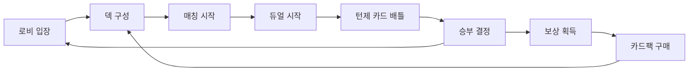

# 메이플 듀얼 게임 개요

## 📋 프로젝트 소개

**메이플 듀얼**은 MapleStory Worlds 플랫폼을 기반으로 한 1vs1 턴제 카드 듀얼 게임입니다. 메이플스토리의 캐릭터와 스킬을 카드로 재구성하여, 플레이어들이 전략적인 카드 배틀을 즐길 수 있는 게임입니다.

### 🎮 핵심 게임플레이 루프



1. **로비 입장**: 플레이어는 로비에서 다른 플레이어들과 만나고 상호작용
2. **덱 구성**: 20장의 카드로 구성된 덱을 편집하고 관리
3. **매칭**: 랭크 매치 또는 친선전을 통한 상대 매칭
4. **듀얼 진행**: 턴제 방식으로 카드를 사용하여 상대와 대결
5. **보상 시스템**: 승리 시 메소와 경험치 획득, 카드팩 구매로 컬렉션 확장

## 🏗️ 주요 게임 시스템

### 카드 시스템
- **카드 유형**: 미니언(Minion), 스킬(Skill) 2가지 주요 타입
- **직업 체계**: Warrior, Magician, Bowman, Thief, Pirate, Common 6개 클래스
- **희귀도**: Normal → Rare → Epic → Unique → Legendary 5단계
- **변형 시스템**: 동일 카드의 다양한 외형 버전 제공

### 덱 시스템  
- **덱 크기**: 정확히 20장으로 구성
- **클래스 제한**: Common + 선택한 1개 클래스 카드만 사용 가능
- **카드 제한**: 동일 카드 최대 2장까지 포함 가능
- **다중 덱**: 플레이어당 최대 10개 덱 보유 가능

### 듀얼 시스템
- **턴제 진행**: 플레이어가 번갈아 가며 행동
- **MP 시스템**: 턴마다 MP가 증가하여 강력한 카드 사용 가능
- **필드 제한**: 각 플레이어당 최대 6개의 미니언 배치 가능
- **손패 제한**: 각 플레이어당 최대 8장의 카드 보유

### 매칭 시스템
- **랭크 매치**: ELO 레이팅 기반 경쟁 시스템
- **친선전**: 친구와의 캐주얼 매치
- **연습 모드**: AI 봇과의 연습 게임
- **튜토리얼**: 신규 플레이어를 위한 가이드

## 📁 프로젝트 폴더 구조

### 핵심 개발 폴더
```
RootDesk/MyDesk/
├── Components/          # 주요 게임 컴포넌트
│   ├── Objects/         # 게임 오브젝트 (Card, Deck, Player, etc.)
│   ├── Managers/        # 시스템 매니저들
│   ├── UIs/            # 사용자 인터페이스 모듈
│   └── Helpers/        # 보조 컴포넌트들
├── DataSets/           # CSV 기반 게임 데이터
├── Events/             # 게임 이벤트 정의
├── Logics/             # 게임 로직 및 유틸리티
├── Images/             # 스프라이트 리소스
├── Models/             # 3D 모델 및 프리팹
├── Materials/          # 머티리얼 리소스
└── Sounds/             # 사운드 리소스
```

### 주요 컴포넌트 개요

#### 오브젝트 (Objects/)
- `Duel.mlua`: 듀얼 전체 제어 및 관리
- `Player.mlua`: 플레이어 유닛과 게임 리소스
- `Card.mlua`: 개별 카드 로직 및 시각화
- `Deck.mlua`: 덱 관리 및 셔플링
- `Field.mlua`, `Hand.mlua`: 게임 영역 관리

#### 매니저 (Managers/)  
- `CardManager.mlua`: 카드 데이터 제공 및 관리
- `DeckManager.mlua`: 덱 구성 규칙 및 검증
- `TaskManager.mlua`: 게임 진행 흐름 제어
- `CommandManager.mlua`: 클라이언트-서버 동기화

#### UI 모듈 (UIs/)
- `LobbyModule.mlua`: 로비 화면
- `DuelModule.mlua`: 듀얼 진행 UI
- `CardModule.mlua`: 카드 컬렉션 관리
- `ShopModule.mlua`: 상점 및 카드팩 구매

### 데이터 구조 (DataSets/)
- `Card.csv`: 모든 카드의 속성 정보 (266개 카드)
- `Deck.csv`: 기본 덱 구성 데이터
- `CardPack.csv`: 카드팩 확률 및 구성
- `AvatarItem.csv`: 아바타 아이템 정보

## 🎯 게임 특징

### MapleStory Worlds 플랫폼 활용
- **멀티플레이어**: 실시간 온라인 매칭 및 상호작용
- **데이터 동기화**: 클라이언트-서버 간 안전한 게임 상태 관리
- **소셜 기능**: 친구 시스템, 채팅, 감정 표현

### 전략적 깊이
- **클래스별 시너지**: 각 직업의 특화된 카드 조합
- **리소스 관리**: MP 시스템을 통한 전략적 자원 분배  
- **타이밍**: 턴 순서와 카드 사용 타이밍의 중요성

### 수집 요소
- **카드 컬렉션**: 266개의 다양한 카드 수집
- **희귀도 시스템**: 높은 희귀도 카드일수록 강력한 효과
- **카드팩**: 확률 기반 카드 획득 시스템

## 🛠️ 개발자를 위한 시작 가이드

### 필수 파일 이해하기
1. **`Character.mlua`**: 플레이어 기본 시스템과 데이터 관리
2. **`Duel.mlua`**: 게임의 핵심 배틀 로직  
3. **`Card.csv`**: 모든 카드 데이터의 중앙 저장소
4. **매니저들**: 각 시스템별 비즈니스 로직

### 코드 구조 특징
- **컴포넌트 기반**: MSW의 Entity-Component 시스템 활용
- **서버-클라이언트 분리**: `@ExecSpace` 어노테이션으로 실행 환경 구분
- **이벤트 기반**: 게임 내 모든 상호작용은 이벤트 시스템 통해 처리

### 주요 코드 참조
- 캐릭터 기본 시스템: `RootDesk/MyDesk/Components/Character.mlua`
- 듀얼 진행 로직: `RootDesk/MyDesk/Components/Objects/Duel.mlua`  
- 카드 데이터 정의: `RootDesk/MyDesk/DataSets/Card.csv`
- UI 시스템 구조: `RootDesk/MyDesk/Components/UIs/`

이 개요를 통해 메이플 듀얼의 전체적인 구조와 게임 플레이를 이해할 수 있으며, 각 세부 시스템에 대한 자세한 내용은 이후 문서들에서 다루어집니다.
